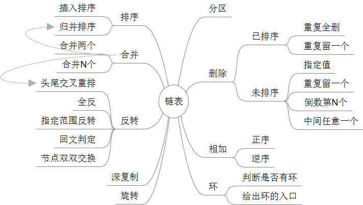

## Linked List - 链表

链表常用操作：



Python编程实现：

```python
# 单向链表
class ListNode:
    def __init__(self, val):
        self.val = val
        self.next = None

# 双向链表
class DListNode:
    def __init__(self, val):
        self.val = val
        self.prev = self.next = null	
```

#### 反转链表

```python
class ListNode:
    def __init__(self, val):
        self.val = val
        self.next = None

    # in python next is a reversed word
    def reverse(self, head):
        prev = None
        while head:
            temp = head.next
            head.next = prev
            prev = head
            head = temp
        return prev
```


#### 删除节点：

```python
head.next = head.next.next
```


#### 链表指针的鲁棒性:

链表操作时的鲁棒性问题主要包含两个情况：

- 当访问链表中某个节点 curt.next 时，一定要先判断 curt 是否为 null。
- 全部操作结束后，判断是否有环；若有环，则置其中一端为 null。


#### Dummy Node

Dummy node 是一个虚拟节点，也可以认为是标杆节点。Dummy node 就是在链表表头 head 前加一个节点指向 head，即 dummy -> head。

#### 快慢指针：

所谓快慢指针中的快慢指的是指针向前移动的步长，每次移动的步长较大即为快，步长较小即为慢，常用的快慢指针一般是在单链表中让快指针每次向前移动2，慢指针则每次向前移动1。快慢两个指针都从链表头开始遍历，于是快指针到达链表末尾的时候慢指针刚好到达中间位置，于是可以得到中间元素的值。快慢指针在链表相关问题中主要有两个应用：

* 快速找出未知长度单链表的中间节点
* 判断单链表是否有环

```python
# 判断链表是否有环
class NodeCircle:
    def __init__(self, val):
        self.val = val
        self.next = None

    def has_circle(self, head):
        slow = head
        fast = head
        while (slow and fast):
            fast = fast.next
            slow = slow.next
            if fast:
                fast = fast.next
            if fast == slow:
                break
        if fast and slow and (fast == slow):
            return True
        else:
            return False
```

