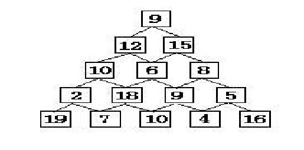

## 基本概念

动态规划的本质，是对问题**状态**的定义和**状态转移方程**的定义。

每次决策依赖于当前状态，又随即引起状态的转移。一个决策序列就是在变化的状态中产生出来的，所以，这种**多阶段最优化决策解决问题**的过程就称为动态规划。

 与分治法最大的差别是：适合于用动态规划法求解的问题，经分解后得到的子问题往往不是互相独立的（即下一个子阶段的求解是建立在上一个子阶段的解的基础上，进行进一步的求解）。

**状态的定义不是唯一的**

## 适用的情况

1. 最优化原理：如果问题的最优解所包含的子问题的解也是最优的，就称该问题具有**最优子结构**，即满足最优化原理。
2. 无后效性：即某阶段状态一旦确定，就不受这个状态以后决策的影响。也就是说，某状态以后的过程不会影响以前的状态，只与当前状态有关。
3. 重叠子问题：即子问题之间是不独立的，一个子问题在下一阶段决策中可能被多次使用到。（该性质并不是动态规划适用的必要条件，但是如果没有这条性质，动态规划算法同其他算法相比就不具备优势）


思维框架：

明确 base case -> 明确「状态」-> 明确「选择」 -> 定义 dp 数组/函数的含义。

```
# 初始化 base case
dp[0][0][...] = base
# 进行状态转移
for 状态1 in 状态1的所有取值：
    for 状态2 in 状态2的所有取值：
        for ...
            dp[状态1][状态2][...] = 求最值(选择1，选择2...)
```


## 经典问题

1. 最大连续子序列求和
2. 数塔问题
3. 背包问题
4. 最长递增子序列
5. 最长公共子序列
6. 跳台阶
7. 换硬币
8. 编辑距离（Levenshtein Distance）

### 最大连续子序列求和

#### 问题描述

给定K个整数的序列{ N1, N2, …, NK }，其任意连续子序列可表示为{ Ni, Ni+1, …, Nj }，其中 1 <= i <= j <= K。最大连续子序列是所有连续子序中元素和最大的一个， 例如给定序列{ -2, 11, -4, 13, -5, -2 }，其最大连续子序列为{ 11, -4, 13 }，最大和为20。

#### 思路分析

具有最优子结构，和重叠子问题， 动态规划的算法思路

- 最大连续子序列和只可能是以位置0～n-1中某个位置结尾。当遍历到第i个元素时，判断在它前面的连续子序列和是否大于0，如果大于0，则以位置i结尾的最大连续子序列和为元素i和前门的连续子序列和相加；否则，则以位置i结尾的最大连续子序列和为元素i。 令sum[i]表示以第i个元素结尾的最大连续子序列和。则对于第i个元素a[i]，添加或者不添加，其和分别为sum[i-1]+a[i]，a[i]，所以其状态转移方程为：

> **sum[i]=max(sum[i-1]+a[i],a[i])**

```python
def maxsequence(nums):
    if not nums:
        return 0
    maxsum = maxhere = nums[0]
    for i in range(1, len(nums)):
        if maxhere <= 0:
            maxhere = nums[i]
        else:
            maxhere += a[i]
        if maxhere > maxsum:
            maxsum = maxhere
    return maxsum

# another solution
def maxsequence(nums):
    if not nums:
        return 0
    maxsum = [0] * len(nums)
    maxsum[0] = nums[0]
    max_maxsum = maxsum[0]
    for i in range(1, len(nums)):
        maxsum[i] = max(maxsum[i-1]+nums[i], nums[i])
        if maxsum[i] > max_maxsum: max_maxsum = maxsum[i]
    return max_maxsum

nums = [-2, 11, -4, 13, -5, -2]
print(maxsequence(nums))
```


### 数塔问题

数塔问题 ：要求从顶层走到底层，若每一步只能走到相邻的结点，则经过的结点的数字之和最大是多少？



设$sum[i][j]$表示从最底层到第i层第j个元素最大的元素和，则其状态转移方程可表示为：

> $sum[i][j]=max(sum[i+1][j], sum[i+1][j+1])+data[i][j]$ 

```python
def solution(data):
    N = len(data)
    sum = [[0 for j in range(i)] for i in range(1, N+1)]
    sum[N-1] = data[N-1]
    for i in range(N-2, -1, -1):
        for j in range(i+1):
            sum[i][j] = max(sum[i+1][j], sum[i+1][j+1]) + data[i][j]
    print(sum[0][0])


data_tower = [
    [9],
    [12, 15],
    [10, 6, 8],
    [2, 18, 9, 5],
    [19, 7, 10, 4, 16]
]
solution(data_tower)
```


### 01背包问题

给你一个可装载重量为 W 的背包和 N 个物品，每个物品有重量和价值两个属性。其中第 i 个物品的重量为 wt[i]，价值为 val[i]，现在让你用这个背包装物品，最多能装的价值是多少？
举个简单的例子，输入如下：

> N = 3, C = 4
> w = [2, 1, 3]
> V = [4, 2, 3]

算法返回 6，选择前两件物品装进背包，总重量 3 小于 C，可以获得最大价值 6。


分析：暴力穷举，每个物品都存在装入和不装入两种情况，所以总的方案数有2^N

`dp[i][j]` 的定义如下：将前i件物品装进限重为j的背包可以获得的最大价值, 0<=i<=N, 0<=j<=W

那么当 i > 0 时`dp[i][j]`有两种情况：

1. 不装入第i件物品，即`dp[i−1][j]`；
2. 装入第i件物品（前提是能装下），即`dp[i−1][j−w[i]] + v[i]`。

所以状态转移方程：dp\[i][j] = max(dp\[i−1][j], dp\[i−1][j−w[i]]+v[i]) // j >= w[i]

| 物品 \ 背包重量 | 0    | 1    | 2    | 3    | 4    |
| --------------- | ---- | ---- | ---- | ---- | ---- |
| 0               | 0    | 0    | 4    | 4    | 4    |
| 1               | 0    | 2    | 4    | 6    | 6    |
| 2               | 0    | 2    | 4    | 6    | 6    |

这个题目不管是先固定物品遍历限重，还是先固定限重遍历物品，都是可以的，因为dp\[i][j]只与左上角的数值有关系。


```python
"""
V: the value list of jewel
W: the weight list of jewel
C: the capacity of the backpack
"""
def backpack(V, W, C):
    N = len(V)
    d = [[0 for c in range(C+1)] for n in range(N+1)]
    for i in range(1, N + 1):
        for j in range(C + 1):
            if j >= W[i - 1]:
                d[i][j] = max(d[i-1][j], d[i-1][j-W[i-1]] + V[i-1])
            else:
                d[i][j] = d[i - 1][j]
		
    # 以下几行是得到最优的装法
    j = C
    x = [0 for n in range(N)]
    for i in range(N, 0, -1):
        if d[i][j] > d[i - 1][j]:
            x[i - 1] = 1
            j = j - W[i - 1]
		print(x)
    
    print(d[N][C])


V = [20, 10, 12]
W = [5, 4, 3]
C = 10
backpack(V, W, C)
```

`dp[i][j]`的值只与`dp[i-1][0,...,j-1]`有关，所以我们可以采用动态规划常用的方法（滚动数组）对空间进行优化（即去掉dp的第一维）。需要注意的是，为了防止上一层循环的`dp[0,...,j-1]`被覆盖，循环的时候 j 只能**逆向枚举**

```python
def backpack(V, W, C):
  N = len(V)
  d = [0 for _ in range(C+1)]
  for i in range(N):
    for j in range(C, W[i]-1, -1):
      d[j] = max(d[j], d[j-W[i]] + V[i])
      
  return d[C]
```


Refer: 

1. https://github.com/youngyangyang04/leetcode-master/blob/master/problems/背包理论基础01背包-1.md
2. https://zhuanlan.zhihu.com/p/93857890

### 最长递增子序列（LIS）

给定一个序列$A_n = a_1, a_2, ..., a_n$，找出最长的子序列使得对所有$i<j, \ a_j<a_j$。

定义状态：设d[k]表示以$a_k$结尾的最长递增子序列的长度。

状态转移方程：
$$
d[k] = \begin{cases}
  1, & k=0 \\
  max(d[i] + 1|A[k]>A[i]), &\  i \in (1..k-1) (k>1)
\end{cases}
$$

```python
def lis(A):
    d =[0 for _ in range(len(A))]
    max_len = d[0] = 1
    for k in range(1, len(A)):
        tmp = []
        for i in range(k):
            if A[k] > A[i]:
                tmp.append(d[i] + 1)
        d[k] = 1 if len(tmp) == 0 else max(tmp)
        if d[k] > max_len: max_len = d[k]
    return max_len

A = [5,6,1,2,8,3,4]
print(lis(A))
```

### 最长公共子串（需连续）

```python
"""
dp(i,j):以str1的第i位结尾和str2的第j位结尾的最长公共子串的长度
dp[0][j] = 0; (0<=j<=m)
dp[i][0] = 0; (0<=i<=n)
dp[i][j] = dp[i-1][j-1] +1; (str1[i] == str2[j])
dp[i][j] = 0; (str1[i] != str2[j])
"""
def maxlongstr(str1, str2):
    n, m = len(str1)+1, len(str2)+1
    dp = [[0 for j in range(m)] for i in range(n)]
    max_length = 0
    for i in range(1, n):
        for j in range(1, m):
            if str1[i-1] == str2[j-1]:
                dp[i][j] = dp[i - 1][j - 1] + 1
                if dp[i][j] > max_length: max_length = dp[i][j]
            else:
                dp[i][j] = 0

    return max_length

print(maxlongstr("abcdf","ebcdfg"))
```


### 最长公共子序列（LCS）

一个序列 S ，如果分别是两个或多个已知序列的子序列，且是所有符合此条件序列中最长的，则 S 称为已知序列的最长公共子序列。例如：输入两个字符串BDCABA和ABCBDAB，字符串BCBA和BDAB都是是它们的最长公共子序列，它**不**要求所求得的字符在所给的字符串中是连续的，则输出它们的长度4，并打印任意一个子序列。

状态：用c[i,j]记录序列Xi和Yj的最长公共子序列的长度。其中Xi=<x1, x2, …, xi>，Yj=<y1, y2, …, yj>。当i=0或j=0时，空序列是Xi和Yj的最长公共子序列，故c[i,j]=0。

状态转移方程：
$$
c[i,j]= \begin{cases}
  0, & if\ i=0\ or\ j=0 \\
  c[i-1,j-1]+1, & if\ i,j > 0\ and\ x_i = y_i \\
  max(c[i,j-1], c[i-1,j]), & if\ i,j > 0\ and\ x_i \neq y_1 
\end{cases}
$$

```python
"""
dp(i,j):以str1的第i位结尾和str2的第j位结尾的最长公共子序列的长度

dp[0][j] = 0; (0<=j<=m)
dp[i][0] = 0; (0<=i<=n)
dp[i][j] = dp[i-1][j-1] +1; (str1[i-1] == str2[j-1])
dp[i][j] = max{dp[i][j-1],dp[i-1][j]}; (str1[i-1] != str2[j-1])
"""
def maxlongstr(str1, str2):
    n, m = len(str1)+1, len(str2)+1
    dp = [[0 for j in range(m)] for i in range(n)]

    for i in range(1, n):
        for j in range(1, m):
            if str1[i-1] == str2[j-1]:
                dp[i][j] = dp[i - 1][j - 1] + 1
            else:
                dp[i][j] = max(dp[i-1][j], dp[i][j-1])

    return dp[n-1][m-1]

print(maxlongstr("BDCABA","ABCBDAB"))
```


### 跳台阶

**排列问题**

小明一次最多跳3个台阶，问跳15个台阶有多少种方案？

dp[k]：跳到第k个台阶有dp种跳法

dp[k] = dp[k-1] + dp[k-2] + dp[k-3]

```python
def solution2(amount, step):
    dp = [0] * (amount+1)
    dp[1] = 1
    dp[2] = 2
    dp[3] = 4
    for i in range(4, amount+1):
        dp[i] = dp[i-1] + dp[i-2] + dp[i-3]
    return dp[-1]
```


### 换硬币

**组合问题**

1分2分5分的硬币，组成1角，共有多少种组合

说明：和跳台阶问题类似，但跳台阶与步长先后有关，而零钱问题和顺序无关。

状态：设dp[k]表示组合成k分方法数

状态转移方程：dp[k] += dp[k-c] if k>c

```python
def change(amount, coins):
    dp = [1] + [0] * amount
    solution = [[] for i in range(amount+1)]
    solution[0].append([])
    for c in coins:
        for i in range(1, amount + 1):
            if i >= c:
                dp[i] += dp[i - c]
                solution[i] += [s+[c] for s in solution[i-c]]
                
    return solution[-1], dp[-1]

print(change(15,[1,2,5]))
```


### 编辑距离

##### 
