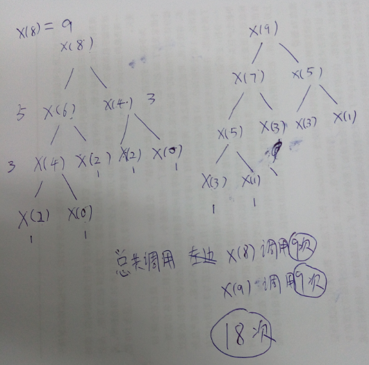

# 递归程序设计

### 定义及理解

递归算法是一种直接或者间接调用自身函数或者方法的算法。递归算法的实质是把问题分解成规模缩小的同类问题的子问题，然后递归调用方法来表示问题的解。

特点：

- 递归就是方法里调用自身。
- 在使用递增归策略时，必须有一个明确的递归结束条件，称为递归出口。
- 递归算法解题通常显得很简洁，但递归算法解题的运行效率较低。所以一般不提倡用递归算法设计程序。
- 在递归调用的过程当中系统为每一层的返回点、局部量等开辟了栈来存储。递归次数过多容易造成栈溢出等，所以一般不提倡用递归算法设计程序。

递归函数的写法包括：**线性递归、二分递归、尾递归、互递归、嵌套递归**

根据递归的返回结果间的关系：

串联：

```
def function(arg):
    if meet the stop condition:
        return the result of this call
    else:
        return the result of the call + function(arg)
```

并联：

```
all_result = []
def function(arg):
    if meet the stop condition:
    	all_result.append(the_result_of_this_call)
  		return
  	else:
  		function(arg)
```


### 尾递归

对于递归函数的使用，人们所关心的一个问题是栈空间的增长。确实，随着被调用次数的增加，某些种类的递归函数会线性地增加栈空间的使用 —— 不过，有一类函数，即尾部递归函数，不管递归有多深，栈的大小都保持不变。尾递归属于线性递归，更准确的说是线性递归的子集。

函数所做的最后一件事情是一个函数调用（递归的或者非递归的），这被称为 尾部调用（`tail-call`）。使用尾部调用的递归称为 *尾部递归*。当编译器检测到一个函数调用是尾递归的时候，它就覆盖当前的活动记录而不是在栈中去创建一个新的。编译器可以做到这点，因为递归调用是当前活跃期内最后一条待执行的语句，于是当这个调用返回时栈帧中并没有其他事情可做，因此也就没有保存栈帧的必要了。通过覆盖当前的栈帧而不是在其之上重新添加一个，这样所使用的栈空间就大大缩减了，这使得实际的运行效率会变得更高。

一个普通递归实例：

```python
def recsum(x):
  if x == 1:
    return x
  else:
    return x + recsum(x - 1)
```

调用recsum(5)时，[SICP](https://zh.wikipedia.org/wiki/SICP)中描述了相应的栈空间变化：

```python
recsum(5)
5 + recsum(4)
5 + (4 + recsum(3))
5 + (4 + (3 + recsum(2)))
5 + (4 + (3 + (2 + recsum(1))))
5 + (4 + (3 + (2 + 1)))
5 + (4 + (3 + 3))
5 + (4 + 6)
5 + 10
15
```

可观察，堆栈从左到右，增加到一个峰值后再计算从右到左缩小，这往往是我们不希望的。

修改以上代码，可以成为尾递归：

```python
def tailrecsum(x, running_total=0):
  if x == 0:
    return running_total
  else:
    return tailrecsum(x - 1, running_total + x)
```

此时的栈空间变化：

```python
tailrecsum(5, 0) 
tailrecsum(4, 5) 
tailrecsum(3, 9)
tailrecsum(2, 12) 
tailrecsum(1, 14) 
tailrecsum(0, 15) 
15
```

则是线性的。


### 将递归转换为循环

如果你正在使用递归函数，并且没有控制递归调用，而栈资源又比较有限，调用层次过深的时候就可能导致栈溢出/堆冲突。

一个思路：既然系统是根据栈来实现递归的，我们也可以考虑模拟栈的行为来将递归转化为循环。


### 递归的次数计算

有这样一个题目：

```c
int x(int n)
{
     if(n<=3)
     {
         return 1;
     }
     else
     {
         return x(n-2)+x(n-4)+1;
     }
}
```

要求计算x(x(8))递归调用次数。

x(x(8))我们先计算x(8)，我们用count=0计数递归调用次数

1.x(8)=x(6)+x(4)+1 count=1;

2.x(6)=x(4)+x(2)+1,x(4)=x(2)+x(0)+1  x(8)=x(4)+2*x(2)+x(0)+3 count=3;

3.x(4)=x(2)+x(0)+1 x(8)=3*x(2)+2*x(0)+4  count=4

4.x(2)=1,x(0)=1; x(8)=9 count=9

再计算x(9)

1.x(9)=x(7)+x(5)+1 count=10

2.x(7)=x(5)+x(3)+1,x(5)=x(3)+x(1)+1  x(9)=x(5)+2*x(3)+x(1)+3 count=12

3.x(5)=x(3)+x(1)+1 x(9)=3*x(3)+2*x(1)+4 count=13

4.x(3)=1 x(1)=1   x(9)=3+2+4=9 count=18



### 递归与回溯的关系


### 递归函数调用过程的理解

递归函数中，**位于递归调用前的语句和各级被调用函数具有相同的执行顺序**； 递归函数中，**位于递归调用后的语句的执行顺序和各个被调用函数的顺序相反**；

下面是个关于递归调用简单但是很能说明问题的例子：

```c
#include<stdio.h>  
void up_and_down(int);  
int main(void)  
{  
    up_and_down(1);  
    return 0;  
}  
void up_and_down(int n)  
{  
    printf("Level %d:n location %p/n",n,&n); /* 1 */  
    if(n<4)  
        up_and_down(n+1);  
    printf("Level %d:n location %p/n",n,&n); /* 2 */  
}  
```

**输出结果**

Level 1:n location 0240FF48
Level 2:n location 0240FF28
Level 3:n location 0240FF08
Level 4:n location 0240FEE8
Level 4:n location 0240FEE8
Level 3:n location 0240FF08
Level 2:n location 0240FF28
Level 1:n location 0240FF48

首先， main() 使用参数 1 调用了函数 up_and_down() ，于是 up_and_down() 中形式参数 n 的值是 1, 故打印语句 #1 输出了 Level1 。然后，由于 n 的数值小于 4 ，所以 up_and_down() （第 1 级）使用参数 n+1 即数值 2 调用了 up_and_down()( 第 2 级 ). 使得 n 在第 2级调用中被赋值 2, 打印语句 #1 输出的是 Level2 。与之类似，下面的两次调用分别打印出 Level3 和 Level4 。

当开始执行第 4 级调用时， n 的值是 4 ，因此 if 语句的条件不满足。这时候不再继续调用 up_and_down() 函数。第 4 级调用接着执行打印语句 #2 ，即输出 Level4 ，因为 n 的值是 4 。现在函数需要执行 return 语句，此时第 4 级调用结束，把控制权返回给该函数的调用函数，也就是第 3 级调用函数。第 3 级调用函数中前一个执行过的语句是在 if 语句中进行第 4 级调用。因此，它继续执行其后继代码，即执行打印语句 #2 ，这将会输出 Level3 ．当第 3 级调用结束后，第 2 级调用函数开始继续执行，即输出Level2 ．依次类推．每一级的递归都使用它自己的私有的变量 n ．可以查看地址的值来证明．

递归的基本原理：

1. 每一次函数调用都会有一次返回．当程序流执行到某一级递归的结尾处时，它会转移到前一级递归继续执行．
2. 递归函数中，位于递归调用前的语句和各级被调函数具有相同的顺序．如打印语句 #1 位于递归调用语句前，它按照递归调用的顺序被执行了 4 次．
3. 每一级的函数调用都有自己的私有变量．
4. 递归函数中，位于递归调用语句后的语句的执行顺序和各个被调用函数的顺序相反．
5. 虽然每一级递归有自己的变量，但是函数代码并不会得到复制．
6. 递归函数中必须包含可以终止递归调用的语句．