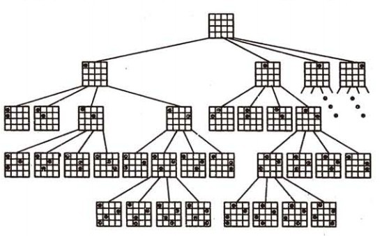

回溯法是暴力搜寻法中的一种。

回溯算法实际上一个类似枚举的搜索尝试过程，主要是在搜索尝试过程中寻找问题的解，当发现已不满足求解条件时，就“回溯”返回，尝试别的路径。

回溯法 = 穷举  + 剪枝

**基本思想**

在包含问题的所有解的解空间树中，按照**深度优先搜索的策略**，从根结点出发深度探索解空间树。当探索到某一结点时，要先判断该结点是否包含问题的解，如果包含，就从该结点出发继续探索下去，如果该结点不包含问题的解，则逐层向其祖先结点回溯。（其实回溯法就是对隐式图的深度优先搜索算法）。

**解题一般步骤**

1).确定问题的解空间 ：针对所给问题，定义问题的解空间； 

 子集树问题：装载问题、符号三角形问题、0-1背包问题、最大团问题
排列树问题：批处理作业调度、n后问题、旅行售货员问题、圆排列问题、电路板排列问题
其他：图的m着色问题

2).确定易于搜索的解空间结构：

找出适当的剪枝函数，约束函数和限界函数。

3).以深度优先的方式搜索解空间，并且在搜索过程中用剪枝函数避免无效的搜索。

递归回溯

迭代回溯

4).利用限界函数避免移动到不可能产生解的子空间


回溯的问题有三种：

1. find a path to success 有没有解
2. find all paths to success 求所有解
   1. 求所有解的个数
   2. 求所有解的具体信息
3. find the best path to success


**经典案例**

应用回溯法有：

- 装载问题
- 批处理作业调度
- 符号三角形问题
- **n后问题**
- **数独问题**
- 0-1背包问题
- 最大团问题
- 图的m着色问题
- 旅行售货员问题
- 圆排列问题
- 电路板排列问题
- 连续邮资问题


#### n皇后问题

n×n格的棋盘上放置彼此不受攻击的n个皇后。按照国际象棋的规则，皇后可以攻击与之处在同一行或同一列或同一斜线上的棋子。n后问题等价于在n×n格的棋盘上放置n个皇后，**任何2个皇后不放在同一行或同一列或同一斜线上**。求不同的解的个数。

当n=4时的分析过程：



```python
# 递归版本
def nQueens(n, x=0, *solution):
    if x == n:
        yield solution
    else:
        for y in range(n):
            if all(y != j and abs(x - i) != abs(y - j) for i, j in solution):
                yield from nQueens(n, x + 1, *solution, (x, y))


# 迭代版本
def nQueensIter(n):
    solution = []
    j = 0
    while solution or j < n:
        i = len(solution)
        while j < n and not all(y != j and abs(x - i) != abs(y - j) 
                for x, y in enumerate(solution)):
            j += 1

        if j < n:
            solution.append(j)
            if i == n - 1:
                yield tuple(enumerate(solution))
                j = solution.pop() + 1
            else:
                j = 0
        else:
            j = solution.pop() + 1

if __name__ == '__main__':
    def showSolution(solutions, n):
        for i, s in enumerate(solutions, 1):
            print("%s:\n" % i + "=" * 20)
            for x in range(n):
                for y in range(n):
                    print('Q ' if s[x][1] == y else '_ ', end='')
                print()
            print()

    N = 8
    showSolution(nQueens(N), N)
    showSolution(nQueensIter(N), N)
    

# another iterative version
class EightQueen(object):
    """
    一维数组column[8]来模拟皇后在棋盘上的位置，即数组下标代表行，数组的元素值代表列。
    """
    def __init__(self, n):
        self.column_ = [0] * 8
        self.n = n
        self.count = 0

    def check(self, row):
        for i in range(row):
            # 1. not in the same column
            # 2. not in the same diagonal line left to right
            # 3. not in the same diagonal line right to left
            if self.column_[i] == self.column_[row] or \
                i-row == self.column_[i] - self.column_[row] or \
                i+self.column_[i] == row + self.column_[row]:
                return False
        return True

    def resolve(self, row):
        if row == self.n:
            print(self.column_)
            self.count += 1
        else:
            for i in range(self.n):
                self.column_[row] = i
                if self.check(row):
                    self.resolve(row+1)

    def result(self):
        self.resolve(0)
        print(self.count)

e = EightQueen(8)
e.result()


```

#### 数独问题

```python
import time

class Sudoku(object):
    """
    board: 9x9 list, 0 means empty
    """

    def __init__(self, board):
        self.board = board
        self.LEN = len(board)
        self.info = [[False for j in range(self.LEN)] for i in range(self.LEN)]
        for i in range(self.LEN):
            for j in range(self.LEN):
                if self.board[i][j] != 0:
                    self.info[i][j] = True
        self.stop_recursion = False
        self.solution = []

    def solve(self, start_row, start_col):

        for i in range(start_row, self.LEN):
            for j in range(start_col, self.LEN):
                # if i == self.LEN - 1 and j == self.LEN - 1:
                #     time.sleep(0.001)
                if not self.info[i][j]:
                    for n in range(1, 10):
                        flag = self.check(n, i, j)
                        if flag:
                            self.board[i][j] = n
                            # terminal condition, there are empty in the last space
                            if i == self.LEN - 1 and j == self.LEN - 1:
                                self.solution.append(
                                    [[self.board[i][j] for j in range(self.LEN)] for i in range(self.LEN)])
                                return

                            if j+1 >= self.LEN:
                                self.solve(i+1, 0)
                            else:
                                self.solve(i, j+1)
                            self.board[i][j] = 0
                        if n == 9:
                            self.stop_recursion = True
                if self.stop_recursion: break
                # terminal condition, there are *not* empty in the last space
                if i == self.LEN-1 and j == self.LEN-1:
                    self.solution.append([[self.board[i][j] for j in range(self.LEN)] for i in range(self.LEN)])
                    return
            start_col = 0
            if self.stop_recursion:
                self.stop_recursion = False
                break


    def check(self,num,row,col):
        # check if there is a same number in the same row
        for i in range(self.LEN):
            if self.board[row][i] == num:
                return False
        # check if there is a same number in the same column
        for i in range(self.LEN):
            if self.board[i][col] == num:
                return False
        # check if there is a same number in the same small square
        base_row, base_col = row//3, col//3
        for m in range(self.LEN):
            i, j = m//3, m%3
            if self.board[3*base_row+i][3*base_col+j] == num:
                return False
        return True


bb = \
[
    [5,3,4,6,7,8,9,1,2],
    [6,7,2,1,9,5,3,4,8],
    [1,9,8,3,4,2,5,6,7],
    [8,5,9,7,6,1,4,2,3],
    [4,2,6,8,5,3,7,9,1],
    [7,1,3,9,2,4,8,5,6],
    [9,6,1,5,3,7,2,8,4],
    [2,8,7,4,1,9,6,3,5],
    [3,4,5,2,8,6,0,7,0]
]
b = \
[
    [5,3,0,0,7,0,0,0,0],
    [6,0,0,1,9,5,0,0,0],
    [0,9,8,0,0,0,0,6,0],
    [8,0,0,0,6,0,0,0,3],
    [4,0,0,8,0,3,0,0,1],
    [7,0,0,0,2,0,0,0,6],
    [0,6,0,0,0,0,2,8,0],
    [0,0,0,4,1,9,0,0,5],
    [0,0,0,0,8,0,0,7,9]
]

b1 = \
[
    [8,0,0,0,0,0,0,0,0],
    [0,0,3,6,0,0,0,0,0],
    [0,7,0,0,9,0,2,0,0],
    [0,5,0,0,0,7,0,0,0],
    [0,0,0,0,4,5,7,0,0],
    [0,0,0,1,0,0,0,3,0],
    [0,0,1,0,0,0,0,6,8],
    [0,0,8,5,0,0,0,1,0],
    [0,9,0,0,0,0,4,0,0]
]

b2 = \
[
    [0,0,9,0,0,0,0,0,0],
    [0,6,1,0,4,0,3,8,0],
    [0,0,0,0,3,0,6,0,5],
    [0,0,0,6,0,8,7,0,0],
    [0,0,0,0,1,2,0,0,0],
    [0,8,0,0,0,0,0,0,4],
    [0,0,0,0,0,0,0,6,0],
    [4,0,5,8,0,0,0,7,3],
    [2,3,0,7,0,0,0,0,0]
]

s = Sudoku(b2)
t0 = time.time()
s.solve(0,0)
t1 = time.time()
print(t1-t0)

if len(s.solution) == 0:
    print("no solution!")
else:
    for i in range(9):
        print(s.solution[0][i])

```

