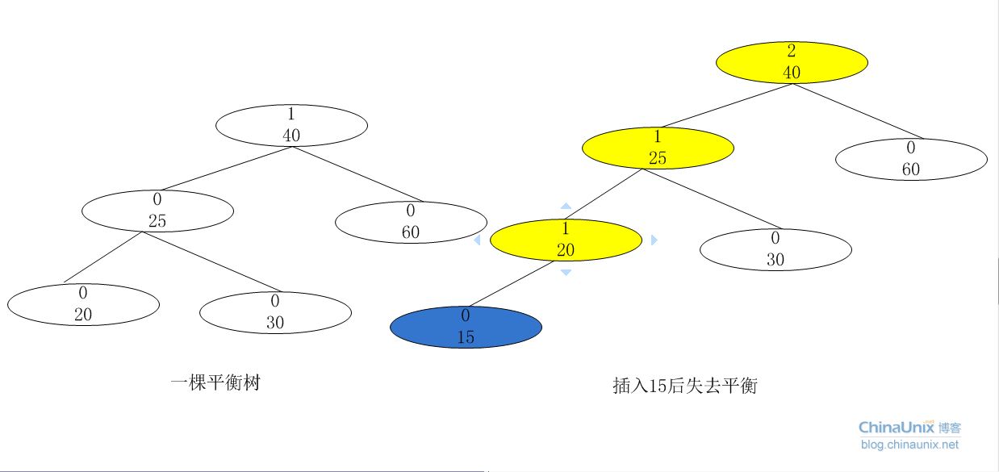

# Binary search Tree(BST)

一颗**二叉查找树(BST)**是一颗二叉树，其中每个节点都含有一个可进行比较的键及相应的值，且每个节点的键都**大于等于左子树中的任意节点的键**，而**小于右子树中的任意节点的键**。
$$
root.left.val \leq root.val < root.right.val
$$
**使用中序遍历可得到有序数组**，这是二叉查找树的又一个重要特征。

### 插入

```python
# 递归
def insert_node(root, node):
    if not root:
        return node
    if root.val > node.val:
        root.left = insert_node(root.left, node)
    else:
        root.right = insert_node(root.right, node)
    
    return root

# 迭代
def insert_node(root, node):
    if not root:
        return node
    init = root
    while root:
        if root.val >= node.val:
            if root.left:
                root = root.left
            else:
                root.left = node
                break
        else:
            if root.right:
                root = root.right
            else:
                root.right = node
                break
    return init
```


## 平衡二叉查找树

### 定义

平衡二叉查找树又称为平衡二叉排序树，又称为AVL树，是二叉查找树的改进。
定义（满足如下三个条件）：

1. 是二叉查找树。
2. 左子树与右子树的深度之差的绝对值小于或等于1.
3. 左右子树也是平衡二叉查找树。 

**`平衡因子`**： 平衡二叉查找树的每个结点都要描述一个属性，它表示结点的左子树深度与右子树深度之差。如果某个二叉查找树的所有节点的平衡因子只有**-1,0,1**则说明其实平衡的，否则说明是不平衡的。

### 分析平衡二叉查找树有什么意义

在分析二叉查找树的平均查找长度时，会发现，二叉查找树的平均查找长度与二叉查找树的形态有关系，最坏的情况是退化为链表，查找变为线性查找，平均查找长度为(n 1)/2.最好的情况就是树的形态与折半查找的判断树形式。平均查找长度为logN。

平衡二叉树就是为了保证树的形态向“树”的方向走。避免了二叉查找树退化为链表的可能。从而提高了查找效率。其实平衡二叉查找树与二叉查找树的区别并不是很大，平衡树在“改变”树的时候会维护树的形态，“改变”无非就两种，插入节点和删除节点，而树的查找只“读”了树，并没改变，所以树的查找，平衡树和查找树是一样的。


现在我要使用24,12,53,28,45,90创建查找树，如果创建的二叉查找树（如左图），则平均查找长度：(1 2 2 3 4 3)/6 = 15/6 如果创建的是平衡二叉查找树(如右图)，则平均查找长度：(2 3 2 3 1 3)/6 = 14/6.

### 如何创建和插入平衡二叉查找树



如上图，插入15这个节点后，平衡因子变化的只有20,25,40。都是15的“祖先节点”。


A节点：为插入点最底层“祖先节点”最可能的失衡点。比如插入的节点是15，故插入的位置是节点20的左子，这从20这个节点开始遍历祖先节点，取最近的的最可能失衡点，这儿就是40这个节点。如果没有找到，说明插入这个节点不可能破坏平衡B节点就是该祖先节点一条线中A节点的下一个。


AVL树的旋转分为四种情况：

#### LL型（左边重，需往右边转）


旋转方法：以B点为轴，将A节点做顺时针旋转，然后将B的右子树作为A的左子树。

```python
if LL:
    B = A.lchild			//该类型B节点所在的位置
    A.lchild = B.rchild		//将B节点的右子树交给A，作为A的左子树。
    B.rchild = A			//把A作为B的右子树。
    A.bf = B.bf = 0			//更新A，B节点的平衡因子的值。
    if father_A == None:	//如果A是根，则现在把B节点设置为根节点。
        root = B
    //如果原来A是father_A的左孩子，则现在把B，作为father_A的左孩子。否则，作为father_A的右孩子，就是用B的取代A原来的位置。
    elif A == father_A.lchild:
        father_A.lchild = B
    else:
        father_A.rchild = B
        
```


#### RR型 （右边重，需往左边转）


旋转方法：以B节点为轴，将A节点作逆时针旋转，然后，把B的左子树给A，作为A的右子树。


#### LR型


