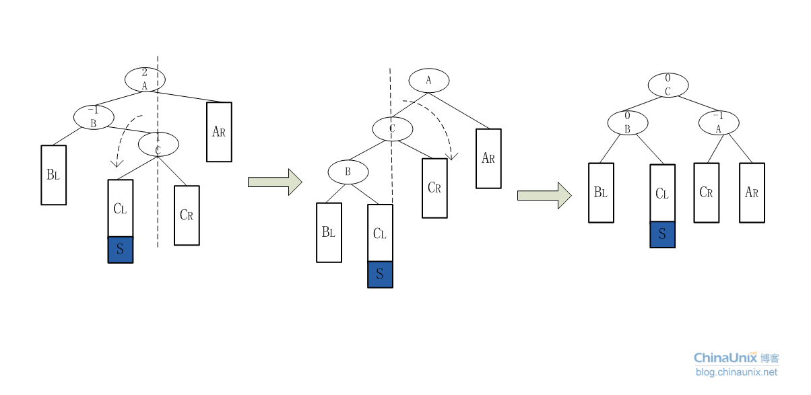

# 动态查找树之二叉查找树与平衡二叉查找树

一颗**二叉查找树(BST)**是一颗二叉树，其中每个节点都含有一个可进行比较的键及相应的值，且每个节点的键都**大于等于左子树中的任意节点的键**，而**小于右子树中的任意节点的键**。
$$
root.left.val \leq root.val < root.right.val
$$
**使用中序遍历可得到有序数组**，这是二叉查找树的又一个重要特征。

### BST数据结构Python实现

```python
# Definition for a binary tree node.
# class TreeNode(object):
#     def __init__(self, x):
#         self.val = x
#         self.left = None
#         self.right = None

class BinarySearchTree(object):
    def __init__(self,key):
        self.key=key
        self.left=None
        self.right=None
    def find(self,x):
        if x==self.key:
            return self
        elif x<self.key and self.left:
            return self.left.find(x)
        elif x>self.key and self.right:
            return self.right.find(x)
        else:
            return None  
    def findMin(self):
        if self.left:
            return self.left.findMin()
        else:
            return self
    def findMax(self):
        tree=self
        if tree:
            while tree.right:
                tree=tree.right
        return tree
    def insert(self,x):
        if x<self.key:
            if self.left:
                self.left.insert(x)
            else:
                tree=BinarySearchTree(x)
                self.left=tree
        elif x>self.key:
            if self.right:
                self.right.insert(x)
            else:
                tree=BinarySearchTree(x)
                self.right=tree
    def delete(self,x):
        if self.find(x):
            if x<self.key:
                self.left=self.left.delete(x)
                return self
            elif x>self.key:
                self.right=self.right.delete(x)
                return self
            elif self.left and self.right:
                key=self.right.findMin().key
                self.key=key
                self.right=self.right.delete(key)
                return self
            else:
                if self.left:
                    return self.left
                else:
                    return self.right
        else:
            return self
```

上述写法的缺点是很难处理空树的情况。

另一种类似于链表的写法

```python
class TreeNode(object):
    def __init__(self,key,left=None,right=None,parent=None):
        self.key=key
        self.left=left
        self.right=right
        self.parent=parent
    def hasLeftChild(self):
        return self.left
    def hasRightChild(self):
        return self.right
    def isLeftChild(self):
        return self.parent and self.parent.left==self
    def isRightChild(self):
        return self.parent and self.parent.right==self
class BSTree(object):
    def __init__(self):
        self.root=None
        self.size=0
    def length(self):
        return self.size
    def insert(self,x):
        node=TreeNode(x)
        if not self.root:
            self.root=node
            self.size+=1
        else:
            currentNode=self.root
            while True:
                if x<currentNode.key:
                    if currentNode.left:
                        currentNode=currentNode.left
                    else:
                        currentNode.left=node
                        node.parent=currentNode
                        self.size+=1
                        break
                elif x>currentNode.key:
                    if currentNode.right:
                        currentNode=currentNode.right
                    else:
                        currentNode.right=node
                        node.parent=currentNode
                        self.size+=1
                        break
                else:
                    break
             
    def find(self,key):
        if self.root:
            res=self._find(key,self.root)
            if res:
                return res
            else:
                return None
        else:
            return None
    def _find(self,key,node):
        if not node:
            return None
        elif node.key==key:
            return node
        elif key<node.key:
            return self._find(key,node.left)
        else:
            return self._find(key,node.right)
    def findMin(self):
        if self.root:
            current=self.root
            while current.left:
                current=current.left
            return current
        else:
            return None
    def _findMin(self,node):
        if node:
            current=node
            while current.left:
                current=current.left
            return current
    def findMax(self):
        if self.root:
            current=self.root
            while current.right:
                current=current.right
            return current
        else:
            return None
    def delete(self,key):
        if self.size>1:
            nodeToRemove=self.find(key)
            if nodeToRemove:
                self.remove(nodeToRemove)
                self.size-=1
            else:
                raise KeyError,'Error, key not in tree'
        elif self.size==1 and self.root.key==key:
            self.root=None
            self.size-=1
        else:
            raise KeyError('Error, key not in tree')
    def remove(self,node):
        if not node.left and not node.right:   #node为树叶
            if node==node.parent.left:
                node.parent.left=None
            else:
                node.parent.right=None
            
        elif node.left and node.right:   #有两个儿子
            minNode=self._findMin(node.right)
            node.key=minNode.key
            self.remove(minNode)
             
        else:    #有一个儿子
            if node.hasLeftChild():
                if node.isLeftChild():
                    node.left.parent=node.parent
                    node.parent.left=node.left
                elif node.isRightChild():
                    node.left.parent=node.parent
                    node.parent.right=node.left
                else:    #node为根
                    self.root=node.left
                    node.left.parent=None
                    node.left=None
            else:
                if node.isLeftChild():
                    node.right.parent=node.parent
                    node.parent.left=node.right
                elif node.isRightChild():
                    node.right.parent=node.parent
                    node.parent.right=node.right
                else:   #node为根
                    self.root=node.right
                    node.right.parent=None
                    node.right=None
```


## 平衡二叉查找树

### 定义

平衡二叉查找树又称为平衡二叉排序树，又称为AVL树，是二叉查找树的改进。
定义（满足如下三个条件）：

1. 是二叉查找树。
2. 左子树与右子树的深度之差的绝对值小于或等于1.
3. 左右子树也是平衡二叉查找树。 

**`平衡因子`**： 平衡二叉查找树的每个结点都要描述一个属性，它表示结点的左子树深度与右子树深度之差。如果某个二叉查找树的所有节点的平衡因子只有**-1,0,1**则说明其实平衡的，否则说明是不平衡的。

### 分析平衡二叉查找树有什么意义

在分析二叉查找树的平均查找长度时，会发现，二叉查找树的平均查找长度与二叉查找树的形态有关系，最坏的情况是退化为链表，查找变为线性查找，平均查找长度为(n 1)/2.最好的情况就是树的形态与折半查找的判断树形式。平均查找长度为logN。

平衡二叉树就是为了保证树的形态向“树”的方向走。避免了二叉查找树退化为链表的可能。从而提高了查找效率。其实平衡二叉查找树与二叉查找树的区别并不是很大，平衡树在“改变”树的时候会维护树的形态，“改变”无非就两种，插入节点和删除节点，而树的查找只“读”了树，并没改变，所以树的查找，平衡树和查找树是一样的。


现在我要使用24,12,53,28,45,90创建查找树，如果创建的二叉查找树（如左图），则平均查找长度：(1 2 2 3 4 3)/6 = 15/6 如果创建的是平衡二叉查找树(如右图)，则平均查找长度：(2 3 2 3 1 3)/6 = 14/6.

### 如何创建和插入平衡二叉查找树


如上图，插入15这个节点后，平衡因子变化的只有20,25,40。都是15的“祖先节点”。


A节点：为插入点最底层“祖先节点”最可能的失衡点。比如插入的节点是15，故插入的位置是节点20的左子，这从20这个节点开始遍历祖先节点，取最近的的最可能失衡点，这儿就是40这个节点。如果没有找到，说明插入这个节点不可能破坏平衡B节点就是该祖先节点一条线中A节点的下一个。


AVL树的旋转分为四种情况：

#### LL型（左边重，需往右边转）


旋转方法：以B点为轴，将A节点做顺时针旋转，然后将B的右子树作为A的左子树。

```python
if LL:
    B = A.lchild			//该类型B节点所在的位置
    A.lchild = B.rchild		//将B节点的右子树交给A，作为A的左子树。
    B.rchild = A			//把A作为B的右子树。
    A.bf = B.bf = 0			//更新A，B节点的平衡因子的值。
    if father_A == None:	//如果A是根，则现在把B节点设置为根节点。
        root = B
    //如果原来A是father_A的左孩子，则现在把B，作为father_A的左孩子。否则，作为father_A的右孩子，就是用B的取代A原来的位置。
    elif A == father_A.lchild:
        father_A.lchild = B
    else:
        father_A.rchild = B
        
```


#### RR型 （右边重，需往左边转）


旋转方法：以B节点为轴，将A节点作逆时针旋转，然后，把B的左子树给A，作为A的右子树。


#### LR型



