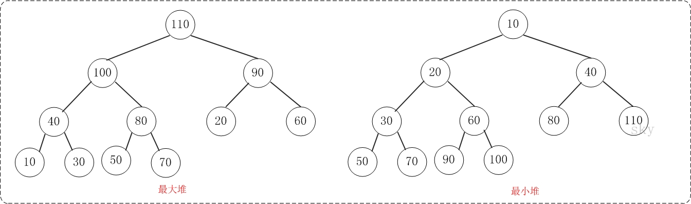

# Binary Tree - 二叉树

二叉树是每个节点最多有两个子树的树结构，子树有左右之分，二叉树常被用于实现**二叉查找树**和**二叉堆**。

性质：

* 第i层至多有 $2^{i-1} $个结点
* 深度为k的二叉树至多有$ 2^k -1$ 个结点


**满二叉树（Full Binary Tree）：**一棵深度为 k, 且有$ 2^k -1$ 个节点的二叉树（除最后一层无任何子节点外，每一层上的所有结点都有两个子结点）

**完全二叉树（Complete Binary Tree）：**除最后一层外，若其余层都是满的，并且最后一层或者是满的，或者是在右边缺少连续若干节点


|      |             完全二叉树             |       满二叉树       |
| :--: | :---------------------------: | :--------------: |
| 总节点k | $2^{h-1} \leq k \leq 2^{h}-1$ |    $k=2^h-1$     |
| 树高h  |       $h = log_2 k + 1$       | $h = log_2(k+1)$ |


**平衡二叉树（Balanced Binary Tree）：**被称为AVL树（有别于AVL算法），且具有以下性质：

1. 它是一棵空树或它的左右两个子树的高度差的绝对值不超过1
2. 左右两个子树都是一棵平衡二叉树


二叉树Python实现：

```python
class TreeNode:
    def __init__(self, val):
        self.val = val
        self.left, self.right = None, None
```

主要知识点：


### 树的遍历

* 深度优先（Depth First Search，DFS）
  * 前序（pre-order）：根左右
  * 中序（in-order）：左根右
  * 后序遍历（post-order）：左右根
* 广度优先（Breadth First Search，BFS）：先访问根节点，沿着树的宽度遍历子节点，直到所有节点均被访问为止。

#### 递归

```python
class Traversal(object):
    def __init__(self):
        self.traverse_path = list()

    def preorder(self, root):
        if root:
            self.traverse_path.append(root.val)
            self.preorder(root.left)
            self.preorder(root.right)

    def inorder(self,root):
        if root:
            self.inorder(root.left)
            self.traverse_path.append(root.val)
            self.inorder(root.right)

    def postorder(self,root):
        if root:
            self.postorder(root.left)
            self.postorder(root.right)
            self.traverse_path.append(root.val)
```

#### 迭代

```python
class solution:
    def preorder(self, root):
        if not root:
            return []
        result = []
        s = []
        s.append(root)
        while s:
            root = s.pop()
            result.append(root.val)
            if root.right:
                s.append(root.right)
            if root.left:
                s.append(root.left)
        return result
    
    def inorder(self, root):
        if not root:
            return []
        result = []
        s = []
        while root or s:
            if root:
                s.append(root)
                root = root.left
            else:
                root = s.pop()
                result.append(root.val)
                root = root.right
        return result
    
    def postorder(self, root):
        if not root:
            return []
        result = []
        s = []
        s.append(root)
        prev = []
        while s:
            curr = s[-1]
            no_child = curr.left is None and curr.right is None
            child_visited = prev and (curr.left==prev or curr.right==prev)
            if no_chile or child_visited:
                result.append(curr.val)
                s.pop()
                prev = curr
            else:
                if curr.right:
                    s.append(curr.right)
                if curr.left:
                    s.append(curr.left)
        return result
    
    # 广度优先:利用队列的思想
    def levelorder(self, root):
        if not root:
            return []
        result = []
        queue = []
        queue.append(root)
        while queue:
            level = []
            for i in range(len(queue)):
                node = queue.pop(0)
                if node.left:
                    queue.append(node.left)
                if node.right:
                    queue.append(node.right)
            result.append(level)
        return result
    
```


**二叉堆（Binary Heap）**：二叉堆是完全二元树或者是近似完全二元树，它分为两种：最大堆和最小堆。二叉堆是完全二元树或者是近似完全二元树，它分为两种：最大堆和最小堆。




创建二叉堆。因为可以采用一个列表保存堆的数据，构造函数只需要初始化一个列表和一个currentSize来表示堆当前的大小。

```python
class bin_heap:
    def __init__(self):
        self.heap_list = [0]
        self.current_size = 0
```


最小堆添加元素。

```python
class solution:
	def perc_up(self, i):
        while i // 2 >0:
            if self.heap_list[i] < self.heap_list[i // 2]:
                tmp = self.heap_list[i // 2]
                self.heap_list[i // 2] = self.heap_list[i]
                self.heap_list[i] = tmp
             i = i // 2
     
    def insert(self, k):
        self.heap_list.append(k)
        self.current_size += 1
        self.perc_up(self.curent_size)
```


### Trie（字典树）

Trie树，即字典树，又称单词查找树或键树，是一种树形结构。典型应用是用于统计和排序大量的字符串（但不仅限于字符串），所以经常被搜索引擎系统用于文本词频统计。它的优点是最大限度地减少无谓的字符串比较，查询效率比较高。

Trie的核心思想是空间换时间，利用字符串的公共前缀来降低查询时间的开销以达到提高效率的目的。

它有3个基本性质：

1. 根节点不包含字符，除根节点外每一个节点都只包含一个字符。
2. 从根节点到某一节点，路径上经过的字符连接起来，为该节点对应的字符串。
3. 每个节点的所有子节点包含的字符都不相同。