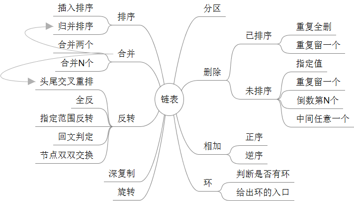

## Linked List - 链表

链表常用操作：



refer：https://zhuanlan.zhihu.com/p/249144171


### 基本定义

为什么用链表数据结构？

顺序存储相对链式存储的缺点：

1. 插入删除操作所需要移动的元素很多，浪费算力。
2. 必须为数组开足够的空间，否则有溢出风险。


链表的种类：

1. 单链表
2. 双链表
3. 循环单链表


Python定义：

```python
# 单向链表
class ListNode:
    def __init__(self, val):
        self.val = val
        self.next = None

# 双向链表
class DListNode:
    def __init__(self, val):
        self.val = val
        self.prev = self.next = None	
```


### 创建单链表

头插入法：先插入的节点在链表的后面，最终得到的结果是逆序的

```python
class ListNode:
    def __init__(self, val):
        self.val = val
        self.next = None
        
    @classmethod
    def create(cls, arr):
        dummy = cls(None)
        for num in arr:
            node = cls(num)
            node.next = dummy.next
            dummy.next = node
        return dummy.next
```


尾插入法：

```python
class ListNode:
    def __init__(self, val):
        self.val = val
        self.next = None
        
    @classmethod
    def create(cls, arr):
        if len(arr) == 0:
            return None
        end = cls(None)
        start = cls(arr[0])
        for num in arr[1:]:
            node = cls(num)
            end.next = node
            end = node
            
        return start
```


### 单链表遍历/插入/删除

```python
import copy
# 遍历, 这么遍历后链表数据就没了，应该先copy一下，最好还是用c++实现
def printList(L: ListNode):
    p = copy.deepcopy(L)
    while p:
        print(p.val)
        p = p.next
        
# 插入，在链表的第i个位置后面插入x的元素（i从1开始算）
def linkedListInsert(L: ListNode, i, x):
    p = copy.deepcopy(L)
    for ind in range(i-1):
        p = p.next
    node = ListNode(x)
    node.next = p.next
    p.next = node
    return L

# 删除，删除链表的第i个元素（i从1开始算）
def linkedListDelete(L: ListNode, i):
    if i == 1:
        return L.next
    
    p = copy.deepcopy(L)
    for ind in range(i-1):
        p = p.next
    pi = p.next
    p.next = pi.next
    del pi
    return L
```


### 创建双链表


### 双链表遍历/插入/删除


### 反转链表

#### 反转整个链表

```python
class ListNode:
    def __init__(self, val):
        self.val = val
        self.next = None

    # 把prev、head不断地往前移动
    # 这个过程类似于不断从旧的链表中删除链表头，
    # 然后拿链表头元素使用头插入法创建新的链表
    def reverse(self, head):
        prev = None
        while head:
            temp = head.next
            head.next = prev
            prev = head
            head = temp
            # 此时head和prev是没有连接的
        return prev
    
    # 使用递归反转
    def reverse_recursive(self, head):
        if head.next is None:
            return head
        last = self.reverse_recursive(head.next)
        head.next.next = head
        head.next = None
        # 一次递归执行到这里时的状态如下图所示
        return last
```


#### 反转前N个节点

迭代的方法比较简单，递归比较难理解

```python
class ListNode:
    successor = None
    def __init__(self, val):
        self.val = val
        self.next = None
       
   def reverseN(self, head, n):
       if n == 1:
            self.successor = head.next
            return head
        last = self.reverseN(head.next, n-1)
        
        head.next.next = head
        head.next = self.successor
        return last
```


#### 反转一部分


### 环链表相关

#### 判断链表是否有环

```python
def hasCycle(head):
    fast = slow = head
    while (fast is not None and fast.next is not None):
        fast = fast.next.next
        slow = slow.next
        
        if fast == slow:
            return True
        
    return False
```

当快慢指针相遇时，让其中任一个指针指向头节点，然后让它俩以相同速度前进，再次相遇时所在的节点位置就是环开始的位置


#### 寻找链表中点

首先有中点，则可以确定链表无环。用快慢指针，快的一次走两步，慢的一次走一步，则快的指针走到链表末尾null时，慢指针所在的位置就是链表的中点


#### 寻找链表的倒数第 k 个元素

让快指针先走 k 步，然后快慢指针开始同速前进。这样当快指针走到链表末尾 null 时，慢指针所在的位置就是倒数第 k 个链表节点


### 链表指针的鲁棒性

链表操作时的鲁棒性问题主要包含两个情况：

- 当访问链表中某个节点 curt.next 时，一定要先判断 curt 是否为 null。
- 全部操作结束后，判断是否有环；若有环，则置其中一端为 null。


### Dummy Node

Dummy node 是一个虚拟节点，也可以认为是标杆节点。Dummy node 就是在链表表头 head 前加一个节点指向 head，即 dummy -> head。

### 快慢指针

所谓快慢指针中的快慢指的是指针向前移动的步长，每次移动的步长较大即为快，步长较小即为慢，常用的快慢指针一般是在单链表中让快指针每次向前移动2，慢指针则每次向前移动1。快慢两个指针都从链表头开始遍历，于是快指针到达链表末尾的时候慢指针刚好到达中间位置，于是可以得到中间元素的值。快慢指针在链表相关问题中主要有两个应用：

* 快速找出未知长度单链表的中间节点
* 判断单链表是否有环

```python
# 判断链表是否有环
class NodeCircle:
    def __init__(self, val):
        self.val = val
        self.next = None

    def has_circle(self, head):
        slow = head
        fast = head
        while (slow and fast):
            fast = fast.next
            slow = slow.next
            if fast:
                fast = fast.next
            if fast == slow:
                break
        if fast and slow and (fast == slow):
            return True
        else:
            return False
```

