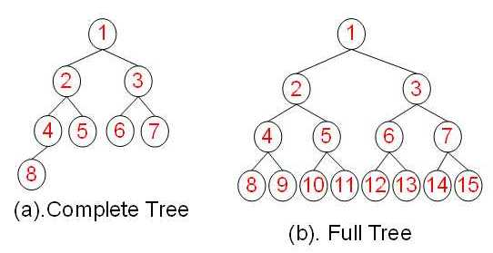
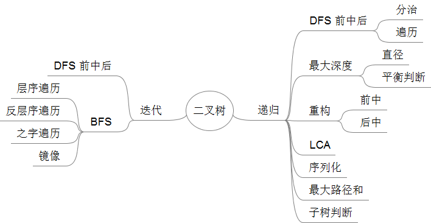
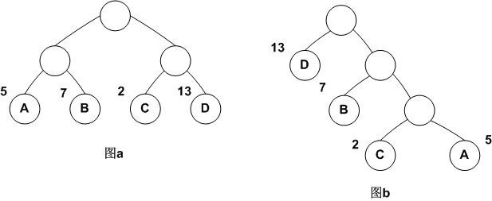
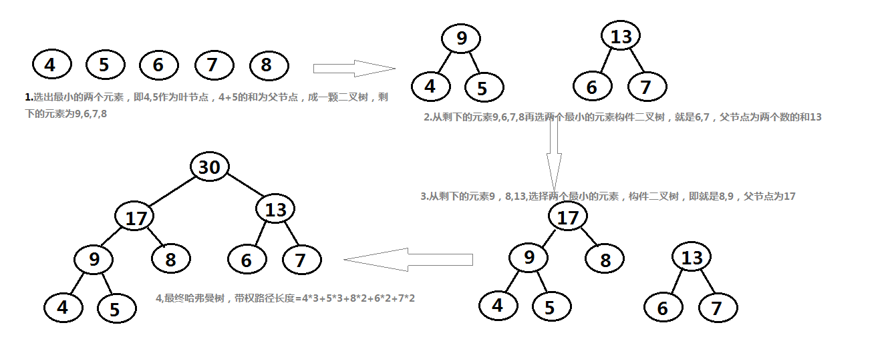
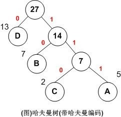
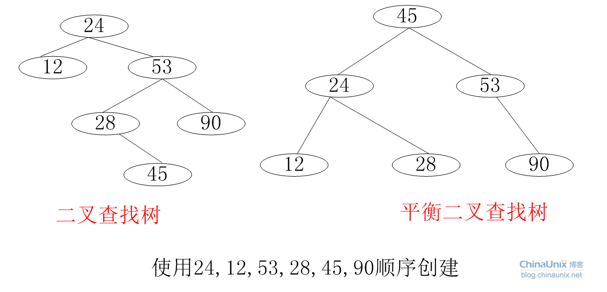
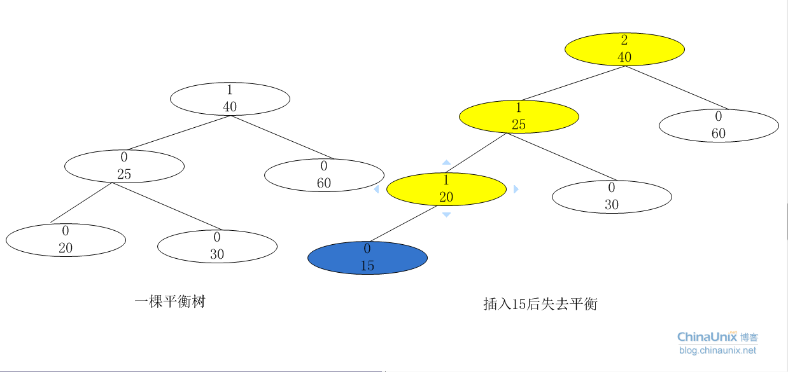
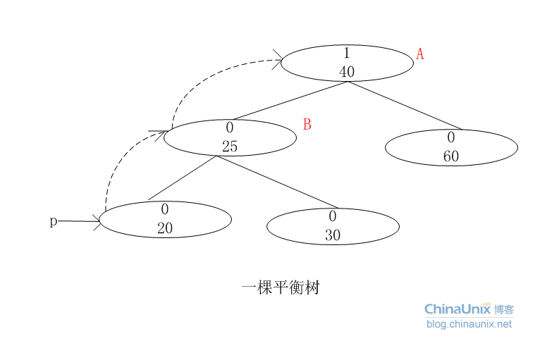
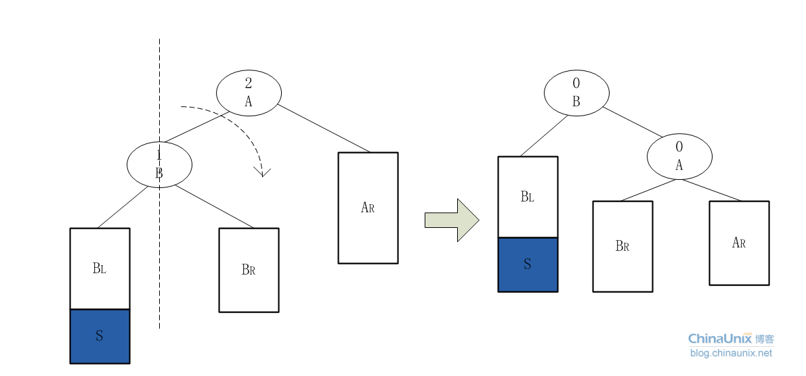
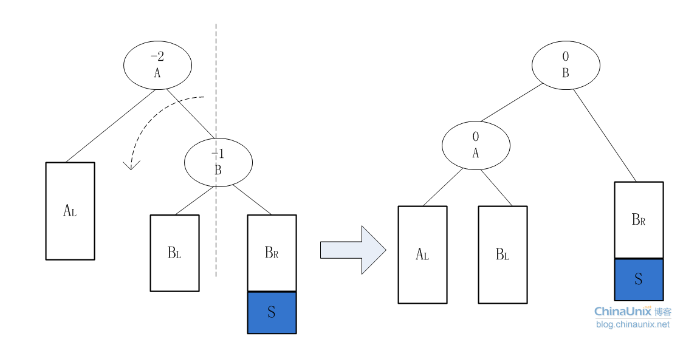

# Tree - 树

二叉树是每个节点最多有两个子树的树结构，子树有左右之分，二叉树常被用于实现**二叉查找树**和**二叉堆**。

性质：

* 第i层至多有 $2^{i-1} $个结点
* 深度为k的二叉树至多有$ 2^k -1$ 个结点


**满二叉树**（Full Binary Tree）：一棵深度为 k, 且有$ 2^k -1$ 个节点的二叉树（除最后一层无任何子节点外，每一层上的所有结点都有两个子结点）

**完全二叉树**（Complete Binary Tree）：除最后一层外，若其余层都是满的，并且最后一层或者是满的，或者是在右边缺少连续若干节点



|      |             完全二叉树             |       满二叉树       |
| :--: | :---------------------------: | :--------------: |
| 总节点k | $2^{h-1} \leq k \leq 2^{h}-1$ |    $k=2^h-1$     |
| 树高h  |       $h = log_2 k + 1$       | $h = log_2(k+1)$ |


**平衡二叉树**（Balanced Binary Tree）：被称为AVL树（有别于AVL算法），且具有以下性质：

1. 它是一棵空树或它的左右两个子树的高度差的绝对值不超过1
2. 左右两个子树都是一棵平衡二叉树


二叉树Python实现：

```python
class TreeNode:
    def __init__(self, val):
        self.val = val
        self.left, self.right = None, None
```

主要知识点：




## 树的遍历

* 深度优先（Depth First Search，DFS）
  * 前序（pre-order）：根左右
  * 中序（in-order）：左根右
  * 后序遍历（post-order）：左右根
* 广度优先（Breadth First Search，BFS）：先访问根节点，沿着树的宽度遍历子节点，直到所有节点均被访问为止。

### 递归

```python
class Traversal(object):
    def __init__(self):
        self.traverse_path = list()

    def preorder(self, root):
        if root:
            self.traverse_path.append(root.val)
            self.preorder(root.left)
            self.preorder(root.right)

    def inorder(self,root):
        if root:
            self.inorder(root.left)
            self.traverse_path.append(root.val)
            self.inorder(root.right)

    def postorder(self,root):
        if root:
            self.postorder(root.left)
            self.postorder(root.right)
            self.traverse_path.append(root.val)
```

### 迭代

```python
class solution:
    def preorder(self, root):
        if not root:
            return []
        result = []
        s = []
        s.append(root)
        while s:
            root = s.pop()
            result.append(root.val)
            if root.right:
                s.append(root.right)
            if root.left:
                s.append(root.left)
        return result
    
    def inorder(self, root):
        if not root:
            return []
        result = []
        s = []
        while root or s:
            if root:
                s.append(root)
                root = root.left
            else:
                root = s.pop()
                result.append(root.val)
                root = root.right
        return result
    
    def postorder(self, root):
        if not root:
            return []
        result = []
        s = []
        s.append(root)
        prev = []
        while s:
            curr = s[-1]
            no_child = curr.left is None and curr.right is None
            child_visited = prev and (curr.left==prev or curr.right==prev)
            if no_chile or child_visited:
                result.append(curr.val)
                s.pop()
                prev = curr
            else:
                if curr.right:
                    s.append(curr.right)
                if curr.left:
                    s.append(curr.left)
        return result
    
    # 广度优先:利用队列的思想
    def levelorder(self, root):
        if not root:
            return []
        result = []
        queue = []
        queue.append(root)
        while queue:
            level = []
            for i in range(len(queue)):
                node = queue.pop(0)
                if node.left:
                    queue.append(node.left)
                if node.right:
                    queue.append(node.right)
            result.append(level)
        return result
    
```

从前序遍历和中序遍历创建树：

```python
class Solution(object):
    def buildTree(self, preorder, inorder):
        """
        :type preorder: List[int]
        :type inorder: List[int]
        :rtype: TreeNode
        """
        if inorder:
            ind = inorder.index(preorder.pop(0))
            root = TreeNode(inorder[ind])
            root.left = self.buildTree(preorder, inorder[0:ind])
            root.right = self.buildTree(preorder, inorder[ind+1:])
            return root
```

从中序遍历和后续遍历创建树：

```python
class Solution(object):
    def buildTree(self, inorder, postorder):
        """
        :type inorder: List[int]
        :type postorder: List[int]
        :rtype: TreeNode
        """
        if inorder:
            ind = inorder.index(postorder.pop())
            root = TreeNode(inorder[ind])
            
            root.right = self.buildTree(inorder[ind+1:], postorder)
            root.left = self.buildTree(inorder[0:ind], postorder)
            return root
```

判断二叉树是否平衡：

```python
# Definition for a binary tree node.
# class TreeNode(object):
#     def __init__(self, x):
#         self.val = x
#         self.left = None
#         self.right = None

class Solution(object):
    def isBalanced(self, root):
        """
        :type root: TreeNode
        :rtype: bool
        """
        if not root:
            return True
        left_depth = self.helper(root.left)
        right_depth = self.helper(root.right)
        
        return abs(left_depth-right_depth)<=1 and self.isBalanced(root.left) and self.isBalanced(root.right)
        
    def helper(self, root):
        if not root:
            return 0
        return max(self.helper(root.left), self.helper(root.right))+1
```


## Trie（字典树）

Trie树，即字典树，又称单词查找树或键树，是一种树形结构。典型应用是用于统计和排序大量的字符串（但不仅限于字符串），所以经常被搜索引擎系统用于文本词频统计。它的优点是最大限度地减少无谓的字符串比较，查询效率比较高。

Trie的核心思想是空间换时间，利用字符串的公共前缀来降低查询时间的开销以达到提高效率的目的。

它有3个基本性质：

1. 根节点不包含字符，除根节点外每一个节点都只包含一个字符。
2. 从根节点到某一节点，路径上经过的字符连接起来，为该节点对应的字符串。
3. 每个节点的所有子节点包含的字符都不相同。


## 哈夫曼树

### 定义

哈夫曼树是一种带权路径长度最短的二叉树，也称为最优二叉树。如下图：



它们的带权路径长度分别为：

图a： WPL=5\*2+7\*2+2\*2+13\*2=54

图b： WPL=5\*3+2\*3+7\*2+13\*1=48

可见，图b的带权路径长度较小，我们可以证明图b就是哈夫曼树(也称为最优二叉树)。


### 哈夫曼树的构建过程




### 哈夫曼编码

利用哈夫曼树求得的用于通信的二进制编码称为哈夫曼编码。树中从根到每个叶子节点都有一条路径，对路径上的各分支约定指向左子树的分支表示”0”码，指向右子树的分支表示“1”码，取每条路径上的“0”或“1”的序列作为各个叶子节点对应的字符编码，即是哈夫曼编码。

就拿上图例子来说：

A，B，C，D对应的哈夫曼编码分别为：111，10，110，0

用图说明如下：



设计电文总长最短的二进制前缀编码，就是以n个字符出现的频率作为权构造一棵哈夫曼树，由哈夫曼树求得的编码就是哈夫曼编码。

### Python实现

```python
#coding:utf-8
import struct
codeDict={}#全局字典key=字符，value=数字
encodeDict={}
filename=None
listForEveryByte=[]
 
class Node:
    def __init__(self,right=None,left=None,parent=None,weight=0,charcode=None):
        self.right=right
        self.left=left
        self.parent=parent
        self.weight=weight
        self.charcode=charcode
 
#按权值排序
def sort(list):
    return sorted(list,key=lambda node:node.weight)
 
#构建哈夫曼树
def Huffman(listOfNode):
    listOfNode=sort(listOfNode)
    while len(listOfNode)!=1:
        a,b = listOfNode[0],listOfNode[1]
        new=Node()
        new.weight, new.left, new.right = a.weight + b.weight, a, b
        a.parent, b.parent = new, new
        listOfNode.remove(a), listOfNode.remove(b)
        listOfNode.append(new)
        listOfNode=sort(listOfNode)
    return listOfNode
 
def inPutFile():
    global filename
    global  listForEveryByte
    filename=raw_input("请输入要压缩的文件：")
    global  codeDict
    with open(filename,'rb') as f:
        data=f.read()
        for Byte in data:
            codeDict.setdefault(Byte,0) #每个字节出现的次数默认为0
            codeDict[Byte]+=1
            listForEveryByte.append(Byte)
 
def outputCompressedFile():
    global  listForEveryByte
    fileString=""
    with open(filename.split(".")[0]+".jbj","wb") as f:
        for Byte in listForEveryByte:
            fileString+=encodeDict[Byte]  #构成一个长字符序列
        leng=len(fileString)
        more=16-leng%16
        fileString=fileString+"0"*more          #空位用0补齐
        #print(fileString)
 
        leng=len(fileString)
        i,j=0,16
        while j<=leng:
            k=fileString[i:j]
            a=int(k,2)
            #print(a)
           # print(repr(struct.pack(">H",a)))
            f.write(struct.pack(">H",a))
           # f.write(str(a))
            i=i+16
            j=j+16
 
 
def encode(head,listOfNode):
    global  encodeDict
    for e in listOfNode:
        ep=e
        encodeDict.setdefault(e.charcode,"")
        while ep!=head:
 
            if ep.parent.left==ep:
                encodeDict[e.charcode]="1"+encodeDict[e.charcode]
            else:
                encodeDict[e.charcode]="0"+encodeDict[e.charcode]
            ep=ep.parent
 
 
if __name__ == '__main__':
    inPutFile()
    listOfNode=[]
    for e in codeDict.keys():
        listOfNode.append(Node(weight=codeDict[e],charcode=e))
    head=Huffman(listOfNode)[0]    #构建哈夫曼树，head称为树的根节点
    encode(head,listOfNode)
 
    for i in encodeDict.keys():
         print(i,encodeDict[i])
    #outputCompressedFile()
```


## 动态查找树之二叉查找树与平衡二叉查找树

一颗**二叉查找树(BST)**是一颗二叉树，其中每个节点都含有一个可进行比较的键及相应的值，且每个节点的键都**大于等于左子树中的任意节点的键**，而**小于右子树中的任意节点的键**。
$$
root.left.val \leq root.val < root.right.val
$$
**使用中序遍历可得到有序数组**，这是二叉查找树的又一个重要特征。

### BST数据结构Python实现

```python
# Definition for a binary tree node.
# class TreeNode(object):
#     def __init__(self, x):
#         self.val = x
#         self.left = None
#         self.right = None

class BinarySearchTree(object):
    def __init__(self,key):
        self.key=key
        self.left=None
        self.right=None
    def find(self,x):
        if x==self.key:
            return self
        elif x<self.key and self.left:
            return self.left.find(x)
        elif x>self.key and self.right:
            return self.right.find(x)
        else:
            return None  
    def findMin(self):
        if self.left:
            return self.left.findMin()
        else:
            return self
    def findMax(self):
        tree=self
        if tree:
            while tree.right:
                tree=tree.right
        return tree
    def insert(self,x):
        if x<self.key:
            if self.left:
                self.left.insert(x)
            else:
                tree=BinarySearchTree(x)
                self.left=tree
        elif x>self.key:
            if self.right:
                self.right.insert(x)
            else:
                tree=BinarySearchTree(x)
                self.right=tree
    def delete(self,x):
        if self.find(x):
            if x<self.key:
                self.left=self.left.delete(x)
                return self
            elif x>self.key:
                self.right=self.right.delete(x)
                return self
            elif self.left and self.right:
                key=self.right.findMin().key
                self.key=key
                self.right=self.right.delete(key)
                return self
            else:
                if self.left:
                    return self.left
                else:
                    return self.right
        else:
            return self
```

上述写法的缺点是很难处理空树的情况。

另一种类似于链表的写法

```python
class TreeNode(object):
    def __init__(self,key,left=None,right=None,parent=None):
        self.key=key
        self.left=left
        self.right=right
        self.parent=parent
    def hasLeftChild(self):
        return self.left
    def hasRightChild(self):
        return self.right
    def isLeftChild(self):
        return self.parent and self.parent.left==self
    def isRightChild(self):
        return self.parent and self.parent.right==self
class BSTree(object):
    def __init__(self):
        self.root=None
        self.size=0
    def length(self):
        return self.size
    def insert(self,x):
        node=TreeNode(x)
        if not self.root:
            self.root=node
            self.size+=1
        else:
            currentNode=self.root
            while True:
                if x<currentNode.key:
                    if currentNode.left:
                        currentNode=currentNode.left
                    else:
                        currentNode.left=node
                        node.parent=currentNode
                        self.size+=1
                        break
                elif x>currentNode.key:
                    if currentNode.right:
                        currentNode=currentNode.right
                    else:
                        currentNode.right=node
                        node.parent=currentNode
                        self.size+=1
                        break
                else:
                    break
             
    def find(self,key):
        if self.root:
            res=self._find(key,self.root)
            if res:
                return res
            else:
                return None
        else:
            return None
    def _find(self,key,node):
        if not node:
            return None
        elif node.key==key:
            return node
        elif key<node.key:
            return self._find(key,node.left)
        else:
            return self._find(key,node.right)
    def findMin(self):
        if self.root:
            current=self.root
            while current.left:
                current=current.left
            return current
        else:
            return None
    def _findMin(self,node):
        if node:
            current=node
            while current.left:
                current=current.left
            return current
    def findMax(self):
        if self.root:
            current=self.root
            while current.right:
                current=current.right
            return current
        else:
            return None
    def delete(self,key):
        if self.size>1:
            nodeToRemove=self.find(key)
            if nodeToRemove:
                self.remove(nodeToRemove)
                self.size-=1
            else:
                raise KeyError,'Error, key not in tree'
        elif self.size==1 and self.root.key==key:
            self.root=None
            self.size-=1
        else:
            raise KeyError('Error, key not in tree')
    def remove(self,node):
        if not node.left and not node.right:   #node为树叶
            if node==node.parent.left:
                node.parent.left=None
            else:
                node.parent.right=None
            
        elif node.left and node.right:   #有两个儿子
            minNode=self._findMin(node.right)
            node.key=minNode.key
            self.remove(minNode)
             
        else:    #有一个儿子
            if node.hasLeftChild():
                if node.isLeftChild():
                    node.left.parent=node.parent
                    node.parent.left=node.left
                elif node.isRightChild():
                    node.left.parent=node.parent
                    node.parent.right=node.left
                else:    #node为根
                    self.root=node.left
                    node.left.parent=None
                    node.left=None
            else:
                if node.isLeftChild():
                    node.right.parent=node.parent
                    node.parent.left=node.right
                elif node.isRightChild():
                    node.right.parent=node.parent
                    node.parent.right=node.right
                else:   #node为根
                    self.root=node.right
                    node.right.parent=None
                    node.right=None
```


### 平衡二叉查找树

#### 定义

平衡二叉查找树又称为平衡二叉排序树，又称为AVL树，是二叉查找树的改进。
定义（满足如下三个条件）：

1. 是二叉查找树。
2. 左子树与右子树的深度之差的绝对值小于或等于1.
3. 左右子树也是平衡二叉查找树。 

**`平衡因子`**： 平衡二叉查找树的每个结点都要描述一个属性，它表示结点的左子树深度与右子树深度之差。如果某个二叉查找树的所有节点的平衡因子只有**-1,0,1**则说明其实平衡的，否则说明是不平衡的。

#### 分析平衡二叉查找树有什么意义

在分析二叉查找树的平均查找长度时，会发现，二叉查找树的平均查找长度与二叉查找树的形态有关系，最坏的情况是退化为链表，查找变为线性查找，平均查找长度为(n 1)/2.最好的情况就是树的形态与折半查找的判断树形式。平均查找长度为logN。

平衡二叉树就是为了保证树的形态向“树”的方向走。避免了二叉查找树退化为链表的可能。从而提高了查找效率。其实平衡二叉查找树与二叉查找树的区别并不是很大，平衡树在“改变”树的时候会维护树的形态，“改变”无非就两种，插入节点和删除节点，而树的查找只“读”了树，并没改变，所以树的查找，平衡树和查找树是一样的。



现在我要使用24,12,53,28,45,90创建查找树，如果创建的二叉查找树（如左图），则平均查找长度：(1 2 2 3 4 3)/6 = 15/6 如果创建的是平衡二叉查找树(如右图)，则平均查找长度：(2 3 2 3 1 3)/6 = 14/6.

#### 如何创建和插入平衡二叉查找树



如上图，插入15这个节点后，平衡因子变化的只有20,25,40。都是15的“祖先节点”。



A节点：为插入点最底层“祖先节点”最可能的失衡点。比如插入的节点是15，故插入的位置是节点20的左子，这从20这个节点开始遍历祖先节点，取最近的的最可能失衡点，这儿就是40这个节点。如果没有找到，说明插入这个节点不可能破坏平衡B节点就是该祖先节点一条线中A节点的下一个。


AVL树的旋转分为四种情况：

#### LL型（左边重，需往右边转）



旋转方法：以B点为轴，将A节点做顺时针旋转，然后将B的右子树作为A的左子树。

```python
if LL:
    B = A.lchild			//该类型B节点所在的位置
    A.lchild = B.rchild		//将B节点的右子树交给A，作为A的左子树。
    B.rchild = A			//把A作为B的右子树。
    A.bf = B.bf = 0			//更新A，B节点的平衡因子的值。
    if father_A == None:	//如果A是根，则现在把B节点设置为根节点。
        root = B
    //如果原来A是father_A的左孩子，则现在把B，作为father_A的左孩子。否则，作为father_A的右孩子，就是用B的取代A原来的位置。
    elif A == father_A.lchild:
        father_A.lchild = B
    else:
        father_A.rchild = B
        
```


#### RR型 （右边重，需往左边转）



旋转方法：以B节点为轴，将A节点作逆时针旋转，然后，把B的左子树给A，作为A的右子树。


#### LR型


## 动态查找树——B树

### 定义与性质

大规模数据存储中，实现索引查询这样一个实际背景下，树节点存储的元素数量是有限的（如果元素数量非常多的话，查找就退化成节点内部的线性查找了），这样导致二叉查找树结构由于树的深度过大而造成磁盘I/O读写过于频繁，进而导致查询效率低下（为什么会出现这种情况，待会在外部存储器-磁盘中有所解释），那么如何减少树的深度（当然是不能减少查询的数据量），一个基本的想法就是：采用多叉树结构（由于树节点元素数量是有限的，自然该节点的子树数量也就是有限的）。

B-树，即为B树，又叫平衡多路查找树。因为B树的原英文名称为B-tree，而国内很多人喜欢把B-tree译作B-树。

B树与红黑树最大的不同在于，B树的结点可以有许多子女，从几个到几千个。包含n[x]个关键字的内结点x，x有n[x]+1个子女（也就是说，一个内结点x若含有n[x]个关键字，那么x将含有n[x]+1个子女）。如下图所示，即是一棵B树，一棵关键字为英语中辅音字母的B树，现在要从树种查找字母R，所有的叶结点都处于相同的深度，带阴影的结点为查找字母R时要检查的结点：


B树可以用阶或度来来定义。用阶定义：

一颗m阶的B树

1. 树中每个结点最多含有m个孩子（m>=2）；
2. 除根结点和叶子结点外，其它每个结点至少有[ceil(m / 2)]个孩子（其中ceil(x)是一个取上限的函数）；
3. 若根结点不是叶子结点，则至少有2个孩子（特殊情况：没有孩子的根结点，即根结点为叶子结点，整棵树只有一个根节点）；
4. 所有叶子结点都出现在同一层，叶子结点不包含任何关键字信息(可以看做是外部接点或查询失败的接点，实际上这些结点不存在，指向这些结点的指针都为null)；（读者反馈@冷岳：这里有错，叶子节点只是没有孩子和指向孩子的指针，这些节点也存在，也有元素。@研究者July：其实，关键是把什么当做叶子结点，因为如红黑树中，每一个NULL指针即当做叶子结点，只是没画出来而已）。
5. 每个非终端结点中包含有n个关键字信息： (n，P0，K1，P1，K2，P2，......，Kn，Pn)。其中：
   ​       a)   Ki (i=1...n)为关键字，且关键字按顺序升序排序K(i-1)< Ki。 
   ​       b)   Pi为指向子树根的接点，且指针P(i-1)指向子树种所有结点的关键字均小于Ki，但都大于K(i-1)。 
   ​       c)   关键字的个数n必须满足： [ceil(m / 2)-1]<= n <= m-1。

用度定义的B树

针对上面的5点，再阐述下：B树中每一个结点能包含的关键字（如之前上面的D H和Q T X）数有一个上界和界。这个下界可以用一个称作B树的最小度数（算法导论中文版上译作度数，最小度数即内节点中节点最小孩子数目）m（m>=2）表示。

- 每个非根的内结点至多有m个子女，每个非根的结点必须至少含有m-1个关键字，如果树是非空的，则根结点至少包含一个关键字；
- 每个结点可包含至多2m-1个关键字。所以一个内结点至多可有2m个子女。如果一个结点恰好有2m-1个关键字，我们就说这个结点是满的（而稍后介绍的B*树作为B树的一种常用变形，B*树中要求每个内结点至少为2/3满，而不是像这里的B树所要求的至少半满）；
- 当关键字数m=2（t=2的意思是，mmin=2，m可以>=2）时的B树是最简单的**（**有很多人会因此误认为B树就是二叉查找树，但二叉查找树就是二叉查找树，B树就是B树，B树是一棵含有m（m>=2）个关键字的平衡多路查找树**）**，此时，每个内结点可能因此而含有2个、3个或4个子女，亦即一棵2-3-4树，然而在实际中，通常采用大得多的t值。


### Python实现

### **搜索B树**

搜索B树与搜索二叉查找树的操作很类似，只是在每个节点所做的不是个二叉分支决定，而是根据该节点的子女数所做的多路分支决定。

### **向B树插入关键字**

 **1.向未满的节点插入关键字**


**2.向已满的节点添加关键字，需要将节点分裂为两个节点：**

分裂一个节点有三种情况：


**A**：父节点未满


有两种情况，分裂leftchild与分裂middlechild：


**B**：父节点已满，需要将父节点分裂


有三种情况：


最后，特殊情况，产生新的根：


```python
class Node(object):
    def __init__(self,key):
        self.key1=key
        self.key2=None
        self.left=None
        self.middle=None
        self.right=None
    def isLeaf(self):
        return self.left is None and self.middle is None and self.right is None
    def isFull(self):
        return self.key2 is not None
    def hasKey(self,key):
        if (self.key1==key) or (self.key2 is not None and self.key2==key):
            return True
        else:
            return False
    def getChild(self,key):
        if key<self.key1:
            return self.left
        elif self.key2 is None:
            return self.middle
        elif key<self.key2:
            return self.middle
        else:
            return self.right
class 2_3_Tree(object):
    def __init__(self):
        self.root=None
    def get(self,key):
        if self.root is None:
            return None
        else:
            return self._get(self.root,key)
    def _get(self,node,key):
        if node is None:
            return None
        elif node.hasKey(key):
            return node
        else:
            child=node.getChild(key)
            return self._get(child,key)
    def put(self,key):
        if self.root is None:
            self.root=Node(key)
        else:
            pKey,pRef=self._put(self.root,key)
            if pKey is not None:
                newnode=Node(pKey)
                newnode.left=self.root
                newnode.middle=pRef
                self.root=newnode
    def _put(self,node,key):
        if node.hasKey(key):
            return None,None
        elif node.isLeaf():
            return self._addtoNode(node,key,None)
        else:
            child=node.getChild(key)
            pKey,pRef=self._put(child,key)
            if pKey is None:
                return None,None
            else:
                return self._addtoNode(node,pKey,pRef)
             
         
    def _addtoNode(self,node,key,pRef):
        if node.isFull():
            return self._splitNode(node,key,pRef)
        else:
            if key<node.key1:
                node.key2=node.key1
                node.key1=key
                if pRef is not None:
                    node.right=node.middle
                    node.middle=pRef
            else:
                node.key2=key
                if pRef is not None:
                    node.right=Pref
            return None,None
    def _splitNode(self,node,key,pRef):
        newnode=Node(None)
        if key<node.key1:
            pKey=node.key1
            node.key1=key
            newnode.key1=node.key2
            if pRef is not None:
                newnode.left=node.middle
                newnode.middle=node.right
                node.middle=pRef
        elif key<node.key2:
            pKey=key
            newnode.key1=node.key2
            if pRef is not None:
                newnode.left=Pref
                newnode.middle=node.right
        else:
            pKey=node.key2
            newnode.key1=key
            if pRef is not None:
                newnode.left=node.right
                newnode.middle=pRef
        node.key2=None
        return pKey,newnode
```


### B+树

B+-tree：是应文件系统所需而产生的一种B-tree的变形树。
一棵m阶的B+树和m阶的B树的异同点在于：

1. 有n棵子树的结点中含有n-1 个关键字；
2. 所有的叶子结点中包含了全部关键字的信息，及指向含有这些关键字记录的指针，且叶子结点本身依关键字的大小自小而大的顺序链接。 (而B 树的叶子节点并没有包括全部需要查找的信息)
3. **所有的非终端结点可以看成是索引部分**，结点中仅含有其子树根结点中最大（或最小）关键字。 (而B 树的非终节点也包含需要查找的有效信息)


## 动态查找树——红黑树

红黑树，一种二叉查找树，但在每个结点上增加一个存储位表示结点的颜色，可以是Red或Black。作为一棵二叉查找树，满足二叉查找树的一般性质。通过对任何一条从根到叶子的路径上各个结点着色方式的限制，红黑树确保没有一条路径会比其他路径长出俩倍，因而是接近平衡的。

**红黑树的5个性质：**

1. 每个结点要么是红的要么是黑的。  
2. 根结点是黑的。  
3. 每个叶结点（叶结点即指树尾端NIL指针或NULL结点）都是黑的。  
4. 如果一个结点是红的，那么它的两个儿子都是黑的。  
5.  对于任意结点而言，其到叶结点树尾端NIL指针的每条路径都包含相同数目的黑结点。 


"叶结点" 或"NULL结点"，如上图所示，它不包含数据而只充当树在此结束的指示，这些节点在绘图中经常被省略。

### 红黑树的插入与插入修复

红黑树的插入相当于在二叉查找树插入的基础上，为了重新恢复平衡，继续做了插入修复操作。

```python
RB-INSERT(T, z)  
y ← nil  
x ← T.root  
while x ≠ T.nil  
    do y ← x  
    if z.key < x.key  
        then x ← x.left  
    else x ← x.right  
z.p ← y  
if y == nil[T]  
    then T.root ← z  
else if z.key < y.key  
    then y.left ← z  
else y.right ← z  
z.left ← T.nil  
z.right ← T.nil  
z.color ← RED  
RB-INSERT-FIXUP(T, z)  	
```

但当遇到下述3种情况时又该如何调整呢？

● 插入修复情况1：如果当前结点的父结点是红色且祖父结点的另一个子结点（叔叔结点）是红色

● 插入修复情况2：当前节点的父节点是红色,叔叔节点是黑色，当前节点是其父节点的右子

● 插入修复情况3：当前节点的父节点是红色,叔叔节点是黑色，当前节点是其父节点的左子

```python
RB-INSERT-FIXUP(T, z)  
while z.p.color == RED  
    do if z.p == z.p.p.left  
        then y ← z.p.p.right  
        if y.color == RED  
            then z.p.color ← BLACK               ▹ Case 1  
            y.color ← BLACK                    ▹ Case 1  
            z.p.p.color ← RED                    ▹ Case 1  
            z ← z.p.p                            ▹ Case 1  
        else if z == z.p.right  
            then z ← z.p                          ▹ Case 2  
            LEFT-ROTATE(T, z)                   ▹ Case 2  
        z.p.color ← BLACK                        ▹ Case 3  
        z.p.p.color ← RED                         ▹ Case 3  
        RIGHT-ROTATE(T, z.p.p)                  ▹ Case 3  
    else (same as then clause with "right" and "left" exchanged)  
T.root.color ← BLACK  
```

### 红黑树的删除


### Python实现

```python
# coding=utf-8
# 红黑树Python实现

# 颜色常量
RED = 0
BLACK = 1


def left_rotate(tree, node):
    if not node.right:
        return False
    node_right = node.right
    node_right.p = node.p
    if not node.p:
        tree.root = node_right
    elif node == node.p.left:
        node.p.left = node_right
    else:
        node.p.right = node_right
    if node_right.left:
        node_right.left.p = node
    node.right = node_right.left
    node.p = node_right
    node_right.left = node


def right_rotate(tree, node):
    if not node.left:
        return False
    node_left = node.left
    node_left.p = node.p
    if not node.p:
        tree.root = node_left
    elif node == node.p.left:
        node.p.left = node_left
    elif node == node.p.right:
        node.p.right = node_left
    if node_left.right:
        node_left.right.p = node
    node.left = node_left.right
    node.p = node_left
    node_left.right = node


def transplant(tree, node_u, node_v):
    """
    用 v 替换 u
    :param tree: 树的根节点
    :param node_u: 将被替换的节点
    :param node_v: 替换后的节点
    :return: None
    """
    if not node_u.p:
        tree.root = node_v
    elif node_u == node_u.p.left:
        node_u.p.left = node_v
    elif node_u == node_u.p.right:
        node_u.p.right = node_v
    # 加一下为空的判断
    if node_v:
        node_v.p = node_u.p


def tree_maximum(node):
    """
    找到以 node 节点为根节点的树的最大值节点 并返回
    :param node: 以该节点为根节点的树
    :return: 最大值节点
    """
    temp_node = node
    while temp_node.right:
        temp_node = temp_node.right
    return temp_node


def tree_minimum(node):
    """
    找到以 node 节点为根节点的树的最小值节点 并返回
    :param node: 以该节点为根节点的树
    :return: 最小值节点
    """
    temp_node = node
    while temp_node.left:
        temp_node = temp_node.left
    return temp_node


def preorder_tree_walk(node):
    if node:
        print (node.value, node.color)
        preorder_tree_walk(node.left)
        preorder_tree_walk(node.right)


class RedBlackTreeNode(object):
    def __init__(self, value):
        self.value = value
        self.left = None
        self.right = None
        self.p = None
        self.color = RED


class RedBlackTree(object):
    def __init__(self):
        self.root = None

    def insert(self, node):
        # 找到最接近的节点
        temp_root = self.root
        temp_node = None
        while temp_root:
            temp_node = temp_root
            if node.value == temp_node.value:
                return False
            elif node.value > temp_node.value:
                temp_root = temp_root.right
            else:
                temp_root = temp_root.left
        # 在相应位置插入节点
        if not temp_node:
            self.root = node
            node.color = BLACK
        elif node.value < temp_node.value:
            temp_node.left = node
            node.p = temp_node
        else:
            temp_node.right = node
            node.p = temp_node
        # 调整树
        self.insert_fixup(node)

    def insert_fixup(self, node):
        if node.value == self.root.value:
            return
        # 为什么是这个终止条件？
        # 因为如果不是这个终止条件那就不需要调整
        while node.p and node.p.color == RED:
            # 只要进入循环则必有祖父节点 否则父节点为根节点 根节点颜色为黑色 不会进入循环
            if node.p == node.p.p.left:
                node_uncle = node.p.p.right
                # 1. 没有叔叔节点 若此节点为父节点的右子 则先左旋再右旋 否则直接右旋
                # 2. 有叔叔节点 叔叔节点颜色为黑色
                # 3. 有叔叔节点 叔叔节点颜色为红色 父节点颜色置黑 叔叔节点颜色置黑 祖父节点颜色置红 continue
                # 注: 1 2 情况可以合为一起讨论 父节点为祖父节点右子情况相同 只需要改指针指向即可
                if node_uncle and node_uncle.color == RED:
                    node.p.color = BLACK
                    node_uncle.color = BLACK
                    node.p.p.color = RED
                    node = node.p.p
                    continue
                elif node == node.p.right:
                    left_rotate(self, node.p)
                    node = node.left
                node.p.color = BLACK
                node.p.p.color = RED
                right_rotate(self, node.p.p)
                return
            elif node.p == node.p.p.right:
                node_uncle = node.p.p.left
                if node_uncle and node_uncle.color == RED:
                    node.p.color = BLACK
                    node_uncle.color = BLACK
                    node.p.p.color = RED
                    node = node.p.p
                    continue
                elif node == node.p.left:
                    right_rotate(self, node)
                    node = node.right
                node.p.color = BLACK
                node.p.p.color = RED
                left_rotate(self, node.p.p)
                return
        # 最后记得把根节点的颜色改为黑色 保证红黑树特性
        self.root.color = BLACK

    def delete(self, node):
        # 找到以该节点为根节点的右子树的最小节点
        node_color = node.color
        if not node.left:
            temp_node = node.right
            transplant(self, node, node.right)
        elif not node.right:
            temp_node = node.left
            transplant(self, node, node.left)
        else:
            # 最麻烦的一种情况 既有左子 又有右子 找到右子中最小的做替换 类似于二分查找树的删除
            node_min = tree_minimum(node.right)
            node_color = node_min.color
            temp_node = node_min.right
            if node_min.p != node:
                transplant(self, node_min, node_min.right)
                node_min.right = node.right
                node_min.right.p = node_min
            transplant(self, node, node_min)
            node_min.left = node.left
            node_min.left.p = node_min
            node_min.color = node.color
        # 当删除的节点的颜色为黑色时 需要调整红黑树
        if node_color == BLACK:
            self.delete_fixup(temp_node)

    def delete_fixup(self, node):
        # 实现过程还需要理解 比如为什么要删除 为什么是那几种情况
        while node != self.root and node.color == BLACK:
            if node == node.p.left:
                node_brother = node.p.right
                if node_brother.color == RED:
                    node_brother.color = BLACK
                    node.p.color = RED
                    left_rotate(self, node.p)
                    node_brother = node.p.right
                if (not node_brother.left or node_brother.left.color == BLACK) and \
                        (not node_brother.right or node_brother.right.color == BLACK):
                    node_brother.color = RED
                    node = node.p
                else:
                    if not node_brother.right or node_brother.right.color == BLACK:
                        node_brother.color = RED
                        node_brother.left.color = BLACK
                        right_rotate(self, node_brother)
                        node_brother = node.p.right
                    node_brother.color = node.p.color
                    node.p.color = BLACK
                    node_brother.right.color = BLACK
                    left_rotate(self, node.p)
                node = self.root
                break
            else:
                node_brother = node.p.left
                if node_brother.color == RED:
                    node_brother.color = BLACK
                    node.p.color = RED
                    left_rotate(self, node.p)
                    node_brother = node.p.right
                if (not node_brother.left or node_brother.left.color == BLACK) and \
                        (not node_brother.right or node_brother.right.color == BLACK):
                    node_brother.color = RED
                    node = node.p
                else:
                    if not node_brother.left or node_brother.left.color == BLACK:
                        node_brother.color = RED
                        node_brother.right.color = BLACK
                        left_rotate(self, node_brother)
                        node_brother = node.p.left
                    node_brother.color = node.p.color
                    node.p.color = BLACK
                    node_brother.left.color = BLACK
                    right_rotate(self, node.p)
                node = self.root
                break
        node.color = BLACK


def main():
    number_list = (7, 4, 1, 8, 5, 2, 9, 6, 3)
    tree = RedBlackTree()
    for number in number_list:
        node = RedBlackTreeNode(number)
        tree.insert(node)
        del node
    preorder_tree_walk(tree.root)
    tree.delete(tree.root)
    preorder_tree_walk(tree.root)

if __name__ == '__main__':
    main()
```
