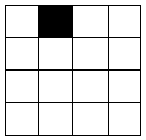
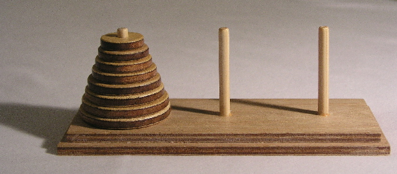

### 基本思想及策略

 如果原问题可分割成k个子问题，1<k≤n，且这些子问题都可解并可利用这些子问题的解求出原问题的解，那么这种分治法就是可行的。由分治法产生的子问题往往是原问题的较小模式，这就为使用递归技术提供了方便。在这种情况下，反复应用分治手段，可以使子问题与原问题类型一致而其规模却不断缩小，最终使子问题缩小到很容易直接求出其解。这自然导致**递归**过程的产生。分治与递归像一对孪生兄弟，经常同时应用在算法设计之中，并由此产生许多高效算法。

### 使用的情况

- 该问题的规模缩小到一定的程度就可以容易地解决
- 该问题可以分解为若干个规模较小的相同问题，即该问题具有**最优子结构性质**。
- 利用该问题分解出的子问题的解可以合并为该问题的解；
- 该问题所分解出的各个子问题是相互独立的，即**子问题之间不包含公共的子子问题**。

第一条特征是绝大多数问题都可以满足的，因为问题的计算复杂性一般是随着问题规模的增加而增加；

**第二条特征是应用分治法的前提**它也是大多数问题可以满足的，此特征反映了递归思想的应用；、

**第三条特征是关键，能否利用分治法完全取决于问题是否具有第三条特征**，如果**具备了第一条和第二条特征，而不具备第三条特征，则可以考虑用贪心法或动态规划法**。

**第四条特征涉及到分治法的效率**，如果各子问题是不独立的则分治法要做许多不必要的工作，重复地解公共的子问题，此时虽然可用分治法，但**一般用动态规划法较好**。


### 解题的基本步骤

 step1 分解（Divide）：将原问题分解为若干个规模较小，相互独立，与原问题形式相同的子问题；

 step2 解决（Conquer）：若子问题规模较小而容易被解决则直接解，否则递归地解各个子问题

 step3 合并（Combine）：将各个子问题的解合并为原问题的解。

分治法的python伪代码：

```python
# Pseudocode(ish)
def divide_and_conquer(S, divide, combine):
    if len(S) == 1: return S
    L, R = divide(S)
    A = divide_and_conquer(L, divide, combine)
    B = divide_and_conquer(R, divide, combine)
    return combine(A, B)
```


### 使用分治法求解的经典问题

1. 二分搜索
2. 大整数乘法
3. Strassen矩阵乘法
4. 棋盘覆盖
5. 合并排序
6. 快速排序
7. 线性时间选择
8. 最接近点对问题
9. 循环赛日程表
10. 汉诺塔


#### 二分搜索

```python
def binary_search(alist, low, high, des):
    if low <= high:
        middle = low + (high-low)>>1
        if des == alist[mid]:
            return mid
        elif des < alist[mid]:
            return binary_search(alist, low, mid-1, des)
        elif des > alist[mid]:
            return binary_search(alist, mid+1, high, des)
    else:
        return -1

a = [1,3,5,8,14,19,24,28,30,34,37]
print(binary_search(a, 0, len(a), 3))
```


#### 大整数乘法

```python

"""
a: str
b: str
return: str(a*b)
"""
def large_multi(stra, strb):
    alist, blist = list(stra), list(strb)
    alen, blen = len(stra), len(strb)
    result = [0 for i in range(alen+blen)]
    for i in range(alen):
        for j in range(blen):
            result[alen-1-i + blen-1-j] += int(alist[i])*int(blist[j])

    for i in range(len(result)-1):
        if result[i] >= 10:
            result[i+1] += result[i]//10
            result[i] = result[i] % 10

    result.reverse()
    for i in range(len(result)):
        if result[i] != 0:
            result = result[i:]
            break
    result = [str(a) for a in result]
    return int("".join(result))

print(large_multi("2345", "46542"))
print(2345*46542)
```


#### Strassen矩阵乘法


#### 棋盘覆盖

在一个$2^k \times 2^k$个方格组成的棋盘中，有一个方格是黑的，其余全是白的。如下图所示。



现在要下图中4中形态的L型骨牌覆盖所有的白色棋盘，且任意两个L型骨牌间不得覆盖。求所有的覆盖方案。


```python
def chess(tr,tc,pr,pc,size):  
    global mark   
    global table  
    mark+=1  
    count=mark  
    if size==1:  
        return  
    half=size//2  
    if pr<tr+half and pc<tc+half:  
        chess(tr,tc,pr,pc,half)  
    else:  
        table[tr+half-1][tc+half-1]=count  
        chess(tr,tc,tr+half-1,tc+half-1,half)  
    if pr<tr+half and pc>=tc+half:  
        chess(tr,tc+half,pr,pc,half)  
    else:  
        table[tr+half-1][tc+half]=count  
        chess(tr,tc+half,tr+half-1,tc+half,half)  
    if pr>=tr+half and pc<tc+half:  
        chess(tr+half,tc,pr,pc,half)  
    else:  
        table[tr+half][tc+half-1]=count  
        chess(tr+half,tc,tr+half,tc+half-1,half)  
    if pr>=tr+half and pc>=tc+half:  
        chess(tr+half,tc+half,pr,pc,half)  
    else:  
        table[tr+half][tc+half]=count  
        chess(tr+half,tc+half,tr+half,tc+half,half)  
  
def show(table):  
    n=len(table)  
    for i in range(n):  
        for j in range(n):  
            print(table[i][j],end=' ')  
        print('')  
  
mark=0  
n=8  
table=[[-1 for x in range(n)] for y in range(n)]  
chess(0,0,2,2,n)  
show(table)  
```


#### 合并排序与快速排序

```python
# merge sort
def merge_sort(ary):
    if len(ary) <= 1 : return ary
    num = int(len(ary)/2)       #二分分解
    left = merge_sort(ary[:num])
    print("left = " + str(left))
    right = merge_sort(ary[num:])
    print("right = " + str(right))
    return merge(left,right)    #合并数组

def merge(left,right):
    '''合并操作，
    将两个有序数组left[]和right[]合并成一个大的有序数组'''
    l,r = 0,0           #left与right数组的下标指针
    result = []
    while l<len(left) and r<len(right) :
        if left[l] < right[r]:
            result.append(left[l])
            l += 1
        else:
            result.append(right[r])
            r += 1
    result += left[l:]
    result += right[r:]
    return result

unsorted_array = [6,5,3,1,8,7,2,4]
print(merge_sort(unsorted_array))


# quick sort
def qsort1(alist):
    print(alist)
    if len(alist) <= 1:
        return alist
    else:
        pivot = alist[0]
        return qsort1([x for x in alist[1:] if x < pivot]) + \
               [pivot] + \
               qsort1([x for x in alist[1:] if x >= pivot])

unsortedArray = [6, 5, 3, 1, 8, 7, 2, 4]
print(qsort1(unsortedArray))
```


#### 线性时间选择


#### 最接近点对问题

给定平面上n个点，找其中的一对点，使得在n个点的所有点对中，该点对的距离最小。

#### 循环赛日程表

设有n=2k个运动员要进行循环比赛，现要设计一个满足以下要求的比赛日程表：

(1) 每个选手必须与其他n-1个选手各比赛一次。

(2) 每个选手一天只能比赛一次。

(3) 循环赛一共需要进行n-1天。


#### 汉诺塔

有三根杆子A，B，C。A杆上有N个(N>1)穿孔圆盘，盘的尺寸由下到上依次变小。要求按下列规则将所有圆盘移至C杆：

1. 每次只能移动一个圆盘；
2. 大盘不能叠在小盘上面。

提示：可将圆盘临时置于B杆，也可将从A杆移出的圆盘重新移回A杆，但都必须遵循上述两条规则。

问：如何移？最少要移动多少次？



4个圆盘的汉诺塔的移动：


```python
def hanoi(n, a='A', b='B', c='C'):
    if n == 1:
        print(a, '-->', c)
        return
    hanoi(n-1, a, c, b)
    print(a, '-->', c)
    hanoi(n-1, b, a, c)

hanoi(8)
```

