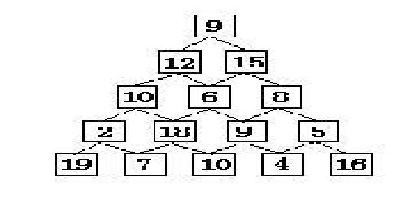

## 基本概念

动态规划的本质，是对问题**状态的定义**和**状态转移方程的定义**。

每次决策依赖于当前状态，又随即引起状态的转移。一个决策序列就是在变化的状态中产生出来的，所以，这种**多阶段最优化决策解决问题**的过程就称为动态规划。

 与分治法最大的差别是：适合于用动态规划法求解的问题，经分解后得到的子问题往往不是互相独立的（即下一个子阶段的求解是建立在上一个子阶段的解的基础上，进行进一步的求解）。


## 适用的情况

1. 最优化原理：如果问题的最优解所包含的子问题的解也是最优的，就称该问题具有最优子结构，即满足最优化原理。
2. 无后效性：即某阶段状态一旦确定，就不受这个状态以后决策的影响。也就是说，某状态以后的过程不会影响以前的状态，只与当前状态有关。
3. 有重叠子问题：即子问题之间是不独立的，一个子问题在下一阶段决策中可能被多次使用到。（该性质并不是动态规划适用的必要条件，但是如果没有这条性质，动态规划算法同其他算法相比就不具备优势）


## 经典问题

1. 最大连续子序列求和
2. 数塔问题
3. 背包问题
4. 最长递增子序列
5. 最长公共子序列

### 最大连续子序列求和

#### 问题描述

给定K个整数的序列{ N1, N2, …, NK }，其任意连续子序列可表示为{ Ni, Ni+1, …, Nj }，其中 1 <= i <= j <= K。最大连续子序列是所有连续子序中元素和最大的一个， 例如给定序列{ -2, 11, -4, 13, -5, -2 }，其最大连续子序列为{ 11, -4, 13 }，最大和为20。

#### 思路分析：

具有最优子结构，和重叠子问题， 动态规划的算法思路

- 最大连续子序列和只可能是以位置0～n-1中某个位置结尾。当遍历到第i个元素时，判断在它前面的连续子序列和是否大于0，如果大于0，则以位置i结尾的最大连续子序列和为元素i和前门的连续子序列和相加；否则，则以位置i结尾的最大连续子序列和为元素i。 

**状态转移方程**： sum[i]=max(sum[i-1]+a[i],a[i])

```python
def maxsequence(nums):
    if not nums:
        return 0
    maxsum = maxhere = nums[0]
    for i in range(1, len(nums)):
        if maxhere <= 0:
            maxhere = nums[i]
        else:
            maxhere += a[i]
        if maxhere > maxsum:
            maxsum = maxhere
    return maxsum
```


### 数塔问题

数塔问题 ：要求从顶层走到底层，若每一步只能走到相邻的结点，则经过的结点的数字之和最大是多少？



转移方程：sum[i] = max(a[left_child] , a[right_child]) + a[i]

```python
class ListNode:
    def __init__(self, val, next=None):
        self.val = val
        self.next = next

def solution(data):
    N = len(data)
    data_copy = [[j for j in d] for d in data]
    track = dict()
    for i in range(N-1, 0, -1):
        for j in range(i):
            if data[i][j] > data[i][j+1]:
                data[i-1][j] += data[i][j]
                track[(i-1,j)] = (i,j)
            else:
                data[i-1][j] += data[i][j+1]
                track[(i-1,j)] = (i, j+1)
    i, j = 0, 0
    info = ""
    while (i, j) in track:
        info += str(data_copy[i][j]) + "-->"
        i, j = track[(i,j)]
    info += str(data_copy[i][j])
    print(info)
    print(data[0][0])


data_tower = [
    [9],
    [12, 15],
    [10, 6, 8],
    [2, 18, 9, 5],
    [19, 7, 10, 4, 16]
]
solution(data_tower)
```


### 01背包问题

有N件物品和一个容量为C的背包。第i件物品的费用是V[i]，价值是W[i]。求解将哪些物品装入背包可使价值总和最大。

将以上问题实例化。假设n=3，C=10，三个宝石的价值为20,20,12，体积分别为5,4,3。这时的正确答案应为把体积为5和3的宝石装入背包，对应的价值为20+12=32。接下来，把第三个宝石拿走，同时背包容量减去第三个宝石的体积（因为它是装入背包的宝石之一），于是问题的各参数变为：n=2，C=7，体积｛5，4｝，价值｛20，10｝。现在的解变成：把体积为5的宝石放入背包 ，此时价值为20。这样一来，我们发现，n=3时，放入背包的是0号和2号宝石；当n=2时， 我们放入的是0号宝石。这并不是一个偶然，没错， 这就是传说中的“**全局最优解包含局部最优解**”（n=2是n=3情况的一个局部子问题）。

当n=2时，我们要求的是前2个宝石， 装到体积为7的背包里能达到的最大价值；当n=3时，我们要求的是前3个宝石， 装到体积为10的背包里能达到的最大价值。定义**d(i,j)为前i个宝石装到剩余体积为j的背包里能达到的最大价值**。 那么上面两句话即为：d(2, 7)和d(3, 10)。上面那么多的文字，用一句话概括就是：**根据子问题定义状态！**你找到子问题， 状态也就浮出水面了。而我们最终要求解的最大价值即为d(n, C)：前n个宝石 （0,1,2…,n-1）装入剩余容量为C的背包中的最大价值。状态好不容易找到了， 状态转移方程呢？顾名思义，状态转移方程就是描述状态是怎么转移的方程。 那么回到例子，d(2, 7)和d(3, 10)是怎么转移的？来，我们来说说2号宝石 （记住宝石编号是从0开始的）。从d(2, 7)到d(3, 10)就隔了这个2号宝石。 它有两种情况，装或者不装入背包。如果装入，在面对前2个宝石时， 背包就只剩下体积7来装它们，而相应的要加上2号宝石的价值12， d(3, 10)=d(2, 10-3)+12=d(2, 7)+12；如果不装入，体积仍为10，价值自然不变了， d(3, 10)=d(2, 10)。记住，d(3, 10)表示的是前3个宝石装入到剩余体积为10 的背包里能达到的`最大价值`，既然是最大价值，就有d(3, 10)=max{ d(2, 10), d(2, 7)+12 }。好了，这条方程描述了状态d(i, j)的一些关系， 没错，它就是状态转移方程了。把它形式化一下：**d(i, j)=max{ d(i-1, j), d(i-1,j-V[i-1]) + W[i-1] }**。注意讨论前i个宝石装入背包的时候， 其实是在考查第i-1个宝石装不装入背包（因为宝石是从0开始编号的）。至此， 状态和状态转移方程都已经有了。所以代码为：

```python
"""
V: the value list of jewel
W: the weight list of jewel
C: the capacity of the backpack
"""


def backpack(V, W, C):
    N = len(V)
    d = [[0 for c in range(C+1)] for n in range(N+1)]
    for i in range(1, N + 1):
        for j in range(C + 1):

            if j >= W[i - 1]:
                d[i][j] = max(d[i-1][j], d[i-1][j-W[i-1]] + V[i-1])
            else:
                d[i][j] = d[i - 1][j]

    j = C
    x = [0 for n in range(N)]
    for i in range(N, 0, -1):
        if d[i][j] > d[i - 1][j]:
            x[i - 1] = 1
            j = j - W[i - 1]

    print(x)
    print(d[N][C])


V = [20, 10, 12]
W = [5, 4, 3]
C = 10
backpack(V, W, C)
```


### 最长递增子序列（LIS）

给定一个序列$A_n = a_1, a_2, ..., a_n$，找出最长的子序列使得对所有$i<j, \ a_j<a_j$。


```python
def lis(A):
    


A = [5,6,7,1,2,8]
```


### 最长公共子序列（LCS）

一个序列 S ，如果分别是两个或多个已知序列的子序列，且是所有符合此条件序列中最长的，则 S 称为已知序列的最长公共子序列。