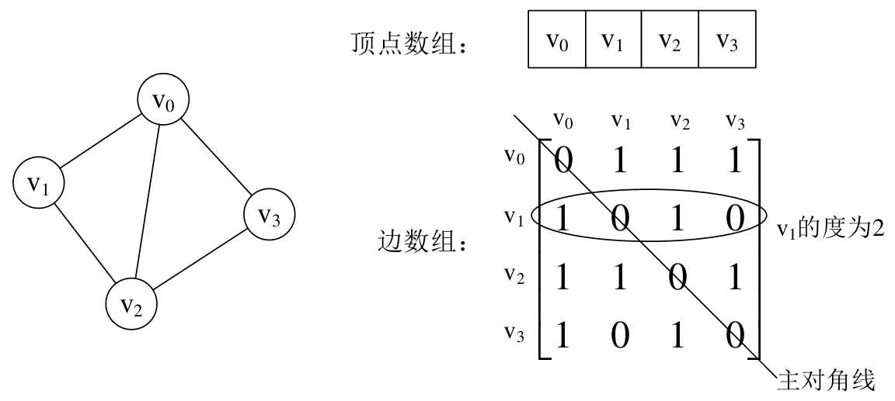
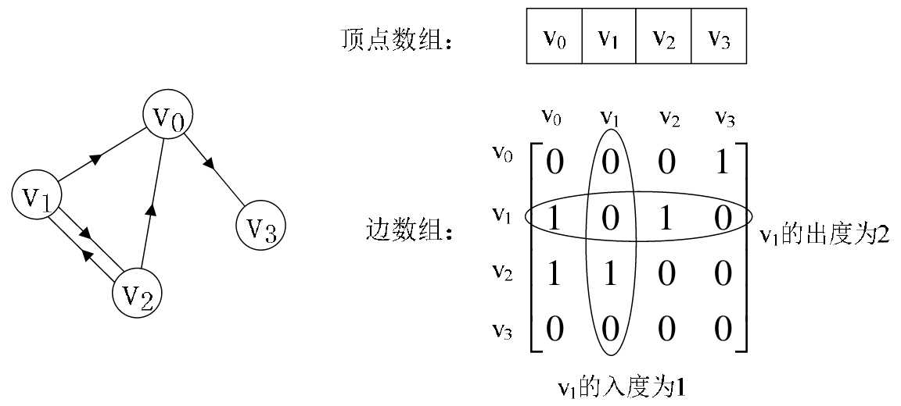
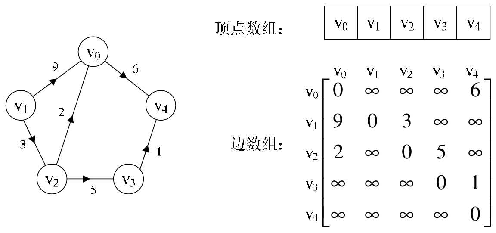
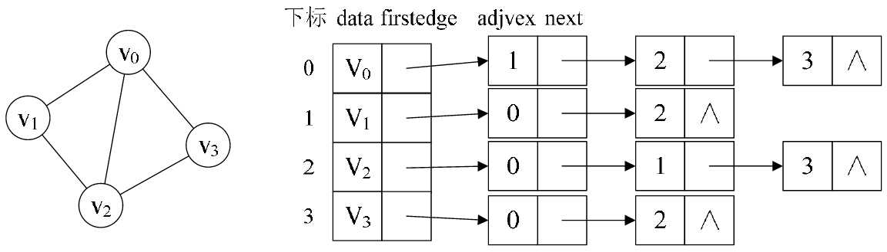
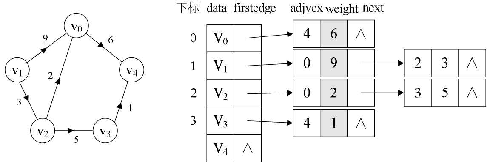
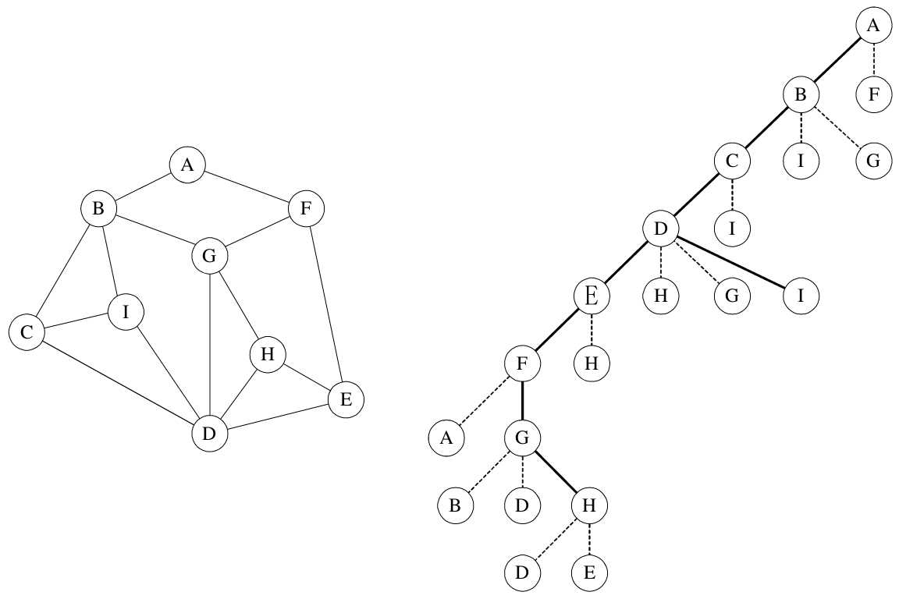
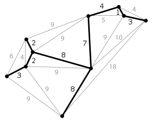
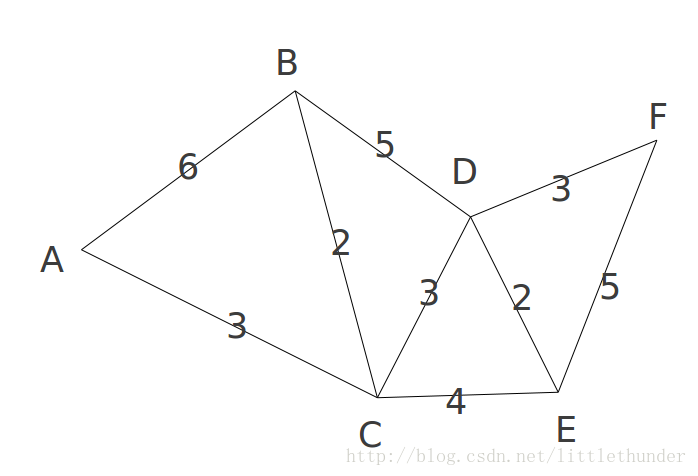
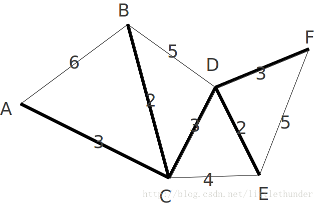

## 一、定义

### 图的定义

图（Graph）是由顶点的有穷非空集合和顶点之间边的集合组成，通常表示为：G(V,E)，其中，G表示一个图，V是图G中顶点的集合，E是图G中边的集合。

无向边 -> 无向图（Undirected graphs）

有向边 -> 有向图（Directed Graphs）

>无向边用小括号“()”表示，而有向边则是用尖括号“<>”表示。

**简单图**： 不存在顶点到其自身的边，且同一条边不重复出现

**无向完全图：**无向图中，任意两个顶点之间都存在边

> 含有n个顶点的无向完全图有$\frac{n(n-1)}{2}$条边。

> **对于具有n个顶点和e条边数的图，无向图$0 \leq e \leq \frac{n(n-1)}{2}$，有向图$0 \leq e \leq n(n-1)$。**

`权`: 有些图的边或弧具有与它相关的数字，这种与图的边或弧相关的数叫做权（Weight）。

`网`： 带权的图通常称为网（Network）。

### 图的顶点与边的关系

`邻接点 ` 两个顶点有边直接连接

`度`：顶点v的邻接点的个数，记为TD(v).

`路径`：无向图G=(V,{E})中从顶点v到顶点v'的路径（Path）是一个顶点序列

`回路`: 第一个顶点和最后一个顶点相同的路径称为回路或环（Cycle）。 

### 连通图

`连通`: 在无向图G中，如果从顶点v到顶点v'有路径，则称v和v'是连通的。

`连通图`: 如果对于图中任意两个顶点vi、vj∈V，vi和vj都是连通的，则称G是连通图（Connected Graph）。

### 树与图的关系

- 树是图的子集（树是图，图不一定是树）
- 树有一个根节点，图没有
- 树可以递归遍历，图要看情况
- 树的非根节点必定有一个父节点，图不一定
- 树是一种“层次”关系，图是“网络”关系

树：节点数 = 边数+1

## 二、图的存储结构

### 邻接矩阵（Adjacency Matrix）

用两个数组来表示图。一个一维数组存储图中顶点信息，一个二维数组（称为邻接矩阵）存储图中的边或弧的信息。

设图G有n个顶点，则邻接矩阵是一个nxn的方阵：
$$
arc[i][j] = 
\begin{cases}
1, & \mbox{}if (v_i,v_j) \in E \  \ or\ \ <v_i,v_j>\in E \\
0, & \mbox{} otherwise
\end{cases}
$$
无向图邻接矩阵：



```python
# Adjacency Lists
a, b, c, d, e, f, g, h = range(8)
N = [
    [b, c, d, e, f], 	 # a
    [c, e], 			# b
    [d], 				# c
    [e], 				# d
    [f], 				# e
    [c, g, h], 			 # f
    [f, h],				# g
    [f, g] 				# h
]

# Adjacency dicts with Edge Weights
a, b, c, d, e, f, g, h = range(8)
N = [
    {b:2, c:1, d:3, e:9, f:4},    # a
    {c:4, e:3}, 				 # b
    {d:8}, 						# c
    {e:7}, 						# d
    {f:5}, 						# e
    {c:2, g:2, h:2}, 			 # f
    {f:1, h:6}, 				# g
    {f:9, g:8} 					# h
]

# A dict with Adjacency sets
N = {
    'a': set('bcdef'),
    'b': set('ce'),
    'c': set('d'),
    'd': set('e'),
    'e': set('f'),
    'f': set('cgh'),
    'g': set('fh'),
    'h': set('fg')
}

# Adjacency Matrix
a, b, c, d, e, f, g, h = range(8)
	 # a b c d e f g h
N =  [[0,1,1,1,1,1,0,0], # a
      [0,0,1,0,1,0,0,0], # b
      [0,0,0,1,0,0,0,0], # c
      [0,0,0,0,1,0,0,0], # d
      [0,0,0,0,0,1,0,0], # e
      [0,0,1,0,0,0,1,1], # f
      [0,0,0,0,0,1,0,1], # g
      [0,0,0,0,0,1,1,0]] # h

# A Weight Matrix with Infinite Weight for Missing Edges
a, b, c, d, e, f, g, h = range(8)
inf = float('inf')
     # a    b    c    d    e    f    g    h
W = [[ 0,   2,   1,   3,   9,   4, inf, inf], # a
    [inf,   0,   4, inf,   3, inf, inf, inf], # b
    [inf, inf,   0,   8, inf, inf, inf, inf], # c
    [inf, inf, inf,   0,   7, inf, inf, inf], # d
    [inf, inf, inf, inf,   0,   5, inf, inf], # e
    [inf, inf,   2, inf, inf,   0,   2,   2], # f
    [inf, inf, inf, inf, inf,   1,   0,   6], # g
    [inf, inf, inf, inf, inf,   9,   8,   0]] # h
```


有向图邻接矩阵：



网的邻接矩阵：



### 邻接表

**使用数组与链表相结合的存储方式，就诞生了邻接表（Ad-jacency List）。**

邻接表的处理办法是这样: 

1. 图中顶点用一个一维数组（或单链表）存储。另外，对于顶点数组中，每个数据元素还需要存储指向第一个邻接点的指针，以便于查找该顶点的边信息。 
2. 图中每个顶点vi的所有邻接点构成一个线性表，由于邻接点的个数不定，所以用单链表存储，无向图称为顶点vi的`边表`，有向图则称为顶点vi作为弧尾的`出边表`。



有向图的邻接表：


网图的邻接表：



### 十字链表


### 邻接多重表


### 边集数组


## 三、图的遍历

图的遍历要比树的遍历复杂的多，因为它的任一顶点都可能和其余的所有顶点相邻接，极有可能存在沿着某条路径搜索后，又回到原顶点，而有些顶点却还没有遍历到的情况。因此需要在遍历过程中把访问过的顶点打上标记，以避免访问多次而不自知。具体办法是设置一个访问数组`visited[n]`，n是图中顶点的个数，初值为0，访问过后设置为1。

### 深度优先遍历（DFS）



遍历过程描述：

> ```
> 首先从顶点A开始，做上表示走过的记号后，面前有两条路，通向B和F，可以定一个原则，在没有碰到重复顶点的情况下，始终是向右手边走，于是走到了B顶点。整个行路过程，可参看上图的右图。此时发现有三条分支，分别通向顶点C、I、G，右手通行原则，使得我们走到了C顶点。就这样一直顺着右手通道走，一直走到F顶点。当依然选择右手通道走过去后，发现走回到顶点A了，因为在这里做了记号表示已经走过。此时退回到顶点F，走向从右数的第二条通道，到了G顶点，它有三条通道，发现B和D都已经是走过的，于是走到H，当面对通向H的两条通道D和E时，会发现都已经走过了。
>
>     此时是否已经遍历了所有顶点呢？没有。可能还有很多分支的顶点没有走到，所以按原路返回。在顶点H处，再无通道没走过，返回到G，也无未走过通道，返回到F，没有通道，返回到E，有一条通道通往H的通道，验证后也是走过的，再返回到顶点D，此时还有三条道未走过，一条条来，H走过了，G走过了，I，哦，这是一个新顶点，没有标记，赶快记下来。继续返回，直到返回顶点A，确认已经完成遍历任务，找到了所有的9个顶点。
> ```

邻接表存储方式DFS遍历：

```python
# create a  Adjacency list
def some_graph():
    a, b, c, d, e, f, g, h = range(8)
    N = [
        [b, c, d, e, f],    # a
        [c, e],             # b
        [d],                # c
        [e],                # d
        [f],                # e
        [c, g, h],          # f
        [f, h],             # g
        [f, g]              # h
    ]
    return N

# recursion
class solution1:
    def rec_dfs(self, G, s, visited=None):
        if visited is None:
            visited = set()
        visited.add(s)
        for u in G[s]:
            if u in visited: continue
            self.rec_dfs(G, u, visited)
        return visited

G = some_graph()
for i in range(len(G)):
    G[i] = set(G[i])
so = solution1()
print(list(so.rec_dfs(G,0)))


# iterative
class solution2:
    def iter_dfs(self, G, s):
        S, Q = set(), []                            # Visited-set and queue
        Q.append(s)                                 # We plan on visiting s
        while Q:                                    # Planned nodes left?
            u = Q.pop()                             # Get one
            if u in S: continue                     # Already visited? Skip it
            S.add(u)                                # We've visited it now
            Q.extend(G[u])                          # Schedule all neighbors
            yield u                                 # Report u as visited

G = some_graph()
for i in range(len(G)):
    G[i] = set(G[i])
so = solution2()
print(list(so.rec_dfs(G,0)))
```

邻接表存储方式BFS遍历：

```python
#Breadth-First Search
from collections import deque

def bfs(G, s):
    P, Q = {s: None}, deque([s])                # Parents and FIFO queue
    while Q:
        u = Q.popleft()                         # Constant-time for deque
        for v in G[u]:
            if v in P: continue                 # Already has parent
            P[v] = u                            # Reached from u: u is parent
            Q.append(v)
    return P

G = some_graph()
print(bfs(G, 0))
```


## 四、最小生成树

`最小生成树`（Minimum Cost SpanningTree）: 一个连通图的生成树是一个极小的连通子图，它含有图中全部的顶点，但只有足以构成一棵树的n-1条边，我们把构造连通网的最小代价生成树称为最小生成树。

维基百科定义：

> 在一给定的无向图 G = (V, E) 中，(u, v) 代表连接顶点 u 与顶点 v 的边（即$(u,v) \in E$），而 w(u, v) 代表此边的权重，若存在 T 为 E 的子集（即$T\in E$）且为无循环图，使得
> $$
> w(T) = \sum_{(u,v) \in T} w(u,v)
> $$
> 的W(T)最小，则T为G的最小生成树



找**无向加权连通网**的最小生成树，经典的有两种算法，**普里姆算法**和**克鲁斯卡尔算法**。

### Prim算法



```python
_ = float('inf')


def prim(graph, n):
    dis = [0] * n
    pre = [0] * n
    flag = [False] * n
    # start node
    flag[0] = True
    k = 0
    for i in range(n):
        dis[i] = graph[k][i]
    for j in range(n - 1):
        mini = _
        # 找到与j之间代价最小的结点
        for i in range(n):
            if dis[i] < mini and not flag[i]:
                mini = dis[i]
                k = i
        if k == 0:  # 不连通
            return
        flag[k] = True
        for i in range(n):
            if dis[i] > graph[k][i] and not flag[i]:
                dis[i] = graph[k][i]
                pre[i] = k
    return dis, pre


if __name__ == '__main__':
    n = 6
    graph = [
        [0, 6, 3, _, _, _],
        [6, 0, 2, 5, _, _],
        [3, 2, 0, 3, 4, _],
        [_, 5, 3, 0, 2, 3],
        [_, _, 4, 2, 0, 5],
        [_, _, _, 3, 5, 0],
    ]
    dis, pre = prim(graph, n)
    print(dis)
    print(pre)  
```



### Kruskal算法

Kruskal算法的步骤：

1.对所有边进行从小到大的排序。

2.每次选一条边（最小的边），如果如果形成环，就不加入(u,v)中，否则加入。那么加入的(u,v)一定是最佳的。

【如果你非手算不可的话】从小到大地搜索所有边，若不产生环则加入生成树中。Kruskal算法是手动求最小生成树的不错选择。

采用递归的方式判断环的存在：

```python
def find(x):
    if parent[x] == x:
        return x
    else:
        parent[x] = find(parent[x])
        return parent[x]
```

parent[x]保存顶点x的直接根节点下标，若x为树的根节点则parent[x]为其自身。find函数可以求出节点x的根节点，从而判断是否有环形成。


## 六、最短路径

`最短路径`：对于非网图来说，，所谓的最短路径，其实就是指两顶点之间经过的边数最少的路径；对于网图来说，最短路径是指两顶点之间经过的边上权值之和最少的路径，并且称路径上的第一个顶点是源点，最后一个顶点是终点。

###  Dijkstra算法

```python
_ = float('inf')


def dijkstra(graph, n):
    dis = [0] * n
    flag = [False] * n
    pre = [0] * n
    flag[0] = True
    k = 0
    for i in range(n):
        dis[i] = graph[k][i]

    for j in range(n - 1):
        mini = _
        for i in range(n):
            if dis[i] < mini and not flag[i]:
                mini = dis[i]
                k = i
        if k == 0:  # 不连通
            return
        flag[k] = True
        for i in range(n):
            if dis[i] > dis[k] + graph[k][i]:
                dis[i] = dis[k] + graph[k][i]
                pre[i] = k
                #       print(k)
    return dis, pre


if __name__ == '__main__':
    n = 6
    graph = [
        [0, 6, 3, _, _, _],
        [6, 0, 2, 5, _, _],
        [3, 2, 0, 3, 4, _],
        [_, 5, 3, 0, 2, 3],
        [_, _, 4, 2, 0, 5],
        [_, _, _, 3, 5, 0],
    ]
    dis, pre = dijkstra(graph, n)
    print(dis)
    print(pre)  
```


### 弗洛伊德（Floyd）算法

```python
import copy
maxDis=1000000
def Floyd(G):
    n=len(G)
    path=copy.deepcopy(G)
    for k in range(0,n):
        for i in range(0,n):
            for j in range(0,n):
                path[i][j]=min(path[i][j],path[i][k]+path[k][j])
    return path
        

if __name__=='__main__':
    G=[
        [0,6,3,maxDis,maxDis,maxDis],
        [6,0,2,5,maxDis,maxDis],
        [3,2,0,3,4,maxDis],
        [maxDis,5,3,0,2,3],
        [maxDis,maxDis,4,2,0,5],
        [maxDis,maxDis,maxDis,3,5,0]
        ]
    path=Floyd(G)
    for i in range(0,len(G)):
        print path[i]
```


