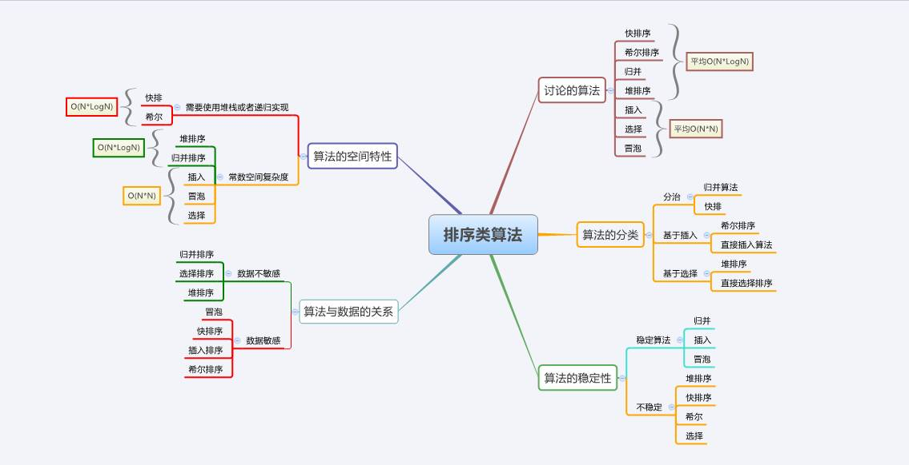
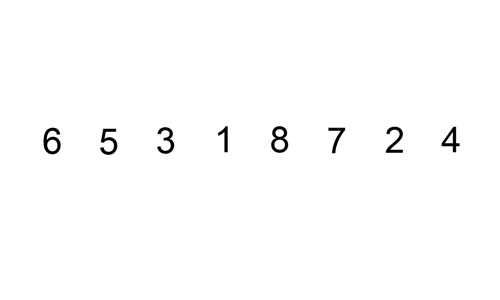

## Bubble Sort - 冒泡排序

核心：**冒泡**，持续比较相邻元素，大的挪到后面，因此大的会逐步往后挪，故称之为冒泡。


```python
def bubble_sort(arry):
    n = len(arry)                   #获得数组的长度
    for i in range(n):
        for j in range(1,n-i):
            if  arry[j-1] > arry[j] :       #如果前者比后者大
                arry[j-1],arry[j] = arry[j],arry[j-1]      #则交换两者
    return arry
```

复杂度分析：平均情况与最坏情况均为$O(n^2)$, 使用了 temp 作为临时交换变量，空间复杂度为$O(1)$.


## Selection Sort - 选择排序

核心：**不断地选择剩余元素中的最小者**。

1. 找到数组中最小元素并将其和数组第一个元素交换位置。
2. 在剩下的元素中找到最小元素并将其与数组第二个元素交换，直至整个数组排序。

性质：

- 比较次数=(N-1)+(N-2)+(N-3)+...+2+1~N^2/2
- 交换次数=N
- 运行时间与输入无关
- 数据移动最少


```python
def select_sort(ary):
    n = len(ary)
    for i in range(0,n):
        min = i                             #最小元素下标标记
        for j in range(i+1,n):
            if ary[j] < ary[min] :
                min = j                     #找到最小值的下标
        ary[min],ary[i] = ary[i],ary[min]   #交换两者
    return ary
```


## Insertion Sort - 插入排序（扑克排序）

核心：插入排序的工作原理是，对于每个未排序数据，在已排序序列中从后向前扫描，找到相应位置并插入。

**步骤：**

1. 从第一个元素开始，该元素可以认为已经被排序
2. 取出下一个元素，在已经排序的元素序列中从后向前扫描
3. 如果被扫描的元素（已排序）大于新元素，将该元素后移一位
4. 重复步骤3，直到找到已排序的元素小于或者等于新元素的位置
5. 将新元素插入到该位置后
6. 重复步骤2~5



```python

def insertionSort(alist):
    for i, item_i in enumerate(alist):
        index = i
        while index > 0 and item_i < alist[index - 1]:
            alist[index] = alist[index - 1]
            index -= 1

        alist[index] = item_i

    return alist
```


## Shell Sort - 希尔排序

核心：基于插入排序，使数组中任意间隔为h的元素都是有序的，即将全部元素分为h个区域使用插入排序。其实现可类似于插入排序但使用不同增量。更高效的原因是它权衡了子数组的规模和有序性。

```python
def shell_sort(ary):
    n = len(ary)
    gap = round(n/2)       #初始步长 , 用round四舍五入取整
    while gap > 0 :
        for i in range(gap,n):        #每一列进行插入排序 , 从gap 到 n-1
            temp = ary[i]
            j = i
            while ( j >= gap and ary[j-gap] > temp ):    #插入排序
                ary[j] = ary[j-gap]
                j = j - gap
            ary[j] = temp
        gap = round(gap/2)                     #重新设置步长
    return ary
```


## Merge Sort - 归并排序

核心：将两个有序对数组归并成一个更大的有序数组。通常做法为递归排序，并将两个不同的有序数组归并到第三个数组中。归并排序是一种典型的分治应用。


```python
def merge_sort(ary):
    if len(ary) <= 1 : return ary
    num = int(len(ary)/2)       #二分分解
    left = merge_sort(ary[:num])
    print("left = " + str(left))
    right = merge_sort(ary[num:])
    print("right = " + str(right))
    return merge(left,right)    #合并数组

def merge(left,right):
    '''合并操作，
    将两个有序数组left[]和right[]合并成一个大的有序数组'''
    l,r = 0,0           #left与right数组的下标指针
    result = []
    while l<len(left) and r<len(right) :
        if left[l] < right[r]:
            result.append(left[l])
            l += 1
        else:
            result.append(right[r])
            r += 1
    result += left[l:]
    result += right[r:]
    return result

unsorted_array = [6,5,3,1,8,7,2,4]
print(merge_sort(unsorted_array))
```


## Quick Sort - 快速排序

核心：快排是一种采用分治思想的排序算法，大致分为三个步骤。

1. 定基准——首先随机选择一个元素最为基准
2. 划分区——所有比基准小的元素置于基准左侧，比基准大的元素置于右侧
3. 递归调用——递归地调用此切分过程


### out-in-place

```python
def qsort1(alist):
    print(alist)
    if len(alist) <= 1:
        return alist
    else:
        pivot = alist[0]
        return qsort1([x for x in alist[1:] if x < pivot]) + \
               [pivot] + \
               qsort1([x for x in alist[1:] if x >= pivot])

unsortedArray = [6, 5, 3, 1, 8, 7, 2, 4]
print(qsort1(unsortedArray))
**************************
[6, 5, 3, 1, 8, 7, 2, 4]
[5, 3, 1, 2, 4]
[3, 1, 2, 4]
[1, 2]
[]
[2]
[4]
[]
[8, 7]
[7]
[]
[1, 2, 3, 4, 5, 6, 7, 8]
```

### in-place(one index for partition)

```python
def qsort2(alist, l, u):
    print(alist)
    if l >= u:
        return

    m = l
    for i in xrange(l + 1, u + 1):
        if alist[i] < alist[l]:
            m += 1
            alist[m], alist[i] = alist[i], alist[m]
    # swap between m and l after partition, important!
    alist[m], alist[l] = alist[l], alist[m]
    qsort2(alist, l, m - 1)
    qsort2(alist, m + 1, u)

unsortedArray = [6, 5, 3, 1, 8, 7, 2, 4]
print(qsort2(unsortedArray, 0, len(unsortedArray) - 1))
```

### in-place(two-way partitioning)

```python
def qsort3(alist, lower, upper):
    print(alist)
    if lower >= upper:
        return

    pivot = alist[lower]
    left, right = lower + 1, upper
    while left <= right:
        while left <= right and alist[left] < pivot:
            left += 1
        while left <= right and alist[right] >= pivot:
            right -= 1
        if left > right:
            break
        # swap while left <= right
        alist[left], alist[right] = alist[right], alist[left]
    # swap the smaller with pivot
    alist[lower], alist[right] = alist[right], alist[lower]

    qsort3(alist, lower, right - 1)
    qsort3(alist, right + 1, upper)

unsortedArray = [6, 5, 3, 1, 8, 7, 2, 4]
print(qsort3(unsortedArray, 0, len(unsortedArray) - 1))
```


## Heap Sort - 堆排序

堆排序在 top K 问题中使用比较频繁。堆排序是采用二叉堆的数据结构来实现的，虽然实质上还是一维数组。二叉堆是一个近似完全二叉树 。

**二叉堆具有以下性质：**

1. 父节点的键值总是大于或等于（小于或等于）任何一个子节点的键值。
2. 每个节点的左右子树都是一个二叉堆（都是最大堆或最小堆）。

堆的常用操作如下。

1. 最大堆调整（Max_Heapify）：将堆的末端子节点作调整，使得子节点永远小于父节点
2. 创建最大堆（Build_Max_Heap）：将堆所有数据重新排序
3. 堆排序（HeapSort）：移除位在第一个数据的根节点，并做最大堆调整的递归运算


```python
def heap_sort(ary) :
    n = len(ary)
    first = int(n/2-1)       #最后一个非叶子节点
    for start in range(first,-1,-1) :     #构造大根堆
        max_heapify(ary,start,n-1)
    for end in range(n-1,0,-1):           #堆排，将大根堆转换成有序数组
        ary[end],ary[0] = ary[0],ary[end]
        max_heapify(ary,0,end-1)
    return ary


#最大堆调整：将堆的末端子节点作调整，使得子节点永远小于父节点
#start为当前需要调整最大堆的位置，end为调整边界
def max_heapify(ary,start,end):
    root = start
    while True :
        child = root*2 +1               #调整节点的子节点
        if child > end : break
        if child+1 <= end and ary[child] < ary[child+1] :
            child = child+1             #取较大的子节点
        if ary[root] < ary[child] :     #较大的子节点成为父节点
            ary[root],ary[child] = ary[child],ary[root]     #交换
            root = child
        else :
            break
```

其中排序算法复杂度比较：


