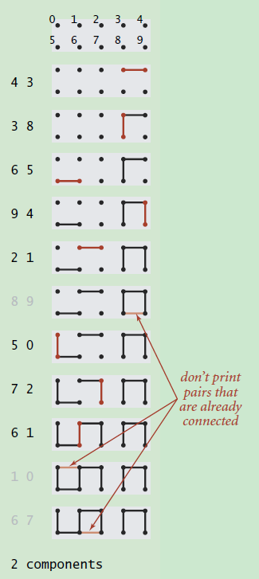
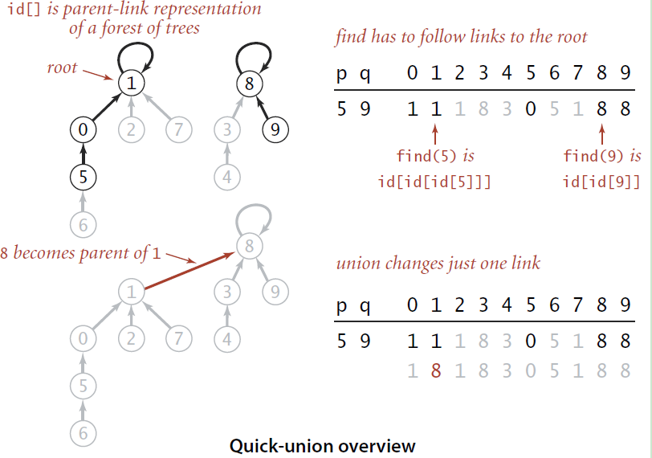

# 并查集

## 动态连通性：



假设我们输入了一组整数对，即上图中的(4, 3) (3, 8)等等，每对整数代表这两个points/sites是连通的。那么随着数据的不断输入，整个图的连通性也会发生变化。

**动态连通性的应用场景：**

- 网络连接判断：

如果每个pair中的两个整数分别代表一个网络节点，那么该pair就是用来表示这两个节点是需要连通的。那么为所有的pairs建立了动态连通图后，就能够尽可能少的减少布线的需要，因为已经连通的两个节点会被直接忽略掉。

- 变量名等同性(类似于指针的概念)：

在程序中，可以声明多个引用来指向同一对象，这个时候就可以通过为程序中声明的引用和实际对象建立动态连通图来判断哪些引用实际上是指向同一对象。

将所有的节点以整数表示，即对N个节点使用0到N-1的整数表示。

```python
for i in range(size):
    id[i] = i
```

对该动态连通图有几种可能的操作：

- 查询节点属于的组

数组对应位置的值即为组号

- 判断两个节点是否属于同一个组

分别得到两个节点的组号，然后判断组号是否相等

- 连接两个节点，使之属于同一个组

分别得到两个节点的组号，组号相同时操作结束，不同时，将其中的一个节点的组号换成另一个节点的组号

- 获取组的数目

初始化为节点的数目，然后每次成功连接两个节点之后，递减1

设计一个类UF及其API：

Quick-Find算法：

```python
class UF(object):
    # initialize N sites with integer names
    def __init__(self, N):
        self.id = [i for i in range(N)]
        self.count = N
    
    # add connection between p and q
    def union(self, p, q):
        p_id = self.find(p)
        q_id = self.find(q)
        if p_id == q_id:
            return 
        for i in range(len(N)):
            if id[i] == p_id: id[i] = q_id
        self.count -= 1
    
    # component identifier for p(0 to N-1)
    def find(self, p):
    	return self.id[p]
    
    # return true if p and q are in the same component
    def connected(p, q):
        return self.find(p) == self.find(q)
    
    # number of components
    def count(self):
        return self.count
```


Quick-Union算法：

因为每个节点所属的组号都是单独记录，各自为政的，没有将它们以更好的方式组织起来，当涉及到修改的时候，除了逐一通知、修改，别无他法。所以现在的问题就变成了，如何将节点以更好的方式组织起来。什么样子的数据结构能够将一些节点给组织起来？常见的就是链表，图，树，什么的了。但是哪种结构对于查找和修改的效率最高？毫无疑问是树，因此考虑如何将节点和组的关系以树的形式表现出来。



```python
def find(self, p):
    # 寻找p节点所在组的根节点，根节点具有性质id[root] = root  
    while p != id[p]:
        p = id[p]
	return p

def union(self, p, q):
    p_root = self.find(p)
    q_root = self.find(q)
    if p_root == q_root:
        return
    id[p_root] = q_root
    self.count -= 1
```

树这种数据结构容易出现极端情况，因为在建树的过程中，树的最终形态严重依赖于输入数据本身的性质，比如数据是否排序，是否随机分布等等。比如在输入数据是有序的情况下，构造的BST会退化成一个链表。

