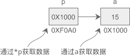

# C指针主要用法

### 定义

计算机中所有的数据都必须放在内存中，不同类型的数据占用的字节数不一样，例如 int 占用4个字节，char 占用1个字节。为了正确地访问这些数据，必须为每个字节都编上号码，就像门牌号、身份证号一样，每个字节的编号是唯一的，根据编号可以准确地找到某个字节。


我们将内存中字节的编号称为地址（Address）或指针（Pointer）。地址从 0 开始依次增加，对于 32 位环境，程序能够使用的内存为 4GB，最小的地址为 0，最大的地址为 0XFFFFFFFF。

demo:

```c
#include <stdio.h>
int main(){
    int a = 100;
    char str[20] = "c.biancheng.net";
    printf("%#X, %#X\n", &a, str);
    return 0;
}
------------------
0X28FF3C, 0X28FF10  
```

C语言用变量来存储数据，用函数来定义一段可以重复使用的代码，它们最终都要放到内存中才能供 CPU 使用。

数据和代码都以二进制的形式存储在内存中，计算机无法从格式上区分某块内存到底存储的是数据还是代码。当程序被加载到内存后，操作系统会给不同的内存块指定不同的权限，拥有读取和执行权限的内存块就是代码，而拥有读取和写入权限（也可能只有读取权限）的内存块就是数据。

CPU 只能通过地址来取得内存中的代码和数据，程序在执行过程中会告知 CPU 要执行的代码以及要读写的数据的地址。如果程序不小心出错，或者开发者有意为之，在 CPU 要写入数据时给它一个代码区域的地址，就会发生内存访问错误。

CPU 访问内存时需要的是地址，而不是变量名和函数名！变量名和函数名只是地址的一种助记符，当源文件被编译和链接成可执行程序后，它们都会被替换成地址。编译和链接过程的一项重要任务就是找到这些名称所对应的地址。

假设变量 a、b、c 在内存中的地址分别是 0X1000、0X2000、0X3000，那么加法运算`c = a + b;`将会被转换成类似下面的形式：

> 0X3000 = (0X1000) + (0X2000);

`( )`表示取值操作，整个表达式的意思是，取出地址 0X1000 和 0X2000 上的值，将它们相加，把相加的结果赋值给地址为 0X3000 的内存

变量名和函数名为我们提供了方便，让我们在编写代码的过程中可以使用易于阅读和理解的英文字符串，不用直接面对二进制地址，那场景简直让人崩溃。

需要注意的是，虽然变量名、函数名、字符串名和数组名在本质上是一样的，它们都是地址的助记符，但在编写代码的过程中，我们认为变量名表示的是数据本身，而函数名、字符串名和数组名表示的是代码块或数据块的首地址。


### 指针变量

数据在内存中的地址也称为指针，如果一个变量存储了一份数据的指针，我们就称它为指针变量。

定义指针变量

定义指针变量时必须带`*`，给指针变量赋值时不能带`*`。

```c
//p1 是一个指向 int 类型数据的指针变量，至于 p1 究竟指向哪一份数据，应该由赋予它的值决定。
int *p;
//在定义指针变量 p_a 的同时对它进行初始化，并将变量 a 的地址赋予它，此时 p_a 就指向了 a。
int a = 100;
int *p_a = &a;
//修改指针变量的值
char c = '@';
p_a = &c;
//通过指针变量获取数据
char d;
d = *p_a;

```

假设变量 a、p 的地址分别为 0X1000、0XF0A0，它们的指向关系如下图所示：



使用指针是间接获取数据，使用变量名是直接获取数据，前者比后者的代价要高。

通过指针修改和获取内存上的数据：

```c
#include <stdio.h>
int main(){
    int a = 15, b = 99, c = 222;
    int *p = &a;  //定义指针变量
    *p = b;  //通过指针变量修改内存上的数据
    c = *p;  //通过指针变量获取内存上的数据
    printf("%d, %d, %d, %d\n", a, b, c, *p);
    return 0;
}
---------------
  99,99,99,99
```

`*`在不同的场景下有不同的作用：`*`可以用在指针变量的定义中，表明这是一个指针变量，以和普通变量区分开；使用指针变量时在前面加`*`表示获取指针指向的数据，或者说表示的是指针指向的数据本身。

```c
int *p;
p = &a;  //给指针变量本身赋值时不能加*
*p = 100;
```

指针变量的一般使用场景：

```c
int x, y, *px = &x, *py = &y;
y = *px + 5;  //表示把x的内容加5并赋给y，*px+5相当于(*px)+5
y = ++*px;  //px的内容加上1之后赋给y，++*px相当于++(*px)
y = *px++;  //相当于y=(*px)++
py = px;  //把一个指针的值赋给另一个指针
```

*和&同时出现：

假设有一个 int 类型的变量 a，pa 是指向它的指针，那么`*&a`和`&*pa`分别是什么意思呢？

*&a = *(&a) = *pa = a

&*pa = &(\*pa) = &a = pa


### 指针变量的运算

```c
#include <stdio.h>
int main(){
    int    a = 10,   *pa = &a, *paa = &a;
    double b = 99.9, *pb = &b;
    char   c = '@',  *pc = &c;
    //最初的值
    printf("&a=%#X, &b=%#X, &c=%#X\n", &a, &b, &c);
    printf("pa=%#X, pb=%#X, pc=%#X\n", pa, pb, pc);
    //加法运算
    pa++; pb++; pc++;
    printf("pa=%#X, pb=%#X, pc=%#X\n", pa, pb, pc);
    //减法运算
    pa -= 2; pb -= 2; pc -= 2;
    printf("pa=%#X, pb=%#X, pc=%#X\n", pa, pb, pc);
    //比较运算
    if(pa == paa){
        printf("%d\n", *paa);
    }else{
        printf("%d\n", *pa);
    }
    return 0;
}
-----------------------------------
&a=0X28FF44, &b=0X28FF30, &c=0X28FF2B
pa=0X28FF44, pb=0X28FF30, pc=0X28FF2B
pa=0X28FF48, pb=0X28FF38, pc=0X28FF2C
pa=0X28FF40, pb=0X28FF28, pc=0X28FF2A
2686784
```

从运算结果可以看出：pa、pb、pc 每次加 1，它们的地址分别增加 4、8、1，正好是 int、double、char 类型的长度。

数组中的所有元素在内存中是连续排列的，如果一个指针指向了数组中的某个元素，那么加 1 就表示指向下一个元素，减 1 就表示指向上一个元素，这样指针的加减运算就具有了现实的意义。

不过C语言并没有规定变量的存储方式，如果连续定义多个变量，它们有可能是挨着的，也有可能是分散的，这取决于变量的类型、编译器的实现以及具体的编译模式，所以对于指向普通变量的指针，我们往往不进行加减运算，虽然编译器并不会报错，但这样做没有意义，因为不知道它后面指向的是什么数据。

不能对指针变量进行乘法、除法、取余等其他运算，除了会发生语法错误，也没有实际的含义。


### 数组指针

数组（Array）是一系列具有相同类型的数据的集合，每一份数据叫做一个数组元素（Element）。数组中的所有元素在内存中是连续排列的，整个数组占用的是一块内存。

定义数组时，要给出数组名和数组长度，数组名可以认为是一个指针，它指向数组的第 0 个元素。在C语言中，我们将第 0 个元素的地址称为数组的首地址。


以指针的方式遍历数组元素：

```c
#include <stdio.h>
int main(){
    int arr[] = { 99, 15, 100, 888, 252 };
    int len = sizeof(arr) / sizeof(int);  //求数组长度
    int i;
    for(i=0; i<len; i++){
        printf("%d  ", *(arr+i) );  //*(arr+i)等价于arr[i]
    }
    printf("\n");
    return 0;
}
```

定义一个指向数组的指针:

```c
int arr[] = { 99, 15, 100, 888, 252 };
int *p = arr;
//or int *p = &arr[0];
```

arr、p、&arr[0] 这三种写法都是等价的，它们都指向数组第 0 个元素

如果一个指针指向了数组，我们就称它为数组指针（Array Pointer）。

两种方案访问数组元素：

1. 使用下标

   arr[i]或p[i]，两者等价

2. 使用指针

   *(arr+i)等价于\*(p+i)

不同的是，数组名是常量，它的值不能改变，而数组指针是变量（除非特别指明它是常量），它的值可以任意改变。也就是说，数组名只能指向数组的开头，而数组指针可以先指向数组开头，再指向其他元素。

```c
#include <stdio.h>
int main(){
    int arr[] = { 99, 15, 100, 888, 252 };
    int i, *p = arr, len = sizeof(arr) / sizeof(int);
    for(i=0; i<len; i++){
        printf("%d  ", *p++ );
    }
    printf("\n");
    return 0;
}
```

假设 p 是指向数组 arr 中第 n 个元素的指针，则

- *p++ 等价于 *(p++)，表示先取得第 n 个元素的值，再将 p 指向下一个元素；
- *++p 等价于 *(++p)，会先进行 ++p 运算，使得 p 的值增加，指向下一个元素，整体上相当于 *(p+1)，所以会获得第 n+1 个数组元素的值。
- (*p)++ 就非常简单了，会先取得第 n 个元素的值，再对该元素的值加 1。


### 字符串指针

C语言中没有特定的字符串类型，我们通常是将字符串放在一个字符数组中

```c
#include <stdio.h>
int main(){
    char str[] = "http://c.biancheng.net";
    int len = strlen(str), i;
    //直接输出字符串
    printf("%s\n", str);
    //每次输出一个字符
    for(i=0; i<len; i++){
        printf("%c", str[i]);
    }
    printf("\n");
    return 0;
}
----------------------
http://c.biancheng.net
http://c.biancheng.net
```

字符数组归根结底还是一个数组，因此同样适用于数组指针的规则

```c
#include <stdio.h>
int main(){
    char str[] = "http://c.biancheng.net";
    char *pstr = str;
    int len = strlen(str), i;
    //使用*(pstr+i)
    for(i=0; i<len; i++){
        printf("%c", *(pstr+i));
    }
    printf("\n");
    //使用pstr[i]
    for(i=0; i<len; i++){
        printf("%c", pstr[i]);
    }
    printf("\n");
    //使用*(str+i)
    for(i=0; i<len; i++){
        printf("%c", *(str+i));
    }
    printf("\n");
    return 0;
}
```

直接用指针指向字符串：

```c
char *str = "http://c.biancheng.net";
//or
char *str;
str = "http://c.biancheng.net";
```

两中字符串表示方式的不同：

最根本的区别是在**内存中的存储区域不一样**，字符数组存储在全局数据区或栈区，第二种形式的字符串存储在常量区。全局数据区和栈区的字符串（也包括其他数据）有读取和写入的权限，而常量区的字符串（也包括其他数据）只有读取权限，没有写入权限。

内存权限的不同导致的一个明显结果就是，字符数组在定义后可以读取和修改每个字符，而对于第二种形式的字符串，一旦被定义后就只能读取不能修改，任何对它的赋值都是错误的。

将第二种形式的字符串称为字符串常量，只能读取和写入：

```c
#include <stdio.h>
int main(){
    char *str = "Hello World!";
    str = "I love C!";  //正确，可以更改指针变量本身的指向
    str[3] = 'P';  //错误，不能修改字符串中的字符
    return 0;
}
```


参考文献：

http://c.biancheng.net/cpp/html/71.html

