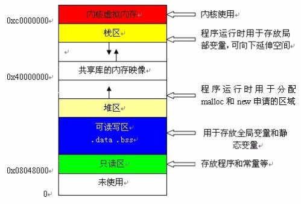

# C语言内存管理



内存中的栈区处于相对较高的地址以地址的增长方向为上的话，栈地址是向下增长的。栈中分配局部变量空间，堆区是向上增长的用于分配程序员申请的内存空间。另外还有静态区是分配静态变量，全局变量空间的；只读区是分配常量和程序代码空间的；以及其他一些分区。

```c++
int a = 0; //全局初始化区 
char *p1; //全局未初始化区 
main() 
{ 
    int b; //栈 
    char s[] = "abc"; //栈 
    char *p2; //栈 
    char *p3 = "123456"; //123456\0在常量区，p3在栈上。 
    static int c =0； //全局（静态）初始化区 
    p1 = (char *)malloc(10); //堆 
    p2 = (char *)malloc(20);  //堆 
}
```


在C语言中，根据数据在内存中存在的时间（生存期）不同，将内存空间分为三个区：

1. 程序区：用于存储程序的代码，即程序的二进制代码；

2. 静态存储区：用于存储全局变量和静态变量，这些变量的空间在程序编译时就已经分配好了；

3. 动态存储区：用于在程序执行时分配的内存，又分为：堆区（heap）和堆栈区(stack)两种。

   堆区：用于动态内存分配，程序运行时由内存分配函数在堆上分配内存。在C语言中，只要使用指针才能动态的分配内存。

   堆栈区:在函数执行时，函数内部的局部变量和函数参数的存储单元的内存区域，函数运行结束时，这些内存区域会自动释放。

**动态内存分配**：

在C语言中用内存分配函数来实现内存的动态分配，这些函数有：malloc（）、calloc()和realloc()函数。

(1)malloc(): 使用这个函数时需要包含头文件\<stdlib.h>。使用该函数需要指定要分配的内存字节数作为参数，函数返回值为所分配内存的第一个字节的地址。因为返回值是一个地址，这里需要用指针。例如：

```c
int *pNumber=(int *) malloc(100);
```

这条语句分配了100个字节的内存，并把这个内存块的地址赋给pNumber,这个内存块保存25个int值，每个int占4个字节。如果不能分配请求的内存，malloc（）会返回一个null指针。所以使用之前，要先判断一下是否为null。例如：

if（pNumber==null）{  //提示内存不足 }

有时使用sezeof运算符分配内存，如：pNumber=(int *)malloc(25*sizeof(int));该例子分配了25个int型大小的内存，即25*4=100个字节；

（2）calloc()：它把内存分配为给定大小的数组，并且初始化了分配的内存，每位都为0；该函数需要两个参数：数组元素的个数和数组元素占用的字节数。例如：

```c
int *pNumber=(int *)calloc(25,sizeof(int));
```

**释放动态分配的内存：**

堆上分配的内存会在程序结束时自动释放，但最好是在使用完这些内存后立即释放。如果不释放，可能会引起内存泄露。使用free（）函数释放内存,参数是内存地址。

free(pNumber);

