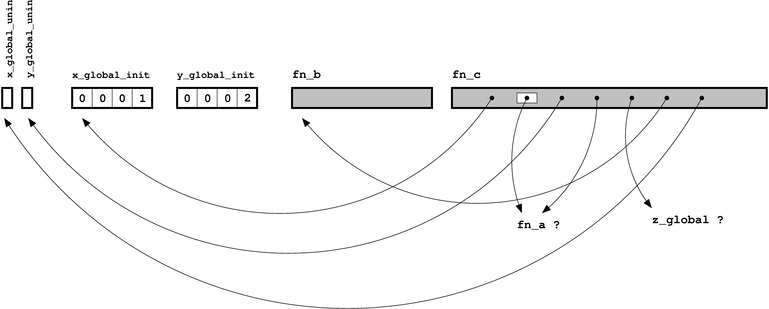
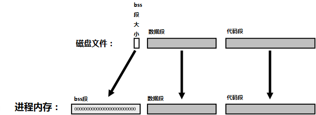
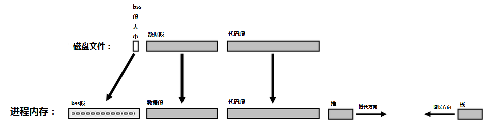

# C链接器

### C文件中包含的内容

```c++
/* 这是一个未初始化的全局变量的定义 */
int x_global_uninit;
 
/* 这是一个初始化的全局变量的定义 */
int x_global_init = 1;
 
/* 这是一个未初始化的全局变量的定义，尽管该变量只能在当前 C文件中访问 */
static int y_global_uninit;
 
/* 这是一个初始化的全局变量的定义，尽管该变量只能在当前 C文件中访问 */
static int y_global_init = 2;
 
/* 这是一个存在于程序别处的某个全局变量的声明 */
extern int z_global;
 
/* 这是一个存在于程序别处的某个函数的声明（如果你愿意，你可以在语句前加上 "extern"关键字，但没有这个必要） */
int fn_a( int x, int y);
 
/* 这是一个函数的定义，但由于这个函数前加了 static限定，因此它只能在当前 C文件内使用 */
static int fn_b(int x)
{
    return x +1;
}
 
/* 这是一个函数的定义，函数参数可以认为是局部变量 */
int fn_c( int x_local)
{
    /* 这是一个未初始化的局部变量的定义 */
    int y_local_uninit ;
    /* 这是一个初始化的局部变量的定义 */
    int y_local_init = 3 ;
 
    /* 以下代码通过局部变量、全局变量和函数的名字来使用它们 */
    x_global_uninit = fn_a (x_local, x_global_init);
    y_local_uninit = fn_a (x_local, y_local_init);
    y_local_uninit += fn_b (z_global);
    return (x_global_uninit + y_local_uninit);
}
```


### C 编译器都做了些什么

C 编译器的任务是把我们人类通常能够读懂的文本形式的 C 语言文件转化成计算机能明白的内容。我们将编译器输出的文件称为目标文件（object file）。在UNIX平台上，这些目标文件的后缀名通常为.o，在Windows平台上的后缀名为.obj。目标文件本质上包含了以下两项内容：

- 代码：对应着 C 文件中函数的定义（definitions）

- 数据：对应着 C 文件中全局变量的定义（definitions）（对于一个已初始化的全局变量，它的初值也存于目标文件中）。

以上两项内容的实例都有相应的名字与之相关联——即定义时，为变量或函数所起的名字。

目标代码（object code）是指将程序员写成的 C 代码——所有的那些if, while, 甚至goto都包括在内——经过适当编码生成对应的机器码序列。所有的这些指令都用于处理某些信息，而这些信息都得有地方存放才行——这就是变量的作用。另外，我们可以在代码中引用另一段代码——说得具体些，就是去调用程序中其它的 C 函数。

无论一段代码在何处使用某个变量或者调用某个函数，编译器都只允许使用已经声明（declaration）过的变量和函数——这样看来，声明其实就是程序员对编译器的承诺：向它确保这个变量或函数已经在程序中的别处定义过了。

链接器（linker）的作用则是兑现这一承诺，但反过来考虑，编译器又如何在产生目标文件的过程中兑现这些承诺呢？

大致说来，编译器会留个空白（blank），这个“空白”（我们也称之为“引用”（reference））拥有与之相关联的一个名字，但该名字对应的值还尚未可知。

上一节示例代码所对应的目标文件的样子：



#### 剖析目标文件

目前为止，我们仅仅只从宏观的角度进行讨论，因此，接下来我们很有必要研究一下之前介绍的理论在实际中都是怎么工作的。这里我们需要用到一个很关键的工具，即命令：nm，这是一条UNIX平台上使用的命令，它可以提供目标文件的符号（symbols）信息。在Windows平台上，与其大致等价的是带 /symbols 选项的 dumpbin 命令；当然，你也可以选择安装 Windows 版的 GNU binutils 工具包，其中包含了 nm.exe。

运行nm命令后，上文的C代码所产生的目标文件的结构：

```c
c_parts.o 中的符号如下：
 
Name                  Value   Class        Type         Size     Line  Section
 
fn_a                |        |   U  |            NOTYPE|        |     |*UND*
z_global            |        |   U  |            NOTYPE|        |     |*UND*
fn_b                |00000000|   t  |              FUNC|00000009|     |.text
x_global_init       |00000000|   D  |            OBJECT|00000004|     |.data
y_global_uninit     |00000000|   b  |            OBJECT|00000004|     |.bss
x_global_uninit     |00000004|   C  |            OBJECT|00000004|     |*COM*
y_global_init       |00000004|   d  |            OBJECT|00000004|     |.data
fn_c                |00000009|   T  |              FUNC|00000055|     |.text
```

不同平台的输出内容可能会有些许不同（你可以用 man 命令来查看帮助页面，从中获取某个特定版本更多的相关信息），但它们都会提供这两个关键信息：每个符号的类型，以及该符号的大小（如果该符号是有效的）。符号的类型包括以下几种（译者注[1]）：

- U: 该类型表示未定义的引用（undefined reference），即我们前文所提及的“空白”（blanks）。对于示例中的目标文件，共有两个未定义类型：“fn_a” 和 “z_global”。（有些 nm 的版本还可能包括 section（译注：即宏汇编中的区，后文直接使用section而不另作中文翻译）的名字，section的内容通常为 *UND* 或 UNDEF）
- t/T: 该类型指明了代码定义的位置。t 和 T 用于区分该函数是定义在文件内部（t）还是定义在文件外部（T）——例如，用于表明某函数是否声明为 static。同样的，有些系统包括 section ，内容形如.text
- d/D: 该类型表明当前变量是一个已初始化的变量，d 指明这是一个局部变量，D 则表示全局变量。如果存在 section ，则内容形如 .data
- b/B: 对于非初始化的变量，我们用 b 来表示该变量是静态（static）或是局部的（local），否则，用 B 或 C 来表示。这时 section 的内容可能为.bss 或者 \*COM*

我们也很可能会看到一些不属于原始 C 文件的符号，我们可以忽略它们，因为这一般是由编译器“邪恶”的内部机制导致的，这是为了让你的程序链接在一起而额外产生的内容。

### 链接器都做了些什么（1）

我们在上文提到过，一个函数或变量的声明，实际上就是在向 C 编译器承诺：这个函数或变已在程序中的别处定义了，而链接器的工作就是兑现这一承诺。根据上文提供的目标文件结构图，现在，我们可以开始着手“填充图中的空白”了。

```c
/* 初始化的全局变量 */
int z_global = 11;
/* 另一个命名为y_global_init的全局变量 , 但它们都是static的 */
static int y_global_init = 2;
/* 声明另一个全局变量 */
extern int x_global_init;
 
int fn_a(int x, int y)
{
  return(x+y);
}
 
int main(int argc, char *argv[])
{
  const char *message = "Hello, world";
 
  return fn_a(11,12);
}
```


有了这两张图，我们现在可以将这图中所有的节点都互相连通了（如果不能连通，那么链接器在链接过程中就会抛出错误信息）。一切各就各位，如下图所示，链接器可以将空白都填补上了（在Unix系统中，链接器通常由 ld 调用）。


至于目标文件，我们可以使用 nm 命令来检查生成的可执行文件：

```c
samples1.exe中的符号列表：
 
Name                  Value   Class        Type         Size     Line  Section
 
_Jv_RegisterClasses |        |   w  |            NOTYPE|        |     |*UND*
__gmon_start__      |        |   w  |            NOTYPE|        |     |*UND*
__libc_start_main@@GLIBC_2.0|        |   U  |              FUNC|000001ad|     |*UND*
_init               |08048254|   T  |              FUNC|        |     |.init
_start              |080482c0|   T  |              FUNC|        |     |.text
__do_global_dtors_aux|080482f0|   t  |              FUNC|        |     |.text
frame_dummy         |08048320|   t  |              FUNC|        |     |.text
fn_b                |08048348|   t  |              FUNC|00000009|     |.text
fn_c                |08048351|   T  |              FUNC|00000055|     |.text
fn_a                |080483a8|   T  |              FUNC|0000000b|     |.text
main                |080483b3|   T  |              FUNC|0000002c|     |.text
__libc_csu_fini     |080483e0|   T  |              FUNC|00000005|     |.text
__libc_csu_init     |080483f0|   T  |              FUNC|00000055|     |.text
__do_global_ctors_aux|08048450|   t  |              FUNC|        |     |.text
_fini               |08048478|   T  |              FUNC|        |     |.fini
_fp_hw              |08048494|   R  |            OBJECT|00000004|     |.rodata
_IO_stdin_used      |08048498|   R  |            OBJECT|00000004|     |.rodata
__FRAME_END__       |080484ac|   r  |            OBJECT|        |     |.eh_frame
__CTOR_LIST__       |080494b0|   d  |            OBJECT|        |     |.ctors
__init_array_end    |080494b0|   d  |            NOTYPE|        |     |.ctors
__init_array_start  |080494b0|   d  |            NOTYPE|        |     |.ctors
__CTOR_END__        |080494b4|   d  |            OBJECT|        |     |.ctors
__DTOR_LIST__       |080494b8|   d  |            OBJECT|        |     |.dtors
__DTOR_END__        |080494bc|   d  |            OBJECT|        |     |.dtors
__JCR_END__         |080494c0|   d  |            OBJECT|        |     |.jcr
__JCR_LIST__        |080494c0|   d  |            OBJECT|        |     |.jcr
_DYNAMIC            |080494c4|   d  |            OBJECT|        |     |.dynamic
_GLOBAL_OFFSET_TABLE_|08049598|   d  |            OBJECT|        |     |.got.plt
__data_start        |080495ac|   D  |            NOTYPE|        |     |.data
data_start          |080495ac|   W  |            NOTYPE|        |     |.data
__dso_handle        |080495b0|   D  |            OBJECT|        |     |.data
p.5826              |080495b4|   d  |            OBJECT|        |     |.data
x_global_init       |080495b8|   D  |            OBJECT|00000004|     |.data
y_global_init       |080495bc|   d  |            OBJECT|00000004|     |.data
z_global            |080495c0|   D  |            OBJECT|00000004|     |.data
y_global_init       |080495c4|   d  |            OBJECT|00000004|     |.data
__bss_start         |080495c8|   A  |            NOTYPE|        |     |*ABS*
_edata              |080495c8|   A  |            NOTYPE|        |     |*ABS*
completed.5828      |080495c8|   b  |            OBJECT|00000001|     |.bss
y_global_uninit     |080495cc|   b  |            OBJECT|00000004|     |.bss
x_global_uninit     |080495d0|   B  |            OBJECT|00000004|     |.bss
_end                |080495d4|   A  |            NOTYPE|        |     |*ABS*

```

这个表格包含了两个目标文件中的所有符号，显然，之前所有“未定义的引用”都已消失。同时，所有符号都按类型重新排了序，还加入了一些额外的信息以便于操作系统更好地对可执行程序实行统一处理。

输出内容中还有相当多复杂的细节，看上去很混乱，但你只要把以下划线开头的内容都过滤掉，整个结构看上去就简单多了。

#### 重复的符号

上文提到，当链接器试图为某个符号产生连接引用时却找不到这个符号的定义，链接器将抛出错误信息。那么，在链接阶段，如果同一个符号定义了两次又该如何处理呢？

在C++中这种情况很容易处理，因为语言本身定义了一种称为一次定义法则（one definition rule）的约束，即链接阶段，一个符号有且只能定义一次（参见 C++ 标准第3.2章节，这一章节还提及了后文中我们将讲解的一些异常信息）。

对于 C 语言而言，事情就稍稍复杂一些了。C语言明确说明了，对于任何的函数或者已经初始化的全局变量，都有且只能有一次定义，但未初始化的全局变量的定义可以看成是一种临时性定义（a tentative definition）。C 语言允许（至少不禁止）同一个符号在不同的源文件中进行临时性定义。

然而，链接器还得对付除 C/C++ 以外的其它语言，对于那些语言来说，“一次定义法则”并非总是适用。例如，以 Fortran 语言的正态模式（normal model）为例，实际应用中，每个全局变量在其被引用的任何文件中都存在一个复本。此时，链接器需要从多个复本中选择一个（如果大小不同，就选最大的那个），并将剩余复本丢弃。（这种模式有时又称为链接时的“通用模式（common model）”，前头需要加上Fortran关键字： COMMON ）

因此，UNIX 系统上的链接器不会为符号的重复定义——或者说不会为未初始化全局变量的重复符号——抛出任何信息，这种情况相当正常（有时，我们将这种情况称为链接时的“松引用/定义模式（relaxed ref/def mode）”模式）。如果你为此感到苦恼（你也完全有理由苦恼），那么你可以查看你所使用的编译器和链接器的相关文档，里面通常会提供一个 –work-properly 选项，用于“收紧”链接器的检测规则。例如，GNU 工具包里提供了 -fno-common 选项，可以让编译器强行将未初始化变量存放于 BSS 段，而不是存于 common 段。

### 操作系统做了些什么

目前为止，链接器产生了可执行文件，文件中所有符号都与其合适的定义相关联。接下来，我们要休息一会儿，插播一则小知识：当我们运行这个程序时，操作系统都做了些什么？

程序的运行显然需要执行机器代码，因此操作系统无疑需要把硬盘上的可执行文件转换成机器码，并载入内存，这样CPU才能从中读取信息。程序所占用的这块内存，我们称之为代码段（code segment），或者文本段（text segment）.

没有数据，再好的代码也出不来——因此，所有全局变量也得一并载入内存。不过已初始化变量和未初始化变量有些不同。初始化变量已经提前赋予了某个特定的初值，这些值同时保存于目标文件和可执行文件中。当程序开始运行时，操作系统将这些值拷贝至内存中一块名为数据段（data segment）的区域。

对未初始化变量，操作系统假设其初值均为0， 因此没有必要对这些值进行拷贝，操作系统保留一部分全为0内存空间，我们称其为 bss 段（bss segment）。

这就意味着可执行文件可以节省这部分存储空间：初始化变量的初始值必须保存于文件中，但对于未初始化变量我们只需要计算出它们占用的空间大小即可。



你可能已经注意到目前我们关于目标文件和链接器的所有讨论都只围绕着全局变量，完全没有作何关于[上文提及的](http://blog.jobbole.com/96225/ctable_chs)局部变量和动态分配内存的介绍。

事实上，这类数据的处理完全无需链接器介入，因为它们的生命周期只存在于程序运行之时——这与链接器进行链接操作还离了十万八千里呢。不过，从文章完整性的角度来考虑，我们还是快速过一下这部分知识点吧：

- 局部变量被存于内存的“栈”区（stack），栈区的大小随着不同函数的调用和返回而动态地增长或减小。
- 动态分配的内存而处于另一块空间，我们称之为“堆”（heap），malloc 函数负责跟踪这块空间里还有哪些部分是可用的。

我们将这部分内存空间也添加上，这样，我们就得到了一张完整的程序运行时的内存空间示意图。由于堆和栈在程序运行过程中都会动态地改变大小，通常的处理方式是让栈从一个方向向另一个方向增长，而堆则从另一端增长。也就是说，当二者相遇之时就是程序内存耗尽之日了（到那时，内存空间就被占用得满满当当啦！）。




### 链接器都做了些什么（2）

现在我们已经对链接器的基础知识有了一定的了解，接下来我们将开始刨根纠底，挖出它更为复杂的细节——大体上，我们会按照链接器每个特性加入的时间顺序来一一介绍。

影响链接器特性的最主要的一个现象是：如果有很多不同的程序都需要做一些相同的操作（例如将输出打印到屏幕上，从硬盘读取文件等），那么显然，一种合理的做法是将这些功能编写成通用的代码，供所有不同的程序使用。

在每个程序的链接阶段去链接相同的目标文件这种方法显然完全可行，但是，想象这么一种方法：把所有相关的目标文件集合都统一存放在一个方便访问的地方——这样我们在使用的时候会觉得生活更加简单美好了~我们将其称为“库”（library）。

（未谈及的技术问题：本节不涉及链接器“重定位(relocation)”这一重要特性的介绍。不同的程序大小也不同，因此，当动态库在不同程序中使用时，将被映射成不同的地址空间，也就是说库中所有的函数和变量在不同的程序中有不同的地址。如果所有访问该地址之处，都使用相对地址（如“向后偏移1020字节”）而不是绝对地址（固定的某个地址值，如 0x102218BF），那这也不是个事儿，可现在我们要考虑的问题在于，现实并不总这么尽如人意，当这种情况出现时，所有绝对地址都必须加上一个合适的偏移量——这就是重定位的概念。由于这一概念对C/C++程序员来说几乎是完全透明的，并且链接中报的错误也几乎不可能由重定位问题导致，因此下文将不会对此赘述。）

#### 静态库

静态库（static library）是“库”最典型的使用方式。前文中提到使用重用目标文件的方法来共享代码，事实上，静态库本质上并不比这复杂多少。

在UNIX系统中，一般使用 ar 命令生成静态库，并以 .a 作为文件扩展名，”lib” 作为文件名前缀，链接时，使用”-l”选项，其后跟着库的名称，用于告诉链接器链接时所需要的库，这时无需加前缀和扩展名（例如，对于名为”libfred.a”的静态库，传递给链接器参数为”-lfred”）。

（过去，为了生成静态库文件，我们还需要使用另一个名为 ranlib 的工具，该工具的作用是在库的起始处建立符号索引信息。如今这一功能已经被整合到 ar 命令中了。）

在Windows平台上，静态库的扩展名为 .LIB，可用 .LIB 工具生成，但由于“导入库”（它只包含了DLL中所需要的基本信息列表，具体介绍可见下文 Windows DLLs）也同样使用 .LIB 作为扩展名，因此二者容易产生混淆。

链接器在将所有目标文件集链接到一起的过程中，会为所有当前未解决的符号构建一张“未解决符号表”。当所有显示指定的目标文件都处理完毕时，链接器将到“库”中去寻找“未解决符号表”中剩余的符号。如果未解决的符号在库里其中一个目标文件中定义，那么这个文件将加入链接过程，这跟用户通过命令行显示指定所需目标文件的效果是一样一样的，然后链接器继续工作。

我们需要注意从库中导入文件的粒度问题：如果某个特定符号的定义是必须的，那么包含该符号定义的整个目标文件都要被导入。这就意味着“未解决符号表”会出现长短往复的变化：在新导入的目标文件解决了某个未定义引用的同时，该目标文件自身也包含着其他未定义的引用，这就要求链接器将其加入“符号表”中继续解决。

另一个需要注意的重要细节是库的处理顺序。链接器按命令行从左到右的顺序进行处理，只有前一个库处理结束了，才会继续处理下一个库。换句话说，如果后一个库中导入的目标文件依赖于前一个库中的某个符号，那么链接器将无法进行自动关联。

下面这个例子应该可以帮助大家更好的理解本节内容。我们假设有下列几个目标文件，并且通过命令行向链接器传入：a.o, b.o, -lx, -ly.

| 文件     | a.o        | b.o     |               | liby.a        |          |          | libx.a   |          |
| ------ | ---------- | ------- | ------------- | ------------- | -------- | -------- | -------- | -------- |
| 目标文件   | a.o        | b.o     | x1.o          | x2.o          | x3.o     | y1.o     | y2.o     | y3.o     |
| 定义的变量  | a1, a2, a3 | b1, b2  | x11, x12, x13 | x21, x22, x23 | x31, x32 | y11, y12 | y21, y22 | y31, y32 |
| 未定义的引用 | b2, x12    | a3, y22 | x23, y12      | y11           |          | y21      |          | x31      |

当链接器开始链接过程时，可以解决 a.o 目标文件中的未定义引用 b2，以及 b.o 中的 a3，但 x12 和 y22 仍然处于未定义状态。此时，链接器在第一个库 libx.a 中查找这两个符号，并发现只要将 x1.o 导入，就可以解决 x12 这一未定义引用，但导入 x1.o 同时也不得不引入新的未定义引用：x23 和 y12，因此，此时未定义引用的列表里包含了三个符号：y22, x23, y12。

因为此时链接器还在处理 libx.a，所以就优先处理 x23 了，即从 libx.a 中导入 x2.o，然而这又引入了新的未定义引用——如今列表变成了y22, y12, y11，这几个引用都不在在 libx.a 中，因此链接器开始继续处理下一个库：liby.a。

接下来，同样的处理过程也发生在 liby.a 中，链接器导入 y1.o 和 y2.o：链接器在导入 y1.o 后首先将 y21 加入未定义引用列表中，不过由于 y22 的存在，y2.o 无论如何都必须导入，因此问题就此轻松搞定了。整个复杂的处理过程，目的在于解决所有未定义引用，但只需要将库中部分目标文件加入到最终的可执行文件中，避免导入库中所有目标文件。

需要注意的一点是，如果我们假设 b.o 中也使用了 y32 ，那么情况就有些许不同了。这种情况下，对 libx.a 的链接处理不变，但处理 liby.a 时，y3.o 也将被导入，这将带来一个新问题：又加入了一个新的未定义引用 x31 ，链接失败了——原因在于，链接器已经处理完了 libx.a， 但由于 x3.o 未导入，链接器无法查找到 x31 的定义。

（补充说明：这个例子展示了 libx.a 和 liby.a 这两个库之间出现循环依赖的问题，这是个典型的错误，尤其当它出现Windows系统上时）

#### 共享库

对于像 C 标准库（libc）这类常用库而言，如果用静态库来实现存在一个明显的缺点，即所有可执行程序对同一段代码都有一份拷贝。如果每个可执行文件中都存有一份如 printf, fopen 这类常用函数的拷贝，那将占用相当大的一部分硬盘空间，这完全没有必要。

另一个不那么明显的缺点则是，一旦程序完成静态链接后，代码就永久保持不变了，如果万一有人发现并修复了 printf 中的某个bug，那么所有使用了printf的程序都不得不重新链接才能应用上这个修复。

为了避开所有这些问题，我们引入了共享库（shared libraries），其扩展名在 Unix 系统中为 .so，在 Windows 系统中为 .dll，在Mac OS X系统中为 .dylib。对于这类库而言，通常，链接器没有必要将所有的符号都关联起来，而是贴上一个“我欠你（IOU）”这样的标签，直到程序真正运行时才对贴有这样标签的内容进行处理。

这可以归结为：当链接器发现某个符号的定义在共享库中，那么它不会把这个符号的定义加入到最终生成的可执行文件中，而是将该符号与其对应的库名称记录下来（保存在可执行文件中）。

当程序开始运行时，操作系统会及时地将剩余的链接工作做完以保证程序的正常运行。在 main 函数开始之前，有一个小型的链接器（通常名为 ld.so，译者注[2]）将负责检查贴过标签的内容，并完成链接的最后一个步骤：导入库里的代码，并将所有符号都关联在一起。

也就是说，任何一个可执行文件都不包含 printf 函数的代码拷贝，如果 printf 修复了某些 bug，发布了新版本，那么只需要将 libc.so 替换成新版本即可，程序下次运行时，自然会载入更新后的代码。

另外，共享库与静态库还存在一个巨大的差异，即链接的粒度（the granularity of the link）。如果程序中只引用了共享库里的某个符号（比如，只使用了 libc.so 库中的 printf），那么整个共享库都将映射到程序地址空间中，这与静态库的行为完全不同，静态库中只会导入与该符号相关的那个目标文件。

换句话说，共享库在链接器链接结束后，可以自行解决同一个库内不同对象（objects）间符号的相互引用的问题（ar 命令与此不同，对于一个库它会产生多个目标文件）。这里我们可以再一次使用 nm 命令来弄清静态库和共享库的区别：对于前文给出的目标文件和库的例子，对于同一个库，nm 命令只能分别显示每个目标文件的符号清单，但如果将 liby.so 变成共享库，我们只会看到一个未定义符号 x31。同样，上一节提到的由静态库处理顺序引起的问题，将不会共享库中出现：即使 b.o （译者注[3]）中使用了 y32，也不会有任何问题，因为 y3.o 和 x3.o 都已全部导入了。

> 顺便推荐另一个超好用的命令： ldd，该命令是Unix平台上用于显示一个可执行程序（或一个共享库）依赖的共享库，同时还可以显示这些被依赖的共享库是否找得到——为了使程序正常运行，库加载工具需要确保能够找到所有库以及所有的依赖项（一般情况下，库加载工具会在 LD_LIBRARY_PATH 这个环境变量指定的目录列表中去搜寻所需要的库）。

```c
/usr/bin:ldd xeyes
        linux-gate.so.1 =>  (0xb7efa000)
        libXext.so.6 => /usr/lib/libXext.so.6 (0xb7edb000)
        libXmu.so.6 => /usr/lib/libXmu.so.6 (0xb7ec6000)
        libXt.so.6 => /usr/lib/libXt.so.6 (0xb7e77000)
        libX11.so.6 => /usr/lib/libX11.so.6 (0xb7d93000)
        libSM.so.6 => /usr/lib/libSM.so.6 (0xb7d8b000)
        libICE.so.6 => /usr/lib/libICE.so.6 (0xb7d74000)
        libm.so.6 => /lib/libm.so.6 (0xb7d4e000)
        libc.so.6 => /lib/libc.so.6 (0xb7c05000)
        libXau.so.6 => /usr/lib/libXau.so.6 (0xb7c01000)
        libxcb-xlib.so.0 => /usr/lib/libxcb-xlib.so.0 (0xb7bff000)
        libxcb.so.1 => /usr/lib/libxcb.so.1 (0xb7be8000)
        libdl.so.2 => /lib/libdl.so.2 (0xb7be4000)
        /lib/ld-linux.so.2 (0xb7efb000)
        libXdmcp.so.6 => /usr/lib/libXdmcp.so.6 (0xb7bdf000)
 
```

共享库之所以使用更大的链接粒度是因为现代操作系统已经相当聪明了，当你想用静态库的时候，他为了节省一些硬盘空间，就采用小粒度的链接方式，但对于共享库来说，不同的程序运行时共用同一个代码段（但并不共同数据段和 bss 段，因为毕竟不同的程序使用不同的内存空间）。为了做到这一点，必须对整个库的内容进行一次性映射，这样才能保证库内部的符号集中保存在一片连续的空间里——否则，如果某个进程导入了 a.o 和 c.o， 另一个进程导入的是 b.o 和 c.o，那么就没什么共同点可以供操作系统利用了。


### 译者注：

[1]

- .bss: BSS全称为Block Started by Symbol（或者block storage segment）。在采用段式内存管理的架构中，BSS 段（bss segment）通常是指用来存放程序中未初始化的全局变量的一块内存区域。BSS段属于静态内存分配。
- .data: 表示数据段（data segment），通常用来存放程序中已初始化的全局变量的一块内存区，也属于静态内存分配
- .text: 表示代码段（text segment），通常用来存放程序执行代码的一块内存区，这部分区域的大小在程序运行前就已经确定，并且内存区属于只读，代码段中也可能包含少量的只读常数变量，例如字符串常量等。
- COM: 全称common段。在《程序员的自我修养》一书中，指出，如果全局变量初始化的值不为0，则保存在data段，值为0，则保存在bss段，如果没有初始化，则保存在common段。当变量为static，且未初始化时放在bss段，否则放在com段
- 以上内容参考自: 《[.bss .data .text 区别](http://blog.163.com/yangqinghua_lw/blog/static/169081872007101325210429/)》和 《[通过未初始化全局变量，研究BSS段和COMMON段的不同](http://blog.chinaunix.net/uid-23629988-id-2888209.html) 》

[2] ld.so 是 Unit 系统上的动态链接器，常见的变体有两个：ld.so 针对 a.out 格式的二进制可执行文件，ld-linux.so 针对 ELF 格式的二进制可执行文件。当应用程序需要使用动态链接库里的函数时，由 ld.so 负责加载。搜索动态链接库的顺序依此是：环境变量LD——LD_BRARY_PATH（a.out格式），LD_LIBRARY_PATH（ELF格式）；在Linux中，LD_PRELOAD 指定的目录具有最高优先权。 缓存文件 /etc/ld.so.cache。此为上述环境变量指定目录的二进制索引文件。更新缓存的命令是 ldconfig。 默认目录，先在 /lib 中寻找，再到 /usr/lib 中寻找。（以上来自wiki百科）

[3] b.o: 这里原文是b.c，想来是作者的笔误

[4] def文件(module definition file模块定义文件）是用来创建dll和对应的导出库的。来自：[http://www.fx114.net/qa-71-109424.aspx](http://www.fx114.net/qa-71-109424.aspx)
def模块定义文件，用来创建dll和对应的lib def文件中，可以指定dll将会导出哪些符号给用户使用，链接器会根据def文件的说明来生成dll和lib。 在def文件中使用exports语句，可以让dll内部符号可见（默认不可见）

[5] exp：导出文件。当生成了两个dll：a.dll, b.dll，二者需要互相调用对方中的函数（循环依赖），这里存在的问题是：生成a.dll时需要b.lib，生成b.dll需要a.lib，这就变成死锁了，微软的解决办尘埃 是使用exp文件，在两个dll生成之前，使用lib.exe(library manager tool库管理工具)来创建一个DLL对应的.lib和.exp 即先生成a.lib, a.exp，然后利用a.lib去生成b.dll和b.lib，这时再用b.lib来生成a.dll。a.exp文件中缓存了a.dll的导出信息，linker加载a.exp中的信息。

[6] 对于C语言来说，编译器默认函数和初始化了的全局变量为强符号，未初始化的全局变量为弱符号(C++并没有将未初始化的全局符号视为弱符号)。我们也可以通过GCC的”__attribute((weak))”来定义任何一个强符号为弱符号。注意，强符号和弱符号都是针对定义来说的，不是针对符号的引用。 来自：[http://blog.csdn.net/astrotycoon/article/details/8008629](http://blog.csdn.net/astrotycoon/article/details/8008629)

[7] Mach不是Mac，Mac是苹果电脑Macintosh的简称，而Mach则是一种操作系统内核。Mach内核被NeXT公司的NeXTSTEP操作系统使用。在Mach上，一种可执行的文件格是就是Mach-O（Mach Object file format）。1996年，乔布斯将NeXTSTEP带回苹果，成为了OS X的内核基础。所以虽然Mac OS X是Unix的“后代”，但所主要支持的可执行文件格式是Mach-O。来自：[http://www.molotang.com/articles/1935.html](http://www.molotang.com/articles/1935.html) 和 http://www.amazon.com/gp/product/0321334876


参考文献：

http://blog.jobbole.com/96225/?repeat=w3tc#ccompiler_chs