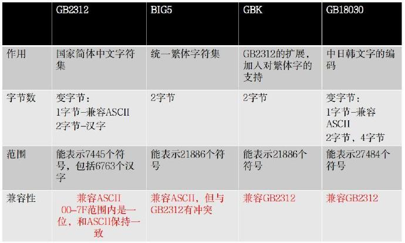
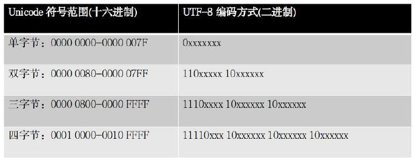

# 字符编码及常见问题

字符编码，就是指**定义一套规则**，将真实世界里的字母/字符与计算机的二进制序列进行相互转化。

### 编码标准

字符编码是一套规则。既然是规则，就必须有标准。

#### 1.拉丁编码

ASCII的全称是American Standard Code for Information Interchange（美国信息交换标准代码）。

**ASCII编码也只支持基础拉丁字符**。ASCII的设计也很简单，**用一个字节（8个位）来表示一个字符，并保证最高位的取值永远为’0’**。

欧洲其它不只是用的基础拉丁字符的国家，将美国人没有用到的**第8位也用上**就好了，这样能表达的字符个数就达到了28 =256个，相比较原来，增长了一倍， 这个编码规则也常被称为**EASCII**。

但是对于欧洲其它地方如北欧，东欧地区，256个字符还是不够用，如是出现了**ISO 8859**,为解决256个字符不够用的问题。

**Latin-1就是ISO 8859-1的别名,它表示整个西欧的字符集范围**。

#### 2.中文编码

以上的拉丁编码都是单字节编码，即用一个字节来对应一个字符。但这一规则对于其它字符集更大的语言来说，并不适应，比如中文，而是出现了用多个字节表示一个字符的编码规则。常见的中文GB2312（国家简体中文字符集）就是用两个字节来表示一个汉字（注意是表示一个汉字，对于拉丁字母，GB2312还是是用一个字节来表示以兼容ASCII）。

各中文编码之间的规则和兼容性：

中文编码一般都是简单的字符查表，重要的是要注意其相互之间的**兼容性**问题。

#### 3. Unicode

针对不同的语言采用不同的编码，有可能导致冲突与不兼容性，如果我们打开一份字节序文件，如果不知道其编码规则，就无法正确解析其语义，这也是产生乱码的根本原因。

为了能独立表示世界上所有的字符，Unicode采用**4个字节表示一个字符**,这样理论上Unicode能表示的字符数就达到了$2^{31} = 2147483648 = 21 $亿左右个字符，完全可以涵盖世界上一切语言所用的符号。

如“微信”两字的Unicode编码为：

- 微 <-> \u5fae <-> 00000000 00000000 01011111 10101110
- 信 <-> \u4fe1 <-> 00000000 00000000 01001111 11100001

Unicode标准实际应用的缺点：

1. Unicode对所有的字符编码均需要四个字节，而这对于拉丁字母或汉字来说是浪费的，其前面三个或两个字节均是0,这对信息存储来说是极大的浪费。
2. 如何区分Unicode与其它编码，比如计算机怎么知道四个字节表示一个Unicode中的字符，还是分别表示四个ASCII的字符呢？

UTF-8的出现解决了部分问题。**UTF-8是Unicode的一种实现方式，而Unicode是一个统一标准规范，Unicode的实现方式除了UTF-8还有其它的，比如UTF-16等。**

UTF-8可总结为两条规则：

- 规则1：对于单字节字符，字节的第一位为0，后7位为这个符号的Unicode码，所以对于拉丁字母，UTF-8与ASCII码是一致的。

- 规则2：对于n字节(n>1)的字符，第一个字节前n位都设为1，第n+1位为0，后面字节的前两位一律设为10，剩下没有提及的位，全部为这个符号的Unicode编码。

根据以上规则，可以建立一个Unicode取值范围与UTF-8字节序表示的对应关系，如下表：

举例来说，’微’的Unicode是’\u5fae’，二进制表示是”00000000 00000000 01011111 10101110“，其取值就位于’0000 0800-0000 FFFF’之间，所以其UTF-8编码为’**111**00101 **10**111110 **10**101110’ （加粗部分为固定编码内容）。

同时，作为中文使用者需要注意的一点是**Unicode(UTF-8)与GBK，GB2312这些汉字编码规则是完全不兼容的，也就是说这两者之间不能通过任何算法来进行转换,如需转换，一般通过GBK查表的方式来进行**。

### 常见问题

#### 什么是UTF-8的BOM？

BOM的全称是Byte Order Mark，BOM是微软给UTF-8编码加上的，用于标识文件使用的是UTF-8编码，即在UTF-8编码的文件起始位置，加入三个字节“EE BB BF”。这是微软特有的，标准并不推荐包含BOM的方式。采用加BOM的UTF-8编码文件，对于一些只支持标准UTF-8编码的环境，可能导致问题。比如，在Go语言编程中，对于包含BOM的代码文件，会导致编译出错。

#### 为什么数据库Latin1字符集（单字节）可以存储中文呢？

其实不管需要使用几个字节来表示一个字符，但最小的存储单位都是字节,所以，**只要能保证传输和存储的字节顺序不会乱即可**。作为数据库，只是作为存储的使用的话，只要能保证存储的顺序与写入的顺序一致，然后再按相同的字节顺序读出即可，翻译成语义字符的任务交给应用程序。