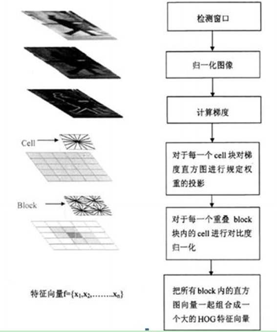
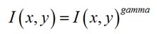
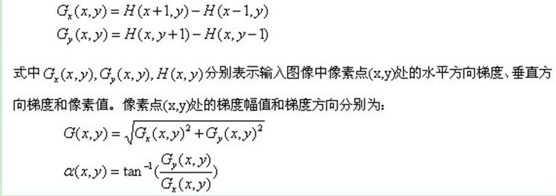
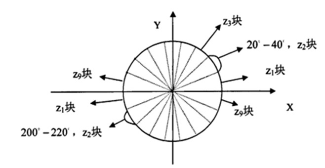
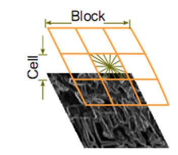
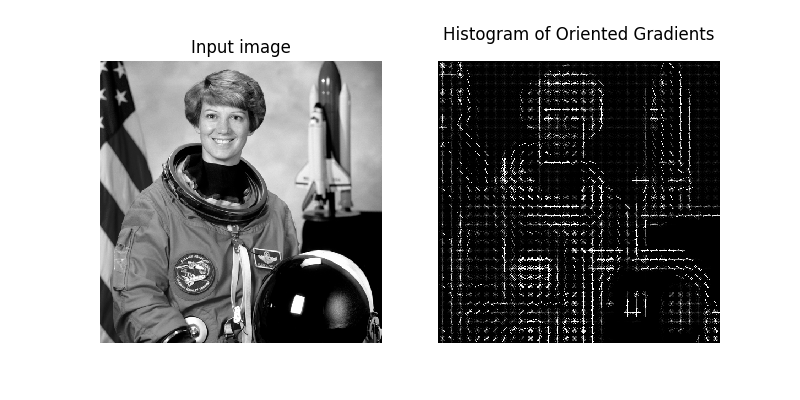

# HOG(转)

http://blog.csdn.net/zouxy09/article/details/7929348

**1、HOG特征：**

       方向梯度直方图（Histogram of Oriented Gradient, HOG）特征是一种在计算机视觉和图像处理中用来进行物体检测的特征描述子。它通过计算和统计图像局部区域的梯度方向直方图来构成特征。Hog特征结合SVM分类器已经被广泛应用于图像识别中，尤其在行人检测中获得了极大的成功。需要提醒的是，HOG+SVM进行行人检测的方法是法国研究人员Dalal在2005的CVPR上提出的，而如今虽然有很多行人检测算法不断提出，但基本都是以HOG+SVM的思路为主。

**（1）主要思想：**

在一副图像中，局部目标的表象和形状（appearance and shape）能够被梯度或边缘的方向密度分布很好地描述。（本质：梯度的统计信息，而梯度主要存在于边缘的地方）。

**（2）具体的实现方法是：**


首先将图像分成小的连通区域，我们把它叫细胞单元。然后采集细胞单元中各像素点的梯度的或边缘的方向直方图。最后把这些直方图组合起来就可以构成特征描述器。

**（3）提高性能：**


把这些局部直方图在图像的更大的范围内（我们把它叫区间或block）进行对比度归一化（contrast-normalized），所采用的方法是：先计算各直方图在这个区间（block）中的密度，然后根据这个密度对区间中的各个细胞单元做归一化。通过这个归一化后，能对光照变化和阴影获得更好的效果。

**（4）优点：**


与其他的特征描述方法相比，HOG有很多优点。首先，由于HOG是在图像的局部方格单元上操作，所以它对图像几何的和光学的形变都能保持很好的不变性，这两种形变只会出现在更大的空间领域上。其次，在粗的空域抽样、精细的方向抽样以及较强的局部光学归一化等条件下，只要行人大体上能够保持直立的姿势，可以容许行人有一些细微的肢体动作，这些细微的动作可以被忽略而不影响检测效果。因此HOG特征是特别适合于做图像中的人体检测的。

 

**2、HOG特征提取算法的实现过程：**

**大概过程：**

HOG特征提取方法就是将一个image（你要检测的目标或者扫描窗口）：

1. **灰度化**（将图像看做一个x,y,z（灰度）的三维图像）；

2. 采用Gamma校正法对输入图像进行**颜色空间的标准化**（归一化）；目的是调节图像的对比度，降低图像局部的阴影和光照变化所造成的影响，同时可以抑制噪音的干扰；

3. 计算图像每个像素的**梯度**（包括大小和方向）；主要是为了捕获轮廓信息，同时进一步弱化光照的干扰。

4. 将图像**划分成小cells**（例如6\*6像素/cell）；

5. **统计每个cell的梯度直方图**（不同梯度的个数），即可形成每个cell的descriptor；

6. 将每几个cell组成一个block（例如3\*3个cell/block），一个block内所有cell的特征descriptor串联起来便得到该block的HOG特征descriptor。

7. 将图像image内的所有block的HOG特征descriptor串联起来就可以得到该image（你要检测的目标）的HOG特征descriptor了。这个就是最终的可供分类使用的特征向量了。 




 

**具体每一步的详细过程如下：**

**（1）标准化gamma空间和颜色空间**

     为了减少光照因素的影响，首先需要将整个图像进行规范化（归一化）。在图像的纹理强度中，局部的表层曝光贡献的比重较大，所以，这种压缩处理能够有效地降低图像局部的阴影和光照变化。因为颜色信息作用不大，通常先转化为灰度图；

     Gamma压缩公式：



     比如可以取Gamma=1/2；

 

**（2）计算图像梯度**

        计算图像横坐标和纵坐标方向的梯度，并据此计算每个像素位置的梯度方向值；求导操作不仅能够捕获轮廓，人影和一些纹理信息，还能进一步弱化光照的影响。

图像中像素点(x,y)的梯度为：




最常用的方法是：首先用[-1,0,1]梯度算子对原图像做卷积运算，得到x方向（水平方向，以向右为正方向）的梯度分量gradscalx，然后用[1,0,-1]T梯度算子对原图像做卷积运算，得到y方向（竖直方向，以向上为正方向）的梯度分量gradscaly。然后再用以上公式计算该像素点的梯度大小和方向。

 

**（3）为每个细胞单元构建梯度方向直方图**

        第三步的目的是为局部图像区域提供一个编码，同时能够保持对图像中人体对象的姿势和外观的弱敏感性。

我们将图像分成若干个“单元格cell”，例如每个cell为6\*6个像素。假设我们采用9个bin的直方图来统计这6\*6个像素的梯度信息。也就是将cell的梯度方向360度分成9个方向块，如图所示：例如：如果这个像素的梯度方向是20-40度，直方图第2个bin的计数就加一，这样，对cell内每个像素用梯度方向在直方图中进行加权投影（映射到固定的角度范围），就可以得到这个cell的梯度方向直方图了，就是该cell对应的9维特征向量（因为有9个bin）。

        像素梯度方向用到了，那么梯度大小呢？梯度大小就是作为投影的权值的。例如说：这个像素的梯度方向是20-40度，然后它的梯度大小是2（假设啊），那么直方图第2个bin的计数就不是加一了，而是加二（假设啊）。



         细胞单元可以是矩形的（rectangular），也可以是星形的（radial）。

 

**（4）把细胞单元组合成大的块（block），块内归一化梯度直方图**


由于局部光照的变化以及前景-背景对比度的变化，使得梯度强度的变化范围非常大。这就需要对梯度强度做归一化。归一化能够进一步地对光照、阴影和边缘进行压缩。


作者采取的办法是：把各个细胞单元组合成大的、空间上连通的区间（blocks）。这样，一个block内所有cell的特征向量串联起来便得到该block的HOG特征。这些区间是互有重叠的，这就意味着：每一个单元格的特征会以不同的结果多次出现在最后的特征向量中。我们将归一化之后的块描述符（向量）就称之为HOG描述符。




区间有两个主要的几何形状——矩形区间（R-HOG）和环形区间（C-HOG）。R-HOG区间大体上是一些方形的格子，它可以有三个参数来表征：每个区间中细胞单元的数目、每个细胞单元中像素点的数目、每个细胞的直方图通道数目。


例如：行人检测的最佳参数设置是：3×3细胞/区间、6×6像素/细胞、9个直方图通道。则一块的特征数为：3\*3\*9；

 

**（5）收集HOG特征**

      最后一步就是将检测窗口中所有重叠的块进行HOG特征的收集，并将它们结合成最终的特征向量供分类使用。

**（6）那么一个图像的HOG特征维数是多少呢？**

顺便做个总结：Dalal提出的Hog特征提取的过程：把样本图像分割为若干个像素的单元（cell），把梯度方向平均划分为9个区间（bin），在每个单元里面对所有像素的梯度方向在各个方向区间进行直方图统计，得到一个9维的特征向量，每相邻的4个单元构成一个块（block），把一个块内的特征向量联起来得到36维的特征向量，用块对样本图像进行扫描，扫描步长为一个单元。最后将所有块的特征串联起来，就得到了人体的特征。例如，对于64\*128的图像而言，每16\*16的像素组成一个cell，每2\*2个cell组成一个块，因为每个cell有9个特征，所以每个块内有4\*9=36个特征，以8个像素为步长，那么，水平方向将有7个扫描窗口，垂直方向将有15个扫描窗口。也就是说，64\*128的图片，总共有36\*7\*15=3780个特征。


### 代码实现

使用skimage

```python
import matplotlib.pyplot as plt

from skimage.feature import hog
from skimage import data, color, exposure


image = color.rgb2gray(data.astronaut())

fd, hog_image = hog(image, orientations=8, pixels_per_cell=(16, 16),
                    cells_per_block=(1, 1), visualise=True)

fig, (ax1, ax2) = plt.subplots(1, 2, figsize=(8, 4), sharex=True, sharey=True)

ax1.axis('off')
ax1.imshow(image, cmap=plt.cm.gray)
ax1.set_title('Input image')
ax1.set_adjustable('box-forced')

# Rescale histogram for better display
hog_image_rescaled = exposure.rescale_intensity(hog_image, in_range=(0, 0.02))

ax2.axis('off')
ax2.imshow(hog_image_rescaled, cmap=plt.cm.gray)
ax2.set_title('Histogram of Oriented Gradients')
ax1.set_adjustable('box-forced')
plt.show()
```




