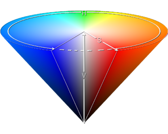

# 颜色空间

颜色通常用三个相对独立的属性来描述，三个独立变量综合作用，自然就构成一个空间坐标，这就是颜色空间。而颜色可以由不同的角度，用三个一组的不同属性加以描述，就产生了不同的颜色空间。但被描述的颜色对象本身是客观的，不同颜色空间只是从不同的角度去衡量同一个对象。

颜色空间按照基本结构可以分两大类：

- 基色颜色空间；
- 色、亮分离颜色空间。

常用颜色空间

- RGB
- HSV
- CMYK
- XYZ
- Lab
- YUV

### HSV

HSV(色相hue，饱和度saturation，亮度value)颜色空间的模型对应于**圆柱坐标系**中的一个**圆锥形子集**，圆锥的顶面对应于V=1. 它包含RGB模型中的R=1，G=1，B=1 三个面，所代表的颜色较亮。色彩H由绕V轴的旋转角给定。红色对应于 角度0° ，绿色对应于角度120°，蓝色对应于角度240°。在HSV颜色模型中，每一种颜色和它的补色相差180° 。 饱和度S取值从0到1，所以圆锥顶面的半径为１。HSV颜色模型所代表的颜色域是CIE色度图的一个子集，这个 模型中饱和度为百分之百的颜色，其纯度一般小于百分之百。在圆锥的顶点(即原点)处，V=0,H和S无定义， 代表黑色。圆锥的顶面中心处S=0，V=1,H无定义，代表白色。从该点到原点代表亮度渐暗的灰色，即具有不同 灰度的灰色。对于这些点，S=0,H的值无定义。可以说，HSV模型中的V轴对应于RGB颜色空间中的主对角线。 在圆锥顶面的圆周上的颜色，V=1，S=1,这种颜色是纯色。HSV模型对应于画家配色的方法。画家用改变色浓和 色深的方法从某种纯色获得不同色调的颜色，在一种纯色中加入白色以改变色浓，加入黑色以改变色深，同时 加入不同比例的白色，黑色即可获得各种不同的色调。

HSL类似于HSV。对于一些人，HSL更好的反映了“饱和度”和“亮度”作为两个独立参数的直觉观念

从RGB到HSL或HSV的转换:

待补充

从HSV到RGB的转换：

待补充

### CMYK

CMYK(cyan,magenta,yellow,black)颜色空间应用于印刷工业,印刷业通过青(C)、品(M)、黄(Y)三原色油墨的不同 网点面积率的叠印来表现丰富多彩的颜色和阶调，这便是三原色的CMY颜色空间。实际印刷中，一般采用青 (C)、品(M)、黄(Y)、黑(BK)四色印刷，在印刷的中间调至暗调增加黑版。当红绿蓝三原色被混合时，会产生 白色，但是当混合蓝绿色、紫红色和黄色三原色时会产生黑色。既然实际用的墨水并不会产生纯正的颜色， 黑色是包括在分开的颜色，而这模型称之为CMYK。CMYK颜色空间是和设备或者是印刷过程相关的，如工艺方法、 油墨的特性、纸张的特性等，不同的条件有不同的印刷结果。所以CMYK颜色空间称为与设备有关的表色空间。 而且，CMYK具有多值性，也就是说对同一种具有相同绝对色度的颜色，在相同的印刷过程前提下，可以用分种 CMYK数字组合来表示和印刷出来。这种特性给颜色管理带来了很多麻烦，同样也给控制带来了很多的灵活性。 在印刷过程中，必然要经过一个分色的过程，所谓分色就是将计算机中使 用的RGB颜色转换成印刷使用的CMYK 颜色。在转换过程中存在着两个复杂的问题，其一是这两个颜色空间在表现颜色的范围上不完全一样，RGB的 色域较大而CMYK则较小，因此就要进行色域压缩；其二是这两个颜色都是和具体的设备相关的，颜色本身没有 绝对性。因此就需要通过一个与设备无关的颜色空间来进行转换，即可以通过以上介绍的XYZ或LAB色空间来 进行转换。

### XYZ

国际照明委员会(CIE)在进行了大量正常人视觉测量和统计,1931年建立了"标准色度观察者"， 从而奠定了现代CIE标准色度学的定量基础。由于"标准色度观察者"用来标定光谱色时出现负刺激值，计算不便，也不易理解，因此1931年CIE在RGB系统基础上，改用三个假想的原色X、Y、 Z建立了一个新的色度系统。将它匹配等能光谱的三刺激值，定名为"CIE1931 标准色度观察者 光谱三刺激值"，简称为"CIE1931标准色度观察者"。这一系统叫做"CIE1931标准色度系统"或称为" 2° 视场XYZ色度系统"。CIEXYZ颜色空间稍加变换就可得到Yxy色彩空间，其中Y取三刺激值中Y的值， 表示亮度，x、y反映颜色的色度特性。定义如下：在色彩管理中，选择与设备无关的颜色空间是 十分重要的，与设备无关的颜色空间由国际照明委员会(CIE)制定，包括CIEXYZ和CIELAB两个标准。 它们包含了人眼所能辨别的全部颜色。而且，CIEYxy测色制的建立给定量的确定颜色创造了条件。 但是，在这一空间中，两种不同颜色之间的距离值并不能正确地反映人们色彩感觉差别的大小， 也就是说在CIEYxy色厦图中，在 不同的位置不同方向上颜色的宽容量是不同的，这就是Yxy颜色空间 的不均匀性。这一缺陷的存在，使得在Yxy及XYZ空间不能直观地评价颜色。

### Lab

Lab颜色空间是由CIE(国际照明委员会)制定的一种色彩模式。自然界中任何一点色都可以在Lab空间 中表达出来，它的色彩空间比RGB空间还要大。另外，这种模式是以数字化方式来描述人的视觉感应， 与设备无关，所以它弥补了RGB和CMYK模式必须依赖于设备色彩特性的不足。 由于Lab的色彩空间要 比RGB模式和CMYK模式的色彩空间大。这就意味着RGB以及CMYK所能描述的色彩信息在Lab空间中都能 得以影射。Lab颜色空间取坐标Lab，其中L亮度；a的正数代表红色，负端代表绿色；b的正数代表黄色， 负端代表蓝色。

### YUV

在现代彩色电视系统中，通常采用三管彩色摄像机或彩色CCD(点耦合器件)摄像机，它把摄得的彩色图像 信号，经分色、分别放大校正得到RGB，再经过矩阵变换电路得到亮度信号Y和两个色差信号R－Y、B－Y， 最后发送端将亮度和色差三个信号分别进行编码，用同一信道发送出去。这就是我们常用的YUV色彩空间。 采用YUV色彩空间的重要性是它的亮度信号Y和色度信号U、V是分离的。如果只有Y信号分量而没有U、V分量， 那么这样表示的图就是黑白灰度图。彩色电视采用YUV空间正是为了用亮度信号Y解决彩色电视机与黑白电视机 的兼容问题，使黑白电视机也能接收彩色信号。根据美国国家电视制式委员会，NTSC制式的标准，当白光的 亮度用Y来表示时，它和红、绿、蓝三色光的关系可用如下式的方程描述：Y=0.3R+0.59G+0.11B 这就是常用 的亮度公式。色差U、V是由B－Y、R－Y按不同比例压缩而成的。如果要由YUV空间转化成RGB空间，只要进行 相反的逆运算即可。与YUV色彩空间类似的还有Lab色彩空间，它也是用亮度和色差来描述色彩分量，其中L为 亮度、a和b分别为各色差分量。

为节省带宽起见，大多数YUV格式平均使用的每像素位数都少于24位元。主要的抽样（subsample）格式有YCbCr 4:2:0、YCbCr 4:2:2、YCbCr 4:1:1和YCbCr 4:4:4。YUV的表示法称为A:B:C表示法：

- 4:4:4表示完全取样。
- 4:2:2表示2:1的水平取样，垂直完全采样。
- 4:2:0表示2:1的水平取样，垂直2：1采样。
- 4:1:1表示4:1的水平取样，垂直完全采样。

## AVS压缩编码中的颜色表示

