# 特征检测 - 边缘特征

边缘的产生：物体的边界、表面方向的改变、不同的颜色、光照明暗的变化

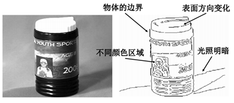

## 图像梯度

图像梯度的定义：
$$
\nabla I = [\frac{\partial I}{\partial x},\frac{\partial I}{\partial y}]
$$
水平梯度：
$$
\nabla I = [\frac{\partial I}{\partial x},0]
$$
垂直梯度：
$$
\nabla I = [0,\frac{\partial I}{\partial y}]
$$
图像梯度指向灰度变化最快的方向：
$$
\theta (x,y) = \tan^{-1} (\frac{\partial I}{\partial x}/\frac{\partial I}{\partial y})
$$
梯度幅值表示边缘的强弱：
$$
M(x,y) = \sqrt{(\frac{\partial I}{\partial x})^2 +(\frac{\partial I}{\partial x})^2}
$$
边缘是一阶导数的极大值点：

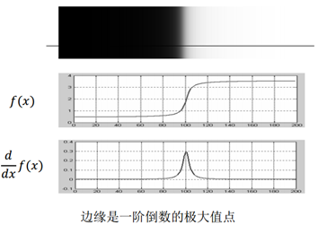

## 一阶微分算子

使用差分近似一阶微分算子：

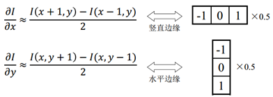

直接对图像使用差分容易受到噪声影响：

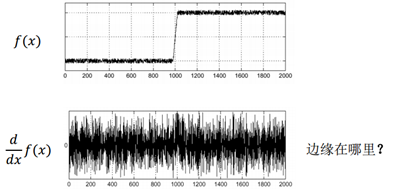

解决方法：先平滑（滤波），再微分

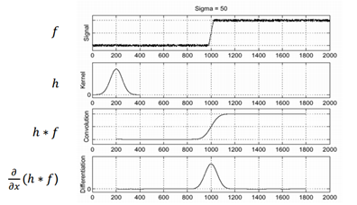

由$(h*f) = (\frac{\partial}{\partial x} h)*f$，可将平滑和微分合并为一个算子

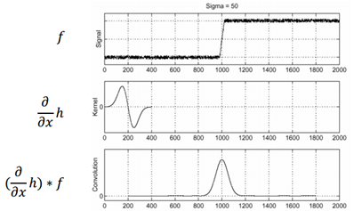

二维高斯微分：

实际应用中，对二维高斯微分进行数值近似：Prewitt算子、Sobel算子

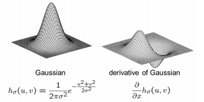

Prewitt算子：去噪+增强边缘

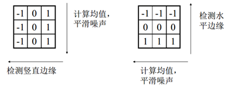 

Sobel算子：去噪+增强边缘（给四邻域更大的权重）

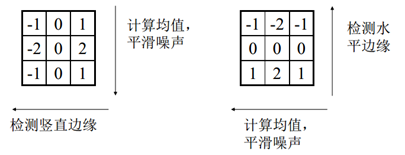

使用一阶微分算子提取边缘流程： 

1. 使用Prewitt或Sobel算子对图像进行卷积； 
2. 将梯度幅值大于阈值的点标记为边缘； 
3. (optional)将边缘细化为一个像素宽度。

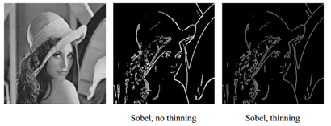

## 二阶微分算子

如果不使用细化，如何获得单像素宽度边缘？

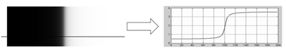

边缘是二阶倒数的过零点 
注意：仅仅等于0不够，常数函数也为0，必须存在符号改变

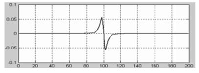

对平滑图像做二阶微分：
$$
\frac{\partial^2}{\partial x^2}(h*f) = (\frac{\partial^2}{\partial x^2}h)*f
$$
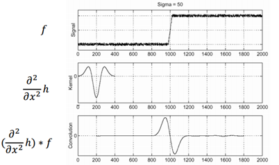

二维高斯微分：

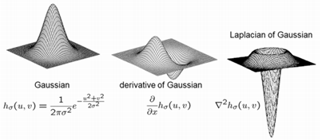

Laplacian of Gaussian (LoG)算子：首先用Gauss函数对图像进行平滑，抑制噪声，然后对经过平滑的图像使用Laplacian算子 
LoG算子等效于：Gaussian平滑+ Laplacian二阶微分

LoG因其形状，也称为Mexican hat

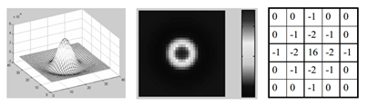

LoG算子与一阶微分算子的比较：

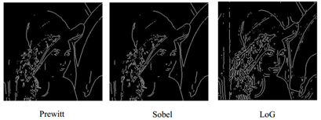

LoG算子的特点： 
• 正确检测到的边缘：单像素宽度，定位准确； 
• 形成许多封闭的轮廓，这是一个主要问题； 
• 需要更加复杂的算法检测过零点。

## Canny算子

Canny算子是最常用的边缘检测算子，Canny算子是一阶微分算子的一个优化方案 

- 单像素宽度 
- 噪声抑制 
- 边缘增强 
- 边缘定位 

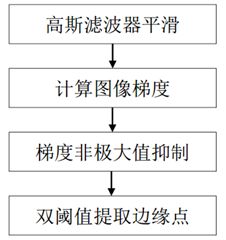

1. 高斯滤波器平滑（噪声去除）

   使用5x5 的高斯滤波器去除噪声

2. 计算图像梯度

   使用一阶有限差分计算偏导数的两个阵列
   $$
   D_x(x,y) \approx \frac{S(x,y+1)-S(x,y)+S(x+1,y+1)-S(x+1,y)}{2} \\
   D_y(x,y) \approx \frac{S(x,y)-S(x+1,y)+S(x,y+1)-S(x+1,y+1)}{2} 
   $$
   相当于于与模板进行卷积运算：

   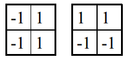

   当然也可以使用高斯微分算子(Prewitt或Sobel)直接与$I(x,y)$卷积计算$D_x(x,y)$和$D_y(x,y)$

3. 梯度非极大值抑制

   在获得梯度的方向和大小之后，应该对整幅图像做一个扫描，去除那些非边界上的点。对每一个像素进行检查，看这个点的梯度是不是周围具有相同梯度方向的点中最大的。如下图所示：

   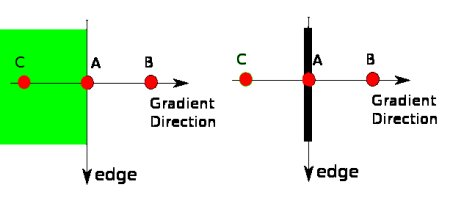

4. 双阈值提取边缘点（滞后阈值）

   现在要确定那些边界才是真正的边界。这时我们需要设置两个阈值：minVal 和maxVal。当图像的灰度梯度高于maxVal 时被认为是真的边界，那些低于minVal 的边界会被抛弃。如果介于两者之间的话，就要看这个点是否与某个被确定为真正的边界点相连，如果是就认为它也是边界点，如果不是就抛弃。如下图：

   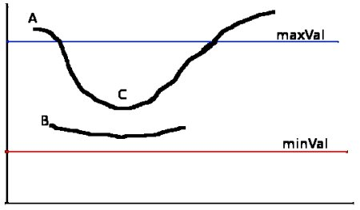

   A 高于阈值maxVal 所以是真正的边界点，C 虽然低于maxVal 但高于minVal 并且与A 相连，所以也被认为是真正的边界点。而B 就会被抛弃，因为他不仅低于maxVal 而且不与真正的边界点相连。所以选择合适的maxVal和minVal 对于能否得到好的结果非常重要。

Canny算子提取效果图：

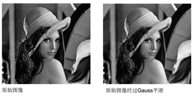

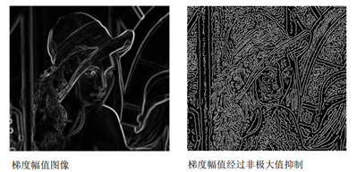

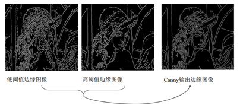

opencv中Canny算子的使用方法：

Python代码实现：

