# 特征检测 - 点特征

- 点特征
- 边缘特征
- 颜色特征
- 纹理特征
- 梯度特征
- 运动特征

## 点特征

对于特征点目前尚无明确的定义。在有些文献中又被称为兴趣点、显著点、关键点等等。以点的位置来表示的点特征是一种最简单的图像特征。事实上，特征点既是一个点的位置辨识，同时也说明它的局部邻域具有一定的模式特征。

> SIFT、SURF、ORB等方法都是对同样的点特征进行检测，只是其特征描述的方法不一样。

特征点是一个具有一定特征的局部区域的位置标识，称其为点，是将其抽象为一个位置概念，以便于确定两幅图像中同一个位置点的对应关系而进行图像配准。所以在特征匹配过程中是以该特征点为中心，将邻域的局部特征进行匹配。也就是说在进行特征匹配时首先要为这些特征点（狭义和广义）建立特征描述，这种特征描述通常称之为描述符。

### 点特征的优势：

- 点特征属于局部特征，对遮挡有一定鲁棒性；
- 通常图像中可以检测到成百上千的点特征，以量取胜；
- 点特征有较好的辨识性，不同物体上的点容易区分；
- 点特征提取通常速度很快；

### 什么样的点可以算作特征点

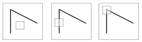

考虑图像上的一个小窗口，当窗口位置发生微小变化时，窗口图像如何变化？

很明显，从下图可以看出，角点是一个好的点特征，因为它沿任意方向移动，窗口的灰度变化明显，所以它可以作为一个特征来进行区分和辨别。

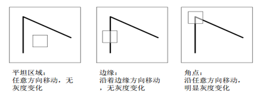

### 点特征的数学表达

- 假设窗口W发生位置偏移(u,v);
- 比较偏移前后窗口中每一个像素点的灰度变化值；
- 使用误差平方和定义误差函数E(u,v)

.png)

不同位置点计算得到的E(u,v)如下图所示，E(u,v)值随着u、v变化的效果图，可以看出，平坦区域（如天空）的灰度变化不大（下图3），边缘区域沿着边缘方向的灰度变化也很小（下图2），只有角点处的灰度变化稍微剧烈一点（下图1）

-compare.png)

将I(x+u,y+v)进行泰勒展开，舍弃高阶小量，并代回原式：

2.png)

3.png)

H称为自相关矩阵，$\lambda_{max}$和$\lambda_{min}$是H的两个特征值，E(u,v)的变化情况如下图所示：

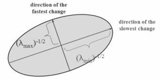

根据H的2个特征值大小对图像点进行分类:

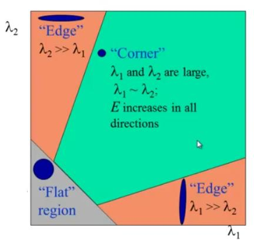

角点应该满足的基本性质：最小特征值尽量大

常用点特征包括：

- Harris角点
- SIFT
- SURF
- FAST
- BRIEF
- ORB

### Harris角点

Harris 角点检测的结果是一个由角点分数构成的灰度图像。选取适当的阈值对结果图像进行二值化我们就检测到了图像中的角点。

算法步骤：

1. 将原图像I使用w(x,y)进行卷积，并计算图像梯度Ix与Iy；
2. 计算每个图像点的自相关矩阵H；
3. 计算角点响应$R=det(H)-\alpha track(H)^2$；
4. 选择R大于阈值且为局部极大值的点作为角点。

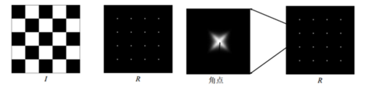

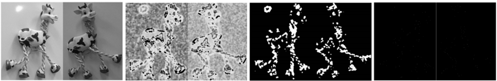

Harris角点的性质

1. 旋转不变
2. 光照变化不变
3. 对比度变化部分不变
4. 对于图像尺度变化不具有不变性

opencv中的Harris角点检测：

Python代码实现：

### SIFT（Scale Invariant Feature Transform）

Harris角点对尺度变化不具有不变性，如下图所示，在一副小图中使用一个小的窗口可以检测到一个角点，但是如果图像被放大，再使用同样的窗口就检测不到角点了。

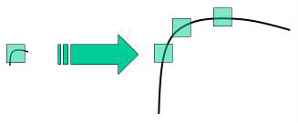

特点：

- 不变性
  - 旋转和尺度不变
  - 对视角彼岸花和光照变化有很强的适应性
  - 局部特征在遮挡和场景杂乱时仍保持不变性
- 辨别力强
  - 特征之间的相互区分能力强，有利于匹配
- 数量较多
  - 一般500*500的图像能提取约2000个特征点

算法流程：

在高斯差分（Difference of Gaussian，DOG）尺度空间中提取极值点并进行优化，从而获取特征点。

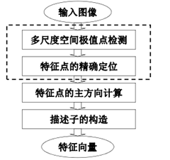

1. 尺度空间极值检测

   从上图我们可以很明显的看出来在不同的尺度空间不能使用相同的窗口检测极值点。对小的角点要用小的窗口，对大的角点只能使用大的窗口。为了达到这个目的我们要使用尺度空间滤波器。（尺度空间滤波器可以使用一些列具有不同方差 的高斯卷积核构成）。使用具有不同方差值 的高斯拉普拉斯算子（LoG）对图像进行卷积，LoG 由于具有不同的方差值 所以可以用来检测不同大小的斑点（当LoG 的方差 与斑点直径相等时能够使斑点完全平滑）。简单来说方差 就是一个尺度变换因子。例如，上图中使用一个小方差 的高斯卷积核是可以很好的检测出小的角点，而使用大方差 的高斯卷积核时可以很好的检测除大的角点。所以我们可以在尺度空间和二维平面中检测到局部最大值，如（x，y，）, 这表示在 尺度中（x，y）点可能是一个关键点。（高斯方差的大小与窗口的大小存在一个倍数关系：窗口大小等于6 倍方差加1，所以方差的大小也决定了窗口大小）

   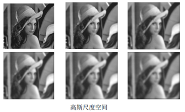

   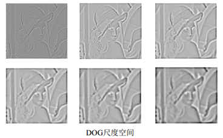

   但是这个LoG 的计算量非常大，所以SIFT 算法使用高斯差分算子（DoG）来对LoG 做近似。这里需要再解释一下图像金字塔，我们可以通过减少采样（如只取奇数行或奇数列）来构成一组图像尺寸（1，0.5，0.25 等）不同的金字塔，然后对这一组图像中的每一张图像使用具有不同方差 的高斯卷积核构建出具有不同分辨率的图像金字塔（不同的尺度空间）。DoG 就是这组具有不同分辨率的图像金字塔中相邻的两层之间的差值。如下图所示：

   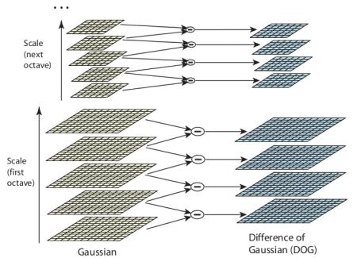

   在DoG 搞定之后，就可以在不同的尺度空间和2D 平面中搜索局部最大值了。对于图像中的一个像素点而言，它需要与自己周围的8 邻域，以及尺度空间中上下两层中的相邻的18（2x9）个点相比。如果是局部最大值，它就可能是一个关键点。基本上来说关键点是图像在相应尺度空间中的最好代表。如下图所示：

   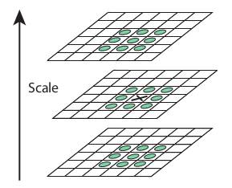

   该算法的作者在文章中给出了SIFT 参数的经验值：octaves=4（通过降低采样从而减小图像尺寸，构成尺寸减小的图像金字塔（4 层）？），尺度空间为5，也就是每个尺寸使用5 个不同方差的高斯核进行卷积，初始方差是1.6，k 等于$\sqrt{2}$等。

2. 特征点精确定位

   一旦找到关键点，我们就要对它们进行修正从而得到更准确的结果。作者使用尺度空间的泰勒级数展开来获得极值的准确位置，如果极值点的灰度值小于阈值（0.03）就会被忽略掉。

   DoG 算法对边界非常敏感，所以我们必须要把边界去除。前面我们讲的Harris 算法除了可以用于角点检测之外还可以用于检测边界。作者就是使用了同样的思路。作者使用2x2 的Hessian 矩阵计算主曲率。从Harris 角点检测的算法中，我们知道当一个特征值远远大于另外一个特征值时检测到的是边界。所以他们使用了一个简单的函数，如果比例高于阈值（OpenCV 中称为边界阈值），这个关键点就会被忽略。文章中给出的边界阈值为10。所以低对比度的关键点和边界关键点都会被去除掉，剩下的就是我们感兴趣的关键点了。

3. 特征点主方向计算

   现在我们要为每一个关键点赋予一个反向参数，这样它才会具有旋转不变性。获取关键点（所在尺度空间）的邻域，然后计算这个区域的梯度级和方向。根据计算得到的结果创建一个含有36 个bins（每10 度一个bin）的方向直方图。（使用当前尺度空间$\sigma$值的1.5 倍为方差的圆形高斯窗口和梯度级做权重）。直方图中的峰值为主方向参数，如果其他的任何柱子的高度高于峰值的80% 被认为是辅方向。这就会在相同的尺度空间相同的位置构建出具有不同方向的关键点。这对于匹配的稳定性会有所帮助。

4. 描述子的构造

   新的关键点描述符被创建了。选取与关键点周围一个16x16 的邻域，把它分成16 个4x4 的小方块，为每个小方块创建一个具有8 个bin 的方向直方图。总共加起来有128 个bin。由此组成长为128 的向量就构成了关键点描述符。除此之外还要进行几个测量以达到对光照变化，旋转等的稳定性。

opencv中SIFT的使用：

Python代码实现：

