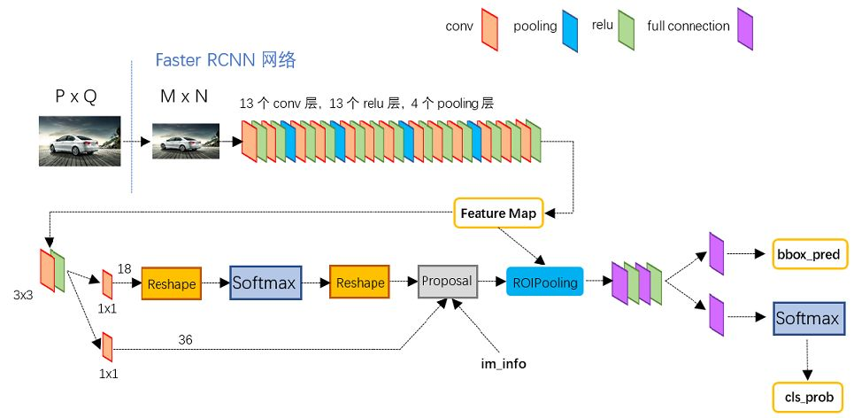
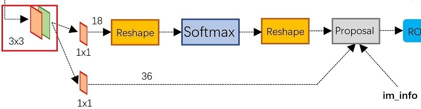
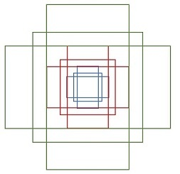
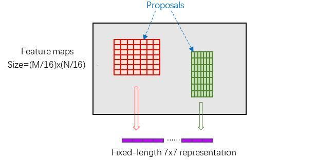
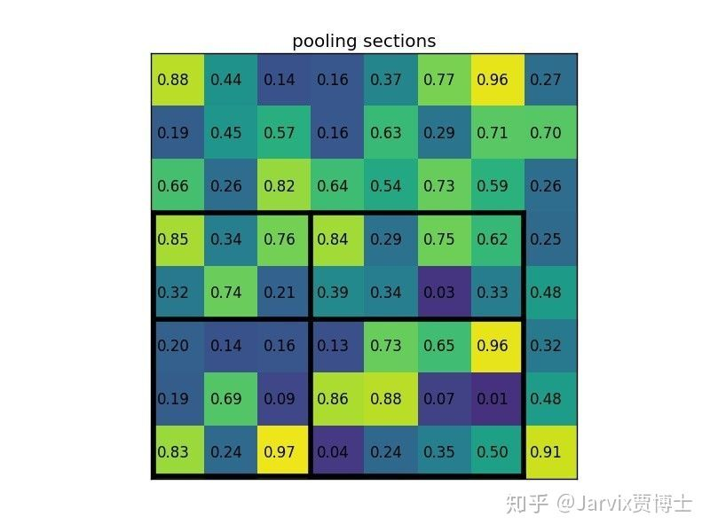
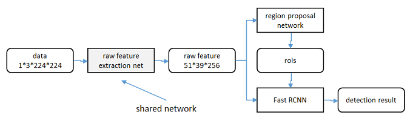

## Faster-RCNN

refer：https://zhuanlan.zhihu.com/p/31426458


网络结构图：



按照结构，可以分成4个部分：

- backbone
- Region Proposal Networks（RPN）
- Roi Pooling
- Classification


### backbone

输入图片固定到大小MxN（原模型设置为800x600），如果backbone如上图所示的VGG16， 包含了13个conv层+13个relu层+4个pooling层，conv和relu不改变featuremap大小，每个pooling后大小变为原来的1/2，因此图片变成原来的1/16.


### RPN



通过卷积来获取proposal是faster-rcnn网络的一个创新（相对selective search）。将backbone输出的feature-map首先通过3x3的卷积，此时feature-map大小为（1，256，N/16，M/16），（N/16，M/16）维度上的每个点都是256维度的矢量，在这个矢量两会回归类别和box坐标偏移，两个分支如下：

- 上面一个分支用于是否为目标的分类，每个点设置了9个anchor，由于此处用softmax计算类别信息，因此需要引入负类别，即输出通道为18；
- 下面一个分支用于回归box的坐标，在每个点上的9个anchor坐标是确定的，因此需要回归anchor坐标相对于分配给这个anchor的gt-box坐标的偏差量，由于偏差量可以用平移、缩放确定，因此需要4值来确定这一偏差量，即输出通道为36；

两个分支在proposal出汇合，其尺寸分别为（1，18，N/16，M/16），（1，36，N/16，M/16）

softmax前两个reshape的作用是为了方便进行softmax操作。1x1卷积后得到[1, 2x9, H, W]，将channel通道的9腾到H，变成[1, 2, 9XH, W]，这样就可以直接在chanel通道上做softmax，做完以后再reshape回来。

#### anchor

原始的anchor设置如下：

```
[[ -84.  -40.   99.   55.]
 [-176.  -88.  191.  103.]
 [-360. -184.  375.  199.]
 [ -56.  -56.   71.   71.]
 [-120. -120.  135.  135.]
 [-248. -248.  263.  263.]
 [ -36.  -80.   51.   95.]
 [ -80. -168.   95.  183.]
 [-168. -344.  183.  359.]]
```

如果把MxN图片等分成16x16的patch，上述的坐标应该对应的是左上角第一个patch的anchor坐标，每个坐标的4个值表示的是（x1，y1，x2，y2），即左上角和右下角点。

anchor的可视化如下图：



9个anchor可分为3组，每组的anchor-box长宽比为{1:1, 1:2, 2:2}

训练时会在合适的anchor中随机选取128个positive anchor和128个negative anchor。

对应800x600的输入，总的anchor数量为：

![[公式]](.pic/equation)

#### gt-box分配

refer：https://bbs.cvmart.net/articles/3462

分配的规则如下：

1. 与gt-box有最大的IoU的anchors作为正样本；
2. 与gt-box的IoU大于0.7的anchors作为正样本；
3. 与gt-box的IoU小于0.3的anchors作为负样本；

#### box回归

对于正样本的anchor，需要计算其与gt-box的偏差。给定anchor A和 gt-box G如下：

![[公式]](https://www.zhihu.com/equation?tex=A%3D%28A_%7Bx%7D%2C+A_%7By%7D%2C+A_%7Bw%7D%2C+A_%7Bh%7D%29)

![[公式]](.pic/equation-20220223183841331)

则A到G的变换如下：
$$
G_x = A_w \cdot d_x + A_x \\
G_y = A_h \cdot d_y + A_y \\
G_w = A_w \cdot exp(d_w) \\
G_h = A_h \cdot exp(d_h)
$$
先做平移，使两个box中心点重合，再做缩放。该变化需要4个参数。且都是相对量。


#### Loss


#### Propopal Layer

输入：

-  rpn_cls_prob_reshape
- rpn_bbox_pred
- im_info，[M, N, scale_factor]
- feat_stride， 16

forward过程的计算逻辑：

1. 利用（dx, dy, dw, dh）得到对于MXN分辨率下的proposal box坐标
2. 安装rpn_cls_prob_reshape对proposal box排序，取前pre_nms_topN（eg. 6000）；
3. 将proposal box的坐标数值约束在正常范围内（0<=x1,x2<M,  0<=y1,y2<N）;
4. 对面积很小的proposal box做适当的剔除；
5. 对余下的proposal box做MNS


### ROI Pooling

refer： https://zhuanlan.zhihu.com/p/73138740

由于proposal box的大小各异，对于的feature-map上的特征尺度就不一样，因此需要对特征的尺度进行归一化，方便后面分类和回归。



具体过程如下：

1. 将proposal box的坐标根据spatial_scale（1/16）映射到backbone后的feature-map上，**不能整除时坐标取整**；
2. 将feature-map上的proposal box resize成（pooled_w，pooled_h）固定的大小，eg. （7， 7），resize时遇到不能等分的情况，需要取整，具体如下图：



### classification

通过前连接和softmax，计算得到每个proposal的类别和更精确的位置偏移量。


#### Loss


### 训练过程

refer：https://blog.csdn.net/shenxiaolu1984/article/details/51152614



#### 轮流训练

1. 从W0开始，训练RPN。用RPN提取训练集上的候选区域
2. 从W0开始，用候选区域训练Fast RCNN，参数记为W1
3. 从W1开始，训练RPN…

具体操作时，仅执行两次迭代，并在训练时冻结了部分层。论文中的实验使用此方法。
如Ross Girshick在ICCV 15年的讲座Training R-CNNs of various velocities中所述，采用此方法没有什么根本原因，主要是因为”实现问题，以及截稿日期“。


#### 近似联合训练

直接在上图结构上训练。在backward计算梯度时，把提取的ROI区域当做固定值看待；在backward更新参数时，来自RPN和来自Fast RCNN的增量合并输入原始特征提取层。
此方法和前方法效果类似，但能将训练时间减少20%-25%。公布的python代码中包含此方法。


#### 联合训练

直接在上图结构上训练。但在backward计算梯度时，要考虑ROI区域的变化的影响


