## Mask-RCNN

refer：

1. https://zhuanlan.zhihu.com/p/37998710
2. https://blog.csdn.net/jiongnima/article/details/79094159

Mask-RCNN在faster-rcnn的基础上，采用ResNet-FPN结构提取特征，并且加了一个mask预测分支。

### ResNet-FPN

Feature Pyramid Network（FPN）包括自下而上，自上而下和横向连接三个部分，如下图所示：

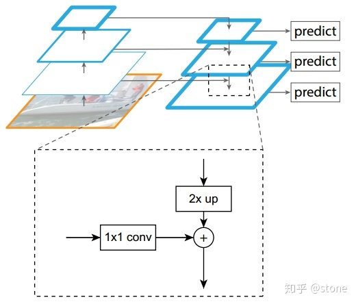

可结合各种backbone使用。

resnet-FPN的结构如下图：

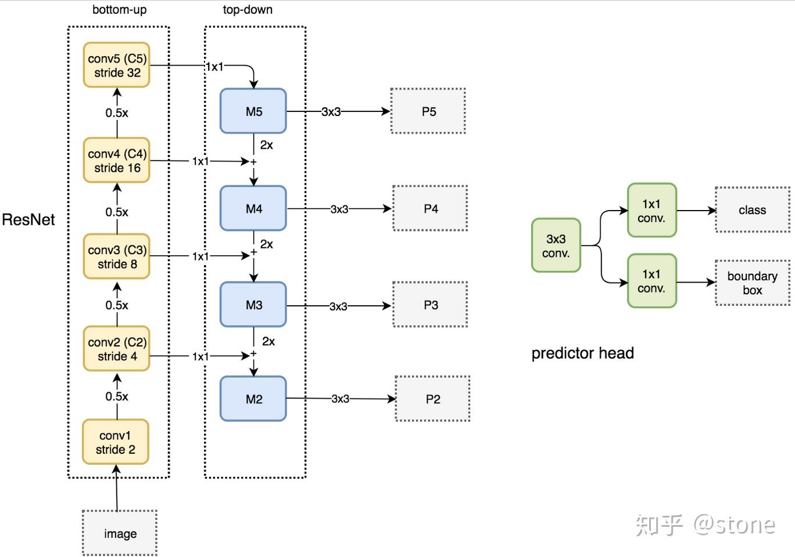

实际上，**上图少绘制了一个分支**：M5经过步长为2的max pooling下采样得到 P6，作者指出使用P6是想得到更大的anchor尺度512×512。但P6是只用在 RPN中用来得到region proposal的，并不会作为后续Fast RCNN的输入。

ResNet-FPN作为RPN输入的feature map是[P2, P3, P4, P5, P6]，后续fast rcnn的输入是[P2, P3, P4, P5]。

### ResNet-FPN+Fast RCNN

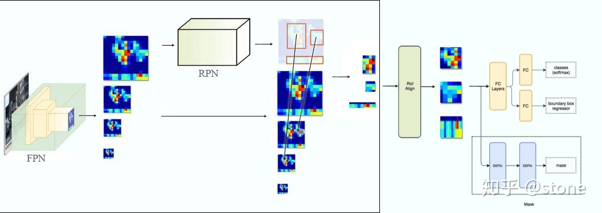

由于生成region proposal的feature-map变成了多个，因此需要根据一定的规则来确定ROI区域的生成。

选择最合适的尺度的feature map来切ROI，具体根据下面的公式确定：

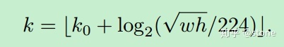

224：用于预训练的ImageNet图片的大小

k0: 面积为wxh=224x224的ROI所应在层级，设为4，即从P4切割ROI；

假设ROI的scale小于224（比如说是112 * 112），k=k0-1=4-1=3，即从更高分辨率的P3中产生；

### ResNet-FPN+Fast RCNN+mask

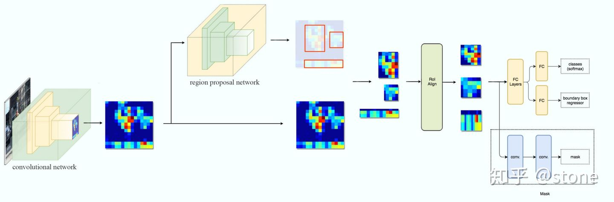

此处新增了mask分支，

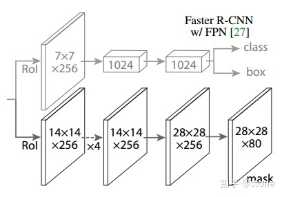

可以看到，mask分支将ROI resize成14x14大小，然后上采样到28x28大小，最后再将通道数变换成80，即类别数（coco）

### ROIAlign

从feature map上经过RPN得到一系列的proposals，大概2k个，这些bbox大小不等，需要找一个办法从大小不等的框中提取特征使输出结果是等长的。

Faster-rcnn采用的ROI-pooling的操作，要进行**两次量化**，特征图与原始图像是**不对准**的（mis-alignment），所以会影响检测精度。

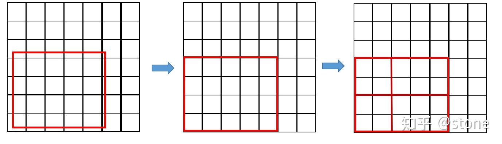

#### 线性插值

如图，已知（x0, y0），(x1, y1），要计算[x0, x1]区域内某一位置x的y值，

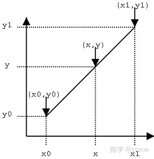

通过斜率相等构建等式：

![[公式]](.pic/equation-20220223223534058)

#### 双线性插值

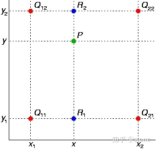

首先在 *x* 方向进行线性插值，得到

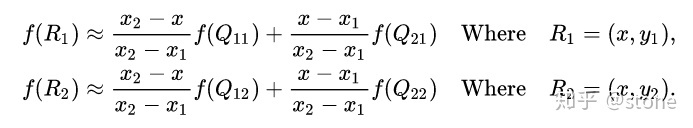

然后在 *y* 方向进行线性插值，得到

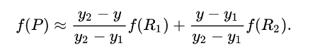

展开公式：略

#### roi-align的过程

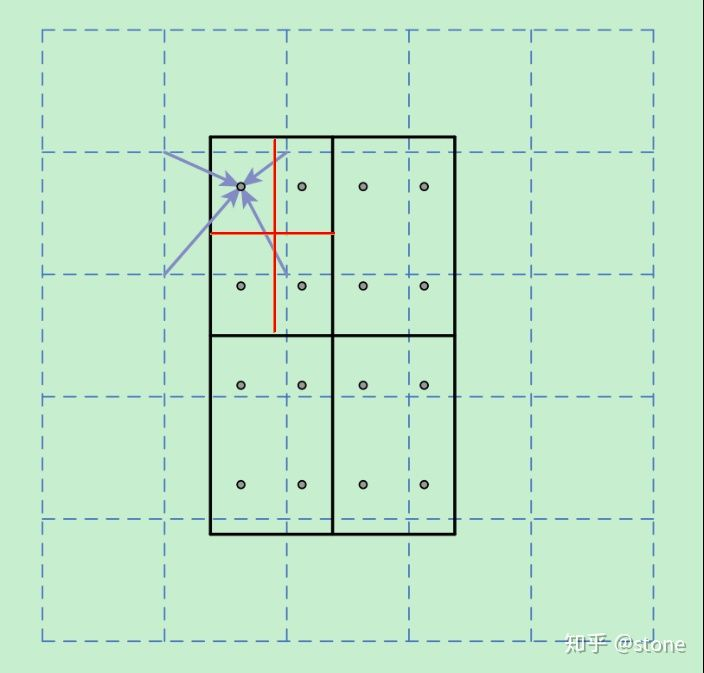

虚线为feature-map，实线为ROI，此处将ROI切分为2x2的格子，每个格式的采样点设为4个（将每个单元格均分为4份，每一份的中心点即为采样点）。通过ROI可以得到每个采样点的坐标，对采样点像素进行双线性插值，如箭头所示，得到每个采样点的数值，然后对每个单元格内的四个采样点进行maxpooling，就可以得到最终的ROIAlign的结果。

将采样点设为4会获得最佳性能。

### Loss

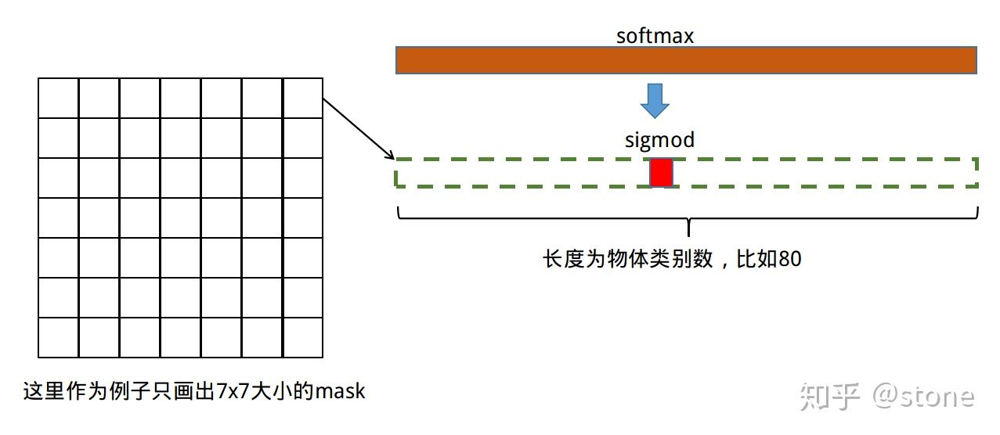

loss由三部分组成，
$$
L = L_{cls} + L_{box} + L_{mask}
$$
其中，前两项和faster-rcnn一致。mask分支的输出尺度为K\*m\*m，对于m*m中的每个点，都会输出K个二值的mask。计算loss的时候，根据类别信息，只对特定的类别计算二值交叉熵损失。
