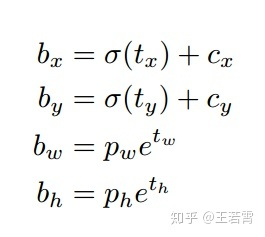
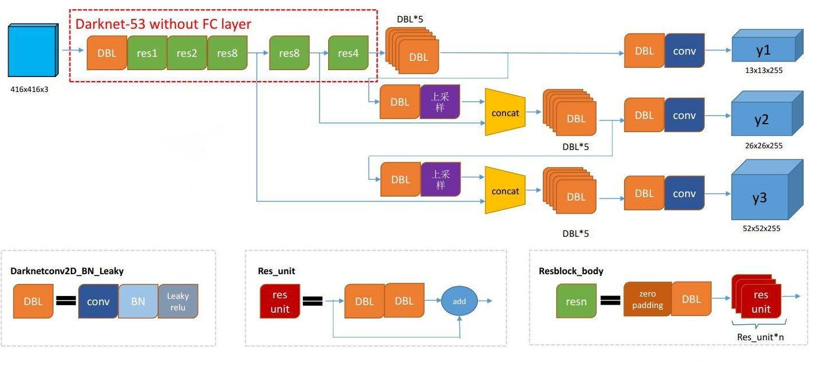
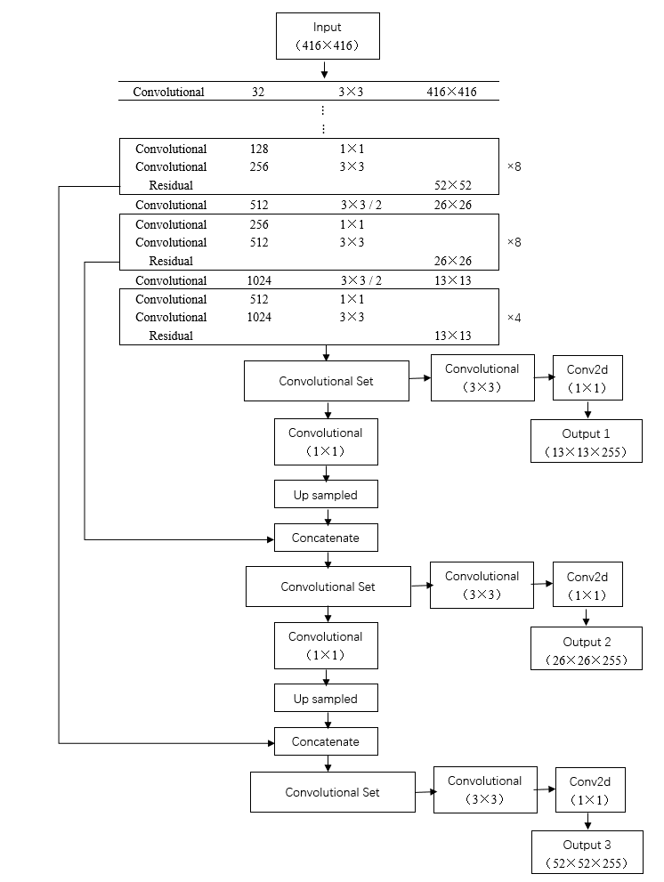
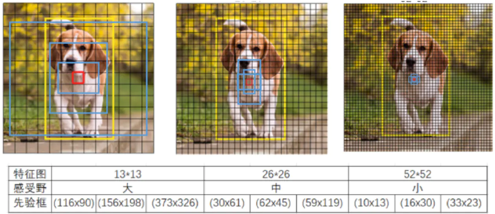

## yolo

Refer:

1. https://zhuanlan.zhihu.com/p/49995236

概述

整体结构由三个部分组成，darknet-53 + FPN + yololayer

### 网络结构

各阶段的尺度信息

| 阶段       | 尺寸                                                         | 说明 |
| ---------- | ------------------------------------------------------------ | ---- |
| input      | （B，3，416，416）                                           |      |
| darknet-53 | （B，256，52，52）（B，512，26，26）（B，1024，13，13）      |      |
| FPN        | （B，255，52，52）（B，255，26，26）（B，255，13，13）       |      |
| yololayer  | (B, 3, 52, 52, 85)， (B, 3, 26, 26, 85)， (B, 3, 13, 13, 85) |      |

85的由来: 训练数据(coco)共80个类别, 加上其他类和4个坐标信息, 所以是85

坐标的表示是(tx, ty, tw, th), 根据这4个值, 通过下面的公式算法ground box的坐标(根据featmap的感受野的尺度缩放后的), tx, ty是平移量, tw, th是x,y维度的缩放因子, (bx, by, bw, bh)表示ground box的坐标

yolov3的网络拓扑结构：

shape信息如下：

### anchor

refer：https://www.jianshu.com/p/e4d7fbcaf68f

对于FPN的三个输出分支，对应原图不同的缩放尺度，以（416，416）的输入尺度为例，anchor的值设置如下：

在具体的训练集上（imagenet，coco），通过kmeans聚类统计所有box的长宽

### loss函数

