## 一、基本概念

给定一张图像或者视频帧，找出其中所有目标的位置，并给出每个目标的具体类别

与目标分类、目标定位的区别：

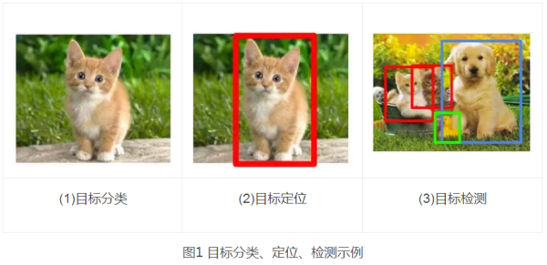

简单来说，分类、定位和检测的区别如下：

1. 分类：是什么？
2. 定位：在哪里？是什么？（单个目标）
3. 检测：在哪里？分别是什么？（多个目标）

## 二、传统目标检测方法

**滑动窗口框架：**

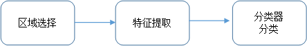

1. 区域选择。利用不同尺寸的滑动窗口框住图中的某一部分作为候选区域；
2. 特征提取。由于目标的形态多样性，光照变化多样性，背景多样性等因素使得设计一个鲁棒的特征并不是那么容易。然而提取特征的好坏直接影响到分类的准确性。（这个阶段常用的特征有SIFT、HOG等）
3. 分类器。利用分类器进行识别，比如常用的SVM模型。

总结：传统目标检测存在的两个主要问题：

- 基于滑动窗口的区域选择策略没有针对性，时间复杂度高，窗口冗余；
- 手工设计的特征对于多样性的变化并没有很好的鲁棒性。

## 三、基于Region Proposal的目标检测

方法：

1. 利用各种候选区域方法（滑动窗口、规则块、选择性搜索）产生候选区域
2. 提取候选区域的视觉特征
3. 利用分类器进行识别

#### Overfeat模型

* 利用滑动窗口进行不同尺度的候选区域，然后使用CNN模型对每个区域进行分类，得到类别和置信度。从图中可以看出，不同缩放比例时，检测出来的目标对象数量和种类存在较大差异

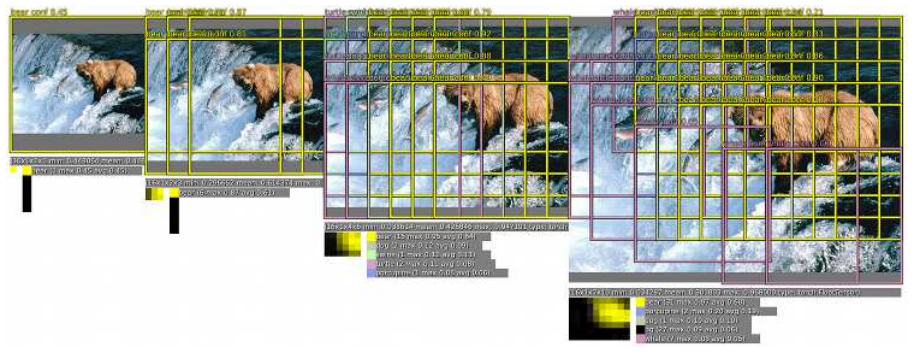

* 利用多尺度滑动窗口来增加检测数量，提升分类效果，如图所示

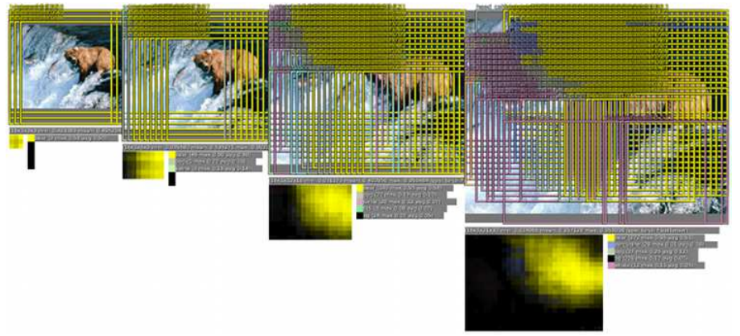

* 用回归模型预测每个对象的位置，从图中来看，放大比例较大的图片，边框数量也较多

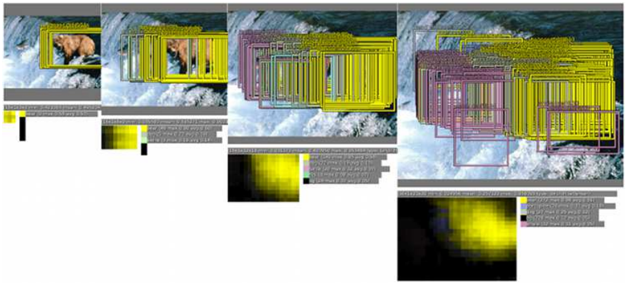

* 边框合并

#### R-CNN

1. 候选区域：通过SelectiveSearch从原始图片提取2000个左右区域候选框；
2. 区域大小归一化：把所有侯选框缩放成固定大小（原文采用227×227）；
3. 特征提取：通过CNN网络，提取特征；
4. 分类与回归：在特征层的基础上添加两个全连接层，再用SVM分类来做识别，用线性回归来微调边框位置与大小，其中每个类别单独训练一个边框回归器。

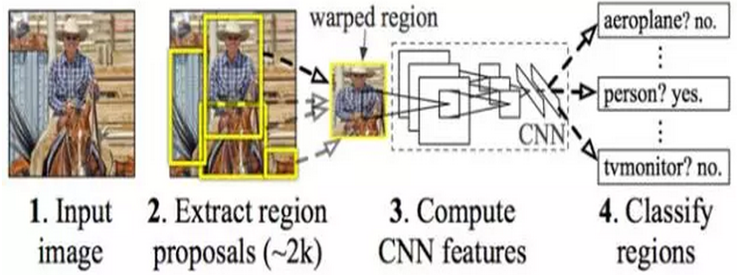

#### SPP-net

R-CNN对图像提完region proposal（2000个左右）之后将每个proposal当成一张图像进行后续处理(CNN提特征+SVM分类)，实际上对一张图像进行了2000次提特征和分类的过程！

这2000个region proposal都是图像的一部分，完全可以对图像提一次卷积层特征，然后只需要将region proposal在原图的位置映射到卷积层特征图上，这样对于一张图像我们只需要提一次卷积层特征，然后将每个region proposal的卷积层特征输入到全连接层做后续操作。问题是每个region proposal的尺度不一样，直接这样输入全连接层肯定是不行的，因为全连接层输入必须是固定的长度。SPP-NET恰好可以解决这个问题：

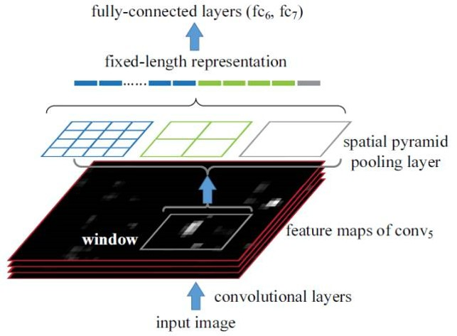

#### Fast R-CNN

1. 特征提取：以整张图片为输入利用CNN得到图片的特征层；
2. 候选区域：通过SelectiveSearch等方法从原始图片提取区域候选框，并把这些候选框一一投影到最后的特征层；
3. 区域归一化：针对特征层上的每个区域候选框进行RoIPooling（SPP-NET的精简版）操作，得到固定大小的特征表示；
4. 分类与回归：然后再通过两个全连接层，分别用softmax多分类做目标识别，用回归模型进行边框位置与大小微调。

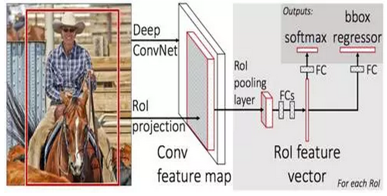

#### Faster R-CNN

Faster R-CNN的主要步骤如下：

1. 特征提取：同Fast R-CNN，以整张图片为输入，利用CNN得到图片的特征层；
2. 候选区域：在最终的卷积特征层上利用*k*个不同的矩形框（Anchor Box）进行提名，*k*一般取9；
3. 分类与回归：对每个Anchor Box对应的区域进行object/non-object二分类，并用*k*个回归模型（各自对应不同的Anchor Box）微调候选框位置与大小，最后进行目标分类。

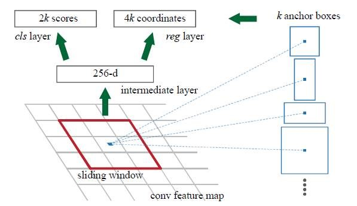

Faster R-CNN抛弃了Selective Search，引入了RPN网络，使得候选区域、分类、回归一起共用卷积特征，从而得到了进一步的加速。但是，Faster R-CNN需要对两万个Anchor Box先判断是否是目标（目标判定），然后再进行目标识别，分成了两步。

## 三、端到端的目标检测

Faster R-CNN的方法目前是主流的目标检测方法，但是速度上并不能满足实时的要求。YOLO一类的方法慢慢显现出其重要性，这类方法使用了回归的思想，既给定输入图像，直接在图像的多个位置上回归出这个位置的目标边框以及目标类别。

#### YOLO

YOLO的目标检测的流程图： 

 (1) 给个一个输入图像，首先将图像划分成7*7的网格

(2) 对于每个网格，我们都预测2个边框（包括每个边框是目标的置信度以及每个边框区域在多个类别上的概率）   

(3) 根据上一步可以预测出$7 \times 7 \times 2$个目标窗口，然后根据阈值去除可能性比较低的目标窗口，最后NMS去除冗余窗口即可。f

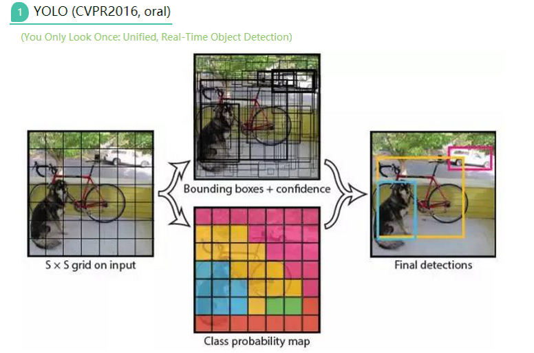

那么如何才能做到直接在不同位置的网格上回归出目标的位置和类别信息呢？上面是YOLO的网络结构图，前边的网络结构跟GoogLeNet的模型比较类似，主要的是最后两层的结构，卷积层之后接了一个4096维的全连接层，然后后边又全连接到一个$7 \times 7 \times 30$维的张量上。实际上这$7 \times 7$就是划分的网格数，现在要在每个网格上预测目标两个可能的位置以及这个位置的目标置信度和类别，也就是每个网格预测两个目标，每个目标的信息有4维坐标信息(中心点坐标+长宽)，1个是目标的置信度，还有类别数20(VOC上20个类别)，总共就是(4+1)*2+20 = 30维的向量。这样可以利用前边4096维的全图特征直接在每个网格上回归出目标检测需要的信息（边框信息加类别）。

#### SSD

## 四、目标检测优化方法

#### 难分样本挖掘（hard negative mining）

#### 多层特征融合

 Fast R-CNN和Faster R-CNN都是利用了最后卷积层的特征进行目标检测，而由于高层的卷积层特征已经损失了很多细节信息（pooling操作），所以在定位时不是很精准。HyperNet等一些方法则利用了CNN的多层特征融合进行目标检测，这不仅利用了高层特征的语义信息，还考虑了低层特征的细节纹理信息，使得目标检测定位更精准。

#### 使用上下文信息

在提取region proposal特征进行目标检测时，结合region proposal上下文信息，检测效果往往会更好一些。（Object detection via a multi-region & semantic segmentation-aware CNN model以及Inside-Outside Net等论文中都使用了上下文信息）

## 五、端到端人脸检测

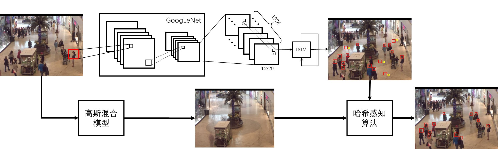

系统主要分为两个部分：

1. GoogLeNet提取特征
2. 利用LSTM获取人脸窗口的位置和大小

第一部分利用GoogLeNet已训练好的模型，首先将图像缩放到$480 \times 640$大小，然后直接输入到模型中，获取bottleneck特征，获得$15 \times 20 \times 1024$维的特征。具体网络结构如下表所示：

| type          | patch/stride | output size |
| ------------- | ------------ | ----------- |
| convolution   | 7×7/2        | 240×320×64  |
| max pool      | 3×3/2        | 120×160×64  |
| convolution   | 3×3/1        | 120×160×192 |
| max pool      | 3×3/2        | 60×80×192   |
| inception(3a) |              | 60×80×256   |
| inception(3b) |              | 60×80×480   |
| max pool      | 3×3/2        | 30×40×480   |
| inception(4a) |              | 30×40×512   |
| inception(4b) |              | 30×40×512   |
| inception(4c) |              | 30×40×512   |
| inception(4d) |              | 30×40×528   |
| inception(4e) |              | 30×40×823   |
| max pool      | 3×3/2        | 15×20×823   |
| inception(5a) |              | 15×20×1024  |
| inception(5b) |              | 15×20×1024  |

第二部分将获取的$15 \times 20 \times 1024$维特征拆分为$1 \times 1  \times 1024$维矢量依次送入LSTM网络，每次LSTM网络生成k个bounding box及其置信度$b = \{b_{pos}, b_c\}, \ where\ b_{pos}=(b_x,b_y,b_w,b_h) \in \mathbb{R}^4$，如下图所示：

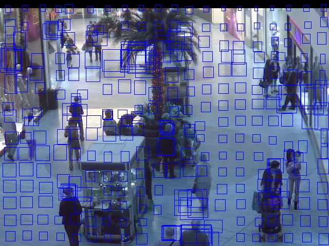

每次，LSTM都会输出k（k<4）个窗口，当某个局部中包含人脸的概率较大时，其k相应的较大（所以当某区域有多个窗口覆盖时，认为其为人脸的概率较大），将上图进一步进行处理，去掉置信度小于阈值的窗口，对于人脸部分的图像一般有多个窗口覆盖，采用NMS方法确定最终窗口的位置及大小。处理后的检测结果如下图所示：

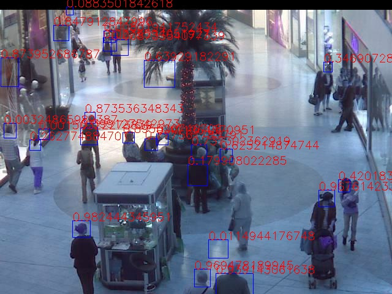

