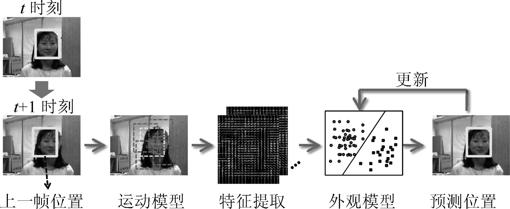
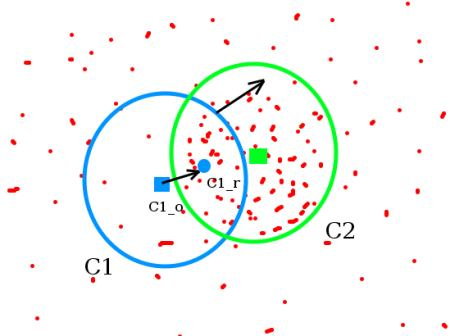
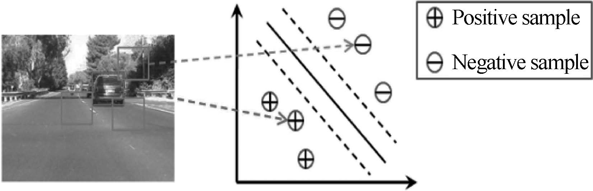
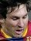
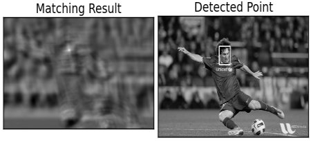
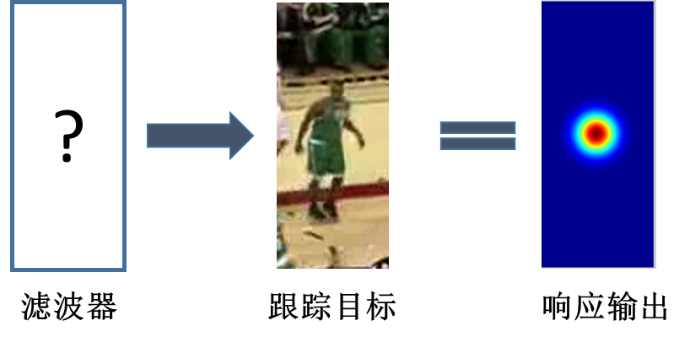
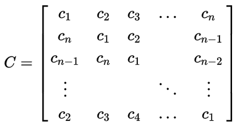

## 一、问题定义

视频目标跟踪是计算机视觉领域的重要研究课题, 其主要任务是获取视频序列中感兴趣的目标的位置与运动信息, 为进一步的语义层分析(动作识别、场景识别等) 提供基础. 其定义是: 给定视频序列初始帧中目标的位置框(一般为矩形框), 在接下来的视频序列中自动给出该目标的位置框或者在目标离开视域时给出提示.

**分类**

按跟踪目标的数量：

- 单目标跟踪
- 多目标跟踪

按获取目标的的摄像头特点：

- 单摄像头跟踪
- 多摄像头跟踪
- 跨摄像头跟踪（重识别）

## 二、目标跟踪的整体框架

- 运动模型：利用视频序列的时空关联性，在目标潜在空间范围内进行搜索或采样，为后面的特征提取、外观模型提供样本
- 特征提取：对目标外观进行有效编码，从二维图像空间映射到某一特征空间
- 外观模型（模板）：对目标外观进行有效建模与描述，从而将目标以最大区分度被跟踪系统搜索到。
- 模型更新：适应目标运动过程中外观的变化

## 三、运动模型

**连续两帧之间目标的位置不会相距过远**, 运动模型就是依据这个基本约束来以较高效率提供候选, 这是与基于全图像扫描的目标检测的根本不同之处.

#### Mean shift（均值漂移）

假设我们有一堆点（比如直方图反向投影得到的点），和一个小的圆形窗口，我们要完成的任务就是将这个窗
口移动到最大灰度密度处（或者是点最多的地方）。如下图所示：

初始窗口是蓝色的“C1”，它的圆心为蓝色方框“C1_o”，而窗口中所有点质心却是“C1_r”(小的蓝色圆圈)，很明显圆心和点的质心没有重合。所以移动圆心C1_o 到质心C1_r，这样我们就得到了一个新的窗口。这时又可以找到新窗口内所有点的质心，大多数情况下还是不重合的，所以重复上面的操作：将新窗口的中心移动到新的质心。就这样不停的迭代操作直到窗口的中心和其所包含点的质心重合为止（或者有一点小误差）。按照这样的操作我们的窗口最终会落在像素值（和）最大的地方。如上图所示“C2”是窗口的最后位址，我们可以看出来这个窗口中的像素点最多。

#### 滑动窗口（slide window）

在目标周边正方形或者圆形范围内进行**穷举搜索**的采样策略, 也称为**密集采样**. 这种方式将搜索范围内所有可能的潜在位置都予以考虑, 但是要付出较大的计算代价.

#### 粒子滤波（Particle filter）

“估计”就是从带有随机误差的观测数据中估计出某些参数或某些状态变量。估计问题一般分为三类：从当前和过去的观测值来估计信号的当前值，称为滤波；从过去的观测值来估计信号的将来值，称为预测或外推；从过去的观测值来估计过去的信号值，称为平滑或内插。滤波理论就是在对系统可观测信号进行测量的基础上，根据一定的滤波准则，对系统的状态或参数进行估计的理论和方法。

粒子滤波主要分为4个步骤：

1. 初始化阶段

   程序手动或自动选择一块跟踪区域，计算该区域的特征向量。同时我们也初始化N个粒子(Particle)，并为它们初始状态赋值，比如位置可以就是这块被跟踪区域的中心，大小就是被跟踪区域的大小等。最后还要给这些粒子赋权重，由于我们认为初始化的时候，这些粒子的重要性是一样的，所以每个粒子的权重都为1/N。

2. 搜索阶段

   这一阶段将粒子撒出去（放狗），方法主要有：

   - 均匀地放（uniform distribution）
   - 按高斯分布（gaussian distribution）

3. 决策阶段

4. 重采样阶段

运动模型主要涉及粒子滤波的搜索阶段

## 四、特征提取

图像特征大体上分为人工特征和学习特征：

- 人工特征：颜色、梯度、纹理……
- 学习特征：通过神经网络获取的图像特征

具体见[图像特征部分]()

## 五、外观模型

主要分为两类：

- 产生式模型
- 判别式模型

#### 产生式模型

产生式模型是一种自顶向下的处理方法. 首先建立目标的外观数据先验分布, 而后在候选区域中搜索与先验模型最为匹配、重构误差最小的区域作为下一帧中目标的位置。例如，在跟踪初始化时获取跟踪目标的颜色直方图，而后获取各个检测窗口的颜色直方图并将其与初始化时的颜色直方图做相似度比较，取相似度最大的窗口为跟踪目标当前的位置窗口。

#### 判别式模型（基于目标检测的模型）

判别式模型也称为基于检测的模型(Tracking by detection), 是近年来逐渐兴起并逐渐占据主流的方法. 其直接借鉴了机器学习理论及其在目标检测中的成功应用. 与产生式模型不同, 判别式模型并不对目标外观分布做事先的刻画, 而是将跟踪问题等同于一个分类问题, 利用一个在线分类器(目标检测器) 将跟踪目标与背景分离, 如图所示：

## 六、模板更新

目前更新的主要有以下几类：

- 每一帧都进行更新；
- 每隔一定的帧数才更新一次；
- 当响应分数低于一定阈值时才更新；
- 分别计算正负样本的响应分数，当两者的差值低于一定阈值时更新。

## 七、核化相关滤波器跟踪算法

相关滤波器（correlation filter）的基本思想是模板匹配。模板匹配是用来在一副大图中搜寻查找模版图像位置的方法。例如给出下面这样一个模板：

其在原图像中匹配结果为：

在tracking的应用里，需要设计一个滤波模板，使得当它作用在跟踪目标上时，得到的响应最大，如下图所示:

$$
g = h \ast f \tag{1}
$$
其中，g表示响应输出，f表示输入图像，h表示滤波模板，g可以为任意形状的响应输出。

CF方法速度快的原因在于其利用了快速傅里叶变换（FFT）。经过FFT变换后，卷积变为点乘：
$$
F(g) = F(f * g)=F(f) \cdot F(h)^* \tag{2}
$$
为了方便描述，将上式写为如下形式：
$$
G = F \cdot H^* \tag{3}
$$
接下来的任务就是找到$H^*$，但在实际应用过程中要考虑目标外观变换因素的影响，所有要同时考虑m个图像作为参考，从而提高滤波器模板的鲁棒性：
$$
min_{\Delta H^*} = \sum_{i=1}^{m}|H^*F_i-G_i|^2 \tag{4}
$$
要得到最小的$\Delta H^*$，需对上式求偏导，并使偏导为0即可。即：
$$
0= \frac{\partial}{\partial H^*}\sum_i |F_iH^* - G_i|^2 \tag{5}
$$
求解上式，得到：
$$
H = \frac{\sum_i F_i \cdot G_i^*}{\sum_i F_i \cdot F_i^*} \tag{6}
$$

#### 运动模型部分

循环位移操作可以用来近似采样窗口的位移。 

采用循环矩阵做密集采样。

循环矩阵：行向量的每个元素都是前一个行向量各元素依次右移一个位置得到的结果。由于可以用离散傅立叶变换快速解循环矩阵，所以在数值分析中有重要的应用

#### 特征提取部分

采用HOG特征

#### 外观模型部分

相关滤波器本质是模板匹配，因此是一种产生式模型