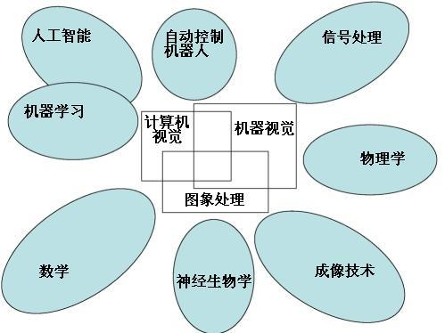

# 计算机视觉整体概论

### 定义与定位

计算机视觉是一门研究如何使机器“看”的科学，更进一步的说，就是指用摄影机和计算机代替人眼对目标进行识别、跟踪和测量等机器视觉，并进一步做图像处理，用计算机处理成为更适合人眼观察或传送给仪器检测的图像

需具备的理论基础

- 高数/线性代数/概率论和随机过程
- 信号处理
  - 信号与系统
  - 数字信号处理
  - 小波变换
  - 信息论
- 模式识别

与其他学科的交叉：

### 与图像处理、图像分析的关系

**图像处理：**对输入的图像做某种变换，输出仍然是图像，基本不涉及或者很少涉及图像内容的分析。比较典型的有图像变换，图像增强，图像去噪，图像压缩，图像恢复，二值图像处理等等。基于阈值的图像分割也属于图像处理的范畴。一般处理的是单幅图像。

经典问题：

- 几何变换（geometric transformations）：包括放大、缩小、旋转等。

- [颜色处理](image-process/color_space.md)（color）：颜色空间的转化、亮度以及对比度的调节、颜色修正等。

- 图像融合（image composite）：多个图像的加、减、组合、拼接。

- 降噪（image denoising）：研究各种针对二维图像的去噪滤波器或者信号处理技术。

- 特征检测

  - [点特征](image-process/point-feature.md)

    角指图像中点似的特征，在局部它有两维结构。早期的算法首先进行边缘检测，然后分析边缘的走向来寻找边缘突然转向（角）。后来发展的算法不再需要边缘检测这个步骤，而是可以直接在图像梯度中寻找高度曲率。后来发现这样有时可以在图像中本来没有角的地方发现具有同角一样的特征的区域。

  - [边缘特征](image-process/edge-feature.md)：进行边缘或者其他局部特征提取。

  - 脊特征

    长条形的物体被称为脊。在实践中脊可以被看作是代表对称轴的一维曲线，此外局部针对于每个脊像素有一个脊宽度。从灰梯度图像中提取脊要比提取边缘、角和区域困难。在空中摄影中往往使用脊检测来分辨道路，在医学图像中它被用来分辨血管。

  - 颜色特征

  - [纹理特征](image-process/texture-feature.md)

  - [梯度特征](image-process/HOG-feature.md)

  - 运动特征

    视频间之间的时空关联性，如光流（optical flow）

- 分区：依据不同标准，把二维图像分区成不同区域。

- 图像编辑：和计算机图形学有一定交叉。

- 图像配准：比较或集成不同条件下获取的图像。

- 图像增强（image enhancement）：

- 图像数字水印：研究图像域的数据隐藏、加密、或认证。

- 图像压缩：研究图像压缩。

**图像分析**：对图像的内容进行分析，提取有意义的特征，以便于后续的处理。处理的仍然是单幅图像。

经典问题：

- 基于内容的图像检索（CBIR-Content Based Image Retrieval）
- 人脸识别（face recognition）
- 表情识别（emotion recognition）
- 光学字符识别（OCR-Optical Character Recognition）
- 手写体识别（handwriting recognition）
- 医学图像分析（biomedical image analysis）
- 视频对象提取（video object extraction）

**计算机视觉**：对图像分析得到的特征进行分析，提取场景的语义表示，让计算机具有人眼和人脑的能力。这时处理的是多幅图像或者序列图像，当然也包括部分单幅图像。

经典问题：

- 识别

  - 识别（狭义的）：对一个或多个经过预先定义或学习的物体或物类进行辨识，通常在辨识过程中还要提供他们的二维位置或三维姿态。
  - 鉴别：识别辨认单一物体本身。例如：某一人脸的识别，某一指纹的识别。
  - 监测/监测：从图像中发现特定的情况内容。例如：医学中对细胞或组织不正常技能的发现，交通监视仪器对过往车辆的发现。监测往往是通过简单的图象处理发现图像中的特殊区域，为后继更复杂的操作提供起点。

- 运动

  - 自体运动：监测摄像机的三维刚性运动。
  - 目标跟踪：跟踪运动的物体。
    - meanshift与camshift

- 场景重建

  给定一个场景的二或多幅图像或者一段录像，场景重建寻求为该场景创建一个计算机模型/三维模型。最简单的情况便是生成一组三维空间中的点。更复杂的情况下会创建起完整的三维表面模型。

- 图像恢复

  图像恢复的目标在于移除图像中的噪声，例如仪器噪声，模糊等