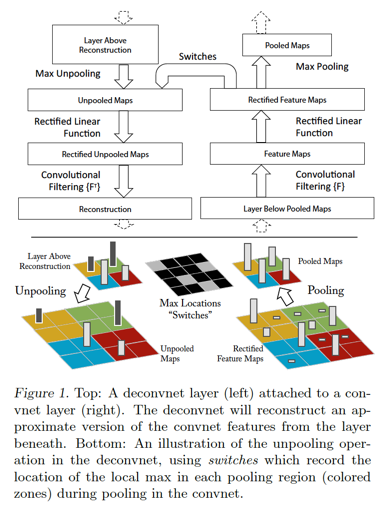
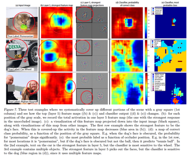

# CNN可视化

主要内容：

1. 激活层可视化
2. 权重可视化
3. activation maximization可视化
4. 反卷积可视化

### 激活层可视化

将神经网络隐藏层的激活神经元以矩阵的形式可视化出来

读图方法：

- **比较理想的layer activation应该具备sparse和localized的特点**
- 如果激活层的可视化的结果和原图非常相似，说明feature map没有学到说明东西

### 权重可视化

通常，我们期望的良好的卷积层的weight可视化出来会具备smooth的特性

这两张图都是将一个神经网络的第一个卷积层的filter weight可视化出来的效果图，**左图存在很多的噪点，右图则比较平滑。出现左图这个情形，往往意味着我们的模型训练过程出现了问题。**

### activation maximization可视化

为了理解3提到的方法，需要先理解CNN里Receptive Field的概念，在[5][6]里关于Receptive Field给出了直观的介绍：  

如果用文字来描述的话，就是对应于卷积核所生成的Feature Map里的一个neuron，在计算这个neuron的标量数值时，是使用卷积核在输入层的图片上进行卷积计算得来的，对于Feature Map的某个特定neuron，用于计算该neuron的输入层数据的local patch就是这个neuron的receptive field。而对于一个特定的卷积层的Feature Map里的某个神经元，我们可以找到使得这个神经元的activation最大的那些图片，然后再从这个Feature Map neuron还原到原始图片上的receptive field，即可以看到是哪张图片的哪些region
maximize了这个neuron的activation。在[7]里使用这个技巧，对于某个pooling层的输出进行了activation
maximization可视化的工作：  

不过，在[9]里，关于3提到的方法进行了更为细致的研究，在[9]里，发现，通过寻找maximizing
activation某个特定neuron的方法也许并没有真正找到本质的信息。因为即便是对于某一个hidden
layer的neurons进行线性加权，也同样会对一组图片表现出相近的semantic亲和性，并且，这个发现在不同的数据集上得到了验证。
如下面在MNIST和ImageNet数据集上的观察：  

### 反卷积可视化

在[11]里，使用了[12]里提出的Deconvolutional Network，对卷积层形成的feature map进行reconstruction，将feature map的activation投影到输入图片所在的像素空间，从而提供了更直观的视角来观察每个卷积层学习到了什么东西，一来可以帮助理解模型；二来可以指导模型的调优设计。 [11]的工作主要是在AlexNet这个模型上做的，将Deconvolutional Network引入到AlexNet模型以后的大致topology如下：  

上图里，右边是正常的卷积神经网络，左边是Deconv Net，Deconv Net的输入是卷积神经网络的某个卷积层pooling层的输出，另外，在Deconv Net与右边的卷积神经网络之间存在一个Switches连接通道，用于执行Deconv net里的Unpooling操作。注意上图的一个细节，Deconv Net的Unpooling操作，实际上是pooling操作的一个近似逆函数，而非精确逆函数。在AlexNet模型上使用Deconv Net对feature map进行input image space投影的效果示例如下：  

从上面这个示例图里能够看得出来，不同的feature map，使用Deconv Net进行reconstruction，会投影出不同描述粒度的图片，比如低层的layer reconstruction出来的会是边缘性质的图像，而高层的layer
reconstruction出来的则可能会是狗的脸部，计算器的轮廓等更general性质的图像。另外，通过Deconv Net还可以观察训练过程中，feature map的演化情况，基本的作法就是将每个卷积层里，activation最大的feature map使用Deconv Net进行reconstruction，以epoch为时间粒度，观察这些feature map
reconstructed image的变化趋势，比如下图：  

**能够看到，低层的feature map比较快就会收敛，而高层的feature map则需要较长epoch的训练时长才会收敛。**  

接下来回到[11]里提出的"Occluding Parts of the Image”的方法，这个方法描述起来并不复杂：**对于一张输入图片，使用一个小尺寸的灰度方块图作为掩模，对该原始图片进行遍历掩模，每作一次掩模，计算一下CNN模型对这张掩模后图片的分类预测输出，同时，找到一个在训练集上activation最大的feature map，每作一次掩模，记录下来以掩模图片作为输入数据之后的feature map矩阵，将所有掩模所产生的这些feature map矩阵进行elementwise相加，就可以观察到掩模图片的不同区域对分类预测结果以及feature map的activation value的影响**。示例图如下：  

**上图的第一列是原始图片。** 
第二列是在训练集上选出了layer 5上的activation行为最显著的一个feature map之后，对第一列的原始图片使用一个灰度小色块进行occluding之后，所生成的该feature map的activation value进行sum up之后的可视图。 
第三列是这个feature map（这个是在没有occluding的image上应用CNN模型生成的feature map）使用Deconv
Net投影到input image space上的图像。能够看得出来，第三列所reconstruct出的image与第二列中受occluding操作影响较大的区域明显是相重合的。

References:  
[1]. Visualizing what ConvNets Learn. [CS231n Convolutional Neural Networks for Visual Recognition](https://link.zhihu.com/?target=http%3A//cs231n.github.io/understanding-cnn/)  
[2]. Matthew Zeiler. Visualizing and Understanding Convolutional Networks. [Visualizing and Understanding Convolutional Networks](https://link.zhihu.com/?target=http%3A//videolectures.net/eccv2014_zeiler_convolutional_networks/).  
[3]. Daniel Bruckner. deepViz: Visualizing Convolutional Neural Networks for
Image Classification.  
[http://vis.berkeley.edu/courses/cs294-10-fa13/wiki/images/f/fd/DeepVizPaper.pdf...](https://link.zhihu.com/?target=http%3A//vis.berkeley.edu/courses/cs294-10-fa13/wiki/images/f/fd/DeepVizPaper.pdf)  
[4]. ConvNetJS MNIST Demo. [ConvNetJS MNIST demo](https://link.zhihu.com/?target=http%3A//cs.stanford.edu/people/karpathy/convnetjs/demo/mnist.html)  
[5]. Receptive Field. [CS231n Convolutional Neural Networks for Visual Recognition](https://link.zhihu.com/?target=http%3A//cs231n.github.io/convolutional-networks/%23conv)  
[6]. Receptive Field of Neurons in LeNet. [deep learning](https://link.zhihu.com/?target=http%3A//stats.stackexchange.com/questions/142606/receptive-field-of-neurons-in-lenet)  
[7]. Ross Girshick. Rich feature hierarchies for accurate object detection and semantic segmentation 
Tech report. Arxiv, 2011.  
[8]. CS231n: Convolutional Neural Networks for Visual Recognition. [Stanford University CS231n: Convolutional Neural Networks for Visual Recognition](https://link.zhihu.com/?target=http%3A//cs231n.stanford.edu/)  
[9]. Christian Szegedy. Intriguing properties of neural networks. Arxiv, 2013.  
[10]. t-SNE. [t-SNE – Laurens van der Maaten](https://link.zhihu.com/?target=http%3A//lvdmaaten.github.io/tsne/)  
[11]. Matthew D.Zeiler. Visualizing and Understanding Convolutional Networks.
Arxiv, 2011.  
[12]. Matthew D.Zeiler. Adaptive Deconvolutional Networks for Mid and High Level
Feature Learning, ICCV 2011.  
[13]. Neural Networks Part 3: Learning and Evaluation. [CS231n Convolutional Neural Networks for Visual Recognition](https://link.zhihu.com/?target=http%3A//cs231n.github.io/neural-networks-3/%23vis) 
[14]. ConvNetJS---Deep Learning in Your Browser.[ConvNetJS: Deep Learning in your browser](https://link.zhihu.com/?target=http%3A//cs.stanford.edu/people/karpathy/convnetjs/)  
[15]. Colah. Visualizing MNIST: An Exploration of Dimensionality Reduction.
[http://colah.github.io/posts/2014-10-Visualizing-MNIST/...](https://link.zhihu.com/?target=http%3A//colah.github.io/posts/2014-10-Visualizing-MNIST/)

