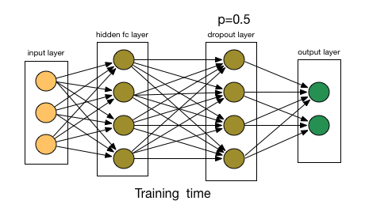

# Dropout

dropout技术是hinton在（https://www.cs.toronto.edu/~hinton/absps/JMLRdropout.pdf ）论文提出来的防止过拟合的方法。原理非常简单，dropout的作用对象是layer，对于某一层中的每个节点，dropout技术使得该节点以一定的概率p不参与到训练的过程中（即前向传导时不参与计算，bp计算时不参与梯度更新），如上图所示。实验证明了，dropout的效果非常爆炸，对于模型训练有非常好的效果。为什么dropout能起到这么大作用呢？ 一个原因是通过dropout，节点之间的耦合度降低了，节点对于其他节点不再那么敏感了，这样就可以促使模型学到更加鲁棒的特征；第二个是dropout layer层中的每个节点都没有得到充分的训练（因为它们只有一半的出勤率），这样就避免了对于训练样本的过分学习；第三个原因是在测试阶段，dropout layer的所有节点都用上了，这样就起到了ensemble的作用，ensemble能够有效地克服模型的过拟合。

