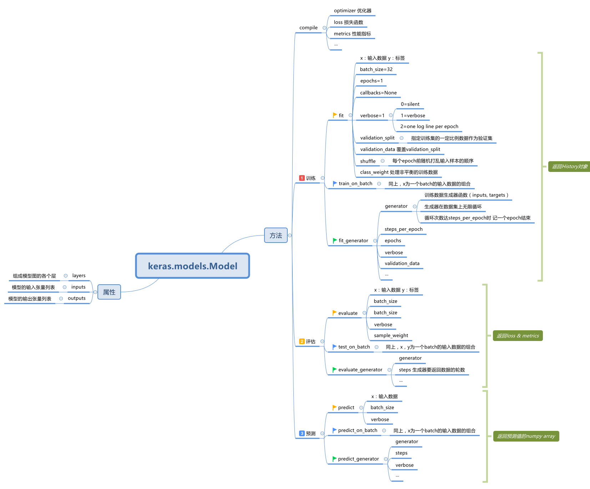

# Keras.models.Model




### generator生成数据的顺序问题

```python
datagen = ImageDataGenerator(rescale=1. / 255)
# 从文件夹生成数据
generator = datagen.flow_from_directory(
        train_data_dir,
        target_size=(img_width, img_height),
        batch_size=1,
        class_mode=None,
        shuffle=False)

# 从numpy array生成数据
# 该种方法每次迭代只生成一个训练数据
generator = datagen.flow(x_train, batch_size=1)
# 该种方法每次迭代生成一个训练数据和其相应的标签（image, label）(tuple)
generator = datagen.flow(x_train, y_train, batch_size=1)

```

> 若要使生成的数据按照x_train原先的顺序排列，要指定**shuffle=False**


