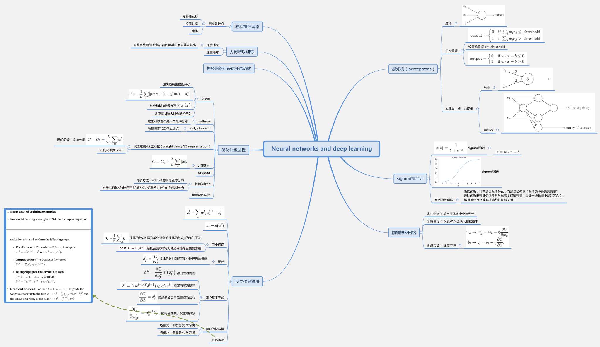
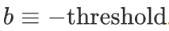
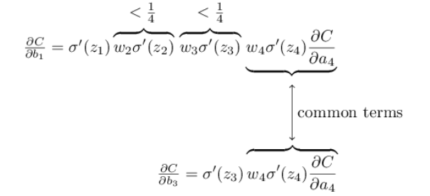

第一章 利用神经网络识别手写数字

1、感知机（perceptrons）

感知机可被用于产生逻辑门，与、或和非。

2、sigmoid神经元

sigmoid函数的定义：

sigmoid函数的图像：

代入变量：

激活函数（$$f( \bullet )$$）:

激活函数，并不是去激活什么，而是指如何把“激活的神经元的特征”通过函数把特征保留并映射出来（保留特征，去除一些数据中是的冗余），这是神经网络能解决非线性问题关键。

3、神经网络的结构（多层感知机）

由于历史原因，上述多层网络结构有时也称为多层感知机（*multilayer
perceptrons，MLP*）

前馈神经网络（*feedforward* neural networks）

输出层有10个类时，采用10个输出而不是4（$$2^{4} > 10$$）的原因：

凭经验讲，输出10个类别时，输出层10个神经元的分类效果比4个要来地好

神经网络的训练目标：改变W，b的值，是损失函数取得最小值。

梯度下降法（gradient descent）：

设$$v_{1},\ldots,v_{m}$$为输出变量，则根据微积分的知识，有：

其中

，表示梯度

令$$v = \  - \eta\nabla C$$，其中$$\eta$$为一个小的正数，则

$$
C \approx \  - \eta\nabla C^{2}
$$

为负值，即当

变化时，损失函数C减小。

所以只要求出C对各个变量的偏微分，得到$$\nabla
C$$，即可使损失函数减小。W，b更新的公式如下：

二次损失函数（均方差，MSE）：

$$
= \frac{1}{n}\sum_{x}^{}C_{x}
$$

其中，W表示权重，b表示偏置项，n为所有训练输入的数据总数（总训练图像数），$$y\left(
x \right)$$为期望值，a为神经网络的输出值

根据$C_{x}\equiv \ \frac{\left\| y\left( x \right) - a\right\|^{2}}{2}$，在实际应用中，为计算$\nabla C = \frac{1}{n}\sum_{x}^{}{\nabla C_{x}}$，先计算$\nabla C_{x}$，为加快计算，每次更新权值和偏置项只计算m个输入数据，根据公式

近似得到$\nabla C$ ，然后根据下面两个式子得到更新的权值和偏置项，该方法称为随机梯度下降法。

有时省略$\ \frac{1}{m}\ $项，并入学习速率$$\eta$$。

第二章 反向传导算法

反向传导算法的核心是对神经网络中损耗函数C关于W和b的偏微分表达。它不仅是一个快速学习的算法，而且可以给出权值和偏置项的改变是如何作用于整个网络的。

几个关键记号的矩阵方式表达：

$w_{\text{jk}}^{l}$——第$l - 1$层的第k个神经元到第l层中第j个神经元的权值；

$$b_{j}^{l}$$——第$$l$$层中第j个神经元的偏置项；

$$a_{j}^{l}$$——第$$\ \text{l }$$层第j个神经元的激活值（输出）；

$$z_{j}^{l}$$——第$$l$$层中第j个神经元的加权输入和；

几个记号的关系：

$$
z_{j}^{l} = \sum_{k}^{}{w_{\text{jk}}^{l}a_{k}^{l - 1}} + b_{j}^{l}
$$

$$
a_{j}^{l} = \sigma\left( z_{j}^{l} \right)
$$

使用反向传导的两个假设：

1.  损耗函数C可写为单个样例的损耗函数$$C_{x}$$的和的平均，即：

$$
C = \frac{1}{n}\sum_{x}^{}C_{x}
$$

2. 损耗函数C可写为神经网络输出值的方程，即：

 $$cost C = C(a^{L})$$

残差（$$\delta_{j}^{l} \equiv \frac{\partial C}{\partial z_{j}^{l}}$$ ）——l层第j个神经元的差

反向产道算法给出了计算残差的方式，然后将残差与$$\frac{\partial C}{\partial w_{\text{jk}}^{l}}$$ 和$$\frac{\partial C}{\partial b_{j}^{l}}$$关联起来

关于神经网络的四个基本等式：

1.  输出层的残差，$$\delta^{L}$$

$$
\delta^{L} = \frac{\partial\complement}{\partial a_{j}^{L}}\sigma^{'}\left( z_{j}^{L} \right)
$$

2. 相邻两层的残差关系：

3. 损耗函数关于偏置项的偏微分：

4. 损耗函数关于权值的偏微分：

>   [./media/image18.png](./media/image18.png)

关于学习快与慢的说法：

-   学习快，权值W大；学习慢，权值W小；

-   学习慢，损耗函数对权值和偏置想的偏微分小；

反向传导算法的步骤：

1.  输入x：设置输入层的激活值为$$a^{1} = x$$；

2. 前馈：对于$$l = 2,3,\ldots,L$$计算$$z^{l} = w^{l}a^{l - 1}$$和$$a^{l} =\partial\left( z^{l} \right)$$

3. 输出残差：

    

4. 反向传导计算残差：对于$$l = L - 1,L - 2,\ldots,2$$，计算

    

5. 输出：计算损耗函数C的梯度，

    

随机梯度下降法的应用步骤：

第三章 改善神经网络的学习过程

交叉熵（cross entropy）:

作用：作为二次损耗函数的替换，加快损耗函数的减小

定义：

关于权值和偏置项的偏微分：

式中不含$$\sigma^{'}\left( z \right)$$项(由于该项在$$\left| z\right|$$较大时会渐趋于0)，所有偏微分的值较大，因此可加快学习速度。

softmax

一种新的输出层函数。

对于输出层的某一神经元，其输入的加权和为$$z_{j}^{L}$$，之前的方法是对加权和作用一个sigmoid函数，最终得到暑输出$$a_{j}^{L}$$。而若采用softmax输出，则将sigmoid函数替换为softmax，表达式为：

从该式可看出，

上式表明，softmax层的输出可以看作是一个概率分布。

最大似然损耗函数（log-likelihood cost）

其对W，b的偏导为：

early
stopping:在每次训练结束后，利用验证数据集计算分类的精度，当在验证数据集的分类精度饱和后就停止训练。

权值衰减/L2正则化(weight deacy/L2 regularization)

正则化的思路是在损耗函数增加一个新的项，使其最终形式如下：

其中， $$\lambda >0$$称为正则化参数。正则化过程是对较小的权值和最小化损耗函数的折衷。

正则化后的$$\frac{\partial C}{\partial w}$$和$$\frac{\partial C}{\partial b}$$可表示为：

偏置项和权值的更新变为：

偏置项学习速率不变，权值学习速率加快。

权值衰减为何可加快学习速度：未正则化的损耗函数随着迭代次数的增加，权值矢量变得越来越大，以致每次更新权值对其方向的影响越来越小。权值衰减限制了权值的增大，使每次迭代产生的变化量$$w$$对最终的权值影响较大，加快了学习的速度。

L1正则化

Dropout：在每次训练过程中，随机地删除隐含层的神经元。

权值初始化

传统的权值初始化方法为期望为0，标准差为1的高斯分布函数，对于某一层的第j个神经元，其输出加权和为$z= \sum_{j}^{}{w_{j}x_{j}} + b\$，$$  | z |$趋向于一个较大的值，从而输出$\sigma\left( z\right)$非常接近1或0，这表示该神经元将会饱和，降低学习速度。为避免这种情况发生，假设一个神经元的输入有n项，则其权值初始化应为期望为0，标准差为$\frac{1}{\sqrt{n}}$的高斯分布。

如何选取超参? (i.e. $$\eta,\ \lambda,\ et\ al$$)

feedback

no-improvement-in-ten

第四章 神经网络可表达任意函数的可视化证明

略

第五章 神经网络为何难以训练

vanishing gradient problem——前层的学习速度比后层的学习速度慢

exploding gradient problem

一般来说，梯度值在深度神经网络中趋向于不稳定，要么explode，要么vanish。这种不稳定性是基于梯度的深度神经网络学习问题的根源。

对于下面一个简单的网络，

其偏微分如下所示，

随着深度的增加，越往前的层其其梯度会越来越小。

综合各种原因，深度神经网络难以训练的原因包括梯度消失、激活函数的选择、权值的初始化方法等，梯度下降的具体实施方式，神经网络的结构，超参的选取的因素也使深度神经网络难以训练。

第六章 深度学习

卷积神经网络

基本改进点：局部感受野，共享权值，池化

局部感受野示意图：

图中采用了5X5大小的局部感受野，移动的步长为1，原本为28X28大小输入图像产生24X24（$$28x24 + 1$$）卷积层神经元。

共享权值和偏置项：所有同一个特征层的神经元的输入权值和偏置项完全相同。共享权值意味着同一特征层的神经元检测特征都是相同的。一个特征层称为一个特征地图，其共享的权值和偏置项称为核或滤波器。

由于

，所以卷积神经网络的名称由此而来。

池化层

池化层通常紧跟在卷积层之后，其所做的事情是简化从卷积层输出的信息。

max-pooling的示意图如下所示，取四个神经元输出的最大值作为池化层的值。我们可以max-pooling想象为一个检测某一区域是否包含某一指定特征的操作。

