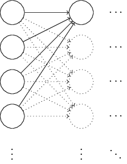
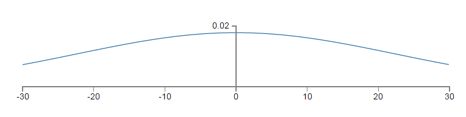
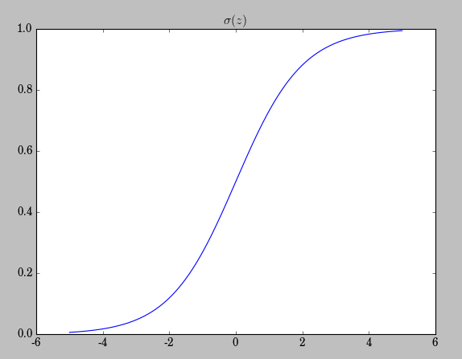
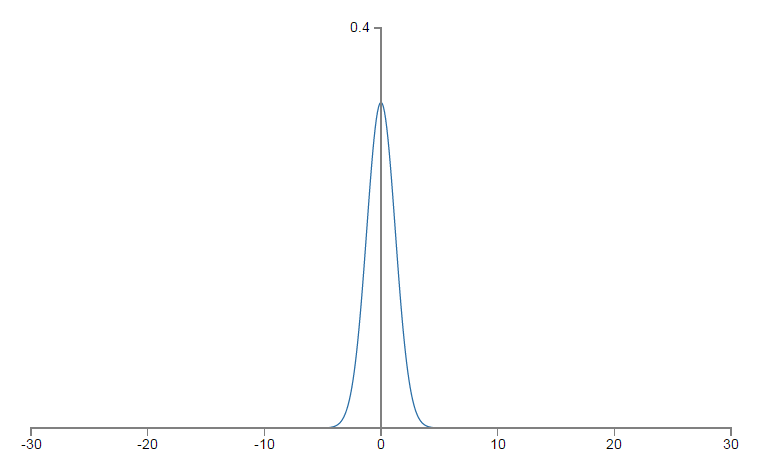

# 权值初始化

常用方法：

- 小数值随机初始化
- 以正态分布N(0,1)初始化每一层
- 以正态分布N(0,  $\sqrt n$)初始化每一层，其中n为上一层神经元的个数

### 以正态分布N(0,1)初始化每一层

以一个简单的具体例子，分析这种初始化方法可能存在的缺陷，如下图所示： 

为了简化问题，我们只以最左一层向中间一层的第一个神经元（neuron）进行前向（forward）传递为例进行分析，假设一个输入样本（特征向量，x，维度为1000），一半为1，一半为0（这样的假设很特殊，但也很能说明问题），根据前向传递公式，$z = \sum_j w_jx_j + b$，z即为输入层向中间隐层第一个神经元的输入。因为输入的一半为0的缘故，再根据前文以及代码也即权重和偏置初始化为独立同分布的**标准高斯随机变量**，z为501（500个权值+1个偏置）个标准正太随机变量的和，由**独立随机变量和的方差等于方差的和**可知，因此z的分布服从0均值，标准差为$\sqrt{501} \approx 22.4$，标准差从1升高到22.4，由高斯密度函数可$f(x)=\frac{1}{\sqrt{2\pi \sigma}}exp(\frac{-(x-\mu)^2}{\sigma^2})$知，方差越大，密度函数的分布越扁平，也即分布越均匀而不是集中在一段区域，其概率密度函数为（可见十分平坦）：

以上的平坦的概率密度函数为z的pdf（概率密度函数），因为pdf较为均匀，|z|的值就不会像N∼(0,1)那样集中于均值附近（越远离均值中心，密度值会迅速衰减），而会以更大的概率取更大的值。这中初始化机制可能带来什么样的问题呢？|z|取值很大，也即z≫1或者z≪−1，相应的该神经元的activation值σ(z)就会接近0或者1，而我们知道，如下图示，σ(z)越靠近0或者1其变化率越小，也即是达到一种饱和（saturate）状态。 

而权值更新公式为： 
$$
\frac{\partial  C}{\partial w^L} = (a^L - y)\sigma^{'}(z)
$$
也就意味着越小的σ′(z)，越小的梯度更新，同等学习率（learning rate：η）的情况下，越小的学习速率。

假使输入层有n个神经元，我们可将这些神经元对应的权重初始化为0均值，标准差为$1/\sqrt n$，这样，高斯pdf的形式将会趋于陡峭，而不是上文的平坦，σ′(z)将以较小的概率达到饱和状态。仍以上文的设置为基础，现在z的pdf，均值为0，标准差为$\sqrt{500/1000}$≈0.707，其形式如下：

