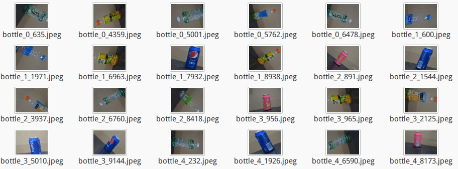

# 数据增强

图像增强，即增加训练样本的一种方法。以图像数据为例，常用的数据增强方法包括以下几种：

- 旋转 | 反射变换(Rotation/reflection): 随机旋转图像一定角度; 改变图像内容的朝向;

- 翻转变换(flip): 沿着水平或者垂直方向翻转图像;

- 缩放变换(zoom): 按照一定的比例放大或者缩小图像;

- 平移变换(shift): 在图像平面上对图像以一定方式进行平移;

- 尺度变换(scale): 对图像按照指定的尺度因子, 进行放大或缩小; 或者参照SIFT特征提取思想, 利用指定的尺度因子对图像滤波构造尺度空间. 改变图像内容的大小或模糊程度;

- 对比度变换(contrast): 在图像的HSV颜色空间，改变饱和度S和V亮度分量，保持色调H不变. 对每个像素的S和V分量进行指数运算(指数因子在0.25到4之间), 增加光照变化;

- **噪声扰动(noise):** 对图像的每个像素RGB进行随机扰动, 常用的噪声模式是椒盐噪声和高斯噪声;

- 颜色变换(color): 在训练集像素值的RGB颜色空间进行PCA, 得到RGB空间的3个主方向向量,3个特征值, p1, p2, p3, λ1, λ2, λ3. 对每幅图像的每个像素$${I_x}*y = {[I^R*{xy}, I^G*{xy}, I^B*{xy}]}^T$$进行加上如下的变化:
  $$
  [p1,p2,p3][α1λ1,α2λ2,α3λ3]^T
  $$
  其中:αi是满足均值为0,方差为0.1的随机变量.


### 代码实现

在keras中，数据增强可通过keras.preprocessing.image.ImageGenerator实现。

示例：

```python
from keras.preprocessing.image import ImageDataGenerator

datagen = ImageDataGenerator(
        rotation_range=40,
        width_shift_range=0.2,
        height_shift_range=0.2,
        rescale=1./255,
        shear_range=0.2,
        zoom_range=0.2,
        horizontal_flip=True,
        fill_mode='nearest')
```

- `rotation_range`是一个0~180的度数，用来指定随机选择图片的角度。
- `width_shift`和`height_shift`用来指定水平和竖直方向随机移动的程度，这是两个0~1之间的比例。
- `rescale`值将在执行其他处理前乘到整个图像上，我们的图像在RGB通道都是0~255的整数，这样的操作可能使图像的值过高或过低，所以我们将这个值定为0~1之间的数。
- `shear_range`是用来进行剪切变换的程度
- `zoom_range`用来进行随机的放大
- `horizontal_flip`随机的对图片进行水平翻转，这个参数适用于水平翻转不影响图片语义的时候
- `fill_mode`用来指定当需要进行像素填充，如旋转，水平和竖直位移时，如何填充新出现的像素

```python
datagen = ImageDataGenerator(
    rotation_range=40,
    width_shift_range=0.2,
    height_shift_range=0.2,
    shear_range=0.2,
    zoom_range=0.2,
    horizontal_flip=True,
    fill_mode='nearest')

generator = datagen.flow_from_directory(
    'data/drinking_bottle/train',
    target_size=(240, 320),
    batch_size=8,
    class_mode=None,  # this means our generator will only yield batches of data, no labels
    shuffle=False)
```




