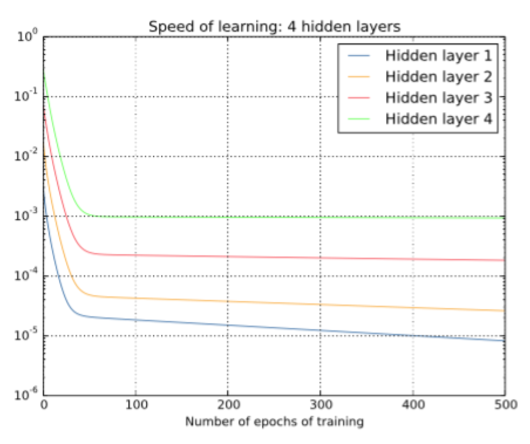
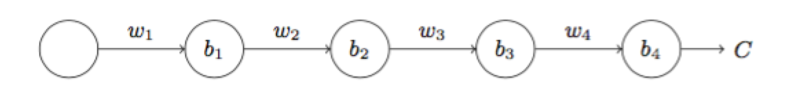
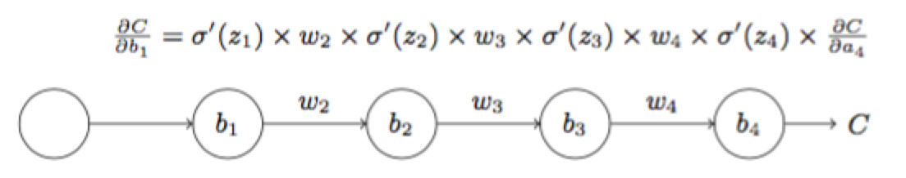
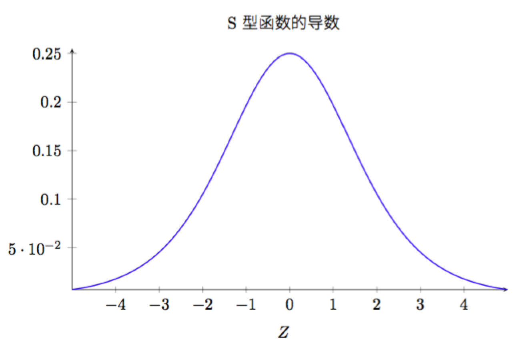
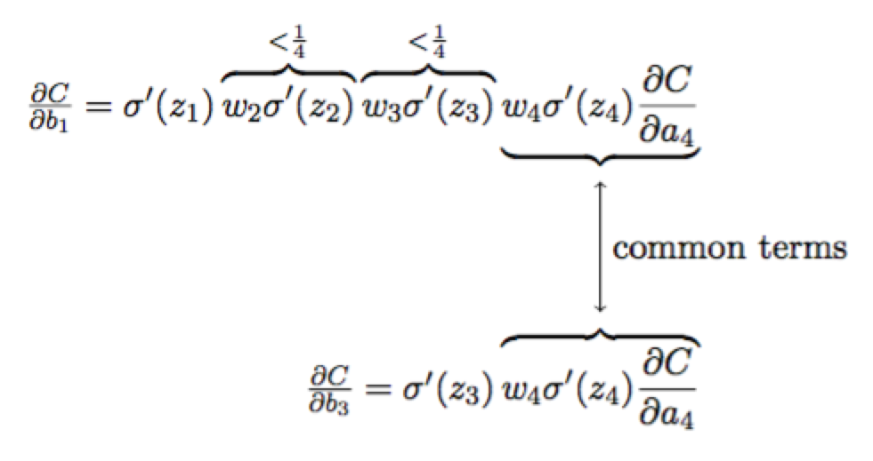

# 如何防止梯度消失和梯度爆炸

对于一个具有四个隐层的神经网络，各隐藏层的学习速率曲线如下：

可以看出，第一层的学习速度和最后一层要差两个数量级，也就是比第四层慢了100倍。**更加一般地说，在深度神经网络中的梯度是不稳定的，在前面的层中或会消失，或会激增，这种不稳定性才是深度神经网络中基于梯度学习的根本原因。**

### 梯度消失的原因

为了弄清楚为何会出现消失的梯度，来看看一个极简单的深度神经网络：每一层都只有一个单一的神经元。下面就是有三层隐藏层的神经网络：

我们把梯度的整个表达式写出来：

为了理解每个项的行为，先看下sigmoid函数导数的曲线：

该导数在σ′(0)=1/4时达到最高。现在，如果我们使用标准方法来初始化网络中的权重，那么会使用一个均值为0标准差为1的高斯分布。因此所有的权重通常会满足|ωj|<1。有了这些信息，我们发现会有$w_j\sigma^{'(z_j)}<1/4$，并且在进行所有这些项的乘积时，最终结果肯定会指数级下降：项越多，乘积的下降也就越快。

下面我们从公式上比较一下第三层和第一层神经元的学习速率：

比较一下∂C/∂b1和∂C/∂b3可知，∂C/∂b1要远远小于∂C/∂b3。 **因此，梯度消失的本质原因是：ωjθ′(zj)<1/4的约束。**

梯度激增问题：网络的权重设置的比较大且偏置使得σ′(zj)σ′(zj)项不会太小。

**不稳定的梯度问题**：根本的问题其实并非是小时的梯度问题或者激增的梯度问题，而是在前面的层上的梯度是来自后面的层上项的乘积。当存在过多的层次时，就出现了内在本质上的不稳定场景。唯一让所有层都接近相同的学习速度的方式是所有这些项的乘积都能得到一种平衡。如果没有某种机制或者更加本质的保证来达成平衡，那网络就很容易不稳定了。简而言之，真实的问题就是神经网络受限于不稳定梯度的问题。所以，如果我们使用标准的基于梯度的学习算法，在网络中的不同层会出现按照不同学习速度学习的情况。

### 解决方法

1. 激活函数改用ReLU
2. Batch Normalization

