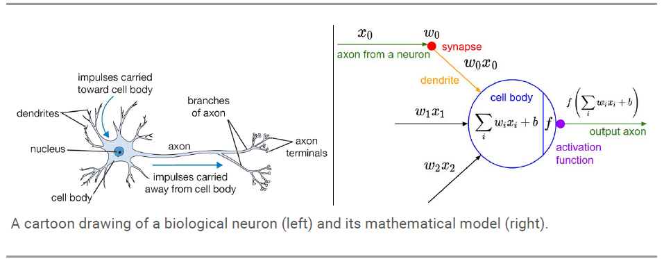
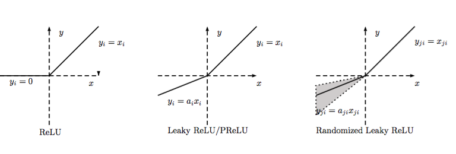

# 激活函数（Activation）

1. 什么是激活函数？
2. 为什么使用激活函数？
3. 激活函数有哪些，即各自的特点？
4. 如何选用激活函数？

## 激活函数的理解

首先，激活函数不是真的要去激活什么。在神经网络中，激活函数的作用是能够给神经网络加入一些非线性因素，使得神经网络可以更好地解决较为复杂的问题。

加拿大蒙特利尔大学的Bengio教授在 ICML 2016 的文章[1]中给出了激活函数的定义：激活函数是映射 h:R→R，且几乎处处可导。

### 饱和

当一个激活函数h(x)满足
$$
\lim_{n\rightarrow +\infty}h^{'}(x)=0
$$
时我们称之为**右饱和**。同时，当一个激活函数h(x)满足
$$
\lim_{n\rightarrow -\infty}h^{'}(x)=0
$$
时我们称之为**左饱和**。当一个激活函数，既满足左饱和又满足又饱和时，我们称之为**饱和**。

激活函数的特点：

- **非线性：** 当激活函数是线性的时候，一个两层的神经网络就可以逼近基本上所有的函数了。但是，如果激活函数是恒等激活函数的时候（即f(x)=x），就不满足这个性质了，而且如果MLP使用的是恒等激活函数，那么其实整个网络跟单层神经网络是等价的。
- **可微性：** 当优化方法是基于梯度的时候，这个性质是必须的。
- **单调性：** 当激活函数是单调的时候，单层网络能够保证是凸函数。
- **f(x)≈x：** 当激活函数满足这个性质的时候，如果参数的初始化是random的很小的值，那么神经网络的训练将会很高效；如果不满足这个性质，那么就需要很用心的去设置初始值。
- **输出值的范围：** 当激活函数输出值是 **有限** 的时候，基于梯度的优化方法会更加 **稳定**，因为特征的表示受有限权值的影响更显著；当激活函数的输出是 **无限** 的时候，模型的训练会更加高效，不过在这种情况小，一般需要更小的learning rate.

## 为什么使用激活函数？

如果不用激励函数（其实相当于激励函数是f(x) = x），在这种情况下每一层输出都是上层输入的线性函数，很容易验证，无论你神经网络有多少层，输出都是输入的线性组合，与*没有*隐藏层效果相当，这种情况就是*最原始的感知机*（Perceptron）了。

激活函数为网络提供了非线性建模能力，假设一个示例神经网络中仅包含线性卷积和全连接运算，那么该网络仅能够表达线性映射，即便增加网络的深度也依旧还是线性映射，难以有效建模实际环境中非线性分布的数据。加入（非线性）激活函数之后，深度神经网络才具备了分层的非线性映射学习能力。因此，激活函数是深度神经网络中不可或缺的部分。

## 常用的激活函数

### Sigmod函数

Sigmoid函数曾被广泛地应用，但由于其自身的一些缺陷，现在很少被使用了。Sigmoid函数被定义为：
$$
f(x) = \frac{1}{1+e^{-x}}
$$
函数对应的图像为：

**优点：**

1. Sigmoid函数的输出映射在(0,1)之间，单调连续，输出范围有限，优化稳定，可以用作输出层。
2. 求导容易。

**缺点：**

1. 由于其软饱和性，容易产生梯度消失，导致训练出现问题。

2. 其输出并不是以0为中心的。这会导致后一层的神经元将得到上一层输出的非0均值的信号作为输入。 

   产生的一个结果就是：如果数据进入神经元的时候是正的(e.g. x>0 elementwise in f=wTx+b)，那么 w 计算出的梯度也会始终都是正的。 

### tanh

tanh与sigmod类似，其关系为：
$$
tanh(x) = 2sigmod(2x) - 1
$$
与 sigmoid 不同的是，tanh 是0均值的。因此，实际应用中，tanh 会比 sigmoid 更好。

### ReLU

ReLU是最近几年非常受欢迎的激活函数。被定义为:
$$
y = \cases{0& (x >=0) \cr x&  (x<0)}
$$
对应的图像为：

**优点：**

1. 相比起Sigmoid和tanh，ReLU在SGD中能够快速收敛。例如在下图的实验中，在一个四层的卷积神经网络中，实线代表了ReLU，虚线代表了tanh，ReLU比起tanh更快地到达了错误率0.25处。据称，这是因为它线性、非饱和的形式。
2. Sigmoid和tanh涉及了很多很expensive的操作（比如指数），ReLU可以更加简单的实现。
3. 有效缓解了梯度消失的问题。
4. 在没有无监督预训练的时候也能有较好的表现。
5. 提供了神经网络的稀疏表达能力。Relu会使一部分神经元的输出为0，这样就造成了网络的稀疏性，并且减少了参数的相互依存关系，缓解了过拟合问题的发生

**缺点：**

1. 随着训练的进行，可能会出现神经元死亡，权重无法更新的情况。如果发生这种情况，那么流经神经元的梯度从这一点开始将永远是0。也就是说，ReLU神经元在训练中不可逆地死亡了。
2. 输出具有偏移现象，即输出均值恒大于零。偏移现象和 神经元死亡会共同影响网络的收敛性。

### LReLU、PReLU与RReLU

通常在LReLU和PReLU中，我们定义一个激活函数为
$$
f(y_i) = \cases{y_i & if(y_i) > 0 \cr a_iy_i & if(y_i <=0)}
$$
**-LReLU**
当aiai比较小而且固定的时候，我们称之为LReLU。LReLU最初的目的是为了避免梯度消失。但在一些实验中，我们发现LReLU对准确率并没有太大的影响。很多时候，当我们想要应用LReLU时，我们必须要非常小心谨慎地重复训练，选取出合适的aa，LReLU的表现出的结果才比ReLU好。因此有人提出了一种自适应地从数据中学习参数的PReLU。

**-PReLU**
PReLU是LReLU的改进，可以自适应地从数据中学习参数。PReLU具有收敛速度快、错误率低的特点。PReLU可以用于反向传播的训练，可以与其他层同时优化。

## 如何选择激活函数

根据模型的实际情况、复杂程度，结合每种激活函数的优缺点选择。

参考文献：

http://www.cnblogs.com/rgvb178/p/6055213.html

https://www.zhihu.com/question/29021768

https://zhuanlan.zhihu.com/p/22142013

http://blog.csdn.net/cyh_24/article/details/50593400

