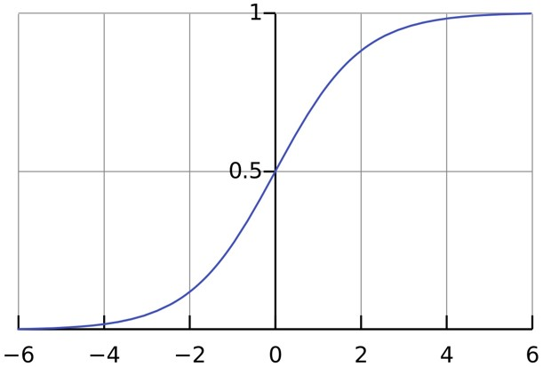

# 回归

- 线性回归
  - 定义
  - 最小二乘法的本质
- Logistics回归
- 工具
  - 梯度下降算法
  - 极大似然估计

### 线性回归

定义式：

$y=ax+b$

$h_{\theta}(x)=\theta_0 + \theta_1x_1+\theta_2x_2$

$h_{\theta}(x)=\sum_{i=1}^n\theta_ix_i=\theta^TX$

其中，X与θ都是列向量。

 给定一系列样本与观测值，现在来拟合参数θ，那么什么样的参数才算是好的呢？总该有一个判断标准吧，因此，因此有了**损失函数**： 
$$
J(\theta)=\frac{1}{2m}\sum_{i=1}^m(h_{\theta}(x_i)-y_i)^2
$$
上式为建立最小二乘的目标公式，$h_{\theta}(x_i)$表示样本$x_i$的理论值，$y_i$表示观测值。1/2只是为了后面计算方便添加，不会对整体产生影响。

### 用极大似然估计来解释最小二乘

我们假设观测值与理论值是有误差的，那么我们可以定义如下公式，其中$\epsilon_i$表示样本$x_i$的误差。
$$
y_i = \theta^T* x_i +\epsilon_i \tag{1}
$$
中心极限定理指出，大量相互独立的随机变量，其均值的分布以正态分布为极限。中心极限定理指出了大量随机变量之和近似服从正态分布的条件。实际问题中，很多随机现象可以看做众多因素的独立影响的综合反应，往往近似服从正态分布。这里假设误差是符合高斯分布的，且期望为0。误差既然符合高斯分布，那么我们可写出它的概率公式： 
$$
p(\epsilon_i)=\frac{1}{\sqrt{2\pi \sigma}}\exp^{-\frac{\epsilon_i^2}{2\sigma^2}} \tag{2}
$$
由（1）式得$\epsilon_i = y_i-\theta^Tx_i$，所以：
$$
p(y_i) = p( \theta^T* x_i +\epsilon_i ) =\frac{1}{\sqrt{2\pi \sigma}}\exp^{-\frac{(y_i-\theta^Tx_i)^2}{2\sigma^2}}
$$
现在总共有m个样本，那么根据极大似然估计，列出似然函数
$$
L(\theta) = \prod_{i=1}^m p(y_i)= \prod_{i-1}^m \frac{1}{\sqrt{2\pi \sigma}}\exp^{-\frac{(y_i-\theta^Tx_i)^2}{2\sigma^2}}
$$
对似然函数求对数，得: 
$$
\log L(\theta) = \sum_{i=1}^m \frac{1}{\sqrt{2\pi \sigma}}\exp^{-\frac{(y_i-\theta^Tx_i)^2}{2\sigma^2}}
=m\log \frac{1}{\sqrt{2\pi \sigma}}-\frac{1}{\sigma^2}*\frac{1}{2}\sum_{i=1}^m(y_i-\theta^Tx_i)^2
$$
想要让似然函数取得最大值，则损失函数必须要取得最小值，最小二乘法得到解释。

> 最大似然估计，就是**利用已知的样本结果**，**反推最有可能（最大概率）导致这样结果的参数值。**


### Logistics回归

Logistics回归虽然名字叫回归，但其实际上是一种分类方法，且是二分类。

定义：
$$
h_{\theta}(x) = g(\theta^Tx) = \frac{1}{1+e^{-\theta^Tx}}
$$
$g(z) = \frac{1}{1+e^{-z}}$



Logistics的参数估计：


要求$L(\theta)$的最大值，根据梯度下降法，得参数的更新值：
$$
\theta_j:=\theta_j+\alpha(y^i -h_{\theta}(x^i))x_j^i
$$
Python代码实现：

```python
#################################################  
# logRegression: Logistic Regression  
# Author : zouxy  
# Date   : 2014-03-02  
# HomePage : http://blog.csdn.net/zouxy09  
# Email  : zouxy09@qq.com  
#################################################  
  
from numpy import *  
import matplotlib.pyplot as plt  
import time  
  
  
# calculate the sigmoid function  
def sigmoid(inX):  
    return 1.0 / (1 + exp(-inX))  
  
  
# train a logistic regression model using some optional optimize algorithm  
# input: train_x is a mat datatype, each row stands for one sample  
#        train_y is mat datatype too, each row is the corresponding label  
#        opts is optimize option include step and maximum number of iterations  
def trainLogRegres(train_x, train_y, opts):  
    # calculate training time  
    startTime = time.time()  
  
    numSamples, numFeatures = shape(train_x)  
    alpha = opts['alpha']; maxIter = opts['maxIter']  
    weights = ones((numFeatures, 1))  
  
    # optimize through gradient descent algorilthm  
    for k in range(maxIter):  
        if opts['optimizeType'] == 'gradDescent': # gradient descent algorilthm  
            output = sigmoid(train_x * weights)  
            error = train_y - output  
            weights = weights + alpha * train_x.transpose() * error  
        elif opts['optimizeType'] == 'stocGradDescent': # stochastic gradient descent  
            for i in range(numSamples):  
                output = sigmoid(train_x[i, :] * weights)  
                error = train_y[i, 0] - output  
                weights = weights + alpha * train_x[i, :].transpose() * error  
        elif opts['optimizeType'] == 'smoothStocGradDescent': # smooth stochastic gradient descent  
            # randomly select samples to optimize for reducing cycle fluctuations   
            dataIndex = range(numSamples)  
            for i in range(numSamples):  
                alpha = 4.0 / (1.0 + k + i) + 0.01  
                randIndex = int(random.uniform(0, len(dataIndex)))  
                output = sigmoid(train_x[randIndex, :] * weights)  
                error = train_y[randIndex, 0] - output  
                weights = weights + alpha * train_x[randIndex, :].transpose() * error  
                del(dataIndex[randIndex]) # during one interation, delete the optimized sample  
        else:  
            raise NameError('Not support optimize method type!')  
      
  
    print 'Congratulations, training complete! Took %fs!' % (time.time() - startTime)  
    return weights  
  
  
# test your trained Logistic Regression model given test set  
def testLogRegres(weights, test_x, test_y):  
    numSamples, numFeatures = shape(test_x)  
    matchCount = 0  
    for i in xrange(numSamples):  
        predict = sigmoid(test_x[i, :] * weights)[0, 0] > 0.5  
        if predict == bool(test_y[i, 0]):  
            matchCount += 1  
    accuracy = float(matchCount) / numSamples  
    return accuracy  
  
  
# show your trained logistic regression model only available with 2-D data  
def showLogRegres(weights, train_x, train_y):  
    # notice: train_x and train_y is mat datatype  
    numSamples, numFeatures = shape(train_x)  
    if numFeatures != 3:  
        print "Sorry! I can not draw because the dimension of your data is not 2!"  
        return 1  
  
    # draw all samples  
    for i in xrange(numSamples):  
        if int(train_y[i, 0]) == 0:  
            plt.plot(train_x[i, 1], train_x[i, 2], 'or')  
        elif int(train_y[i, 0]) == 1:  
            plt.plot(train_x[i, 1], train_x[i, 2], 'ob')  
  
    # draw the classify line  
    min_x = min(train_x[:, 1])[0, 0]  
    max_x = max(train_x[:, 1])[0, 0]  
    weights = weights.getA()  # convert mat to array  
    y_min_x = float(-weights[0] - weights[1] * min_x) / weights[2]  
    y_max_x = float(-weights[0] - weights[1] * max_x) / weights[2]  
    plt.plot([min_x, max_x], [y_min_x, y_max_x], '-g')  
    plt.xlabel('X1'); plt.ylabel('X2')  
    plt.show()  
```

测试代码：

```python
#################################################  
# logRegression: Logistic Regression  
# Author : zouxy  
# Date   : 2014-03-02  
# HomePage : http://blog.csdn.net/zouxy09  
# Email  : zouxy09@qq.com  
#################################################  
  
from numpy import *  
import matplotlib.pyplot as plt  
import time  
  
def loadData():  
    train_x = []  
    train_y = []  
    fileIn = open('E:/Python/Machine Learning in Action/testSet.txt')  
    for line in fileIn.readlines():  
        lineArr = line.strip().split()  
        train_x.append([1.0, float(lineArr[0]), float(lineArr[1])])  
        train_y.append(float(lineArr[2]))  
    return mat(train_x), mat(train_y).transpose()  
  
  
## step 1: load data  
print "step 1: load data..."  
train_x, train_y = loadData()  
test_x = train_x; test_y = train_y  
  
## step 2: training...  
print "step 2: training..."  
opts = {'alpha': 0.01, 'maxIter': 20, 'optimizeType': 'smoothStocGradDescent'}  
optimalWeights = trainLogRegres(train_x, train_y, opts)  
  
## step 3: testing  
print "step 3: testing..."  
accuracy = testLogRegres(optimalWeights, test_x, test_y)  
  
## step 4: show the result  
print "step 4: show the result..."    
print 'The classify accuracy is: %.3f%%' % (accuracy * 100)  
showLogRegres(optimalWeights, train_x, train_y)   
```


 (a)梯度下降算法迭代500次。(b)随机梯度下降算法迭代200次。(c)改进的随机梯度下降算法迭代20次。(d)改进的随机梯度下降算法迭代200次。


### Softmax回归

同样是一个分类的方法， 不同适用于k分类。

