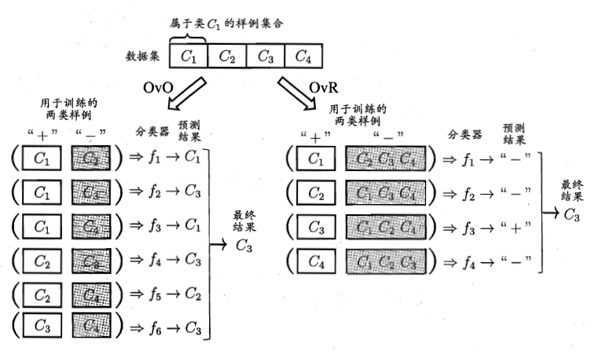

## 线性模型

### 基本形式

给定由d个属性描述的示例
$$
f(x) = w_1x_1 + w_2x_2 + ...+w_dx_d + b
$$
一般用向量形式写成：
$$
f(x) = w^x + b
$$

### 线性回归

给定数据集$D = {(x_1,y_1),(x_2,y_2),...,(x_m,y_m)}$，线性回归（linear regression）试图学得一个线性模型以敬克能准确地预测实值输出标记。即：
$$
f(x_i) = wx_i+b，使得f(x_i)\approx y_i
$$
如何确定w和b，显然关键在于如何衡量f(x)与y之间的关系。使用均方误差作为性能度量，即：
$$
(w^*,b^*)=arg\;min_{(w,b)}\sum_{i=1}^m(f(x_i)-y_i)^2\\
=arg\;min_{(w,b)}\sum_{i=1}^m(y_i-wx_i-b)^2.
$$
最小二乘法就是试图找到一条之心啊，使所有样本到直线上的欧式距离之和最小。

若要做的是分类任务，则需找一个单调可微函数将分类任务的的真实标记y与线性回归的预测值联系起来。在二分类任务中，其输出标记为$y\in \{0,1\}$，而线性模型产生的预测值$z=wx+b$是实值，于是需要将z转换为0/1值，最理想的是“单位阶跃函数”，但其不连续不可导，因此使用“对数几率函数”替代，即“sigmod”函数：
$$
y=\frac{1}{1+e^{-z}}
$$
对数几率回归（logistic regression），即逻辑回归，虽然名字是“回归”，但其实际却是一种分类学习方法。其优点有：

* 直接对分类可能性进行建模，无需实先假设数据分布；
* 不仅可预测出类别，还可得到相应类型的概率。

### 线性判别分析

线性判别分析（Linear Discriminant Analysis，LDA）是一种经典的线性学习方法。其思想为：给定训练样例集，设法将样例集投影到一条直线上，使得同类样例的投影点尽可能接近，异类样例的投影点尽可能远离；在对新样本进行分类时，将其投影到同样的这条直线上，根据投影点的位置确定样本的类别。如下图所示。

LDA可从贝叶斯决策理论的角度阐释，并可证明，当两类数据同先验，满足高斯分布且协方差相等时，LDA可达到最优分类。

### 多分类学习

多分类学习的基本思路：拆解法，即将多分类任务拆解为多个二分类任务求解。

难点： 

* 如何对任务进行拆分
* 如何对多个分类器进行集成

典型的拆分策略：一对一(OvO)、一对其余(OvR)、一对多(MvM)

OvO和OvR是MvM的特例。

### 类别不平衡问题

指分类任务中不同类别的训练样例数目差别很大的情况。

#### 再缩放（rescaling）

当我们用$y=w^Tx+b$对新样本$x$进行分类时，事实上是在用预测出的y值与一个阈值进行比较。当y>0.5时判为正例，反之为反例。即：
$$
if: \frac{y}{1-y}>1, then 预测为正例
$$
然而训练集中正、反样本数目不同时，分别用$m^+、m^-$表示正、反例数目，则观测几率为$\frac{m^+}{m^-}$，由于通常假设**训练集是真实样本的总体的无偏采样**，因此观测几率就代表了真实几率。因此：
$$
if\  \frac{y}{1-y} > \frac{m^+}{m^-},then 预测为正例
$$
即：
$$
if\ \frac{y^\'}{1-y^\'}=\frac{y}{1-y}\times \frac{m^-}{m^+}>1, then 预测为正例.
$$
实际应用中，**训练集是真实样本总体的无偏采样**这个假设往往不成立，因此主要有三种措施：

* 欠采样。去除一些反例，使正、反例数目接近。
* 过采样
* 阈值移动

**无偏性**：一个估计量的第一重要性质就是关于它的期望值。若$\theta$的估计量W对一切可能的$\theta$值，都有$E(W)=\theta$，则W是一个无偏估计量。估计值在估参数的真值附近摆动，对待估参数的真值无偏倚。从分析测试的观点看，无偏性以为这测定的准确度。
