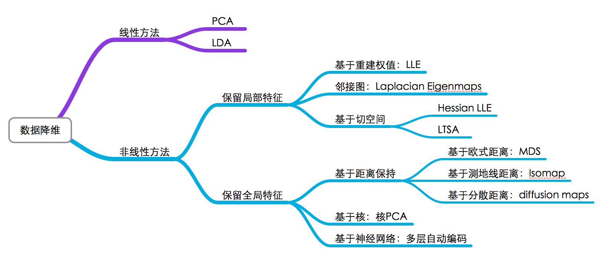

# 主成分分析法

Principal Component Analysis(PCA)是最常用的线性降维方法，它的目标是通过某种线性投影，将高维的数据映射到低维的空间中表示，并期望在所投影的维度上数据的方差最大，以此使用较少的数据维度，同时保留住较多的原数据点的特性。

通俗的理解，如果把所有的点都映射到一起，那么几乎所有的信息（如点和点之间的距离关系）都丢失了，而如果映射后方差尽可能的大，那么数据点则会分散开来，以此来保留更多的信息。可以证明，PCA是丢失原始数据信息最少的一种线性降维方式。（实际上就是最接近原始数据，但是PCA并不试图去探索数据内在结构）

简单来说，就是将数据从原始的空间中转换到新的特征空间中，例如原始的空间是三维的(x,y,z)，x、y、z分别是原始空间的三个基，我们可以通过某种方法，用新的坐标系(a,b,c)来表示原始的数据，那么a、b、c就是新的基，它们组成新的特征空间。在新的特征空间中，可能所有的数据在c上的投影都接近于0，即可以忽略，那么我们就可以直接用(a,b)来表示数据，这样数据就从三维的(x,y,z)降到了二维的(a,b)。

### 计算方法

1. 零均值化

   假如原始数据集为矩阵dataMat，dataMat中每一行代表一个样本，每一列代表同一个特征。零均值化就是求每一列的平均值，然后该列上的所有数都减去这个均值。也就是说，这里零均值化是对每一个特征而言的，零均值化都，每个特征的均值变成0。

   ```python
   # 函数中用numpy中的mean方法来求均值，axis=0表示按列求均值。
   # 该函数返回两个变量，newData是零均值化后的数据，meanVal是每个特征的均值，是给后面重构数据用的。
   def zeroMean(dataMat):        
       meanVal=np.mean(dataMat,axis=0)     #按列求均值，即求各个特征的均值  
       newData=dataMat-meanVal  
       return newData,meanVal  
   ```

2. 求协方差矩阵

   ```python
   newData,meanVal=zeroMean(dataMat)  
   covMat=np.cov(newData,rowvar=0)  
   ```

   numpy中的cov函数用于求协方差矩阵，参数rowvar很重要！若rowvar=0，说明传入的数据一行代表一个样本，若非0，说明传入的数据一列代表一个样本。因为newData每一行代表一个样本，所以将rowvar设置为0。covMat即所求的协方差矩阵。

3. 求特征值、特征矩阵

   调用numpy中的线性代数模块linalg中的eig函数，可以直接由covMat求得特征值和特征向量：

   ```python
   eigVals,eigVects=np.linalg.eig(np.mat(covMat))  
   ```

   eigVals存放特征值，行向量。eigVects存放特征向量，每一列代表一个特征向量。特征值和特征向量是一一对应的

4. 保留主要的成分

   第三步得到了特征值向量eigVals，假设里面有m个特征值，我们可以对其排序，排在前面的n个特征值所对应的特征向量就是我们要保留的，它们组成了新的特征空间的一组基n_eigVect。将零均值化后的数据乘以n_eigVect就可以得到降维后的数据。代码如下：

   ```python
   eigValIndice=np.argsort(eigVals)            #对特征值从小到大排序  
   n_eigValIndice=eigValIndice[-1:-(n+1):-1]   #最大的n个特征值的下标  
   n_eigVect=eigVects[:,n_eigValIndice]        #最大的n个特征值对应的特征向量  
   lowDDataMat=newData*n_eigVect               #低维特征空间的数据  
   reconMat=(lowDDataMat*n_eigVect.T)+meanVal  #重构数据  
   return lowDDataMat,reconMat  
   ```

总体代码如下 ：

```python
#零均值化  
def zeroMean(dataMat):        
    meanVal=np.mean(dataMat,axis=0)     #按列求均值，即求各个特征的均值  
    newData=dataMat-meanVal  
    return newData,meanVal  
  
def pca(dataMat,n):  
    newData,meanVal=zeroMean(dataMat)  
    covMat=np.cov(newData,rowvar=0)    
      
    eigVals,eigVects=np.linalg.eig(np.mat(covMat))
    eigValIndice=np.argsort(eigVals)            #对特征值从小到大排序  
    n_eigValIndice=eigValIndice[-1:-(n+1):-1]   #最大的n个特征值的下标  
    n_eigVect=eigVects[:,n_eigValIndice]        #最大的n个特征值对应的特征向量  
    lowDDataMat=newData*n_eigVect               #低维特征空间的数据  
    reconMat=(lowDDataMat*n_eigVect.T)+meanVal  #重构数据  
    return lowDDataMat,reconMat  
```

图像处理的结果：


用sklearn的PCA与我们的pca做个比较：

```python
from sklearn.decomposition import PCA
X = np.array([[-1, 1], [-2, -1], [-3, -2], [1, 1], [2, 1], [3, 2]])
pca=PCA(n_components=1)
pca.fit(X)
pca.transform(X)
```