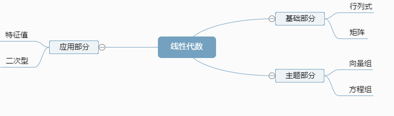
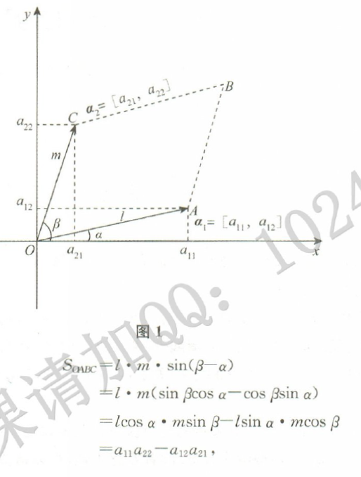

# 整体概述

### 行列式

2阶行列式是由两个2维向量组成的，其（运算规则的）结果为以这两个向量为邻边的平行四边形的面积。

同理，对于n阶行列式由n个n维向量$\alpha_1=[a_{11}, a_{12},...,a_{1n}],\alpha_2=[a_{21}, a_{2},...,a_{2n}],\alpha_n=[a_{n1}, a_{n2},...,a_{nn}]$组成，其结果是以这n个向量为邻边的n维图形的体积。

### 矩阵

重要观点：

1. 矩阵也是由若干个行（列）向量拼成的；
2. 矩阵不能运算，但其若干个行（列）向量之间存在着某种联系，这种关系反映了矩阵的本质——秩

### 向量

向量主要看向量间的关系——是否线性相关，找极大线性无关组，这个组就是向量组的代表，“代表”的个数就是地理的个数，这个个数就叫做之。

方程组和向量组是同一个问题的两种表现形式，所以解决方法也一样。求解线性方程组，就是对增广矩阵作初等行变换，化成阶梯形矩阵，然后求解，这个基本方法贯穿整个线性代数。

对于方程组有无穷多解时，如何表示出所有的解？这又是某个（无穷）向量组用什么“代表”来表示的问题，这个代表就是基础解系。解方程组所得到的的解$x_1, x_2,..,x_n$就是描述向量与向量之间关系的表示系数。

### 向量空间

齐次线性方程组的解向量是$[x_1,x_2,..,x_n]^T$，其全部解的集合就是一个向量组，也叫做解空间，这个解空间就是一个向量空间。向量空间的基就是向量组中极大线性无关组，还是“代表”问题，空间的维数就是基的个数，就是矩阵或者向量组的秩的问题。

求一个向量在一组基下的坐标表示，就是解决一个非齐次方程组的问题,坐标就是方程组的解。

综上，以下三个问题是等价的：

1. 求非齐次方程组的解；
2. 求一个向量由一组向量线性表示的系数；
3. 求一个向量在一组基下坐标

### 二次型化为标准型

目的：如何把一个二次齐次式的复杂表示（含有交叉项）通过变换得到简单表示（只含平方项），这种变换的实质就是用正交变换把实对称矩阵相似对角化。