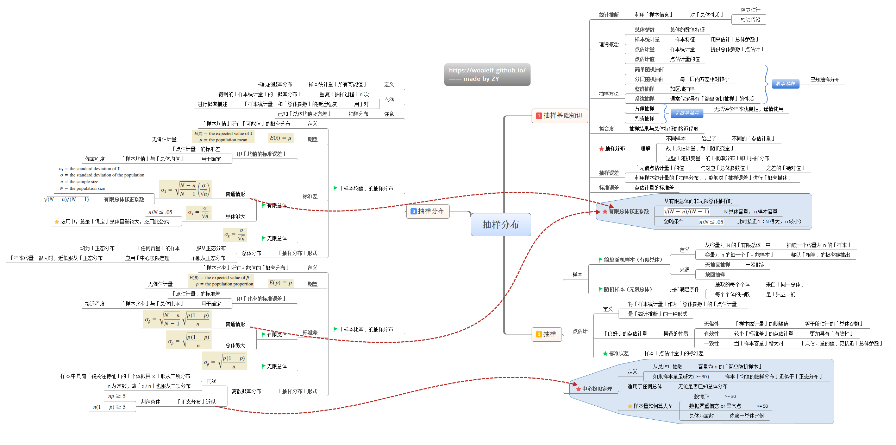

# 抽样分布

### 抽样方法

#### 随机抽样

将调查总体全部观察单位编号，再用抽签法或随机数字表随机抽取部分观察单位组成样本。

优点：操作简单，均数、率及相应的标准误计算简单。 

缺点：总体较大时，难以一一编号。

#### 整群抽样

总体分群，再随机抽取几个群组成样本，群内全部调查。

优点：便于组织、节省经费。

缺点：抽样误差大于单纯随机抽样。

#### 分层抽样

先按对观察指标影响较大的某种特征，将总体分为若干个类别，再从每一层内随机抽取一定数量的观察单位，合起来组成样本。有按比例分配和最优分配两种方案。

优点：样本代表性好，抽样误差减少。

#### 系统抽样

又称机械抽样、等距抽样，即先将总体的观察单位按某一顺序号分成n个部分，再从第一部分随机抽取第k号观察单位，依次用相等间距，从每一部分各抽取一个观察单位组成样本。

优点：易于理解、简便易行。

缺点：总体有周期或增减趋势时，易产生偏性。

各种抽样方法的抽样误差一般是：**整群抽样≥单纯随机抽样≥系统抽样≥分层抽样**

参数是刻画总体某方面概率特性的数量。当此数量未知时,从总体抽出一个样本，用某种方法对这个未知参数进行估计就是参数估计。

例如，$X\sim N(\mu,\sigma^2)$，若$\mu, \sigma^2$未知，通过构造样本的函数,给出它们的**估计值**或**取值范围**就是参数估计的内容.

## 点估计

### 定义

设总体 X 的**分布函数形式已知**，但它的一个或多个参数为未知，借助于总体 X 的一个样本来估计总体未知参数的值的问题称为点估计问题.

一般提法：

设总体X的分布函数$F(x;\theta)$的形式为已知，$\theta$是待估参数，$X_1,X_2,...,X_n$是X的一个样本，$x_1,x_2,..,x_n$为相应的一个样本值。点估计的问题就是要构造一个适当的统计量$\hat{\theta}(X_1,X_2,..,X_n)$，用他的观察值$\hat{\theta}(x_1,x_2,..,x_n)$，来估计未知参数$\theta$。

$\hat{\theta}(X_1,X_2,..,X_n)$称为$\theta$的估计量

$\hat{\theta}(x_1,x_2,..,x_n)$称为$\theta$的估计值。

例题：

在某纺织厂细纱机上的断头次数X是一个随机变量，假设它服从以$\lambda>0$为参数的泊松分布，参数$\lambda$为未知，现检查了150只纱锭在某一时间段内断头的次数，数据如下，试估计参数$\lambda$。

解：先确定一个统计量$\bar{X}$，在计算出$\bar{X}$的观察值$\bar{x}$，把$\bar{x}$作为参数$\lambda$的估计值。

$\bar{x}=1.133$, $\lambda$的估计值为1.133

### 估计量的求法

构造估计量的方法

- 矩估计法
- 最大似然估计法

#### 矩估计

用样本矩来估计总体矩,用样本矩的连续函数来估计总体矩的连续函数,这种估计法称为矩估计法.

- 用样本均值估计总体均值E(X)，$\hat{E}(X)= \bar{X}$
- 用样本方差估计总体方差Var(X)，$\hat{V}ar(X)=S_n^2$
- 用样本的p分位数估计总体的p分位数;
- 用样本中位数估计总体中位数。 

