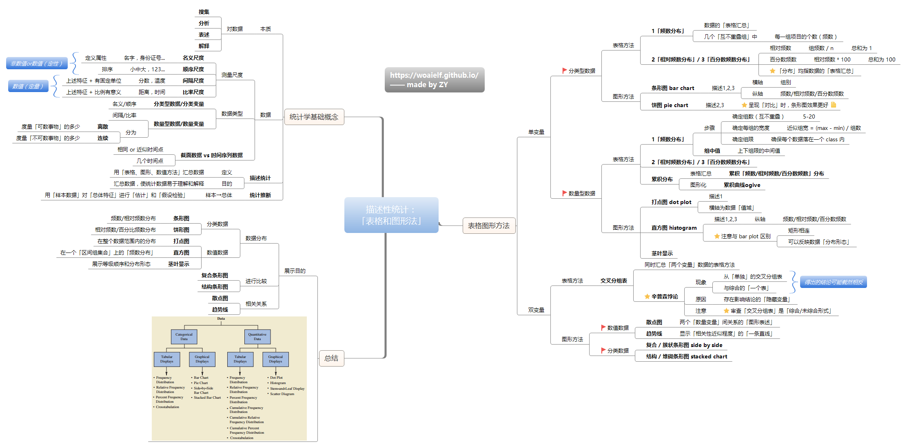
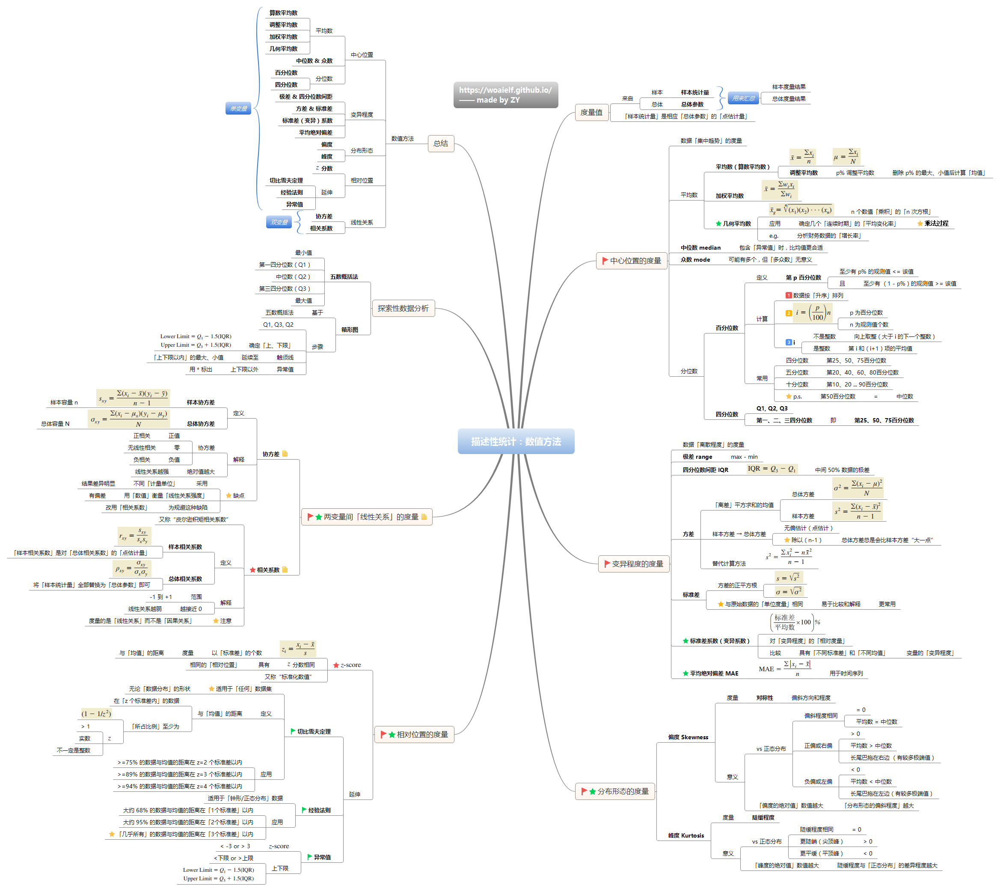
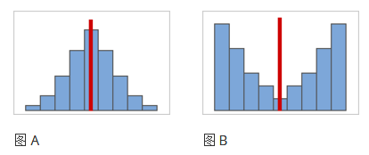
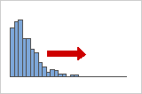
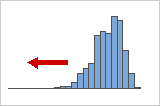
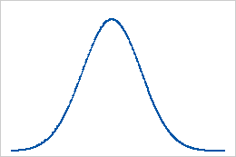
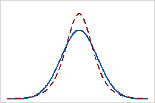
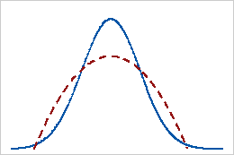

# 描述性统计

主要内容：

- [x]  中心位置
- [x]  变异程度
- [ ]  分布形态
- [ ]  相对位置
- [ ]  线性关系

描述性统计量：均值/平均值、方差、分布、直方图、概率质量函数、条件概率

- 平均值没办法了解数据之间的差异，于是有了方差
- 方差只能描述数据之间的差异，但无法描述数据的分布，于是有了分布和直方图
- 直方图没有办法套入数学公式体系进行快速推导，于是有了概率质量函数
- 概率质量函数没办法处理附加条件的情况，于是有了条件概率

### 分布形态的度量 - 偏度&峰度

偏度：偏度指的是数据不对称的程度。偏度值为 0、正数或负数可指示有关数据形状的信息。

对称或非偏斜分布

在数据变得更加对称时，其偏度值接近于零。如图 A 显示，根据定义，正态分布的数据显示出相对较小的偏度。通过沿正态数据这一直方图的中间绘制一条线，可以轻松地看到两侧互相构成镜像。只是无偏并不表示具有正态性。图 B 显示了一个分布，此分布的两侧仍然彼此构成镜像，但数据远非正态分布。

正或向右偏斜分布

对正偏斜或向右偏斜的数据这样命名是因为分布的“尾部”指向右侧，且因为其偏度值将大于 0（即为正）。工资数据往往以这种方式偏斜：一个公司中许多员工得到的工资相对较少，而越来越少的人得到非常高的工资。

负或向左偏斜分布

左倾斜或负倾斜数据之所以如此命名，是因为分布点的尾部指向左侧，且产生负偏度值。失效率数据通常向左偏斜。考虑灯泡：极少量的灯泡会立即烧坏，大多数灯泡会持续相当长的时间。

峰度表示分布的波峰和尾部与正态分布的区别。使用峰度可帮助您初步了解有关数据分布的一般特征。

基线：峰度值 0

完全服从正态分布的数据的峰度值为 0。正态分布数据建立峰度的基线。显著偏离 0 的样本峰度可指示该数据不是正态分布。

正峰度

具有正峰度值的分配表明，相比于比正态分布，该分布有更重的尾部和更陡的峰值。例如，遵循 T 分布的数据具有正峰度值。实线表示正态分布，虚线表示具有正峰度值的分布。

负峰度

具有负峰度值的分配表明，相比于比正态分布，该分布有更轻的尾部和更平坦的峰值。例如，遵循 Beta 分布（第一个和第二个形状参数等于 2）的数据具有负峰度值。实线表示正态分布，虚线表示具有负峰度值的分布。

### 相对位置的度量

z-score：以“标准差”的个数度量与“均值”的距离：
$$
z_i = \frac{x_i-\bar{x}}{s}
$$

#### 

