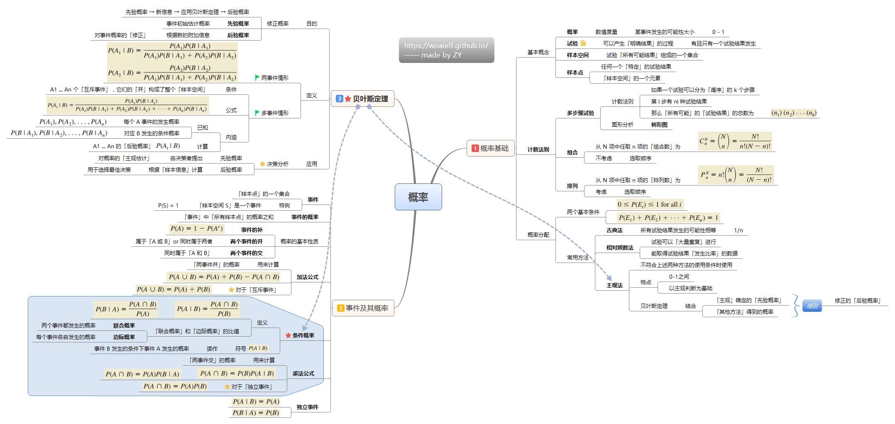
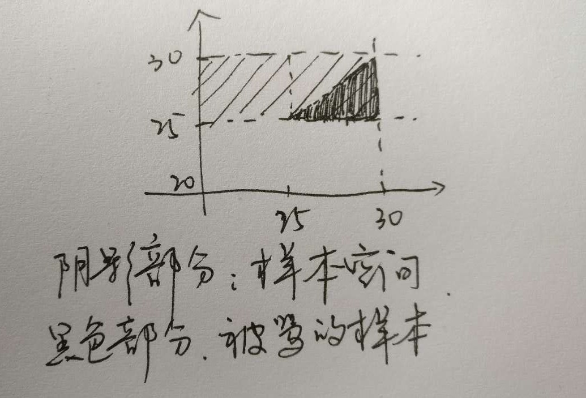
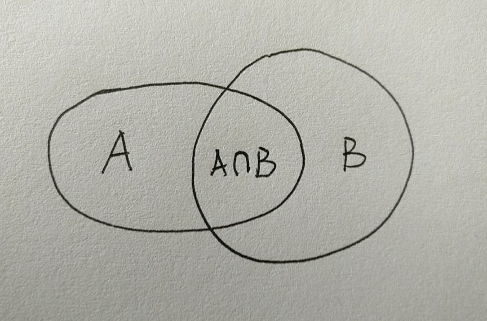
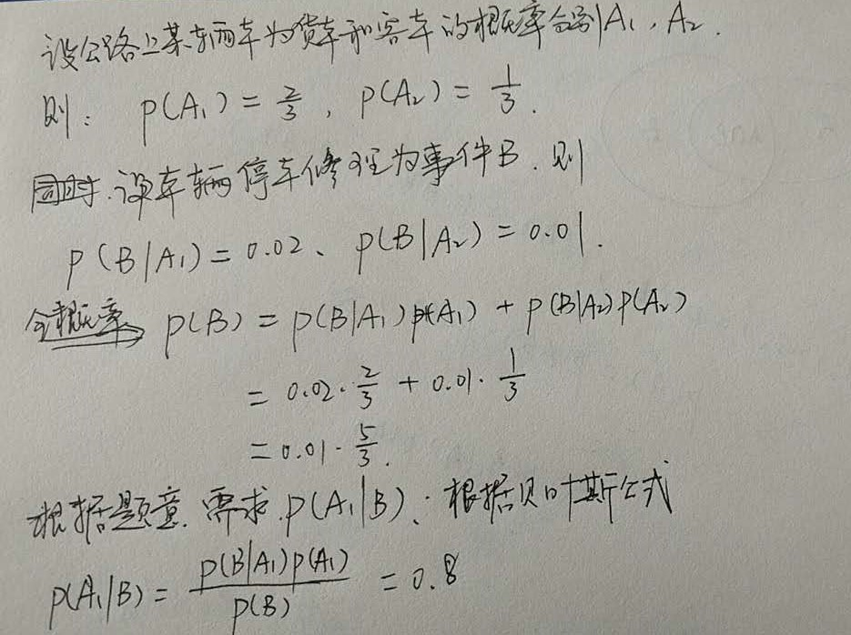

# 概率

重点：

- 独立事件
- 排列组合
- 古典概率
- 条件概率
- 全概率
- 贝叶斯定理

推导关系：

条件概率 => 全概率 => 贝叶斯定理



### 独立事件

事件A（或B）是否发生对事件B（A）发生的概率没有影响，这样的两个事件叫做相互独立事件。


### 排列组合

设$\pmatrix{N \cr n}=\frac{N!}{n!(N-n)!}$，则

排列数：
$$
P_n^N = n!\pmatrix{N \cr n} = \frac{N!}{(N-n)!}
$$
组合数：
$$
C_n^N = \pmatrix{N \cr n} = \frac{N!}{n!(N-n)!}
$$

#### 输出排列/组合的种类

对于给定的集合，输出由k个元素组成的全排列

```python
class Solution(object):
    def __init__(self):
        self.result = []

    def export_permutation(self, choices, k):
        def helper(choices, ls):
            if len(ls)==k:
                self.result.append(ls)
                return
            else:
                for i in range(len(choices)):
                    tmp = choices[:]
                    helper(tmp, ls+tmp.pop(i))

        choices = list(choices)
        helper(choices, "")

if __name__ == "__main__":
    s = Solution()
    s.export_permutation("0123", 3)
    print(s.result, len(s.result))
```

对于给定的集合，输出其k个元素组成的子集：

```python
class Solution(object):
    def export_combanations(self, choices, k):
            solution = [[]]
            for i in range(1, len(choices)+1):
                solution = solution + [s+[choices[i-1]] for s in solution]
            solution = [s for s in solution if len(s)==k ]
            return ["".join(s) for s in solution]

if __name__ == "__main__":
    s = Solution()
    print(s.export_combanations(list("012"), 1))
```


对于给定的集合，输出其所有子集：

```python
class Solution(object):
    def export_combanations(self, choices):
            solution = [[]]
            for i in range(1, len(choices)+1):
                solution = solution + [s+[choices[i-1]] for s in solution]
            return ["".join(s) for s in solution]

if __name__ == "__main__":
    s = Solution()
    print(s.export_combanations(list("012")))
```

### 古典概率

概率依其计算方法不同，可分为**古典概率**、**试验概率**和**主观概率**

古典概率通常又叫事前概率，是指当随机事件中各种可能发生的结果及其出现的次数都可以由演绎或外推法得知，而无需经过任何统计试验即可计算各种可能发生结果的概率。

基本特征：

- 可知性，可由演绎或外推法得知随机事件所有可能发生的结果及其发生的次数；
- 无需试验；
- 准确性，即按古典概率方法计算的概率是没有误差的；
- 有限性；
- 等可能性。

#### 例题一

某程序猿小杨每天接老婆下班回家。小杨在6点准时下班从公司开车出发，由于路上可能存在的堵车情况，小杨到老婆公司门口的时间点均匀的分布在6点20到6点30之间。老婆根据小杨的下班时间做了估计，到公司门口的时间点均匀的分布在6点25到6点30之间，如果小杨比老婆晚到公司门口将会挨骂，那么小杨被骂的概率是。

**A. 1/4**

B. 1/3

C. 1/2

D. 2/3




### 条件概率

条件概率问题可以想象成面积的问题。



定义：联合概率和边际概率的比值
$$
P(B|A) = \frac{P(A\cap B)}{P(A)}=\frac{P(AB)}{P(A)} \ \ \ P(A|B)=\frac{P(A\cap B)}{P(B)}=\frac{P(AB)}{P(B)}
$$

### 全概率公式

设事件组$B_1,B_2$满足

- $B_1,B_2$互斥，且$P(B_i)>0(i=1,2)$
- $B_1 \cup B_2=U$，即$P(B_1)+P(B_2)=1$

则：
$$
P(A) = P(AU)= P(AB_1) + P(AB_2)
$$
又根据条件概率公式，得$$，所以：
$$
P(A) =P(A|B_1)P(B_1)   + P(A|B_2)P(B_2)
$$
推论：
$$
P(A) = \sum_n P(A|B_n)P(B_n)
$$

### 贝叶斯公式

根据条件概率公式可得：
$$
P(AB) = P(A|B)P(B) \ \ \ \ P(BA) = P(B|A)P(A)
$$
又$P(AB) = P(BA)$，所以：
$$
P(A|B) = \frac{P(B|A)P(A)}{P(B)}
$$
例题一

设某公路上经过的货车与客车的数量之比为2:1,货车中途停车修理的概率为0.02,客车为0.01,今有一辆汽车中途停车修理,求该汽车是货车的概率()

A. 0.67

B. 0.33

C. 0.91

D. 0.8



例题二

有朋自远方来，他乘火车，轮船，汽车，飞机来的概率分别是0.3,0.2,0.1,0.4，坐各交通工具迟到的概率分别是1/4,1/3,1/12,0，下列语句中正确的是

- 如果他准点，那么乘飞机的概率大于等于0.5
- 坐陆路（火车，汽车）交通工具准点机会比坐水路（轮船）要低
- **如果他迟到，乘火车的概率是0.5**
- **如果他准点，坐轮船或汽车的概率等于坐火车的概率**

设乘火车、轮船、汽车、飞机的事件分别为A1，A2，A3，A4，迟到的为事件B1，准时为事件B2

已知P(A1), P(A2), P(A3), P(A4)，P(B1|A1), P(B1|A2), p(B1|A3), P(B1|A4)，根据全概率公式可得P(B1)

第一个选项，求P(A1|B2)=$\frac{P(B2|A1)P(A1)}{p(B2)}=\frac{(1-P(B1|A1))P(A1)}{P(B2)}$

第二个选项，求P(B2|A1)P(A1)+P(B2|A3)P(A3)和P(B2|A2)P(A2)

第三个选项，求P(A1|B1)=$\frac{P(B1|A1)P(A1)}{P(B1)}$

第四个选项，P(A2|B2)+P(A3|B2)和P(A1|B2)


### 条件概率、联合概率、边缘概率

假设变量M的取值为A、B、C，以及N的取值为X、Y、Z。 
有几个明显的结论：

```
P(X|A)+P(X|B)+P(X|C)不一定等于1
P(X,A)+P(X,B)+P(X,C)=P(X)
```

假设P(X|A)=P(X|B)=P(X|C)，也不表示P(X,A)=P(X,B)=P(X,C)成立

独立性：

假设

```
P(X|A)=P(X|B)=P(X|C)
P(Y|A)=P(Y|B)=P(Y|C)
P(Z|A)=P(Z|B)=P(Z|C)
```

则可讨论一致性

```
P(X|A)=P(X|B)=P(X|C)=P(A)
P(Y|A)=P(Y|B)=P(Y|C)=P(B)
P(Z|A)=P(Z|B)=P(Z|C)=P(C)
```

即对于每一种M，其XYZ的条件概率都相等，这是一致性 
反过来，对于每一种N，其ABC的条件概率 也相等，这也是一致性

故，称M与N是独立的。

联合概率指类似于P(X=a,Y=b)这样，包含多个条件，且所有条件**同时**成立的概率

边缘概率指类似于P(X=a），P(Y=b)这样，仅与单个随机变量有关的概率

联合分布可求边缘分布，但若只知道边缘分布，无法求得联合分布。


### 最小二乘法（Least Square Methods， LSM）

我们以最简单的一元线性模型来解释最小二乘法。什么是一元线性模型呢？ 监督学习中，如果预测的变量是离散的，我们称其为分类（如决策树，支持向量机等），如果预测的变量是连续的，我们称其为回归。回归分析中，如果只包括一个自变量和一个因变量，且二者的关系可用一条直线近似表示，这种回归分析称为一元线性回归分析。如果回归分析中包括两个或两个以上的自变量，且因变量和自变量之间是线性关系，则称为多元线性回归分析。对于二维空间线性是一条直线；对于三维空间线性是一个平面，对于多维空间线性是一个超平面...

 对于一元线性回归模型, 假设从总体中获取了n组观察值（X1，Y1），（X2，Y2）， …，（Xn，Yn）。对于平面中的这n个点，可以使用无数条曲线来拟合。要求样本回归函数尽可能好地拟合这组值。综合起来看，这条直线处于样本数据的中心位置最合理。 选择最佳拟合曲线的标准可以确定为：使总的拟合误差（即总残差）达到最小。有以下三个标准可以选择：

1. 用“残差和最小”确定直线位置是一个途径。但很快发现计算“残差和”存在相互抵消的问题。
2. 用“残差绝对值和最小”确定直线位置也是一个途径。但绝对值的计算比较麻烦。
3. 最小二乘法的原则是以“残差平方和最小”确定直线位置。

最常用的是普通最小二乘法（ Ordinary  Least Square，OLS）：所选择的回归模型应该使所有观察值的残差平方和达到最小。（Q为残差平方和）- 即采用平方损失函数。

样本回归模型：
$$
Y_i = \hat{\beta}_0 + \hat{\beta}_1 X_i + e_i\\
\Longrightarrow \ e_i = Y_i - \hat{\beta}_0 - \hat{\beta}_1 X_i
$$
其中$e_i$为样本$(X_i,Y_i)$的误差。

平方损失函数：
$$
Q= \sum_{i=1}^n e_i^2 = \sum_{i=1}^n(Y_i- \hat{\beta}_0 - \hat{\beta}_1 X_i)^2
$$
则通过Q最小确定这条直线，即确定$\hat{\beta}_0 ,\hat{\beta}_1$，以$\hat{\beta}_0 ,\hat{\beta}_1$为变量，把它们看作是Q的函数，就变成了一个求极值的问题，可以通过求导数得到。求Q对两个待估参数的偏导数：
$$
\cases{
  \frac{\partial Q}{\partial \hat{\beta}_0}=2\sum_{i=1}^{n} (Y_i - \hat{\beta}_0 - \hat{\beta}_1 X_i)(-1)=0 \\
   \frac{\partial Q}{\partial \hat{\beta}_1}=2\sum_{i=1}^{n} (Y_i - \hat{\beta}_0 - \hat{\beta}_1 X_i)(-X_i)=0
}
$$
 根据数学知识我们知道，函数的极值点为偏导为0的点。

  解得：
$$
\hat{\beta}_1 =  \frac{n\sum X_iY_i-\sum X_i \sum Y_i}{n\sum X_i^2 - (\sum X_i)^2} \\
\hat{\beta}_0 =  \frac{\sum X_i^2 \sum Y_i- \sum X_i\sum X_iY_i}{n\sum X_i^2 - (\sum X_i)^2}
$$

### 二次规划

二次规划是非线性规划中的一类特殊数学规划问题。其一般形式可以表示为：
$$
min_x \ \ q(x)=\frac{1}{2}x^TGx + x^Tc \\
s.t. \ \ a_i^Tx \geqslant b_i
$$
其中G是[*Hessian*](http://baike.baidu.com/view/2255290.htm)矩阵，τ是有限指标集，c，x和{ai}，都是R中的向量。如果*Hessian*矩阵是半正定的，则我们说上式是一个凸二次规划，在这种情况下该问题的困难程度类似于线性规划。如果有至少一个向量满足约束并且在[可行域](http://baike.baidu.com/view/1780876.htm)有下界，则凸二次规划问题就有一个全局最小值。如果是正定的，则这类二次规划为严格的凸二次规划，那么全局最小值就是唯一的。如果是一个[不定矩阵](http://baike.baidu.com/view/4806263.htm)，则为非凸二次规划，这类二次规划更有挑战性，因为它们有多个平稳点和局部极小值点。

到目前为止，已经出现了很多求解二次规划问题的算法，如Lemke方法、内点法、有效集法、椭球算法等等


#### 