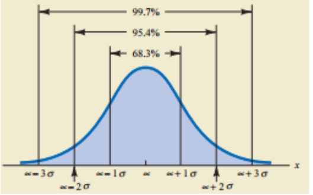

# 概率分布

重点：

- 二项分布
- 泊松分布
- 超几何分布
- 均匀概率分布
- 正态概率分布
- 指数概率分布

## 离散型概率分布

分布函数的值域是离散的，比如只取整数值的随机变量就是属于离散分布的。 F(x)表示随机变量 ${\displaystyle X\leq x}$的概率值。如果X的取值只有x_{1}<x_{2}<...<x_{n}，则：
$$
F_X(x_i)=\sum_{j=1}^i P(x_j) \\
\sum_{k=1}^n P(X=x_i)=1
$$

#### 均匀分布

每次抽样存在多种可能结果，每种结果出现的概率完全一致，也就是X的取值空间为一个有穷的集合S={k1, k2, …, kn}且对于任意$i \in 1…n,\ P(X=ki)=1/n$

#### 伯努利分布

伯努利试验：仅存在两种可能结果的一次试验

S={0,1}，P(X=0) =p, p(X=1)=1-p

#### 二项分布

重复进行n次独立的伯努利试验(可能结果为{1, 0}，出现1的概率是p)，n次结果中有X次1的概率分布就是二项式分布，X的可能取值范围是{0,1,…,n}，记作X ~ B(n,p)
$$
P(X=k) = C_n^k p ^k(1- p)^{n-k}\\
C_n^k = \frac{n!}{(n-k)!\ k!}
$$
均值和方差：
$$
E(x) =\mu = n\pi \\
Var(x) = \sigma ^2 = np (1-p)
$$

#### 泊松分布（Poisson）

Poisson分布也是一种离散型分布，**用以描述罕见事件发生次数的概率分布**。医学上人群中出生缺陷、多胞胎、染色体异常等事件等都是罕见的，可能发生这些事件的观察例数n常常很大 ，但实际上发生类似事件的数目却很小很小。

Poisson分布可以看作是发生的概率π（或未发生的概率1－π）很小，而观察例数n很大时的二项分布。

Poisson分布的概率函数为：
$$
P(X=k) = e^{-\lambda}\frac{\lambda ^k}{k!}
$$
其中，**$\lambda = n\pi=\mu = \sigma^2$**为Poisson分布的**总体均数**。

Poisson分布有以下特性：

- Poisson分布的**总体期望与总体方差相等**,均为 λ
- Poisson分布的观察结果有可加性
- X没有上限，X太大时，p(X)近似为0 

例题：如果某地新生儿先天性心脏病的发病概率为8‰，那么该地120名新生儿中有4人患先天性心脏病的概率有多大？
λ=nπ=120×0.008=0.96

$P(X=4) = \frac{e^{-0.96}0.96^4}{4!}=0.014$

#### 超几何分布（Hypergeometric）

超几何分布是一种**不放回**的抽样

例如：已知N个产品中有D件不合格产品，现抽取n个样品，出现k个不合格的几率是多少？
$$
P(X=k) = \frac{C_D^k C_{N-D}^{n-k}}{C_N^n} = \frac{\pmatrix{D \cr k}\pmatrix{N-D \cr n-k}}{\pmatrix{N \cr n}}
$$
当N趋于无穷大时，超几何分布变为二项分布，实际应用中，当N>=10n，就可用二项分布近似描述超几何分布。

## 连续型分布

一个随机变量在其区间内当能够取任何数值时所具有的分布。

#### 连续均值分布（Uniform）

类似离散均匀分布，但变量的取值范围是一个闭区间[a,b]，概率与区间长度成正比。
$$
f(x) = \cases{
  \frac{1}{b-a} &   for a <= x <= b \\
  0 & otherwise
}
$$

期望：$E(x) = \frac{a+b}{2}$，方差：$Var(x) = \frac{(b-a)^2}{12}$

#### 正态分布（高斯分布）

$$
f(x) = \frac{1}{\sigma \sqrt{2\pi}}e^{-\frac{1}{2}(\frac{x-\mu}{\sigma})^2}
$$

性质：

- 关于$x=\mu$对称，偏度为0；

- 在$x=\mu$处取得该概率密度函数的最大值，在$x=\mu \pm \sigma$处有拐点，变现为钟形曲线

- 曲线下面积为1

- μ决定曲线在横轴上的位置，μ增大，曲线沿横轴向右移；反之,μ减小，曲线沿横轴向左移。

- σ决定曲线的形状，当μ恒定时，σ越大，数据越分散，曲线越“矮胖’；σ越小, 数据越集中，曲线越‘瘦高’

- 经验法则：

  

  ​

Z变换：
$$
Z= \frac{X- \mu}{\sigma}
$$
对任意一个正态分布，经过Z变换后，变为均值为0，标准差为1的标准正态分布。

#### 指数分布

指数分配可以用来表示独立随机事件发生的时间间隔，比如旅客进入机场的时间间隔、打进客服中心电话的时间间隔、中文维基百科新条目出现的时间间隔等等。

概率密度函数和累计分布函数：
$$
f(x;\lambda)=\cases{\lambda e^{-\lambda x},  & x >=0 \cr 0, & x<0} \\
F(x;\lambda)=\cases{1-  e^{-\lambda x},  & x >=0 \cr 0, & x<0}
$$

均值和方差

$E(x) = \sigma = \frac{1}{\lambda}$

vs. 泊松分布

- 泊松分布指每一区间事件发生的次数，指数分布式两事件发生的时间间隔长度

一小时内到达的汽车数为“泊松分布”，$P(X=k) = e^{-10}\frac{10 ^k}{k!}$，均值为10辆每小时；

两车到达的时间间隔为“指数分布”，$f(x) = \frac{1}{0.1}e^{-x/0.1}=10e^{-10x}$，均值为0.1小时每辆。

