# 统计概率思维导图

统计问题的解决步骤：

1. 数据 -收集 使用可靠来源的数据
2. 描述性统计 - 计算能总结数据的统计量，并评测各种数据可视化的方法
3. 探索性数据分析 - 寻找模式、差异和其他能解答我们问题的特征。同时，我们会检查不一致性，并确认其局限性
4. 假设检验 - 在发现明显的影响时，我们需要评判这种影响是否真实，也就是说是否是因为随机因素造成的
5. 估计 - 我们会用样本数据推断全部人口的特征

读图方法：

- 默认阅读顺序：从右→左，顺时针方向。
- 核心重点用「红色星星」标出，需要重点理解，一般是后续学习的基石；「绿色星星」则为需要进一步巩固的内容；「蓝色星星」为高级部分，可以暂时不深入；「红色旗子」表示并列层级，「绿色旗子」为下一层级；「黄色星星」表示需要注意的内容点。
- 「箭头线」标出了知识之间的联系。

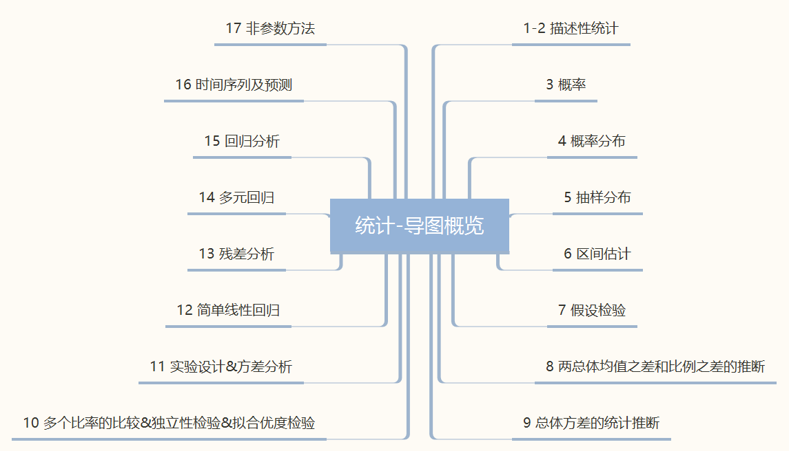

### 描述性统计：表格和图形法

### 描述性统计：数值方法

### 概率

### 概率 & 概率分布

### 抽样分布

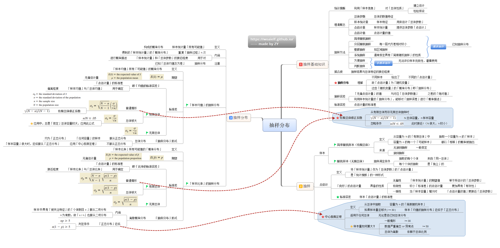

### 区间估计

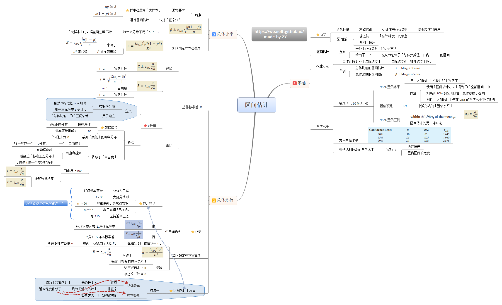

### 假设检验

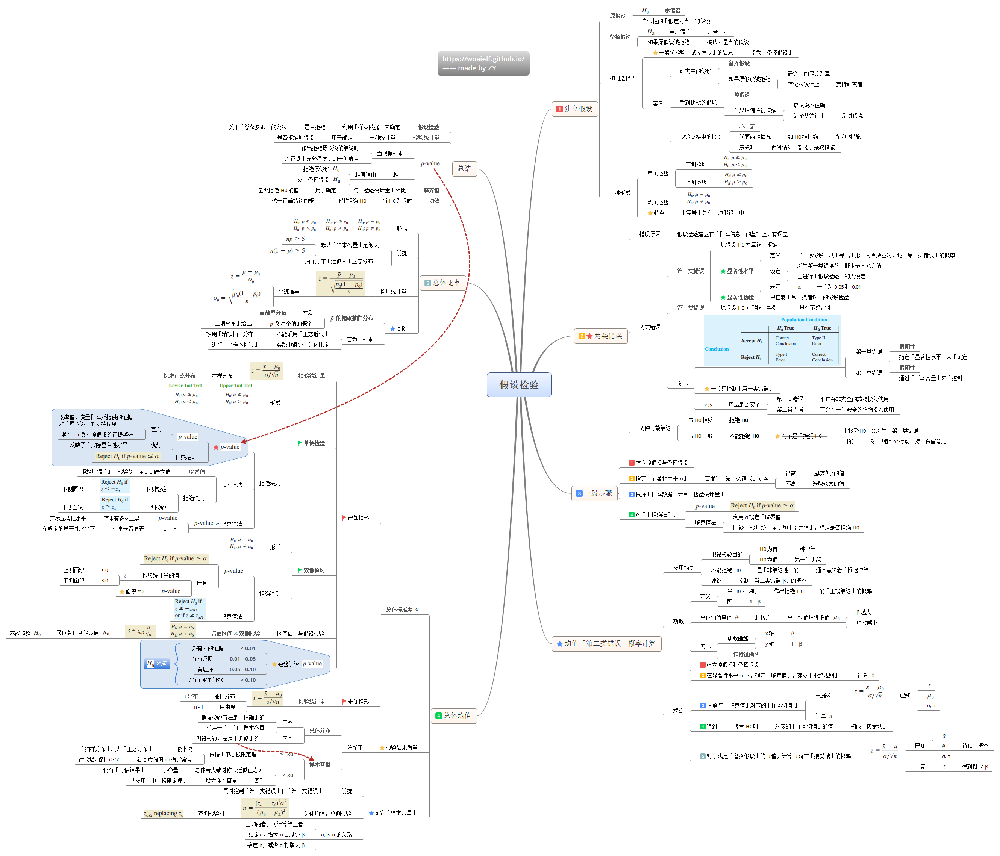

### 两总体均值之差和比例之差的推断

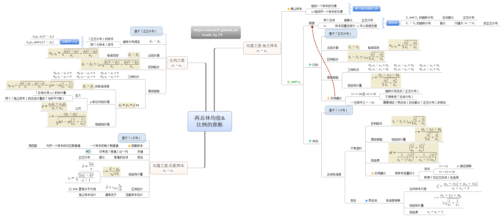

### 总体方差的统计推断

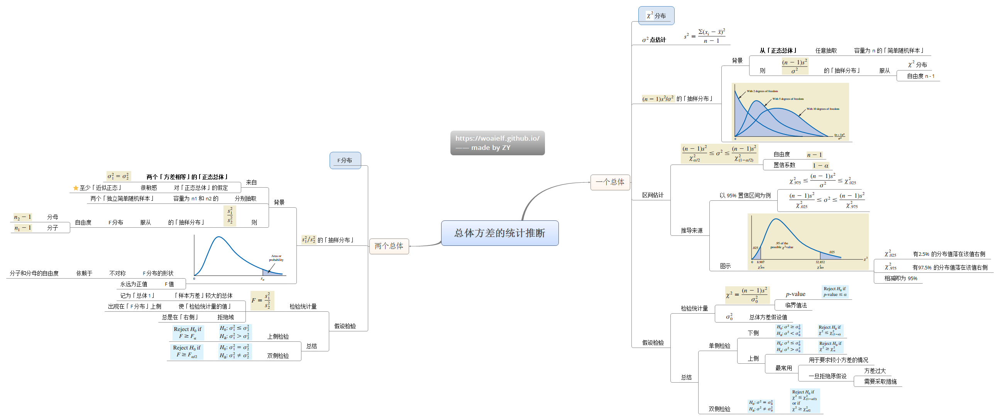

### 多个比例的比较&独立性检验& 拟合优度检验

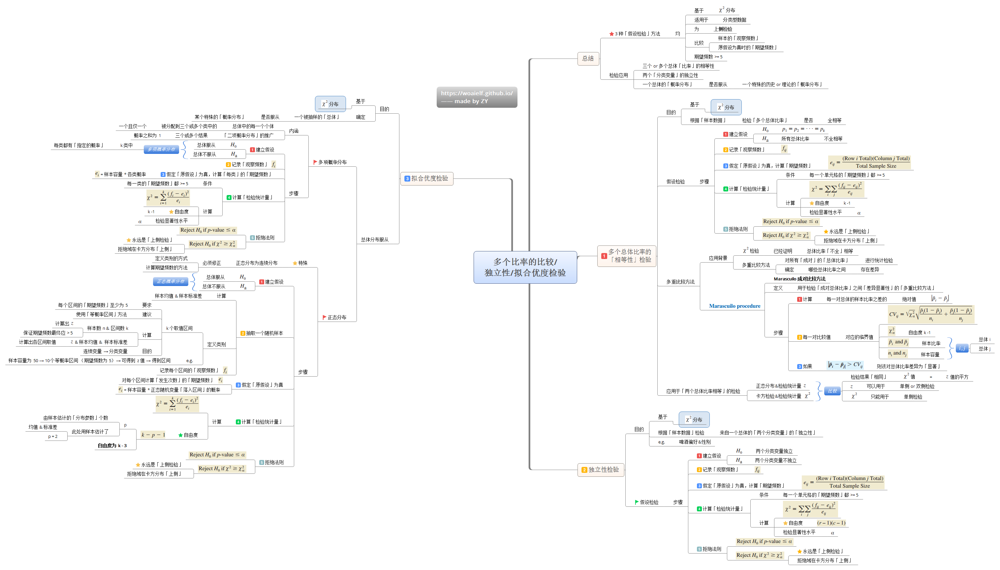

### 实验设计&方差分析

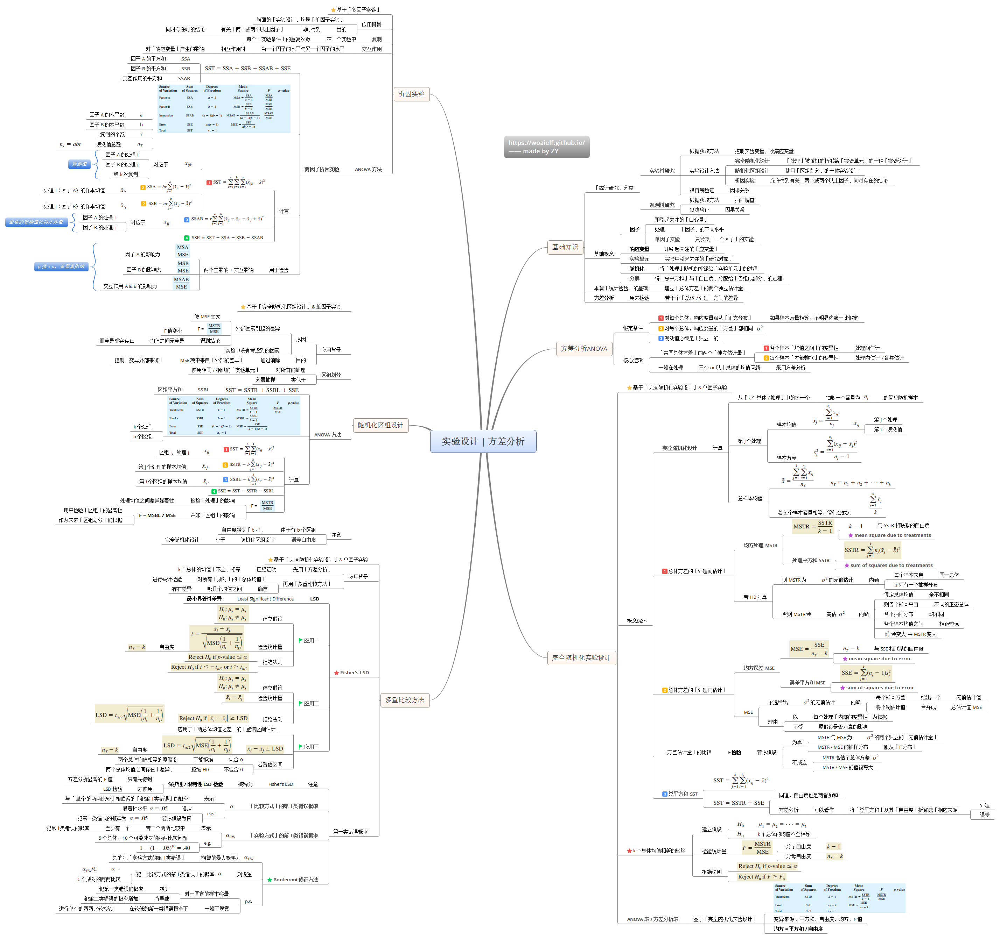

### 简单线性回归

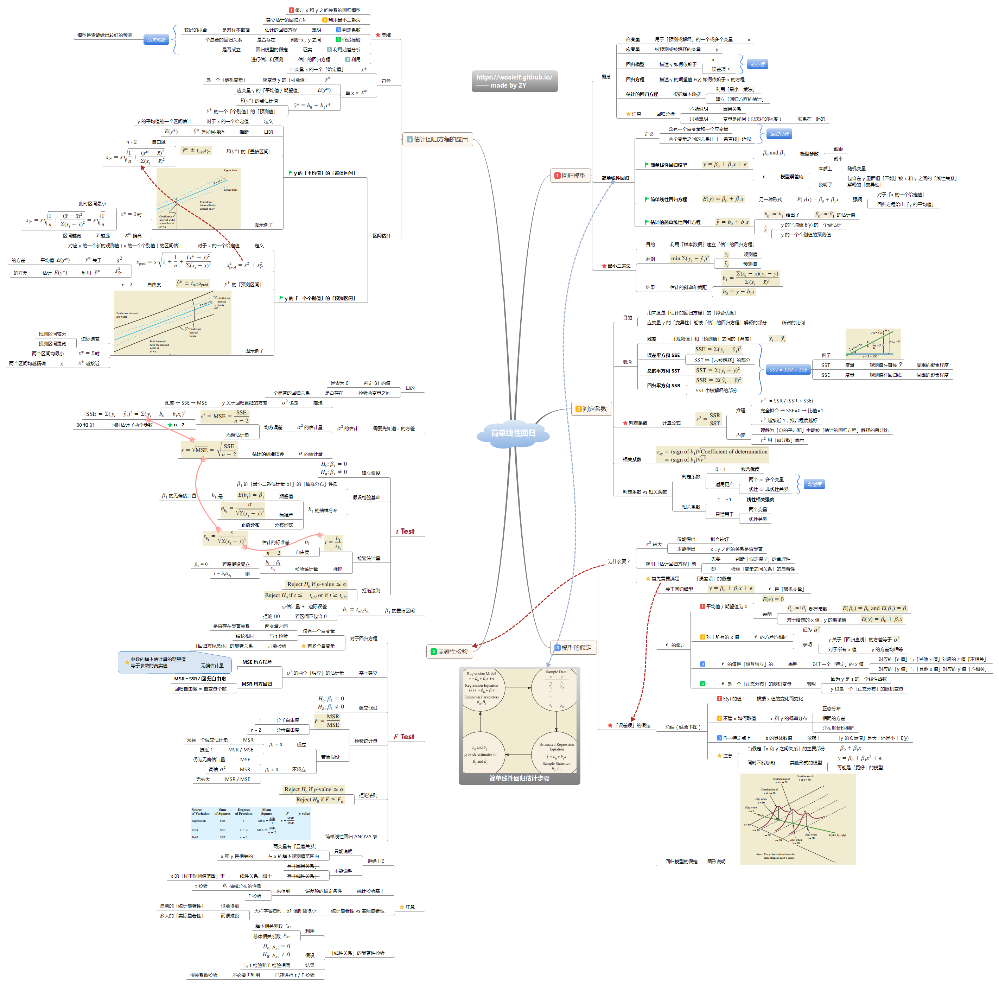

### 残差分析

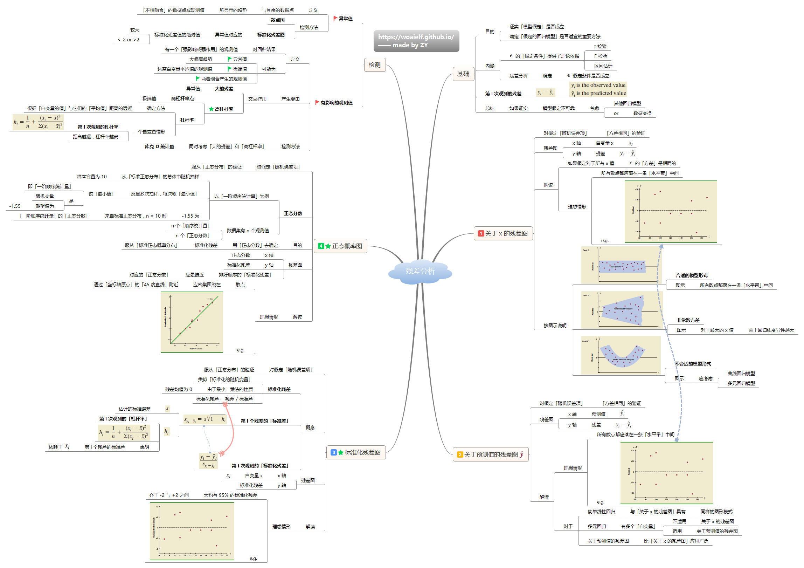

### 多元回归

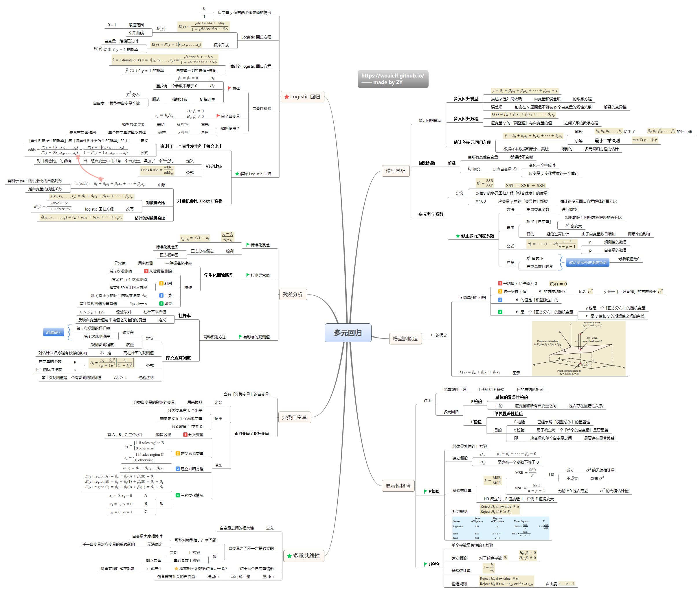

### 回归分析

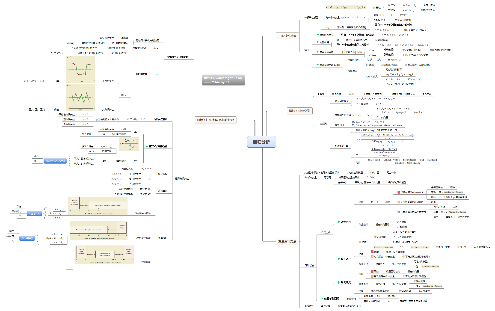

### 时间序列及预测

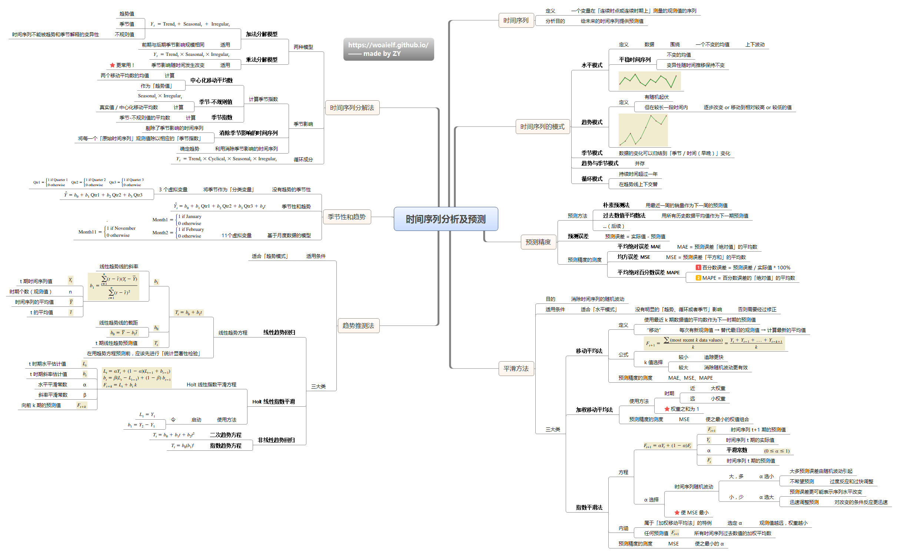

### 非参数方法

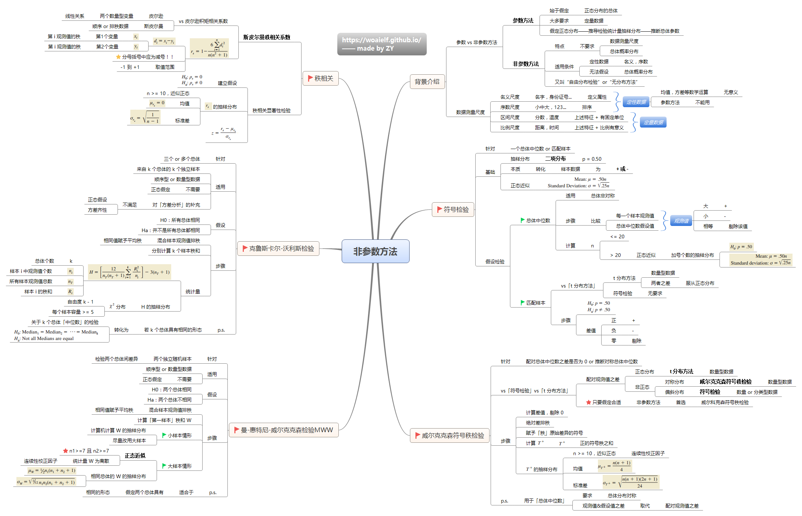