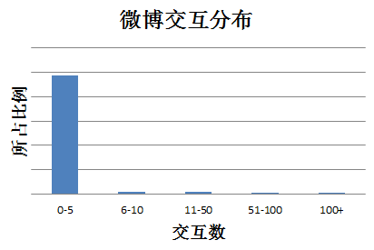

# 数据预处理

## 缺失值填充

现实世界中的数据往往非常杂乱，未经处理的原始数据中某些属性数据缺失是经常出现的情况。另外，在做特征工程时经常会有些样本的某些特征无法求出。

缺失值填补是对缺失的数据观测进行估计的过程。De Waal, Pannekoek和Scholtus的书(Ton de Waal 2011)中第7章对现存的一些缺失值填补方法做了简洁的概述。具体填补方法的选择取决于你的实际应用情况：关于缺失数据你有哪些辅助信息（比如如果客户管理系统将没有购买的客户对应的购买量设置为缺失的话，那你就该用0填补），变量之间是不是有些相关性限制（比如关于是否有驾照信息的缺失就可能受到年龄的限制，如果某人年龄低于16周岁，那就不可能有驾照信息）。因为情况各不相同，所以没有某个方法永远比其它方法好。

决定处理缺失值的方法之前要先了解缺失的原因等关于缺失的辅助信息。缺失是随机发生的么？如果这样的话，可以用中位数/众数填补，也可以使用均值填补。或者缺失其实是有潜在发生机制的？比如年龄大的人在问卷调查中更不愿意透露年龄，这样关于年龄的缺失就不是随机发生的，如果用均值或者中位数填补可能产生很大偏差。这时需要利用年龄和其它自变量的关系对缺失的值进行估计。比如可以基于那些没有缺失值的数据，用是否有子女，收入，问卷调查的回复这些信息来对年龄建模，然后用拟合的模型来进行预测（如用树模型）。

此外，建模的目的对于选择缺失值填补方法也很重要。若建模目的是对传统统计模型结果进行解释和推断，那么仔细研究缺失机制，尽可能用非缺失信息建模来估计缺失值就显得尤为重要。相反，如果建模的目的是预测，大部分情况下不会很严格的研究缺失机制（缺失机制很明显的时候除外），在缺失机制不太清楚的情况下，可以当成随机缺失进行填补（使用均值，中位数或者用K-近邻）。由于统计推断对缺失值更加敏感，所以抽样调查统计学对各种缺失值填补方法进行了深入的研究，这些研究着重于有效的统计推断。而在预测模型中的缺失值填补的问题和抽样调查中的有所不同，因为预测模型的主要目的是预测而非推断。因此关于预测模型中的缺失值填补方面的研究文献没有传统抽样调查统计那么多。想深入学习这方面知识的读者可以参考Saar-Tsechansky 和 Provost对判别模型中不同缺失值方法的比较(Saar-Tsechansky M 2007b)。还有之前提到的De Waal, Pannekoek和Scholtus的书(Ton de Waal 2011)。

常用方法：

1. 删除

   最简单的方法是删除，删除属性或者删除样本。如果大部分样本该属性都缺失，这个属性能提供的信息有限，可以选择放弃使用该维属性；如果一个样本大部分属性缺失，可以选择放弃该样本。虽然这种方法简单，但只适用于数据集中缺失较少的情况。

2. 统计填充

   对于缺失值的属性，尤其是数值类型的属性，根据所有样本关于这维属性的统计值对其进行填充，如使用平均数、中位数、众数、最大值、最小值等，具体选择哪种统计值需要具体问题具体分析。另外，如果有可用类别信息，还可以进行类内统计，比如身高，男性和女性的统计填充应该是不同的。

3. 统一填充

   对于含缺失值的属性，把所有缺失值统一填充为自定义值，如何选择自定义值也需要具体问题具体分析。当然，如果有可用类别信息，也可以为不同类别分别进行统一填充。常用的统一填充值有：“空”、“0”、“正无穷”、“负无穷”等。

4. 预测填充

   如KNN填充、袋装树填充

   我们可以通过预测模型利用不存在缺失值的属性来预测缺失值，也就是先用预测模型把数据填充后再做进一步的工作，如统计、学习等。虽然这种方法比较复杂，但是最后得到的结果比较好。

## 归一化与标准化（Normalization，Standardization）

数据的归一化一般包括：

- 样本尺度归一化
- 逐样本均值相减(移除直流分量)
- 特征标准化（使数据集中所有特征都具有零均值和单位方差）

**线性归一化**，典型的做法是将数据统一映射到[0,1]区间，比如直接进行线性变换：
$$
x^{'} = \frac{x-min}{max-min}
$$
最大值与最小值非常容易受异常点影响，所以这种方法鲁棒性较差，只适合传统精确小数据场景。

逐样本的均值相减主要应用在那些具有稳定性的数据集中，也就是那些数据的每个维度间的统计性质是一样的。

**标准差标准化：**
$$
x' = \frac{x-\mu}{\sigma}
$$
即正态分布中的Z变换。

**非线性归一化**：

经常用在数据分化比较大的场景，有些数值很大，有些很小。通过一些数学函数，将原始值进行映射。该方法包括 log、指数，正切等。需要根据数据分布的情况，决定非线性函数的曲线，比如log(V, 2)还是log(V, 10)等。

**数据白化**

## 离散化

## 数据不平衡

方法总结：

- 数据角度
  - 过采样
  - 欠采样
- 算法角度
  - 代价敏感学习
  - 评价方法

在学术研究与教学中，很多算法都有一个基本假设，那就是数据分布是均匀的。当我们把这些算法直接应用于实际数据时，大多数情况下都无法取得理想的结果。因为实际数据往往分布得很不均匀，都会存在“**长尾现象**”，也就是所谓的“二八原理”。下图是新浪微博交互分布情况：

可以看到大部分微博的总互动数（被转发、评论与点赞数量）在0-5之间，交互数多的微博（多于100）非常之少。如果我们去预测一条微博交互数所在档位，预测器只需要把所有微博预测为第一档（0-5）就能获得非常高的准确率，而这样的预测器没有任何价值。

问题难易程度：**大数据+分布均衡<大数据+分布不均衡<小数据+数据均衡<小数据+数据不均衡**。

主要解决方案：

1. 采样
2. 数据合成
3. 加权
4. 一分类

### 采样

采样分为**上采样（Oversampling）**和**下采样（Undersampling）**，上采样是把小种类复制多份，下采样是从大众类中剔除一些样本，或者说只从大众类中选取部分样本。

上采样的缺点：数据集中反复出现一些样本，训练的模型有一定过拟合。

解决方法：每次生成新数据点时加入轻微的随机扰动。

下采样的缺点：丢失信息。

解决方法：

- EasyEnsemble：多次下采样（放回采样，这样产生的训练集才相互独立）产生多个不同的训练集，进而训练多个不同的分类器，通过组合多个分类器的结果得到最终的结果。
- BalanceCascade：利用增量训练的思想（Boosting），先通过一次下采样产生训练集，训练一个分类器，对于那些分类正确的大众样本不放回，然后对这个更小的大众样本下采样产生训练集，训练第二个分类器，以此类推，最终组合所有分类器的结果得到最终结果
- NearMiss：利用KNN试图挑选那些最具代表性的大众样本（参考论文：Learning from Imbalanced Data）

### 数据合成

数据合成方法是利用已有样本生成更多样本，这类方法在小数据场景下有很多成功案例，比如医学图像分析等。其中最常见的一种方法叫做SMOTE，它利用小众样本在特征空间的相似性来生成新样本。

### 加权

### 一分类

对于正负样本极不平衡的场景，我们可以换一个完全不同的角度来看待问题：把它看做一分类（One Class Learning）或异常检测（Novelty Detection）问题。这类方法的重点不在于捕捉类间的差别，而是为其中一类进行建模，经典的工作包括One-class SVM等。

**如何选择各种方法：**

在正负样本都非常之少的情况下，应该采用数据合成的方式；在负样本足够多，正样本非常之少且比例及其悬殊的情况下，应该考虑一分类方法；在正负样本都足够多且比例不是特别悬殊的情况下，应该考虑采样或者加权的方法。