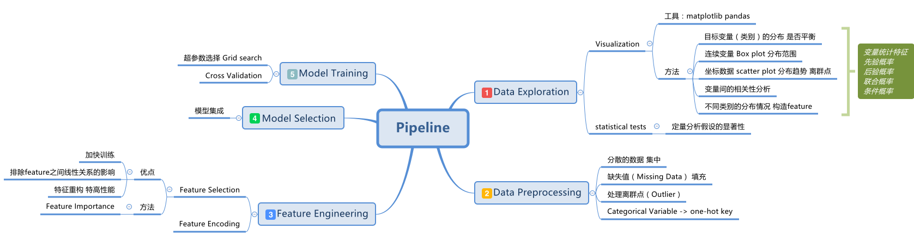

# 机器学习pipeline

KDD(Knowledge  Discovery of Database):

机器学习与数据挖掘间的相互关系：

机器学习为数据挖掘提供了技术基础，数据挖掘用到了许多机器学习的方法。数据挖掘是计算机科学的一个跨学科子领域，旨在从大的数据集中提取出有用的信息。数据挖掘被描述为在KDD中的一个特殊步骤。

- data exploration
  - outlier detecion
  - data visualization
  - summary statistics
- data preprocessing
  - data cleaning
  - data transformation
    - normalization
    - discretization
  - feature construction
  - feature selection
- model validation and selection
  - validation
- hyperparameter tuning
- ​

