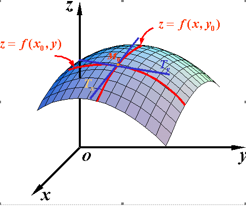

# 梯度下降法

在求解函数模型时，可用 最小二乘法（OLS），当样本数据较少时，可直接用代数的方法求损失函数接的解析式，当样本数量较多时，矩阵的求解计算量非常大，于是在实际应用中采用计算法求损失函数的解。

**梯度下降法（Gradient Descent）**是一种常见的最优化算法，用于求解函数的最大值或者最小值。

一个函数$J(\theta)$对变量$\theta$的梯度定义为：
$$
\frac{\partial J(\theta)}{\partial \theta} = \mathop{\lim}_{\Delta \theta \to 0}\frac{J(\theta + \Delta \theta) - J(\theta)}{\Delta \theta}
$$
为什么梯度反方向是函数值下降最快的方向？

**导数**

几何意义：函数曲线上切线的斜率

物理意义：函数在该点的瞬时变化率，如速度

**偏导数**

以两个自变量为例，z=f(x,y) . 从导数到偏导数，也就是从曲线来到了曲面. 曲线上的一点，其切线只有一条。但是曲面的一点，切线有无数条。而我们所说的偏导数就是指的是多元函数沿坐标轴的变化率.

$f_x(x,y)$指的是函数在y方向不变，函数值沿着x轴方向的变化率

$f_y(x,y)$指的是函数在x方向不变，函数值沿着y轴方向的变化率

偏导数对应的几何意义：

- 偏导数$f_x(x,y)$就是曲面被平面所$y=y_0$截得的曲面在点$M_0$处的切线$M_0T_x$对x轴的斜率
- 偏导数$f_y(x,y)$就是曲面被平面所$x=x_0$截得的曲面在点$M_0$处的切线$M_0Y_y$对y轴的斜率

偏导数指的是多元函数沿坐标轴的变化率，但是我们往往很多时候要考虑多元函数沿任意方向的变化率，那么就引出了方向导数.

**方向导数**

对于函数z=f(x,y)，若要求其在$u=(cos\theta, sin\theta)$方向上的导数，可以类比前面导数的定义，令：
$$
x= x_0 + tcos\theta \\
y = y_0 + tsin\theta
$$
则其导数定义为：
$$
D_uf = \mathop{\lim}_{t \to 0}\frac{f(x_0 + tcos\theta, y_0+tsin\theta)-f(x_0,y_0)}{t}
$$
则称这个极限值是f沿着u方向的方向导数，那么随着$\theta$的不同，我们可以求出任意方向的方向导数.这也表明了方向导数的用处，是为了给我们考虑函数对任意方向的变化率.

定理：若函数$f$在点$p_0$处可微，向量l的方向余弦为$cos\alpha_1,cos\alpha_2,\cdot\cdot\cdot,cos\alpha_n$，则函数f在点$p_0$处沿u方向的方向导数存在，且
$$
D_uf(x_1,x_2,...,x_n)=f_{x_1}^{'}cos\alpha_1 +f_{x_2}^{'}cos\alpha_2+...+f_{x_n}^{'}cos\alpha_n
$$
设$A=(f_x(x,y),f_y(x,y)),\ I=(cos\theta,sin\theta)$，对于方向导数：
$$
D_uf(x,y)=f_x(x,y)cos\theta + f_u(x,y)sin\theta \\
= A\cdot I=|A|\times |I|cos\alpha
$$
$\alpha$为向量A与向量I之间的夹角，当$\alpha=0$时，也就是向量I（这个方向是一直在变，在寻找一个函数变化最快的方向）与向量A（这个方向当点固定下来的时候，它就是固定的）平行的时候，方向导数最大.方向导数最大，也就是单位步伐，函数值朝这个反向变化最快.

在神经网络模型中，模型的损耗函数$J(w,b)$是关于$w,b$的函数，要使函数$J(w,b)$的值减小，按照上述推论，就得是$w,b$朝梯度反方向移动，即：
$$
w \to w-\alpha \nabla J_w(w,b) \\
b \to b-\alpha \nabla J_b(w,b)
$$
其中，$\alpha$为学习速率

### 批量梯度下降（Batch Gradient Descent,DGD）

Use all examples in each iteration；

**优点：**全局最优解；易于并行实现；

**缺点：**当样本数目很多时，训练过程会很慢。

### 随机梯度下降法（Stochastic Gradient Descent, SGD）

Use 1 example in each iteration；

**优点：**训练速度快；

**缺点：**准确度下降，并不是全局最优；不易于并行实现。

### 小批量梯度下降法（Mini-batch Gradient Descent, MBGD）

Use b examples in each iteration.

### Python代码实现

