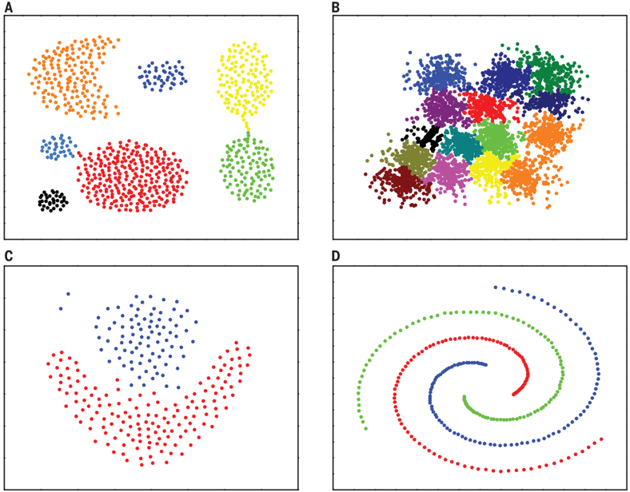

# 聚类

聚类就是对大量未知标注的数据集，按数据的内在相似性将数据集划分为多个类别，使类别内的数据相似度较大而类别间的数据相似度较小。聚类是一种无监督学习。

### 性能度量（有效性指标）

- Jaccard系数

  $JC=\frac{|A\bigcap B|}{|A\bigcup B|}$

- FM指数

- Rand指数

### 相似性度量

见[距离与相似性度量方法](machine_learning/距离与相似性度量方法.md)

### 原型聚类

k均值算法

优点：

- 是解决聚类问题的一种经典算法，简单、快速
- 对处理大数据集，该算法保持可伸缩性和高效率
- 当簇近似为高斯分布时，它的效果较好

缺点

- 在簇的平均值可被定义的情况下才能使用，可能不适用于某些应用
- 必须事先给出k(要生成的簇的数目)，而且对初值敏感，对于不同的初始值，可能会导致不同结果。
- 不适合于发现非凸形状的簇或者大小差别很大的簇
- 对躁声和孤立点数据敏感

学习向量量化(Learning Vector Quantization)

高斯混合聚类

### 密度聚类

密度聚类方法的指导思想是，只要样本点的密度大于某阈值，则将该样本添加到最近的簇中。

这类算法能克服基于距离的算法只能发现“类圆形”(凸)的聚类的缺点，可发现任意形状的聚类，且对噪声数据不敏感。但计算密度单元的计算复杂度大，需要建立空间索引来降低计算量。

**DBSCAN**

(Density-Based Spatial Clustering of Applications with Noise)

**密度最大值算法**

### 层次聚类

层次聚类方法对给定的数据集进行层次的分解，直到某种条件满足为止。具体又可分为：

凝聚的层次聚类：AGNES算法

•一种自底向上的策略，首先将每个对象作为一个簇，然后合并这些原子簇为越来越大的簇，直到某个终结条件被满足。

分裂的层次聚类：DIANA算法

•采用自顶向下的策略，它首先将所有对象置于一个簇中，然后逐渐细分为越来越小的簇，直到达到了某个终结条件。