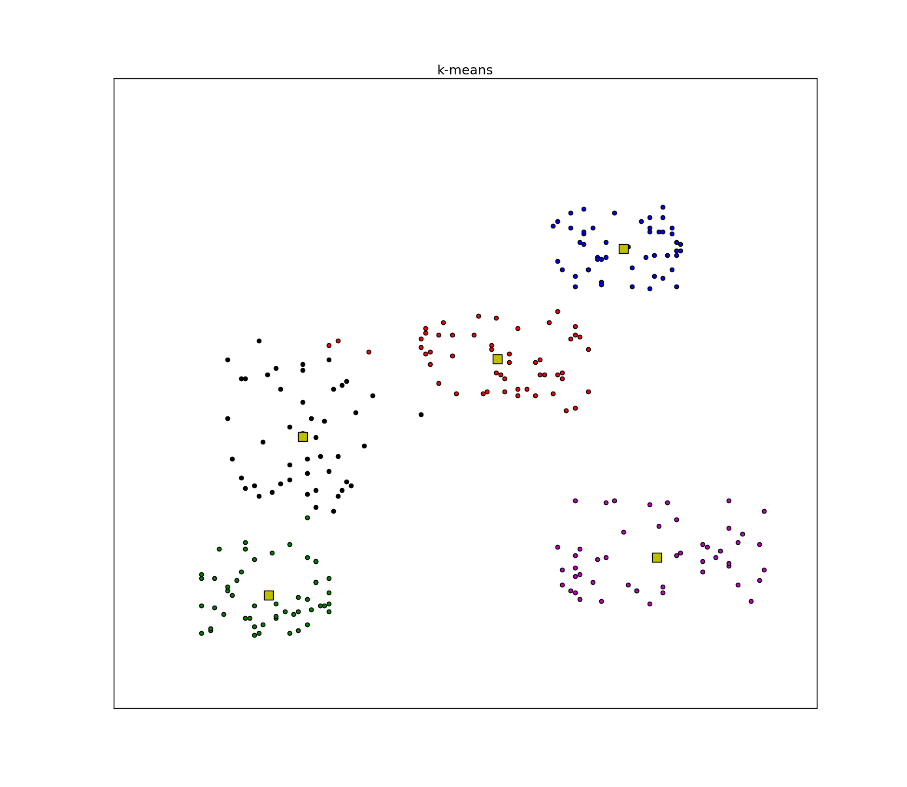

# 视觉词袋模型（Bag of Visual Words）

### 1. 提取特征

提取训练样本图像中的特征向量，提取特征向量的方法可以使用SIFT、SURF等。该步骤生成的图像特征的描述子应该具有不变性对于光照的的变化、变形、碰撞等。

### 2. 构建视觉词典

将步骤一中提取得到的所有特征矢量放到一块构建视觉词典。每个特征矢量相当于一个单词，词与词间具有相似度（同义词、近义词），因此需要将词义相近的词聚集在一块，并求其聚类中心，所有的聚类中心构成了最终的视觉词典。通常选用K-means算法，通过迭代求出n个聚类中心。

### 3. 计算图像特征直方图

对每幅图像中的特征矢量，找距离它最近的聚类中心做**词频（term frequency，TF）**统计。词频指的是某一个给定的词语在该文件中出现的次数。假如一篇文件的总词语数是100个，而词语“母牛”出现了3次，那么“母牛”一词在该文件中的词频就是0.03 (3/100)。

做完词频(TF)统计后，为了降低停用词带来的干扰，可以再算个逆文档词频(IDF)，也就是给TF乘上个权重。一个计算文件频率(DF) 的方法是测定有多少份文件出现过“母牛”一词，然后除以文件集里包含的文件总数。所以，如果“母牛”一词在1,000份文件出现过，而文件总数是10,000,000份的话，其逆向文件频率就是 9.21 ( ln(10,000,000 / 1,000) )。最后的TF-IDF的分数为0.28(0.03 * 9.21)。

对于新的待分类图像，提取其特征矢量，统计TF后乘以IDF后便可得到TF-IDF向量，可对向量进行L2归一化处理。对于数据库中每个训练样本图像都有一个TF-IDF向量，可用**内积**做两个向量间的相似性度量，最后使用KNN算法确定待分类图像的类别。

### 补充一：L2归一化

对于特征矢量$Y=(x_1,x_2,...,x_n)$，其L2归一化的结果为：
$$
Y^{\prime} = x_i / \sum_{i=1}^n x_i^2, \ \ i=1,2,..,n
$$

### 补充二：向量内积

向量内积是线性代数里最为常见的计算，实际上它还是一种有效并且直观的相似性测量手段。

向量内积的结果是没有界限的，一种解决办法是除以长度之后再求内积，这就是应用十分广泛的**余弦相似度**（Cosine similarity）：
$$
CosSim(x,y)=\frac{\sum_i x_i y_i}{\sqrt{\sum_i x_i^2}\ \sqrt{\sum_i y_i^2}}=\frac{\langle x,y \rangle}{||x|| \  ||y||}
$$
